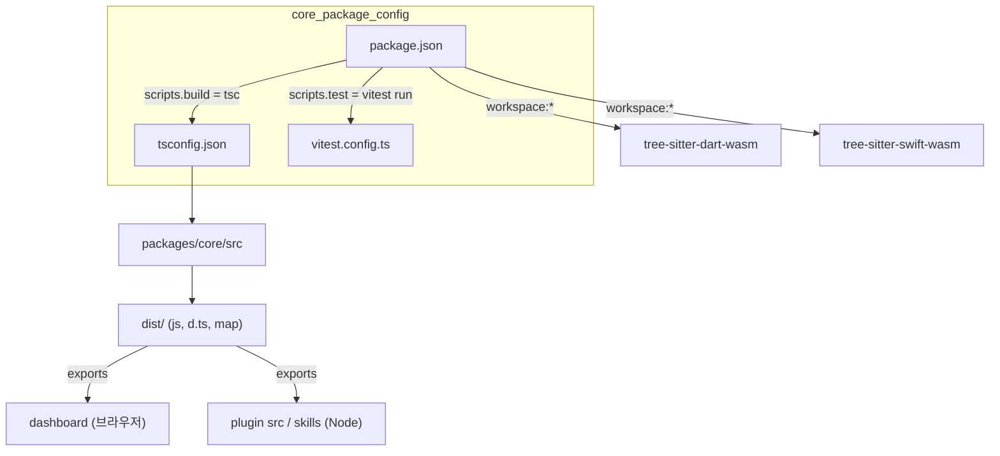
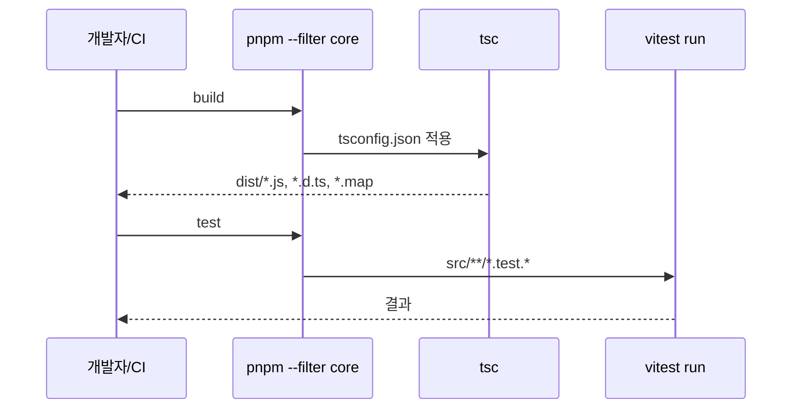

# core_package_config 모듈

## 개요

`core_package_config`는 `@understand-anything/core` 패키지(`understand-anything-plugin/packages/core`)의 **빌드·패키징·테스트 설정**을 담당하는 모듈이다. 소스 코드가 아니라 아래 세 개의 설정 파일로 구성된다.

| 파일 | 역할 |
|---|---|
| `understand-anything-plugin/packages/core/package.json` | 패키지 메타데이터, `exports`(서브패스), 스크립트, 의존성 |
| `understand-anything-plugin/packages/core/tsconfig.json` | TypeScript 컴파일 옵션 (`src` → `dist`) |
| `understand-anything-plugin/packages/core/vitest.config.ts` | core 전용 Vitest 테스트 수집 규칙 |

상위 모듈: [build_ci_and_workspace_config](build_ci_and_workspace_config.md), [homepage](homepage.md)와 같은 계층인 `workspace_build_and_delivery`의 하위 모듈이다. 이 설정이 빌드하는 실제 코드는 [knowledge_graph_core_engine](knowledge_graph_core_engine.md)과 [source_code_parsing_plugins](source_code_parsing_plugins.md)에 문서화되어 있다.

## 아키텍처



## package.json

- **이름/형식**: `@understand-anything/core`, `"type": "module"`(ESM), `main`은 `dist/index.js`, `types`는 `dist/index.d.ts`.
- **스크립트**
  - `build`: `tsc` — `tsconfig.json` 기준으로 `dist/`에 산출물을 생성한다.
  - `test`: `vitest run` — 1회 실행(watch 아님).
- **`exports` 서브패스**: `.`, `./search`, `./types`, `./schema`, `./languages`, `./figma`. 각각 `types`(`.d.ts`)와 `default`(`.js`)를 가진다.
  - 프로젝트 규칙상 대시보드는 브라우저에서 동작하므로 Node 모듈을 끌어오는 메인 엔트리(`.`) 대신 `./search`, `./types`, `./schema` 같은 브라우저 안전 서브패스만 import해야 한다 (CLAUDE.md의 Gotchas 참조). 소비 측은 [interactive_dashboard_ui](interactive_dashboard_ui.md) 참고.
- **의존성 그룹**
  - 파싱: `web-tree-sitter`(WASM, 네이티브 바인딩 회피) 및 `tree-sitter-*` 문법 패키지(c-sharp, cpp, go, java, javascript, php, python, ruby, rust, scala, typescript, kotlin).
  - 워크스페이스: `@understand-anything/tree-sitter-dart-wasm`, `@understand-anything/tree-sitter-swift-wasm` (`workspace:*`).
  - 유틸: `fuse.js`(검색), `ignore`(ignore 필터), `yaml`, `zod`(스키마 검증).
  - 개발: `typescript`, `vitest`, `@vitest/coverage-v8`, `@types/node`.

## tsconfig.json

- `target: ES2022`, `module: ESNext`, `moduleResolution: bundler`, `lib: ["ES2022"]`.
- `strict: true` (프로젝트 규약: 전 영역 strict).
- `declaration`, `declarationMap`, `sourceMap`을 켜서 `.d.ts`와 맵을 생성한다.
- `rootDir: src`, `outDir: dist`, `include: ["src"]` — 테스트 파일(`src/**/*.test.ts`)도 `src` 안에 있으므로 함께 컴파일 대상이 된다.
- `resolveJsonModule`, `esModuleInterop`, `skipLibCheck`, `forceConsistentCasingInFileNames` 활성화.

## vitest.config.ts

```ts
test: { include: ['src/**/*.test.{ts,tsx,mjs}'] }
```

core 패키지의 `src` 하위 테스트만 수집한다. 루트 `vitest.config.ts`는 `understand-anything-plugin/packages/core/**`를 명시적으로 **제외**하므로(이중 집계 방지), core 테스트는 반드시 `pnpm --filter @understand-anything/core test`로 실행한다. `understand-anything-plugin/vitest.config.ts`는 `include: []`로 상위 설정 상속을 차단하는 용도이다.

## 빌드/테스트 흐름



주요 명령:
- `pnpm --filter @understand-anything/core build`
- `pnpm --filter @understand-anything/core test`

다른 패키지(dashboard, skill)는 core의 `dist/`를 사용하므로 **core를 먼저 빌드**해야 한다. CI 및 루트 스크립트와의 연계는 [build_ci_and_workspace_config](build_ci_and_workspace_config.md)를 참고한다.

## 유지보수 시 주의점

- 새 공개 서브패스를 추가하면 `exports`에 `types`/`default` 쌍을 함께 등록해야 하며, 브라우저에서 쓸 경우 Node 전용 모듈을 import하지 않도록 한다.
- 테스트 파일 확장자를 추가할 때는 `vitest.config.ts`의 `include` 글롭을 갱신한다.
- `@understand-anything/tree-sitter-*-wasm`은 워크스페이스 패키지이므로 [build_ci_and_workspace_config](build_ci_and_workspace_config.md)의 `pnpm-workspace.yaml`에 포함되어 있어야 한다.
- 버전(`0.1.0`)은 CLAUDE.md의 "Versioning" 목록(6개 파일)에 포함되지 않는다.
