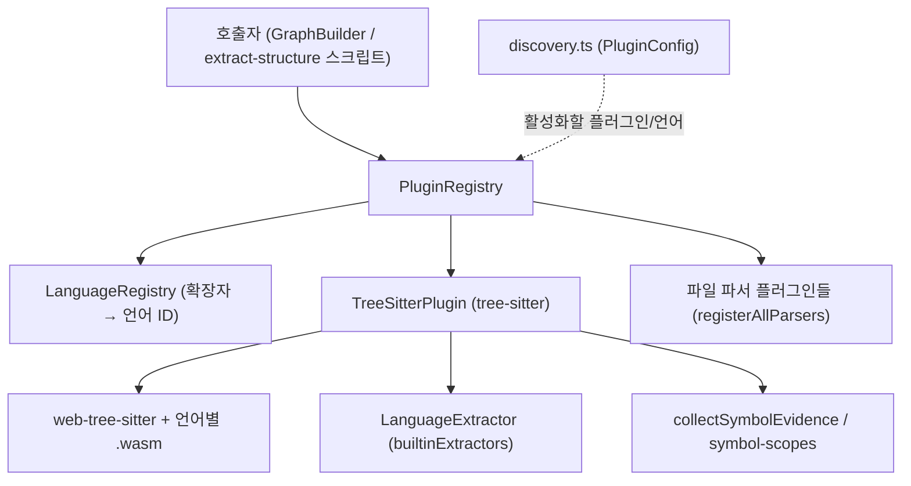
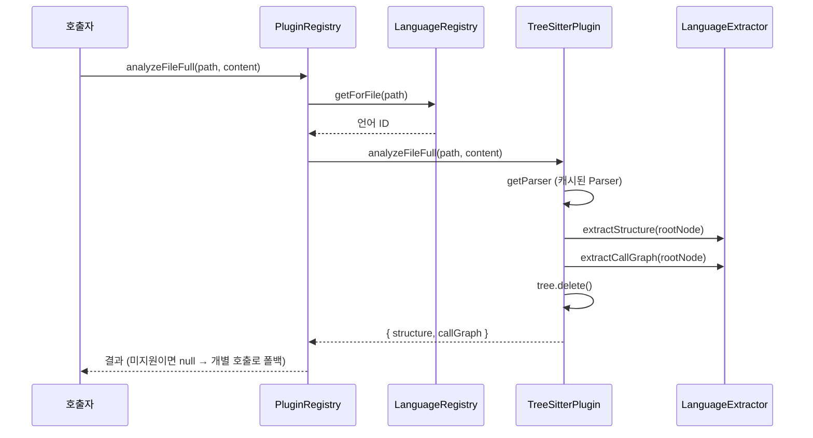

# core_plugin_system 모듈

`core_plugin_system`은 `@understand-anything/core` 패키지에서 **소스 파일 분석기(AnalyzerPlugin)를 등록·선택·실행**하는 계층입니다. 파일 경로를 언어 ID로 매핑하고, 해당 언어를 담당하는 플러그인에 분석(구조, import 해석, 호출 그래프)을 위임합니다. 기본 플러그인인 `TreeSitterPlugin`은 `web-tree-sitter`(WASM)로 코드를 파싱하고, 언어별 extractor에 구조 추출을 맡깁니다.

관련 모듈:
- 언어별 구조 추출 로직: [core_language_extractors](core_language_extractors.md)
- 비코드 파일 파서(Markdown, YAML, Dockerfile 등): [core_file_parsers](core_file_parsers.md)
- 언어/프레임워크 레지스트리: [core_language_registries](core_language_registries.md)
- 분석 결과를 그래프로 조립: [core_graph_analysis](core_graph_analysis.md)
- 패키지 빌드 설정: [core_package_config](core_package_config.md)

## 구성 파일

| 파일 | 역할 |
|---|---|
| `plugins/registry.ts` | `PluginRegistry` — 플러그인 등록, 언어/파일 기반 조회, 위임 |
| `plugins/tree-sitter-plugin.ts` | `TreeSitterPlugin` — WASM 문법 로딩, 파싱, extractor 호출 |
| `plugins/discovery.ts` | `parsePluginConfig`, `serializePluginConfig`, `DEFAULT_PLUGIN_CONFIG` — 플러그인 설정 JSON 처리 |
| `plugins/symbol-scopes.test.ts` | 심볼 스코프(`buildSymbolScopes`) 동작을 검증하는 테스트 |
| `__tests__/plugin-registry.test.ts` | `PluginRegistry` 및 `registerAllParsers` 스모크 테스트 |

## 아키텍처

## 핵심 컴포넌트

### PluginRegistry
- `register(plugin)`: 플러그인을 목록에 추가하고 `plugin.languages` 각각을 `languageMap`에 기록합니다. **같은 언어에 나중에 등록된 플러그인이 우선**합니다(테스트로 확인됨).
- `unregister(name)`: 플러그인을 제거하고 `languageMap`을 남은 플러그인으로 **전체 재구성**합니다. 없는 이름이면 아무 일도 하지 않습니다.
- `getPluginForFile(path)`: `LanguageRegistry.getForFile`로 언어 ID를 구한 뒤 플러그인을 찾습니다. 확장자 테이블을 직접 갖지 않습니다.
- `analyzeFile`, `resolveImports`, `extractCallGraph`: 플러그인에 위임하며, 플러그인이 없거나 (선택적 메서드인 경우) 메서드가 없으면 `null`을 반환합니다.
- `analyzeFileFull`: 한 번의 파싱으로 구조와 호출 그래프를 함께 반환하는 빠른 경로입니다. 플러그인이 지원하지 않으면 `null`을 반환하므로 호출자가 `analyzeFile` + `extractCallGraph`로 대체해야 합니다.
- `getPlugins()`, `getSupportedLanguages()`는 내부 상태의 복사본을 반환합니다.

### TreeSitterPlugin
`AnalyzerPlugin`을 구현하며 이름은 `"tree-sitter"`입니다.

- **생성자**: `LanguageConfig[]` 중 `treeSitter` 필드가 있는 것만 사용하고, 확장자→언어 맵을 구성합니다. 설정이 없으면 TypeScript/JavaScript 기본값으로 폴백합니다. extractor를 주지 않으면 `builtinExtractors`를 모두 등록합니다.
- **`init()`**: `web-tree-sitter`를 동적으로 import하고 `Parser.init()` 후 각 언어의 WASM 문법을 병렬 로드합니다. 문법 로드에 실패한 언어는 건너뛰며(`console.debug`), 해당 파일은 빈 구조를 반환합니다. TypeScript는 `tree-sitter-tsx.wasm`도 함께 로드하고, `.tsx`는 `"tsx"` 키를 쓰되 extractor는 `typescript`를 공유합니다. **동기 메서드 호출 전에 반드시 `await init()`** 해야 하며, 그렇지 않으면 `getParser`가 예외를 던집니다.
- **파서 캐시**: 언어 키마다 `Parser` 하나를 지연 생성해 재사용합니다. `Tree`는 호출마다 `delete()`로 해제합니다.
- **`analyzeFile`**: 최선 노력(best-effort) 방식. 파서/트리/extractor가 없으면 빈 `StructuralAnalysis`를 반환합니다.
- **`analyzeFileFull`**: 한 번 파싱해 `extractStructure`와 `extractCallGraph`를 모두 실행합니다(주석상 파싱 비용 약 40% 절감).
- **`analyzeFileStrict`**: 파괴적 비교용 엄격 모드. `status`는 `"succeeded" | "unsupported" | "failed"`이며, 문법 없음/extractor 없음은 `unsupported`, 파싱 실패·`rootNode.hasError`·예외는 `failed`로 구분해 "심볼이 없는 정상 파일"과 혼동되지 않게 합니다. 성공 시 `collectSymbolEvidence` 결과(`symbolEvidence`)를 포함합니다.
- **`resolveImports`**: `./`, `../`로 시작하는 import는 `resolve(dirname(filePath), source)`로 절대화하고, 그 외(패키지 등)는 `source`를 그대로 씁니다. 확장자 보완은 하지 않습니다.
- **`extractCallGraph`**: 단독 호출 시 파싱 후 extractor의 호출 그래프를 반환합니다.

### discovery.ts
- `PluginEntry { name, enabled, languages, options? }`, `PluginConfig { plugins }`.
- `DEFAULT_PLUGIN_CONFIG`: `builtinLanguageConfigs` 중 `treeSitter`가 있는 언어를 대상으로 한 `tree-sitter` 플러그인 하나.
- `parsePluginConfig(json)`: 빈 문자열, JSON 오류, `plugins` 배열 누락 시 기본 설정을 반환합니다. 항목은 `name`(비어 있지 않은 문자열)과 비어 있지 않은 `languages` 배열이 있어야 유효하며, `enabled`가 boolean이 아니면 `true`로 간주합니다. 유효하지 않은 항목은 조용히 제외됩니다.
- `serializePluginConfig(config)`: 들여쓰기 2칸의 JSON으로 직렬화합니다.

## 분석 흐름

## 사용상 주의점
- 지원되지 않는 파일/언어는 레지스트리 수준에서 `null`, `TreeSitterPlugin` 수준에서는 빈 결과를 반환합니다. 두 계약이 다르므로 구분해서 처리하세요.
- WASM(`web-tree-sitter`)을 사용하는 이유는 네이티브 `tree-sitter`가 darwin/arm64 + Node 24에서 실패하기 때문입니다(`CLAUDE.md`).
- 이 모듈은 Node 전용 모듈(`node:module`, `node:path`)을 사용하므로 대시보드는 코어 메인 엔트리가 아니라 브라우저 안전 subpath(`./search`, `./types`, `./schema`)만 import해야 합니다.
- 테스트: `pnpm --filter @understand-anything/core test`. `symbol-scopes.test.ts`는 클래스 표현식, 중첩 클래스 필드, 섀도잉/재할당된 참조가 `class`/`local`/`unknown` 스코프로 올바르게 분류되는지 검증합니다.
- 비코드 파서는 `registerAllParsers(registry)`로 한 번에 등록되며, 스모크 테스트가 12개 파일 유형에서 유효한 `StructuralAnalysis` 형태를 확인합니다. 자세한 내용은 [core_file_parsers](core_file_parsers.md)를 참고하세요.
