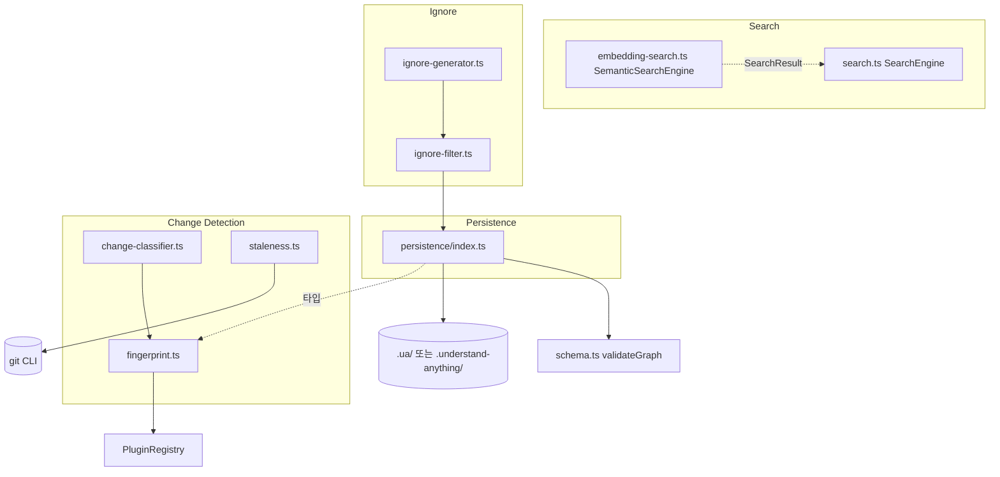
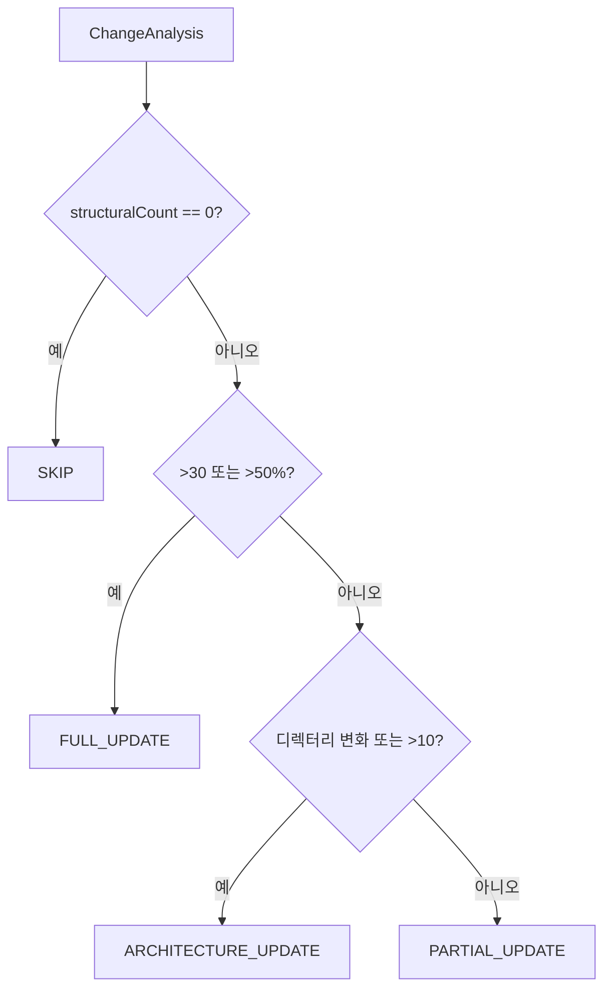
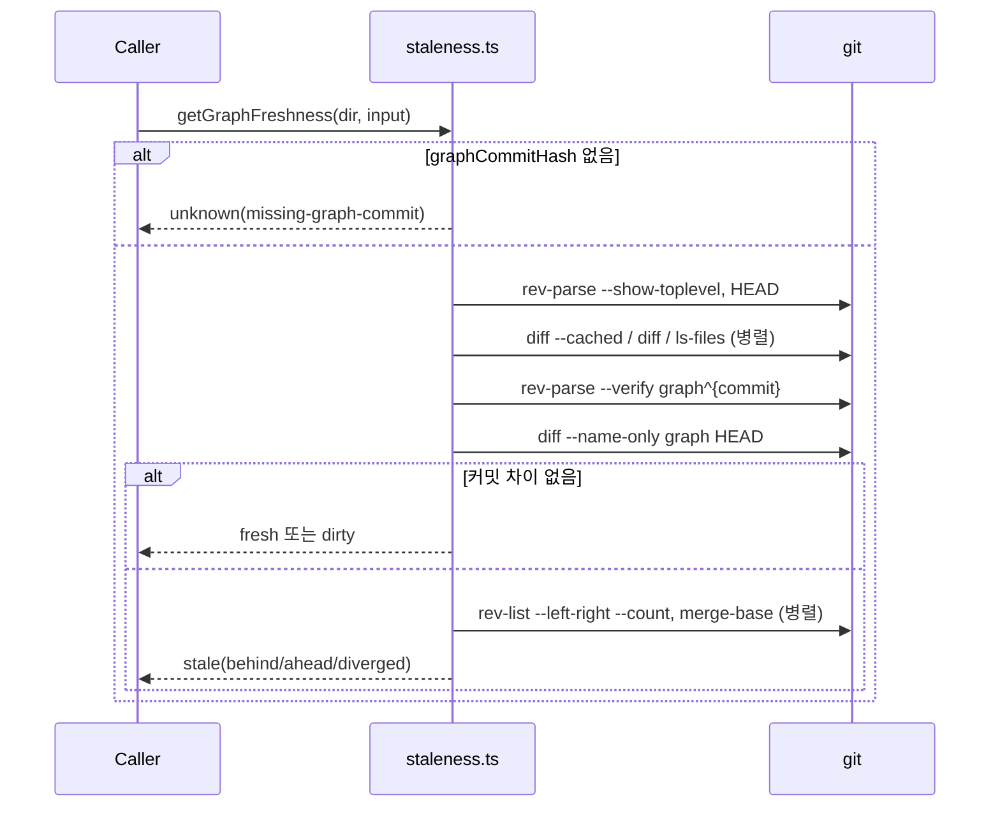
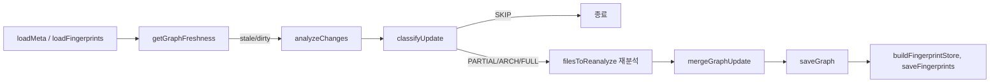

# core_search_persistence_staleness 모듈

`understand-anything-plugin/packages/core` 안에서 **검색, 디스크 영속화, 변경 감지·신선도(staleness) 판단, 무시 규칙**을 담당하는 모듈입니다. 지식 그래프(`KnowledgeGraph`)를 만든 뒤 "저장하고, 찾아보고, 오래됐는지 판단하고, 증분 갱신 범위를 결정하는" 수명주기를 다룹니다.

| 책임 | 파일 | 핵심 심볼 |
|---|---|---|
| 퍼지 검색 | `search.ts` | `SearchEngine` (`updateNodes`) |
| 시맨틱 검색 | `embedding-search.ts` | `SemanticSearchEngine`, `cosineSimilarity` |
| 영속화 | `persistence/index.ts` | `saveGraph`/`loadGraph`, `saveMeta`/`loadMeta`, `saveFingerprints`/`loadFingerprints`, `saveConfig`/`loadConfig`, `saveDomainGraph`/`loadDomainGraph` |
| 구조 핑거프린트 | `fingerprint.ts` | `buildFingerprintStore`, `analyzeChanges` |
| 갱신 범위 분류 | `change-classifier.ts` | `classifyUpdate` |
| 신선도/병합 | `staleness.ts` | `getGraphFreshness`, `isStale`, `mergeGraphUpdate` |
| 분석 제외 | `ignore-filter.ts`, `ignore-generator.ts` | `createIgnoreFilter`, `generateStarterIgnoreFile` |

관련 모듈: 그래프 생성은 [core_graph_analysis](core_graph_analysis.md), 구조 분석 플러그인은 [core_plugin_system](core_plugin_system.md), 대시보드의 신선도 배너는 [dashboard_components](dashboard_components.md) 및 [dashboard_state_and_app_services](dashboard_state_and_app_services.md), 스키마 검증은 [knowledge_graph_core_engine](knowledge_graph_core_engine.md)를 참고하세요.

## 아키텍처

## 컴포넌트 상세

### 영속화 (`persistence/index.ts`)
- **데이터 디렉터리 규칙**: `resolveUaDirName`은 `.understand-anything/`이 이미 있으면 이를 읽기·쓰기 모두에 사용하고, 없으면 `.ua/`를 사용합니다(마이그레이션 없음).
- 파일: `knowledge-graph.json`, `domain-graph.json`, `meta.json`, `fingerprints.json`, `config.json`.
- `saveGraph`/`saveDomainGraph`는 `sanitiseFilePaths`로 노드의 절대 경로를 정리합니다: 프로젝트 내부는 상대 경로로, 외부 절대 경로는 파일명만 남기고, 이미 상대 경로면 그대로 둡니다. 개발자 홈 디렉터리 정보가 JSON과 대시보드 서버로 새지 않게 하기 위함입니다.
- `loadGraph`/`loadDomainGraph`는 기본적으로 `validateGraph`를 실행하며 치명적 오류 시 예외를 던집니다(`{ validate: false }`로 생략 가능).
- `loadFingerprints`(파싱 실패 시 `null`)와 `loadConfig`(실패·부재 시 `{ autoUpdate: false, outputLanguage: "en" }`)는 오류에 관대합니다.

### 핑거프린트 (`fingerprint.ts`)
파일별로 SHA-256 `contentHash`와 함수·클래스·import·export 시그니처를 저장합니다(`FingerprintStore`, version `1.0.0`, `gitCommitHash` 포함).

`compareFingerprints` 결과 수준:
- `NONE`: 해시 동일.
- `COSMETIC`: 내용은 다르지만 시그니처는 동일.
- `STRUCTURAL`: 시그니처 변화. 보수적으로 다음 경우도 STRUCTURAL로 처리합니다. 구조 분석이 없는 경우, 함수 `owner`가 `null`인 경우, 함수 소유권 변화, 함수 크기 ±50% 초과 변화.

`buildFingerprintStore`는 `structuralFingerprintLanguages` 옵션으로 지정되지 않은 언어에 콘텐츠 해시 전용 핑거프린트를 만듭니다. `analyzeChanges`는 삭제·신규·변경 파일을 분류해 `ChangeAnalysis`를 반환합니다.

### 갱신 분류 (`change-classifier.ts`)
`classifyUpdate(analysis, totalFilesInGraph, previousFiles, currentFiles?)`의 결정표입니다. `structuralCount = structurallyChanged + new + deleted`.

| 조건 | action | 아키텍처/투어 재실행 |
|---|---|---|
| `structuralCount === 0` | `SKIP` | 아니오 |
| `>30` 파일 또는 전체의 `>50%` | `FULL_UPDATE` | 예 |
| 최상위 디렉터리 집합 변화 또는 `>10` | `ARCHITECTURE_UPDATE` | 예 |
| 그 외 | `PARTIAL_UPDATE` | 아니오 |

디렉터리 변화는 변경 전/후 파일 목록의 첫 경로 세그먼트 집합을 비교합니다. `currentFiles`가 없으면 `previousFiles`와 분석 결과로 재구성합니다. Windows에서만 `\`를 `/`로 정규화합니다. 삭제된 파일은 `filesToReanalyze`에 포함되지 않습니다.

### 신선도 (`staleness.ts`)
`getGraphFreshness(projectDir, { graphCommitHash, lastAnalyzedAt })`는 `git`을 `execFile`로 호출합니다(타임아웃 5초, 버퍼 4MiB). `getGraphFreshnessBatch`는 하나의 Git 스냅샷(`repoRoot`, `HEAD`, staged/unstaged/untracked 파일)을 여러 그래프(예: knowledge, domain)가 공유하게 합니다.

결과 `GraphFreshnessResult.status`:
- `fresh`: 그래프 커밋과 HEAD 사이에 프로젝트 파일 변경이 없고 작업 트리도 깨끗함.
- `dirty`: 커밋 차이는 없지만 작업 트리에 변경이 있음.
- `stale`: 커밋 간 변경이 있음. `relation`은 `behind`/`ahead`/`diverged`(`merge-base --is-ancestor`로 판정)이고 `commitsBehind`/`commitsAhead`를 함께 제공합니다.
- `unknown`: 판단 불가. 이유는 `missing-graph-commit`, `git-head-unavailable`, `graph-commit-unavailable`, `git-command-timeout`, `freshness-request-failed`. `unknown`은 `fresh`와 의도적으로 구분되어, Git 메타데이터를 못 읽을 때 최신이라고 오해하지 않게 합니다.

`PROJECT_PATHSPEC`은 `.ua`와 `.understand-anything` 출력물을 제외하고 하위 프로젝트 경로 범위로 한정합니다(모노레포에서 형제 프로젝트 변경은 무시). 경로는 NUL 구분(`-z`)으로 파싱하여 공백·비ASCII 파일명을 보존하고, 결과는 중복 제거 후 정렬합니다.

레거시 API: `getChangedFiles`(`git diff <hash>..HEAD --name-only`, 실패 시 `[]`), `isStale`(`{ stale, changedFiles }`).

`mergeGraphUpdate`는 변경 파일(`filePath` 일치)에 속한 노드와 그 노드를 source/target으로 하는 모든 엣지를 제거하고, 새 노드·엣지를 추가하며, `project.gitCommitHash`와 `analyzedAt`을 갱신합니다.

### 검색
- `SearchEngine`(`search.ts`): `fuse.js` 기반. 가중치는 `name` 0.4, `tags` 0.3, `summary` 0.2, `languageNotes` 0.1이며 `threshold: 0.4`, 확장 검색을 사용합니다. 공백으로 구분된 토큰은 `|`(OR)로 연결됩니다. 기본 `limit`은 50이고 `types`로 필터링할 수 있으며, 점수는 0이 최선입니다. `updateNodes`는 Fuse 인덱스를 재구축합니다.
- `SemanticSearchEngine`(`embedding-search.ts`): 사전 계산된 임베딩(`Record<string, number[]>`)에 코사인 유사도를 적용합니다. 쿼리 벡터의 크기는 노드 루프 밖에서 한 번만 계산합니다(결과는 `cosineSimilarity`와 동일). 반환 점수는 `1 - similarity`로 `SearchEngine`과 같은 방향(낮을수록 좋음)이며, 기본 `limit` 10, `threshold` 0입니다. `updateNodes`는 노드 목록만 교체하고 임베딩은 유지합니다. 임베딩이 없는 노드는 결과에서 제외됩니다.

### 무시 규칙
- `createIgnoreFilter(projectRoot, extraPatterns)`는 `ignore` 패키지로 다음 순서(뒤가 우선, `!` 부정 가능)로 패턴을 병합합니다: (1) `DEFAULT_IGNORE_PATTERNS`, (2) `<ua-dir>/.understandignore`, (3) 프로젝트 루트 `.understandignore`, (4) CLI `--exclude`.
- `generateStarterIgnoreFile(projectRoot)`는 `.gitignore`(기본값에 없는 항목), 디스크에서 발견한 테스트·문서·벤치 디렉터리, 언어별 테스트 파일 패턴을 **모두 주석 처리한 채** 제안합니다. Swift는 `ignore`가 대소문자를 구분하지 않아 `Contest.swift` 같은 실제 소스가 잘못 제외되는 것을 막으려고 디렉터리 기반 패턴(`**/Tests/**/*.swift`)만 씁니다.

## 증분 업데이트 데이터 흐름

이 흐름을 실제로 조합하는 코드는 스킬/에이전트 쪽에 있으며, 이 모듈은 각 단계의 순수 함수와 I/O 헬퍼를 제공합니다. 대시보드는 Vite 개발 서버 미들웨어를 통해 신선도 보고서를 받습니다(`vite-staleness.test.ts`, [dashboard_build_config](dashboard_build_config.md) 참고).

## 테스트

`packages/core/src/__tests__/`에 위치합니다(`vitest`, [core_package_config](core_package_config.md) 참고).
- `change-classifier.test.ts`: 결정표 각 분기, 디렉터리 삭제, Windows 구분자 처리.
- `graph-freshness.integration.test.ts`: 실제 Git 저장소로 `fresh`/`dirty`/`stale`(behind/ahead/diverged)/`unknown`, 출력 디렉터리 무시, 모노레포 형제 프로젝트, 배치 평가를 검증.
- `staleness.test.ts`: `execFileSync`를 모킹해 `getChangedFiles`, `isStale`, `mergeGraphUpdate`를 검증.
- `search.test.ts`: 퍼지 검색, 타입 필터, `limit`, `updateNodes` 재색인.
- `schema.test.ts`, `config-schema.test.ts`: `validateGraph`(영속화 로드 시 사용)와 언어/프레임워크 설정 스키마 검증.

## 유의사항
- 대시보드는 브라우저 안전 서브패스(`./search`, `./types`, `./schema`)만 import해야 합니다. `persistence`, `staleness`, `fingerprint`는 Node 모듈(`fs`, `child_process`, `crypto`)을 쓰므로 메인 엔트리 전용입니다.
- `mergeGraphUpdate`는 변경 파일 노드를 가리키는 다른 파일의 엣지도 제거하므로, 호출자는 새 엣지에 해당 관계를 다시 포함해야 합니다.
- `isStale`/`getChangedFiles`는 Git 오류 시 빈 배열을 반환하여 "변경 없음"과 구분되지 않습니다. 이를 구분하려면 `getGraphFreshness`(`unknown` 상태)를 사용하세요.
