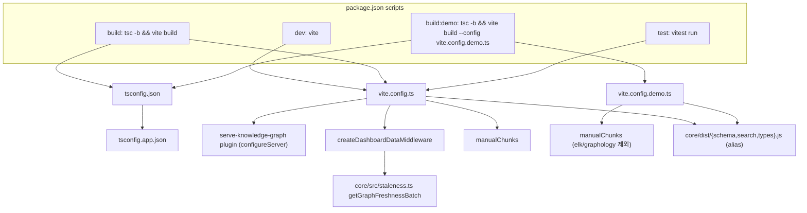
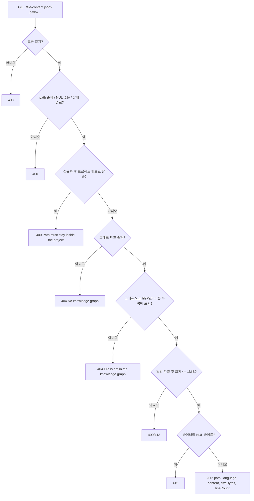
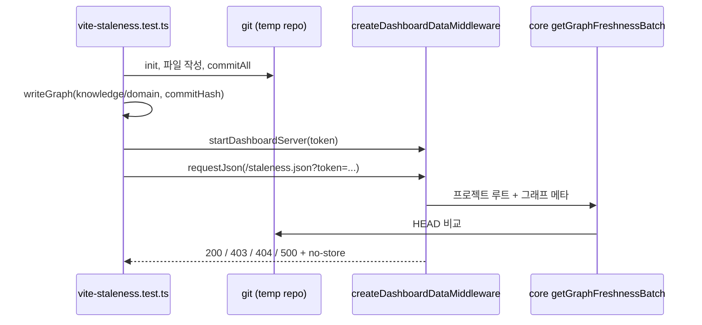

# dashboard_build_config 모듈

`understand-anything-plugin/packages/dashboard`(`@understand-anything/dashboard`) 패키지의 **빌드·개발 서버·타입체크·테스트 설정**을 담당하는 모듈입니다. UI 코드 자체(컴포넌트, 스토어, 유틸)는 다루지 않고, 그것들을 어떻게 번들링하고 로컬에서 안전하게 서빙하는지를 정의합니다.

핵심 역할은 세 가지입니다.

1. **빌드 파이프라인**: `tsc -b` + `vite build`, 데모 빌드(`vite.config.demo.ts`), 청크 분할.
2. **개발 서버 미들웨어**: `.understand-anything/` 또는 `.ua/`의 그래프 JSON을 토큰 인증 뒤에서 제공하고, 소스 파일 미리보기와 신선도(staleness) 리포트를 제공.
3. **테스트 설정**: Vitest(`environment: "node"`)와 미들웨어 통합 테스트 `vite-staleness.test.ts`.

## 구성 파일

| 파일 | 역할 |
|---|---|
| `package.json` | 스크립트(`dev`, `build`, `build:demo`, `preview`, `test`, `test:watch`)와 의존성 |
| `tsconfig.json` | 빈 `files` + `tsconfig.app.json` 프로젝트 참조 (솔루션 스타일) |
| `tsconfig.app.json` | `strict`, `noUnusedLocals`, `noUnusedParameters`, `jsx: react-jsx`, `moduleResolution: bundler`, `noEmit`; `src`만 포함 |
| `vite.config.ts` | 개발 서버, 보안 미들웨어, 청크 분할, 별칭, Vitest 설정 |
| `vite.config.demo.ts` | 정적 데모용 빌드 (`base: "/demo/"`, `VITE_DEMO_MODE=true`) |
| `src/__tests__/vite-staleness.test.ts` | `/staleness.json` 엔드포인트 통합 테스트 |

## 아키텍처



코어 패키지 연동은 [core_search_persistence_staleness](core_search_persistence_staleness.md)의 `staleness.ts`, 그리고 빌드 산출물 `core/dist`(설정은 [core_package_config](core_package_config.md))에 의존합니다. 워크스페이스 전체 빌드/CI는 [build_ci_and_workspace_config](build_ci_and_workspace_config.md)를 참고하세요.

## 빌드 설정

### 브라우저 안전 별칭
`resolve.alias`가 `@understand-anything/core/schema|search|types`를 `../core/dist/*.js`로 직접 매핑합니다. 대시보드가 Node 전용 모듈을 끌어오는 코어 메인 엔트리를 import하지 못하게 하는 프로젝트 규칙(CLAUDE.md의 Gotchas)을 빌드 단에서 뒷받침합니다. 따라서 **대시보드 빌드 전에 코어를 먼저 빌드**해야 합니다(`pnpm --filter @understand-anything/core build`).

### manualChunks
`node_modules` 모듈을 다음과 같이 분할합니다.

| 청크 | 대상 | 비고 |
|---|---|---|
| `react-vendor` | react, react-dom, scheduler | 공통 |
| `xyflow` | `@xyflow/*` | 공통 |
| `elk` | `elkjs` (~1.6MB) | 메인 설정에만 존재 |
| `graphology` | `graphology*` | 메인 설정에만 존재 |
| `graph-layout` | `@dagrejs/*`, `d3-force` | 공통 |
| `markdown` | react-markdown, remark/rehype/mdast/hast/unified 계열 | 공통 |

데모 설정은 `elk`/`graphology` 분할이 없고, 추가로 `base: "/demo/"`와 `import.meta.env.VITE_DEMO_MODE`를 `"true"`로 정의합니다. 홈페이지 하위 경로에 정적 배포하는 용도입니다([homepage](homepage.md)).

## 개발 서버와 보안 모델

서버는 `127.0.0.1:5173`에만 바인딩되어 LAN의 다른 기기에서 접근할 수 없습니다. 시작 시 `UNDERSTAND_ACCESS_TOKEN` 환경변수 또는 `crypto.randomBytes(16)` 기반 일회성 토큰이 만들어지고, 터미널에 `http://127.0.0.1:<port>/?token=...` URL이 출력되며 브라우저가 이 URL로 열립니다.

### 엔드포인트

| 경로 | 인증 | 동작 |
|---|---|---|
| `/knowledge-graph.json`, `/domain-graph.json`, `/diff-overlay.json`, `/meta.json` | 토큰 필수 | 데이터 디렉터리에서 JSON을 읽고 노드 `filePath`를 프로젝트 루트 기준 상대 경로로 정리해 반환 |
| `/config.json` | 토큰 필수 | 없으면 `{ autoUpdate: false, outputLanguage: "en" }` |
| `/file-content.json?path=` | 토큰 필수 | 소스 미리보기 (아래 검증 참조) |
| `/staleness.json` | 토큰 필수, `Cache-Control: no-store` | 그래프 신선도 리포트 |

토큰이 없거나 틀리면 403 `Forbidden: missing or invalid token`을 반환합니다.

### 데이터 디렉터리 탐색
`graphFileCandidates(fileName)`은 `GRAPH_DIR`(설정 시), `process.cwd()`, `cwd/../../..` 순으로 루트를 잡고 각 루트에서 `.understand-anything`(레거시, 먼저) → `.ua` 순으로 후보를 만듭니다. 이는 CLAUDE.md의 데이터 디렉터리 규칙과 일치합니다. 프로젝트 루트는 그래프 파일의 두 단계 상위 디렉터리입니다.

### 파일 미리보기 방어 (`readSourceFile`)



핵심은 **경로 탈출 차단 + 그래프 기반 허용 목록(`graphFilePathSet`) + 크기 상한(`MAX_SOURCE_FILE_BYTES` = 1MiB) + 바이너리 거부**의 다층 방어입니다. `detectLanguage`는 확장자를 prism 언어 이름으로 매핑하며 알 수 없으면 `text`입니다.

### 신선도 리포트
`readGraphFreshness()`는 knowledge 그래프(필수)와 domain 그래프(선택)의 `project.gitCommitHash`, `project.analyzedAt`을 읽어 코어의 `getGraphFreshnessBatch`에 위임하고 `DashboardFreshnessReport`(`{ graphs: { knowledge, domain? } }`)를 반환합니다. 오류 처리: 지식 그래프 없음 → 404, JSON 파싱 실패(선택 domain 포함) → 안전한 500 `Failed to read graph file`. 이 미들웨어는 `createDashboardDataMiddleware(accessToken)`로 export되어 테스트에서 독립 서버에 장착됩니다. 클라이언트 측 소비는 [dashboard_state_and_app_services](dashboard_state_and_app_services.md)의 `freshness.ts`, 표시는 [dashboard_components](dashboard_components.md)의 `StalenessBanner`가 담당합니다.

## 테스트 설정

- Vitest 설정은 `vite.config.ts`의 `test` 블록에 있으며 `environment: "node"`, `include: ["src/**/__tests__/**/*.test.ts"]`입니다.
- `vite-staleness.test.ts`는 임시 git 저장소(`os.tmpdir()`)를 만들고 `GRAPH_DIR`을 지정하며 `process.cwd`를 목킹해 개발자 로컬 그래프가 테스트에 섞이지 않게 합니다. `http.createServer`에 미들웨어를 붙여 실제 HTTP로 검증합니다.



검증 시나리오: 무토큰 403, `.understand-anything`/`.ua` 양쪽에서 knowledge 전용 리포트, knowledge=fresh & domain=stale(`commitsBehind: 1`, `changedFiles`), 그래프 없음 404, 잘못된 JSON 500(knowledge/domain 각각).

## 사용법

```bash
pnpm --filter @understand-anything/core build   # 선행 필수 (alias가 dist를 가리킴)
pnpm dev:dashboard                              # 루트 스크립트, 개발 서버 (토큰 URL 출력)
pnpm --filter @understand-anything/dashboard build
pnpm --filter @understand-anything/dashboard build:demo
pnpm --filter @understand-anything/dashboard test
```

## 유지보수 참고

- `vite.config.ts`의 개발 서버 미들웨어를 바꾸면 `packages/viewer`의 `bin/viewer.mjs`가 이를 의도적으로 미러링하므로 함께 갱신해야 합니다(CLAUDE.md의 Viewer Package 항목).
- 대시보드 UI가 바뀌면 viewer 타볼에 내장된 `dist/`도 다시 패키징해야 합니다.
- 두 vite 설정의 `manualChunks`와 `alias`는 중복되어 있으므로 한쪽을 수정할 때 다른 쪽도 확인하세요.
- 새 보호 엔드포인트를 추가할 때는 `isProtectedEndpoint` 목록에 넣어야 토큰 검증이 적용됩니다.
