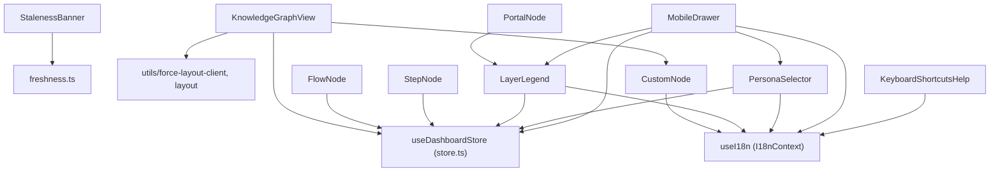
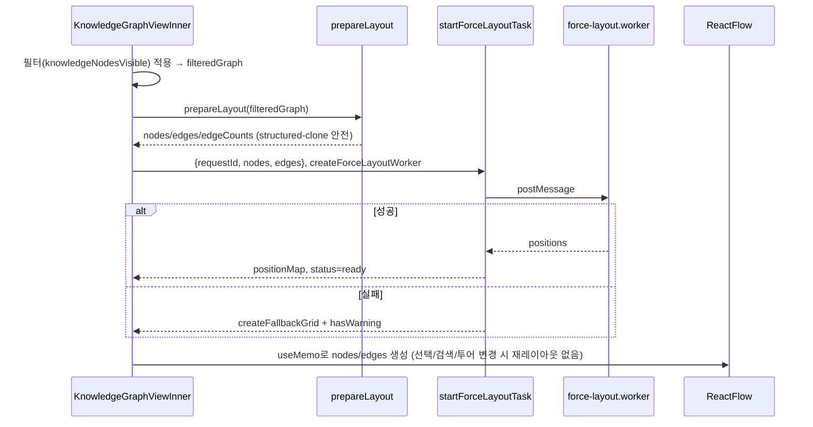
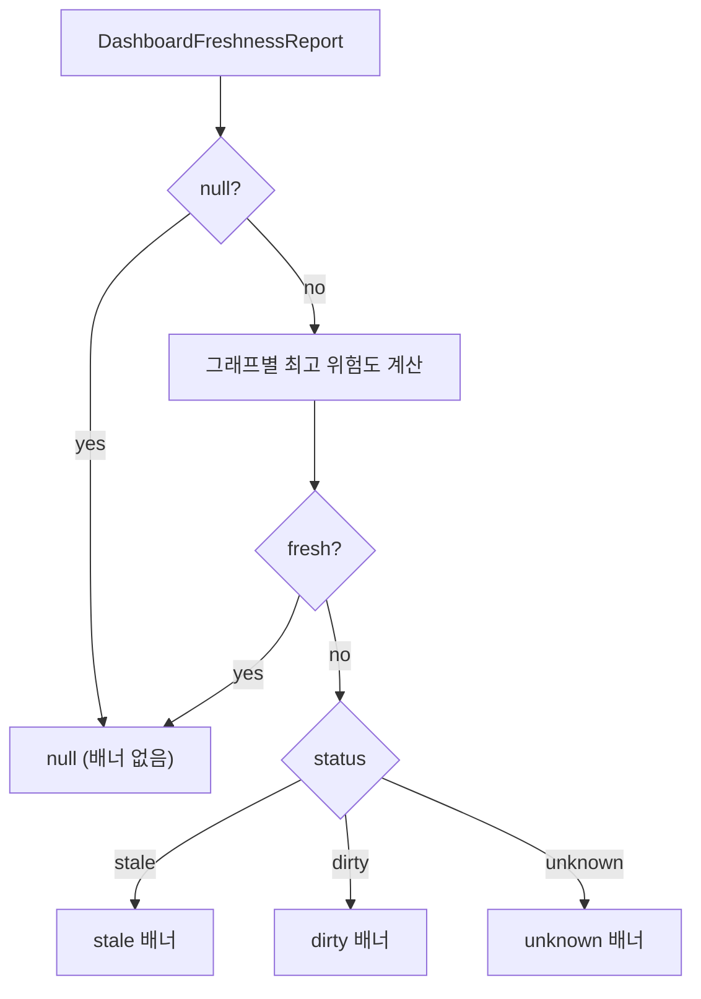

# dashboard_components 모듈

## 1. 개요

`dashboard_components`는 `interactive_dashboard_ui`의 하위 모듈로, 지식 그래프 대시보드의 **React 표현 계층(컴포넌트)** 을 담당합니다. 위치는 `understand-anything-plugin/packages/dashboard/src/components/` 입니다.

이 모듈이 제공하는 기능:

- React Flow 노드 렌더러: `CustomNode`, `FlowNode`, `StepNode`, `PortalNode`
- 지식(knowledge) 그래프 뷰: `KnowledgeGraphView` (force layout을 Web Worker에서 계산)
- 상단/모바일 UI: `PersonaSelector`, `LayerLegend`, `MobileDrawer`, `KeyboardShortcutsHelp`
- 그래프 최신성(freshness) 경고 배너: `StalenessBanner` (`buildFreshnessBanner` 순수 함수 포함)

상태는 [dashboard_state_and_app_services](dashboard_state_and_app_services.md)의 Zustand 스토어(`useDashboardStore`), i18n(`useI18n`), 키보드 훅(`useKeyboardShortcuts`)에서 가져오고, 레이아웃/필터 계산은 [dashboard_graph_utils](dashboard_graph_utils.md)에 위임합니다. 빌드 설정은 [dashboard_build_config](dashboard_build_config.md)를 참고하세요.

> 규칙: 대시보드는 core의 브라우저 안전 서브패스(`@understand-anything/core/types` 등)만 import 합니다 (`CustomNode.tsx`, `KnowledgeGraphView.tsx` 참조).

## 2. 아키텍처

`MobileDrawer`는 `DiffToggle`, `FilterPanel`, `ExportMenu`, `ThemePicker` 도 조합합니다(이 모듈 범위 밖의 컴포넌트).

## 3. 컴포넌트 상세

### 3.1 CustomNode (`CustomNodeComponent`)
- 기본 노드 카드. `memo`로 감쌉니다. `NodeProps<CustomFlowNode>`를 받으며 데이터 형태는 `CustomNodeData`입니다.
- `typeColors` / `typeTextColors`: `NodeType` 별 CSS 변수/Tailwind 클래스 매핑. **core의 `NodeType` 유니온과 동기화**해야 합니다. 알 수 없는 타입은 `file` 색으로 폴백하고 개발 모드에서 경고합니다.
- 시각 상태 합성 우선순위:
  1. 선택(`isSelected`) > 투어 강조(`isTourHighlighted`) > 검색 강조(`isHighlighted`, `searchScore`가 낮을수록(≤0.1, ≤0.3) 강한 링)
  2. diff 오버레이(`isDiffChanged` / `isDiffAffected` / `isDiffFaded`)
  3. 선택 기반 흐림(`isSelectionFaded`) 또는 이웃 강조(`isNeighbor`)
- 라벨은 24자 초과 시 잘라 표시, `tags`에 `tested`가 있으면 초록 점을 표시합니다.

### 3.2 FlowNode / StepNode
- 도메인 그래프 뷰용 노드. 클릭 시 `selectNode(flowId | stepId)`를 스토어에 직접 호출하고 `selectedNodeId`와 비교해 선택 스타일을 적용합니다.
- `FlowNode`: 진입점(`entryPoint`), 요약, 스텝 수 표시. 핸들은 좌/우.
- `StepNode`: 순서(`order`), 라벨, 요약, `filePath` 표시.

### 3.3 PortalNode
- 레이어 상세 뷰에서 다른 레이어로 이동하는 점선 테두리 노드. `data.onNavigate(targetLayerId)` 콜백을 호출하며, 색상은 `getLayerColor(layerColorIndex)`에서 가져옵니다.

### 3.4 LayerLegend
- `LAYER_PALETTE`(7색)과 `getLayerColor(index)`를 **export**하며, LayerLegend, PortalNode 등이 공유하는 레이어 색상 소스입니다.
- `navigationLevel`이 `overview`면 레이어 수를, `layer-detail`이면 활성 레이어 이름을 표시하고 비활성 레이어는 흐리게 처리합니다. 레이어가 없으면 `null`.

### 3.5 KnowledgeGraphView (`KnowledgeGraphViewInner`, `createForceLayoutWorker`)
- `ReactFlowProvider`로 감싼 기본 export. 지식 그래프(article/entity/topic/claim/source)를 force layout으로 배치합니다.
- 핵심 흐름은 **레이아웃 계산(무거움)** 과 **시각 상태 계산(가벼움)** 의 분리입니다.

- 핵심 구현 포인트
  - `getNodeDimensions`: 연결 수에 따라 0.85~1.5 배율로 노드 크기 조절.
  - 레이어 인덱스를 `community`로 넘겨 클러스터링에 활용.
  - 그래프 리비전마다 새 Worker를 만들고, cleanup에서 `task.cancel()`로 진행 중인 시뮬레이션을 즉시 종료. `requestId`로 오래된 결과를 무시.
  - `EDGE_STYLES`: 엣지 타입별(`cites`, `contradicts`, `builds_on` 등) 스타일. 선택 노드가 있으면 연결 엣지는 강조, 나머지는 `opacity: 0.04`. `contradicts`는 애니메이션.
  - 그래프가 없으면 `/understand-knowledge` 실행 안내 문구를 표시.

### 3.6 PersonaSelector
- `persona`(`non-technical` / `junior` / `experienced`)를 Overview / Learn / Deep Dive 라벨의 토글로 노출하고 `setPersona`를 호출합니다. Learn 페르소나는 사이드바의 LearnPanel을 활성화합니다(프로젝트 CLAUDE.md 참고).

### 3.7 MobileDrawer
- 모바일용 좌측 슬라이드 설정 패널. Escape 키로 닫기, 열려 있는 동안 `document.body` 스크롤 잠금.
- 섹션: 역할(PersonaSelector), 뷰 전환(도메인 그래프가 있고 지식 그래프가 아닐 때만), diff 오버레이, 노드 타입 필터, 레이어 범례, 도구(필터/내보내기/경로 탐색/테마/도움말).
- `isKnowledgeGraph`이면 필터는 `knowledge` 하나만 노출합니다.

### 3.8 KeyboardShortcutsHelp
- `shortcuts` 배열을 `category`별로 그룹화해 모달로 표시. 카테고리 이름은 `General/Navigation/Tour/View`를 i18n으로 번역하고, 키 표기는 `formatShortcutKey`를 사용. 배경 클릭 시 닫힘.

### 3.9 StalenessBanner (`buildFreshnessBanner`)
- `DashboardFreshnessReport`를 받아 배너 내용(`title`, `summary`, `action`, `changedFiles`)을 만드는 **순수 함수** `buildFreshnessBanner`와 이를 렌더하는 컴포넌트로 구성됩니다.
- 위험도 순위: `fresh(0) < unknown(1) < dirty(2) < stale(3)`. 가장 높은 위험도의 그래프(knowledge / domain)만 배너에 반영하며, 모두 fresh면 `null`.
- 상태별 동작
  - `stale`: `behind` / `ahead` / 그 외(diverged)로 문구 분기, 변경 파일 수 포함.
  - `dirty`: 작업 트리 변경 안내.
  - `unknown`: 사유(`GraphFreshnessUnknownReason`)별 문구. 요청 실패면 "창을 다시 포커스해 재시도" 안내(참고: [dashboard_state_and_app_services](dashboard_state_and_app_services.md)의 `freshness.ts`).
- 새로 고침 명령은 그래프 종류에 따라 `/understand`, `/understand-domain`, 또는 둘 다를 안내합니다.
- 변경 파일은 정렬·중복 제거 후 최대 8개까지 표시하고 나머지는 `+N more`로 요약, 펼침/접힘은 로컬 `useState`.

테스트: `components/__tests__/StalenessBanner.test.ts`는 단수/복수 문법, ahead/diverged 문구, stale > dirty 우선순위, 양쪽 그래프 동일 위험도 병합, 요청 실패 표시를 검증합니다.

## 4. 설계 노트

- 노드 컴포넌트는 `memo`로 감싸 React Flow 재렌더 비용을 줄입니다. 선택·검색·투어 상태는 `data`로 주입되어 재레이아웃 없이 갱신됩니다.
- 색상은 CSS 변수(`--color-node-*`)와 Tailwind 토큰에 의존하므로 테마 변경([ThemeContext](dashboard_state_and_app_services.md))이 자동 반영됩니다.
- 새 `NodeType`을 core에 추가하면 `CustomNode.tsx`의 `typeColors`, `typeTextColors` 두 맵을 함께 갱신해야 합니다.
- 관련 유틸(`applyDagreLayout`, `computeForceLayout`, `filterNodes` 등)은 [dashboard_graph_utils](dashboard_graph_utils.md)를 참고하세요.
