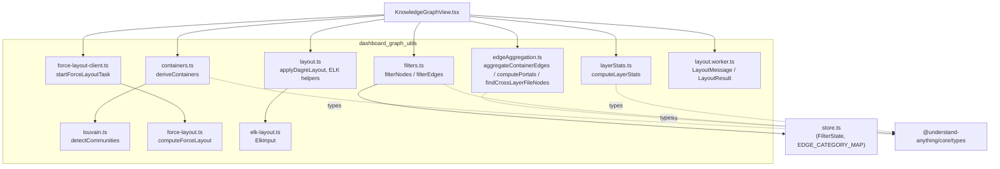
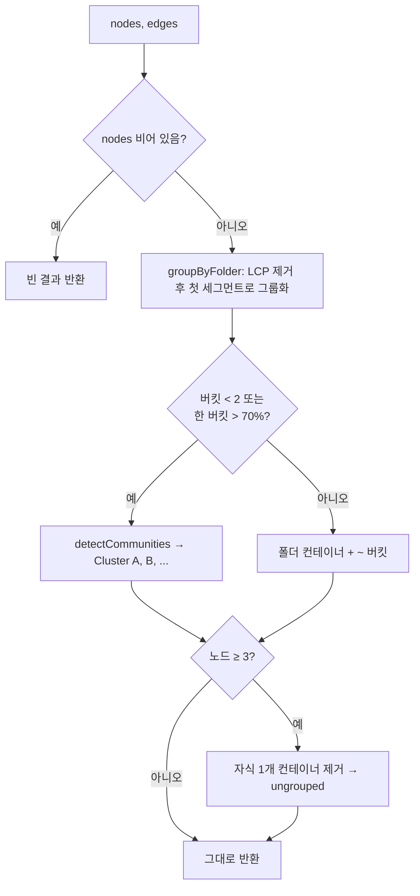
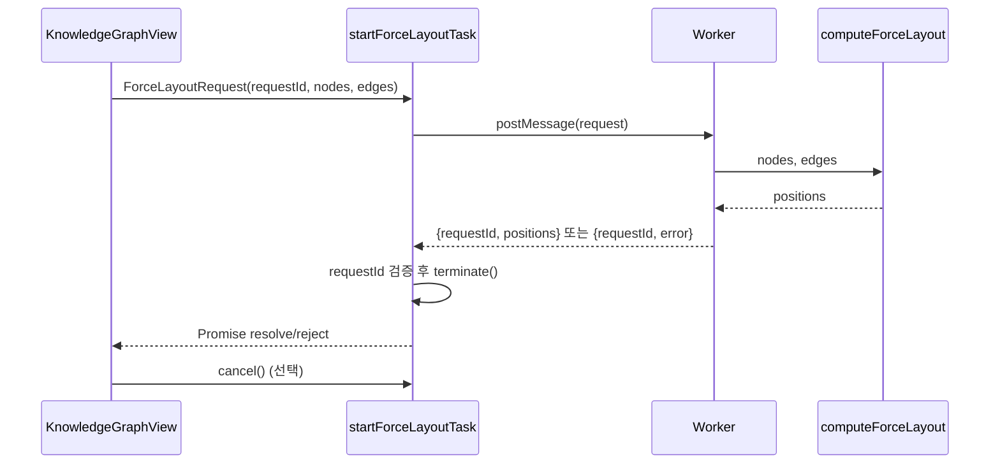
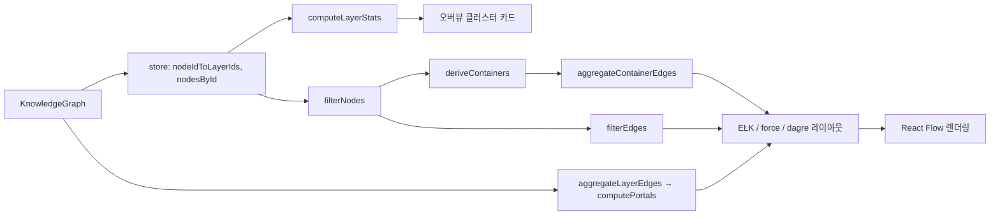

# dashboard_graph_utils 모듈

`understand-anything-plugin/packages/dashboard/src/utils/` 아래에 있는 순수 함수 유틸리티 모음입니다. 지식 그래프(`KnowledgeGraph`)를 대시보드에서 그리기 전에 필요한 **그룹화(컨테이너 도출), 엣지 집계, 필터링, 레이어 통계, 레이아웃 계산**을 담당합니다. React 상태나 DOM에 의존하지 않기 때문에 Node 기반 Vitest로 검증할 수 있고, 무거운 계산(d3-force, dagre)은 Web Worker에서 실행할 수 있습니다.

상위 모듈: [interactive_dashboard_ui](interactive_dashboard_ui.md). 형제 모듈: [dashboard_components](dashboard_components.md)(이 유틸을 호출하는 뷰), [dashboard_state_and_app_services](dashboard_state_and_app_services.md)(`store.ts`의 `FilterState`, `EDGE_CATEGORY_MAP` 등 제공). 그래프 타입(`GraphNode`, `GraphEdge`, `Layer`, `KnowledgeGraph`)은 core의 `@understand-anything/core/types` 서브패스에서 가져옵니다. 자세한 내용은 [knowledge_graph_core_engine](knowledge_graph_core_engine.md)를 참고하세요.

> 브라우저 안전성: 대시보드는 core의 `./types`, `./schema`, `./search` 서브패스만 import해야 합니다(CLAUDE.md 참고). 이 모듈은 `import type`만 사용합니다.

## 아키텍처

`louvain.ts`, `elk-layout.ts`, `force-layout-client.ts`는 제공된 핵심 컴포넌트에는 없지만, 위 코드에서 import되거나 테스트에서 참조되는 이웃 파일입니다.

## 컴포넌트 상세

### `containers.ts` — `deriveContainers(nodes, edges)`

레이어 안의 노드를 시각적 컨테이너(박스)로 묶습니다. 반환값은 `DeriveResult { containers, ungrouped }`이고, 각 `DerivedContainer`는 `id`, `name`, `nodeIds`, `strategy: "folder" | "community"`를 가집니다.

동작 순서:
1. **폴더 전략** (`groupByFolder`): 모든 `filePath`의 *디렉터리 부분*에서 공통 접두사(LCP)를 구해 `/` 경계로 자릅니다. LCP를 뺀 뒤 첫 번째 경로 세그먼트로 그룹화합니다. 세그먼트가 없거나 `filePath`가 없는 노드는 `~`(`ROOT_BUCKET`) 버킷에 들어갑니다.
2. **커뮤니티 폴백** (`shouldFallbackToCommunity`): 버킷이 2개 미만(`MIN_BUCKET_COUNT`)이거나, 한 버킷이 전체의 70% 초과(`MAX_CONCENTRATION`)이면 폴더 구분이 의미 없다고 보고 `detectCommunities`(Louvain)로 엣지 기반 클러스터링을 합니다. 이름은 `Cluster A`~`Cluster Z`, 26개를 넘으면 `Cluster 27`처럼 숫자를 씁니다.
3. **단일 자식 컨테이너 제거**: 노드가 3개 이상(`MIN_NODES_FOR_SUPPRESSION`)일 때, 자식이 1개인 컨테이너는 제거하고 그 자식을 `ungrouped`로 보냅니다. 노드가 3개 미만이면 제거하지 않습니다.

컨테이너 id는 `container:<세그먼트>`, `container:~`, `container:cluster-<id>` 형식입니다.

### `edgeAggregation.ts`

| 함수 | 역할 |
|---|---|
| `aggregateLayerEdges(graph)` | 레이어 간 엣지를 세어 집계합니다. `A→B`와 `B→A`는 정렬된 키로 **합칩니다**(무방향). 양 끝이 모두 레이어에 속한 엣지만 봅니다. |
| `computePortals(graph, activeLayerId, precomputed?)` | 활성 레이어와 연결된 다른 레이어와 연결 수(`PortalInfo`)를 계산합니다. 미리 계산한 집계를 넘기면 재계산을 피합니다. |
| `findCrossLayerFileNodes(graph, activeLayerId, targetLayerId)` | 활성 레이어에서 대상 레이어로 엣지가 넘어가는 노드 id 집합을 반환합니다. 양방향을 모두 검사합니다. |
| `aggregateContainerEdges(edges, nodeToContainer)` | 엣지를 `intraContainer`(원본 유지)와 `interContainerAggregated`(방향 있는 컨테이너 쌍별 집계)로 나눕니다. |

`aggregateContainerEdges`의 주의점:
- **방향이 의미 있습니다.** `A→B`와 `B→A`는 서로 다른 집계 엣지가 됩니다(레이어 집계와 반대).
- 컨테이너 매핑이 없는 끝점을 가진 엣지는 조용히 버려집니다.
- 맵 키는 `${sc.length}:${sc} ${tc}`로, 컨테이너 id에 구분자(공백)가 들어 있어도 충돌하지 않게 소스에 길이 접두사를 붙입니다(`"x y"+"z"` 대 `"x"+"y z"`).

### `filters.ts` — `filterNodes`, `filterEdges`

- `filterNodes(nodes, nodeIdToLayerIds, filters)`: 노드 타입, 복잡도, 레이어 조건을 차례로 검사합니다. 레이어 소속은 store가 `setGraph`에서 한 번 만들어 두는 `Map<string, Set<string>>`으로 O(1)에 확인합니다. 이전 방식은 `layer.nodeIds.includes`로 O(N×L×K)였고 대형 그래프에서 병목이었습니다(#102).
  - 레이어 필터가 비어 있으면 무시합니다. 활성화되어 있으면 어느 레이어에도 속하지 않은 노드는 제외됩니다.
  - **any-layer-wins**: 여러 레이어에 속한 노드는 그중 하나만 선택돼도 통과합니다. 탐색용 first-wins 인덱스 `nodeIdToLayerId`를 여기서 쓰면 안 됩니다.
- `filterEdges(edges, visibleNodeIds, filters)`: 양 끝이 보이는 노드인 엣지만 남기고, 엣지 타입의 카테고리(`EDGE_CATEGORY_MAP` 기반)가 꺼져 있으면 제외합니다. 모듈 로드 시 한 번 만든 역인덱스 `EDGE_TYPE_TO_CATEGORY`로 엣지마다 상수 시간에 조회합니다(중복 타입은 첫 카테고리 우선). **알 수 없는 엣지 타입은 카테고리가 `null`이라 필터를 통과합니다**(테스트로 고정됨).

### `layerStats.ts` — `computeLayerStats(layer, nodesById)`

레이어의 `nodeIds`를 한 번 돌면서 `resolvedCount`(그래프에 실제 있는 노드 수)와 `aggregateComplexity`를 계산합니다. `complex` 비율이 30%를 **초과**하면 `"complex"`, 아니면 `moderate`가 30%를 초과하면 `"moderate"`, 그 외는 `"simple"`입니다. 둘 다 넘으면 `complex`가 우선합니다. 빈 레이어는 `simple`, 0입니다. 복잡도가 `simple/moderate/complex` 외의 값이면 카운트가 `NaN`이 될 수 있으므로 스키마 검증을 거친 그래프를 전제로 합니다.

### `force-layout.ts` — `computeForceLayout`

DOM에 의존하지 않는 d3-force 시뮬레이션입니다. 요청/응답 타입은 `ForceLayoutRequest`, `ForceLayoutSuccess`(`positions`), `ForceLayoutFailure`(`error`)이고 `requestId`로 응답을 짝지어 줍니다.

- x/y를 설정하지 않아 d3의 결정적 phyllotaxis 초기 배치를 쓰므로, 같은 순서의 입력이면 같은 결과가 나옵니다.
- 존재하지 않는 노드를 가리키는 엣지는 걸러냅니다.
- 노드가 100개를 넘으면 반발력 -600, 링크 거리 250, 아니면 -350, 150을 씁니다. 충돌 반경은 `max(20, (width+40)/2)`입니다.
- `community`가 2종류 이상이면 커뮤니티를 원형으로 배치하는 `forceX`/`forceY`(반경 `max(600, n*5)`)를 추가합니다.
- `tick`은 `min(300, max(100, n))`회 실행하고 중심 좌표를 좌상단 좌표로 바꿔 돌려줍니다. 유한하지 않은 값은 0으로 처리합니다.

Worker 쪽 래퍼 `force-layout-client.ts`(`startForceLayoutTask`, `ForceLayoutCancelledError`)는 요청을 `postMessage`로 보내고, 일치하는 `requestId` 응답으로 resolve하고 종료 시 항상 `terminate()`합니다. 다른 요청의 응답, 에러 응답, Worker 생성 실패는 reject하며, `cancel()`은 `ForceLayoutCancelledError`로 reject합니다(테스트 `force-layout-client.test.ts`).

### `layout.ts` / `layout.worker.ts`

- `applyDagreLayout(nodes, edges, direction, nodeDimensions?, spacingOverrides?)`: 동기 dagre 레이아웃입니다. 노드가 50개를 넘으면 간격을 넓힙니다(nodesep 80/ranksep 120, 아니면 60/80). **`@deprecated`**: 구조 뷰는 이미 ELK(`applyElkLayout`)를 쓰며, ELK에 문제가 생길 때를 대비한 폴백으로 한 릴리스 동안만 남겨 둡니다.
- 크기 상수: `NODE_WIDTH=280`, `NODE_HEIGHT=120`, `LAYER_CLUSTER_WIDTH/HEIGHT=320/180`, `PORTAL_NODE_WIDTH/HEIGHT=240/80`.
- ELK 도우미: `ELK_DEFAULT_LAYOUT_OPTIONS`(layered, 아래 방향, 직교 엣지 라우팅), `nodesToElkInput`(React Flow 노드/엣지 → `ElkInput`), `mergeElkPositions`(ELK 결과 위치를 노드에 병합, 컨테이너 노드는 width/height도 전달).
- `layout.worker.ts`: dagre를 Worker 안에서 실행합니다. `LayoutMessage`(`requestId`, `nodes`, `edges`, `direction`)를 받아 `LayoutResult`(`requestId`, `positions`)를 `postMessage`합니다. 간격은 60/80으로 고정이며 `applyDagreLayout`처럼 대형 그래프용 조정은 없습니다.

## 데이터 흐름

## 테스트

`utils/__tests__/`에 Vitest 테스트가 있습니다(루트 `vitest.config.ts` 및 대시보드 `test` 스크립트로 실행, 설정은 [dashboard_build_config](dashboard_build_config.md) 참고).

- `containers.test.ts`: 폴더 그룹화, 깊은 LCP 제거, `~` 버킷, 단일 자식 제거, 커뮤니티 폴백(밀집 두 클러스터, 70% 초과).
- `edgeAggregation.test.ts`: 내부/외부 분리, 같은 방향 병합, 반대 방향 분리, 매핑 없는 엣지 무시, 구분자 충돌 방지.
- `filters.test.ts`: 타입/복잡도/레이어/any-layer-wins/엣지 카테고리/알 수 없는 타입 통과, 1만 노드×100 레이어 50ms 미만 성능 가드(#102).
- `layerStats.test.ts`: 30% 임계값, complex 우선, 빈 레이어, 성능 가드.
- `force-layout-client.test.ts`: Worker 수명 주기(응답, 불일치, 취소, 에러, 생성 실패).

`test` 파일의 이름은 `node`, `ce`, `makeWorker` 같은 작은 팩토리 헬퍼이며, 스냅샷 없이 동작을 직접 검증합니다.

## 유지보수 참고

- 대형 그래프에서 `Array.includes`나 반복 선형 탐색을 다시 넣지 마세요. 인덱스(`Map`/`Set`)를 받는 현재 시그니처를 유지하는 것이 #102 회귀 방지의 핵심입니다.
- 레이어 집계(`aggregateLayerEdges`, 무방향)와 컨테이너 집계(`aggregateContainerEdges`, 유방향)의 방향 규칙이 다릅니다. 새 소비자를 만들 때 혼동하지 마세요.
- 새 엣지 타입을 추가하면 store의 `EDGE_CATEGORY_MAP`에 등록해야 카테고리 필터가 적용됩니다.
