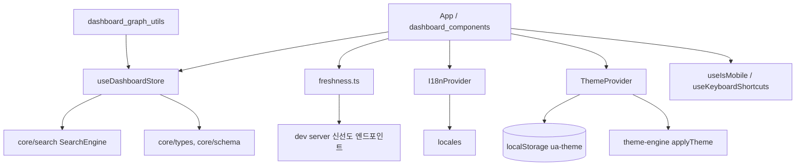
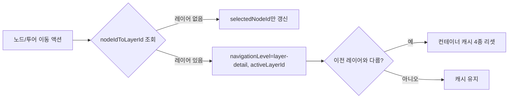
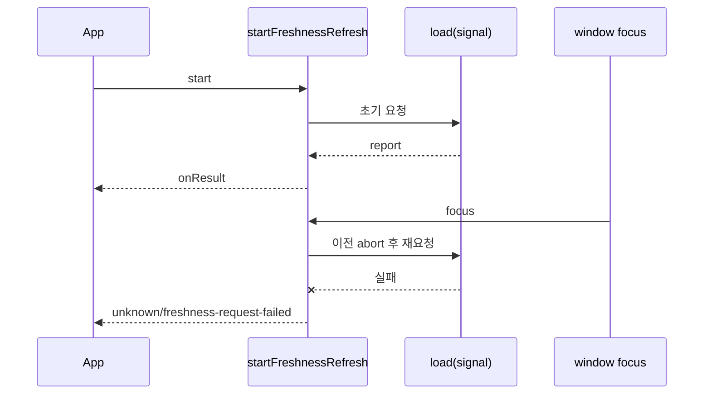

# dashboard_state_and_app_services

`interactive_dashboard_ui`의 하위 모듈로, 대시보드 전체가 공유하는 **전역 상태(Zustand 스토어)** 와 **앱 서비스**(신선도 조회, i18n, 테마, 반응형/키보드 훅)를 담당합니다. 렌더링 컴포넌트는 [dashboard_components](dashboard_components.md), 그래프 계산 유틸은 [dashboard_graph_utils](dashboard_graph_utils.md), 빌드/개발 서버 설정은 [dashboard_build_config](dashboard_build_config.md)를 참고하세요.

## 구성 요소

| 파일 | 핵심 심볼 | 역할 |
|---|---|---|
| `src/store.ts` | `useDashboardStore`, `buildGraphIndexes`, `getSortedTour`, `navigateTourToLayer`, `layerResetIfChanged` | 그래프, 탐색, 투어, 필터, 컨테이너 레이아웃 캐시 등 전역 상태 |
| `src/freshness.ts` | `requestFreshnessReport`, `shouldRequestFreshness`, `startFreshnessRefresh` | 그래프가 Git HEAD 대비 최신인지 서버에 묻고 검증 |
| `src/contexts/I18nContext.tsx` | `I18nProvider`, `useI18n` | 언어 → 로케일 사전(`t`) 제공 |
| `src/themes/ThemeContext.tsx`, `themes/types.ts` | `ThemeProvider`, `useTheme`, `ThemeConfig` | 프리셋/강조색/제목 폰트 관리 및 localStorage 영속화 |
| `src/hooks/useIsMobile.ts` | `useIsMobile` | `matchMedia` 기반 모바일 판정 (기본 768px) |
| `src/hooks/useKeyboardShortcuts.ts` | `useKeyboardShortcuts`, `formatShortcutKey` | 전역 단축키 등록 및 표시 문자열 생성 |
| `src/__tests__/store-navigation.test.ts`, `freshness.test.ts` | — | 스토어 레이어 이동 캐시 리셋, 신선도 흐름 테스트 |

## 아키텍처

대시보드는 `@understand-anything/core`의 브라우저 안전 서브패스(`/search`, `/types`, `/schema`)만 임포트합니다(루트 CLAUDE.md의 규칙).

## 스토어 (`store.ts`)

### 상태 그룹
- **그래프/인덱스**: `graph`, `nodesById`, `nodeIdToLayerId`, `nodeIdToLayerIds` — `setGraph`가 `buildGraphIndexes`로 재구성.
- **탐색**: `navigationLevel`(`overview` | `layer-detail`), `activeLayerId`, `selectedNodeId`, `focusNodeId`, `nodeHistory`(최대 `MAX_HISTORY=50`).
- **검색**: `searchEngine`, `searchQuery`, `searchResults`, `searchMode`. 현재 `fuzzy`/`semantic` 모두 동일한 `SearchEngine`을 사용합니다.
- **투어**: `tourActive`, `currentTourStep`, `tourHighlightedNodeIds`, `tourFitPending`.
- **필터/뷰**: `filters`(`FilterState`), `nodeTypeFilters`, `persona`, `detailLevel`, `showFunctionsInClassView`, `viewMode`(`structural` | `domain` | `knowledge`), `domainGraph`, `activeDomainId`.
- **오버레이/UI**: `diffMode`, `changedNodeIds`, `affectedNodeIds`, 코드 뷰어(`codeViewerOpen/NodeId/Expanded`), 필터·내보내기·경로 탐색 패널 토글, `reactFlowInstance`.
- **컨테이너 레이아웃**: `expandedContainers`, `pendingFocusContainer`, `containerLayoutCache`, `containerSizeMemory`, `stage1Tick`, `layoutIssues`.

상수: `ALL_NODE_TYPES`, `ALL_COMPLEXITIES`, `ALL_EDGE_CATEGORIES`, `EDGE_CATEGORY_MAP`(엣지 타입 → 카테고리), `DOMAIN_EDGE_TYPES`.

### 핵심 헬퍼
- `buildGraphIndexes(graph)`: 두 가지 레이어 인덱스를 의도적으로 분리합니다.
  - `nodeIdToLayerId`: 첫 번째로 일치하는 레이어 우선 → 이동(drill, 투어, 히스토리)용 단일 정본 레이어.
  - `nodeIdToLayerIds`: 노드가 속한 모든 레이어 → `filterNodes`의 "어느 한 레이어라도 선택되면 통과" 의미론.
- `getSortedTour(graph)`: `order` 기준 정렬 복사본.
- `navigateTourToLayer(map, nodeIds)`: 첫 하이라이트 노드의 레이어로 `layer-detail` 이동 상태를 반환(없으면 `{}`).
- `layerResetIfChanged(layerNav, prevLayerId)`: 레이어가 **실제로 바뀔 때만** 컨테이너 캐시(`containerLayoutCache`, `containerSizeMemory`, `expandedContainers`, `pendingFocusContainer`)를 비웁니다. 컨테이너 id(`container:cluster-0`, 폴더명 등)가 레이어 간에 충돌하기 때문입니다.

### 캐시 무효화 규칙
컨테이너 자식 집합이 바뀌는 모든 액션은 위 네 가지 캐시를 리셋합니다: `drillIntoLayer`, `navigateToOverview`, `setFocusNode`, `setPersona`, `toggleNodeTypeFilter`, `setDetailLevel`(추가로 `showFunctionsInClassView=false`), `toggleShowFunctionsInClassView`, `setGraph`. 반면 `navigateToNodeInLayer`, `navigateToHistoryIndex`, `goBackNode`, 투어 이동은 `layerResetIfChanged`로 **레이어가 바뀔 때만** 리셋합니다(테스트 `store-navigation.test.ts`가 검증).

### 주요 동작
- `setGraph`: `SearchEngine` 재생성, 기존 질의로 결과 재계산, 탐색/히스토리/캐시/`layoutIssues` 초기화. 도메인 그래프가 로드된 도메인 뷰는 유지.
- `selectNode`/`navigate*`: 다른 노드로 이동 시 이전 노드를 히스토리에 push(최대 50개).
- `setDomainGraph`, `setViewMode`, `navigateToDomain`, `clearActiveDomain`: 구조/도메인/지식 뷰 전환. `setViewMode`는 선택·포커스·코드 뷰어를 닫습니다.
- `toggleContainer`: 펼칠 때 `pendingFocusContainer`를 설정해 뷰포트가 잠기게 함(GraphView가 소비).
- `setContainerLayout`: 자식 좌표와 실제 크기를 캐시하고 `containerSizeMemory`에도 기록.
- `appendLayoutIssues`: `level|message`로 중복 제거하여 WarningBanner로 전달.
- `toggleFilterPanel`/`toggleExportMenu`는 상호 배타적.
- `hasActiveFilters()`는 기본값과 다른 필터가 있는지 반환.

## 신선도 서비스 (`freshness.ts`)

서버가 계산한 그래프 신선도 리포트(`DashboardFreshnessReport`)를 가져와 검증합니다. 결과 상태:

| status | 조건 |
|---|---|
| `fresh` | 변경 파일 0, 앞/뒤 커밋 0 |
| `dirty` | 커밋은 같으나 작업 트리 변경 파일 > 0 |
| `stale` | `relation`: `behind` / `ahead` / `diverged`, 변경 파일 > 0 |
| `unknown` | `reason`: `missing-graph-commit`, `git-head-unavailable`, `graph-commit-unavailable`, `git-command-timeout`, `freshness-request-failed` |

- `isGraphFreshnessResult` / `isDashboardFreshnessReport`: 런타임 타입 가드. `changedFileCount === changedFiles.length` 등 일관성까지 검사하며 잘못된 페이로드는 거부.
- `shouldRequestFreshness(demoMode, demoFreshnessUrl)`: 로컬 대시보드 또는 명시적 URL이 있는 데모만 요청(정적 데모는 생략).
- `requestFreshnessReport(url, signal, fetcher)`: `cache: "no-store"`로 fetch, `ok` 아님/형식 불량 시 예외.
- `startFreshnessRefresh({ target, load, onResult })`: 시작 즉시 1회 로드, 이후 `focus` 이벤트마다 재로드(주기 폴링 없음). 새 요청 전 이전 요청을 abort하고, 오래된/중단된 응답은 무시. 실패 시 `freshness-request-failed` 리포트를 발행. 반환된 함수가 리스너 제거와 abort를 수행.

리포트를 사용자용 배너로 변환하는 `buildFreshnessBanner`는 [dashboard_components](dashboard_components.md)에, 서버 측 엔드포인트는 [dashboard_build_config](dashboard_build_config.md)(`vite.config.ts`)에 있으며, Git 기반 신선도 계산 로직은 [core_search_persistence_staleness](core_search_persistence_staleness.md)를 참고하세요.

## 컨텍스트와 훅

- **I18nProvider**: `language` → `resolveLocaleKey` → `getLocale`. `useI18n()`은 `{ locale, localeKey, t }`를 반환하며 Provider 밖에서 호출하면 예외.
- **ThemeProvider**: 초기값 우선순위는 `localStorage("ua-theme")` → `metaTheme`(그래프 메타) → `DEFAULT_THEME_CONFIG`(`dark-gold`/`gold`). 설정 변경 시 `applyTheme`로 적용하고, 최초 마운트 이후에만 저장. `metaTheme`가 비동기로 늦게 오면 저장된 선호가 없을 때만 반영. `setPreset`은 프리셋의 기본 강조색으로 리셋. `PresetId`: `dark-gold`, `dark-ocean`, `dark-forest`, `dark-rose`, `light-minimal`; `HeadingFont`: `serif`/`sans`/`mono`.
- **useIsMobile(breakpoint=768)**: `(max-width: breakpoint-1px)` 미디어 쿼리 구독, SSR 환경에서는 `false`.
- **useKeyboardShortcuts(shortcuts, enabled)**: `document`에 `keydown` 등록. input/textarea/contentEditable에서는 `Escape`만 허용. 수식키는 정확히 일치해야 하며 Ctrl/Meta/Alt 조합은 `preventDefault`. `formatShortcutKey`는 플랫폼별(⌘/Ctrl, ⌥/Alt) 표시 문자열을 만들고, `?` 같은 Shift 필요 문자에는 ⇧를 붙이지 않습니다. 사용처는 `KeyboardShortcutsHelp`([dashboard_components](dashboard_components.md)).

## 다른 모듈과의 관계

- 컴포넌트(`KnowledgeGraphView`, `LayerLegend`, `PersonaSelector` 등)가 스토어를 구독합니다: [dashboard_components](dashboard_components.md)
- `filterNodes`/`filterEdges`, `deriveContainers`, 레이아웃 유틸이 스토어의 인덱스와 캐시를 읽고 씁니다: [dashboard_graph_utils](dashboard_graph_utils.md)
- 그래프 타입, 검색 엔진, 스키마 검증은 core에서 옵니다: [core_search_persistence_staleness](core_search_persistence_staleness.md)

## 테스트

`pnpm --filter @understand-anything/dashboard test` (Vitest). `store-navigation.test.ts`는 `useDashboardStore.getInitialState()`로 스토어를 초기화하고 레이어 교차 시 캐시 리셋/동일 레이어에서 보존을 검증합니다. `freshness.test.ts`는 타입 가드, abort 처리, focus 재요청, 실패 시 unknown 발행을 검증합니다.
