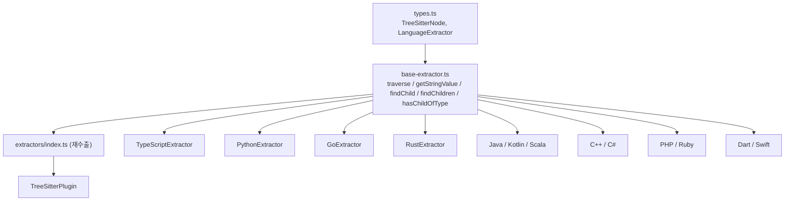
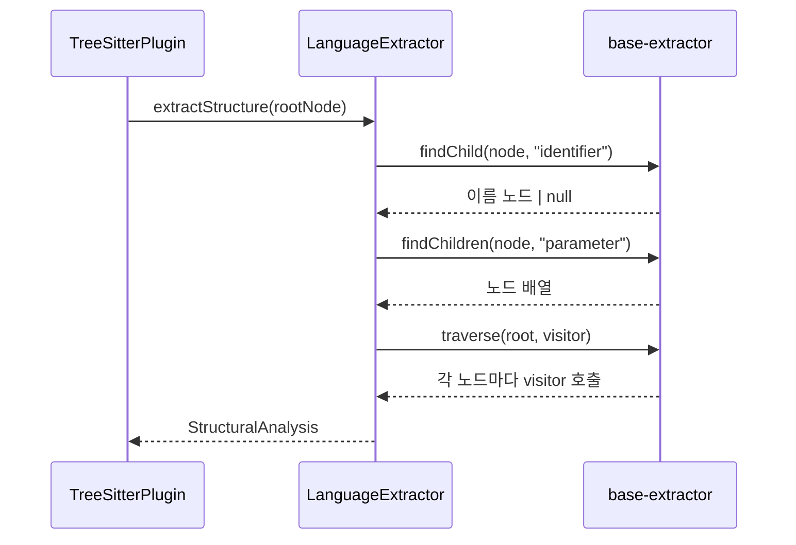

# extractor_base 모듈

## 개요

`extractor_base`는 언어별 tree-sitter 추출기(extractor)들이 공통으로 사용하는 **AST 탐색 헬퍼 함수 모음**입니다. 파일은 `understand-anything-plugin/packages/core/src/plugins/extractors/base-extractor.ts` 하나이며, 클래스나 상태 없이 순수 함수만 export합니다. 모든 함수는 `./types.js`의 `TreeSitterNode` 인터페이스(`childCount`, `child(i)`, `type`, `text`)에만 의존합니다.

> 참고: 모듈 트리의 핵심 컴포넌트로는 `hasChildOfType`만 등록되어 있지만, 같은 파일에는 `traverse`, `getStringValue`, `findChild`, `findChildren`도 함께 정의되어 있고 모두 `extractors/index.ts`에서 재수출됩니다.

## 제공 함수

| 함수 | 시그니처 | 동작 |
|---|---|---|
| `traverse` | `(node, visitor) => void` | 깊이 우선(전위)으로 모든 후손 노드에 `visitor`를 호출 |
| `getStringValue` | `(node) => string` | 문자열 노드에서 따옴표를 제거한 값 반환. `string_fragment` 자식이 있으면 그 텍스트, 없으면 `'`, `"`, `` ` `` 를 양끝에서 제거 |
| `findChild` | `(node, type) => TreeSitterNode \| null` | 직계 자식 중 첫 번째로 `type`이 일치하는 노드 |
| `findChildren` | `(node, type) => TreeSitterNode[]` | 직계 자식 중 `type`이 일치하는 모든 노드 |
| `hasChildOfType` | `(node, type) => boolean` | 직계 자식 중 해당 `type`이 있는지 여부(export/visibility 판정용) |

`findChild`/`findChildren`/`hasChildOfType`은 **직계 자식만** 검사합니다(재귀 아님). 재귀 탐색이 필요하면 `traverse`를 사용합니다. `child(i)`가 null을 반환할 수 있으므로 모든 함수가 null 가드를 갖고 있습니다.

## 아키텍처

## 사용처

`base-extractor.js`를 직접 import하는 추출기와 사용 함수:

- `findChild`, `findChildren`: Go, Scala, C#, C++, Rust, Kotlin, Java, Python, PHP
- `findChild`: Swift, Ruby
- `findChild`, `findChildren`, `getStringValue`: Dart
- `getStringValue`: TypeScript

각 추출기는 `LanguageExtractor`를 구현하며 `extractStructure`(함수/클래스/import/export 추출)와 `extractCallGraph`(호출 관계 추출)를 제공합니다. 이 헬퍼들은 그 안에서 AST 노드를 단계적으로 내려가며 이름, 파라미터, 본문 등의 자식을 찾는 데 쓰입니다.

## 데이터 흐름

## 설계 노트 및 주의사항

- **의존성 최소화**: 파서 런타임(`web-tree-sitter`)에 직접 의존하지 않고 `TreeSitterNode` 구조적 타입만 사용하므로 테스트에서 목(mock) 노드로 쉽게 대체할 수 있습니다.
- **`traverse`는 재귀**: 매우 깊은 AST에서는 호출 스택 깊이에 영향을 줄 수 있습니다.
- **`getStringValue`의 한계**: 양끝 따옴표만 제거하며, 이스케이프 시퀀스나 템플릿 리터럴 보간은 처리하지 않습니다.
- **`hasChildOfType`**: `findChild(...) !== null`과 동치이지만 노드를 반환하지 않는 불리언 판정용입니다. 예를 들어 `export` 키워드나 접근 제어자 자식 존재 여부 확인에 사용됩니다.

## 관련 문서

- [core_language_extractors](core_language_extractors.md): 언어별 추출기 전체 개요
- [core_plugin_system](core_plugin_system.md): `TreeSitterPlugin`과 `PluginRegistry`
- [typescript_extractor](typescript_extractor.md), [python_extractor](python_extractor.md), [go_extractor](go_extractor.md), [rust_extractor](rust_extractor.md), [jvm_extractors](jvm_extractors.md), [c_family_extractors](c_family_extractors.md), [scripting_extractors](scripting_extractors.md), [mobile_extractors](mobile_extractors.md)
