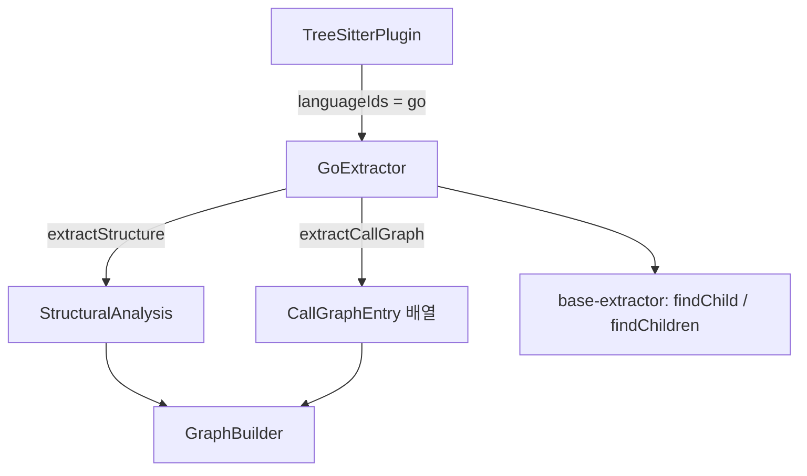
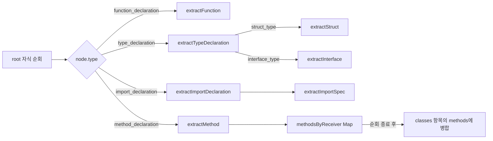
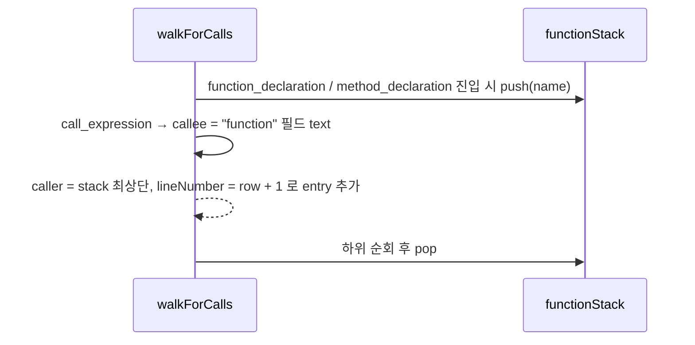

# go_extractor 모듈

## 개요

`go_extractor`는 tree-sitter(WASM, `web-tree-sitter`)가 만든 Go 구문 트리에서 **구조 분석(`StructuralAnalysis`)** 과 **호출 그래프(`CallGraphEntry[]`)** 를 추출하는 언어별 추출기입니다. `GoExtractor` 클래스 하나로 구성되며, `LanguageExtractor` 인터페이스를 구현해 [core_plugin_system](core_plugin_system.md)의 `TreeSitterPlugin`에 등록됩니다.

- 소스: `understand-anything-plugin/packages/core/src/plugins/extractors/go-extractor.ts`
- 테스트: `understand-anything-plugin/packages/core/src/plugins/extractors/__tests__/go-extractor.test.ts`
- 공용 헬퍼(`findChild`, `findChildren`): [extractor_base](extractor_base.md)
- 상위 모듈: [core_language_extractors](core_language_extractors.md)
- 형제 추출기: [typescript_extractor](typescript_extractor.md), [python_extractor](python_extractor.md), [rust_extractor](rust_extractor.md)

## 아키텍처

`GraphBuilder`([core_graph_analysis](core_graph_analysis.md))는 결과를 받아 파일/함수/클래스 노드와 import·call 엣지를 만듭니다.

## 컴포넌트

### 모듈 내부 헬퍼 함수

| 함수 | 역할 |
|---|---|
| `extractParams` | `parameter_list`의 `parameter_declaration`에서 `identifier`를 모두 수집합니다. `a, b int`처럼 이름이 여러 개여도 처리하며, 이름 없는 파라미터는 건너뜁니다. |
| `extractResultType` | `result` 필드의 원문 텍스트를 반환합니다(`error`, `*Server`, `(string, error)`). 없으면 `undefined`입니다. |
| `extractReceiverType` | 메서드 리시버의 기본 타입명을 반환합니다. 포인터(`*`)와 제네릭 인자(`A[T]`)는 벗겨내고 `type_identifier`만 반환합니다. |
| `isExported` | 첫 글자가 `A-Z`이면 export로 판정합니다(Go 대문자 규칙). |

### `GoExtractor`

`languageIds = ["go"]`.

#### `extractStructure(rootNode)`

루트의 직계 자식만 순회하며 노드 타입별로 분기합니다.

Go 특유의 매핑 규칙은 다음과 같습니다.

- **struct/interface → `classes`**. struct의 `properties`는 `field_identifier`이고, interface의 `methods`는 `method_elem`의 이름입니다. interface의 `properties`는 항상 빈 배열입니다.
- **메서드 → `functions`** 에 저장합니다. `owner`는 리시버 타입명입니다. 리시버 타입을 알 수 없으면 `null`이고, 일반 함수는 `""`입니다. 리시버 타입이 있으면 `methodsByReceiver`에도 기록해 두었다가 같은 파일의 struct/interface 항목 `methods`에 붙입니다. 이렇게 해서 타입 선언보다 앞이나 뒤에 있는 메서드도 연결됩니다. 제네릭 리시버(`*A[T]`)도 `A`에 귀속됩니다.
- **exports**: 함수, 메서드, struct, interface 이름이 대문자로 시작하면 등록합니다.
- **imports**: 단일 import와 그룹 import(`import_spec_list`)를 모두 처리합니다. `source`는 따옴표를 제거한 경로입니다. `specifiers`는 별칭이 있으면 별칭, 없으면 경로의 마지막 구성 요소(`net/http` → `http`)입니다.
- 줄 번호는 모두 1-based(`row + 1`)입니다.
- `type_declaration`은 첫 `type_spec`만 처리하며, struct/interface가 아닌 타입 정의(예: `type ID int`)는 무시합니다. 또한 `type ( ... )` 그룹의 두 번째 이후 spec도 처리하지 않습니다.

#### `extractCallGraph(rootNode)`

AST 전체를 재귀 순회하면서 `functionStack`으로 현재 감싸는 함수를 추적합니다.

- callee는 표현식 원문이라 `fmt.Println`, `s.helper`처럼 selector가 그대로 보존됩니다. 패키지나 리시버 해석은 하지 않습니다.
- caller는 메서드도 이름만 사용합니다(`Start`). 리시버 정보는 포함하지 않으므로 서로 다른 타입의 동명 메서드는 구분되지 않습니다.
- 함수 스택이 비어 있는 최상위 호출(`var _ = fmt.Println(...)`)은 무시합니다.
- 함수 리터럴(클로저)은 스택에 push하지 않으므로 클로저 내부 호출은 감싸는 이름 있는 함수의 호출로 기록됩니다.

## 테스트

`go-extractor.test.ts`는 `tree-sitter-go/tree-sitter-go.wasm`을 `beforeAll`에서 한 번 로드하고, `parse(code)` 헬퍼로 코드 조각을 파싱합니다. 각 테스트는 끝에서 `tree.delete()`와 `parser.delete()`로 WASM 메모리를 해제합니다. 검증 범위는 다음과 같습니다.

- 함수 파라미터와 반환 타입(단일, 다중, 없음), 여러 줄 함수의 line range
- 리시버 소유권, 제네릭 리시버, 같은 이름 메서드
- struct 필드(`X, Y int` 포함), 빈 struct/interface, interface 메서드
- 단일, 그룹, 별칭 import와 줄 번호
- 대소문자 기준 export
- 호출 그래프: 단순 호출, selector 호출, 메서드 caller, 줄 번호, 최상위 호출 무시

테스트 실행은 `pnpm --filter @understand-anything/core test`입니다(설정: `understand-anything-plugin/packages/core/vitest.config.ts`).

## 확장 시 참고

- 새 Go 구문 지원은 `extractStructure`의 `switch`에 case를 추가하고 private 헬퍼를 만드는 방식으로 합니다.
- 다른 언어 추출기와 같은 `StructuralAnalysis` 스키마를 유지해야 [core_graph_analysis](core_graph_analysis.md)가 언어와 무관하게 동작합니다.
