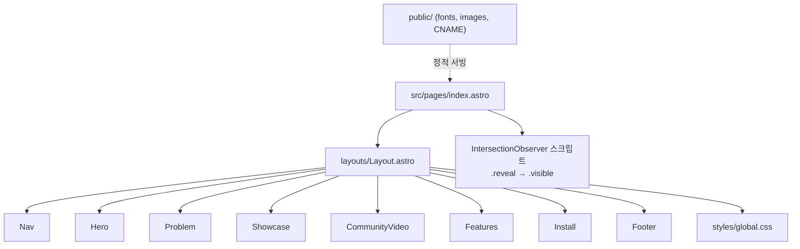
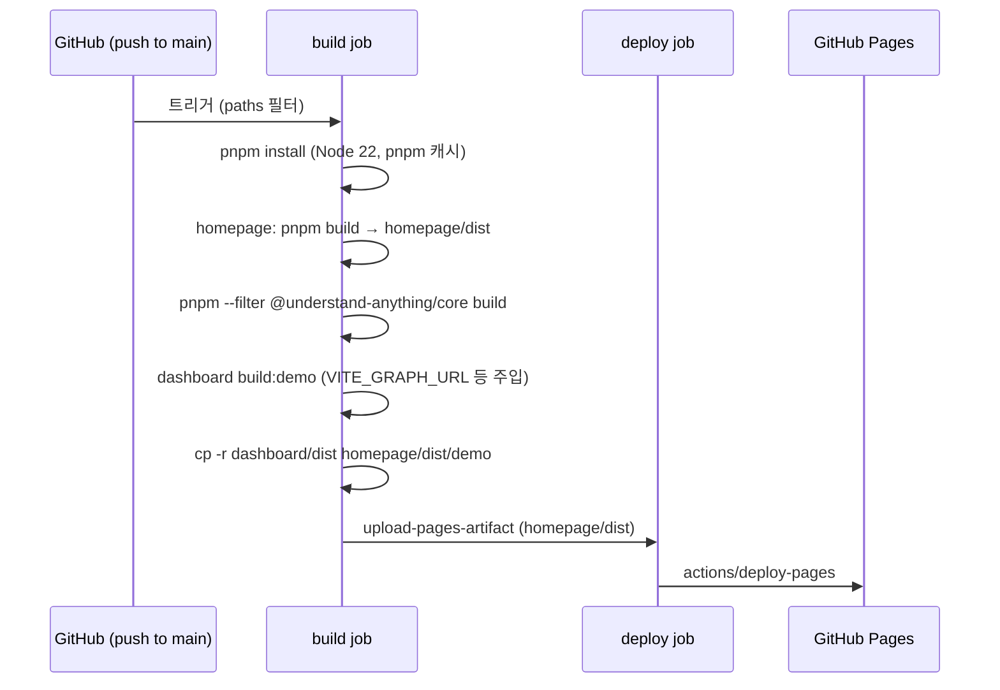

# homepage 모듈

`homepage`는 Understand Anything 프로젝트의 공개 마케팅 사이트(https://understand-anything.com)입니다. [Astro](https://astro.build) 기반 정적 사이트이며, 빌드 결과물은 GitHub Pages로 배포됩니다. 같은 배포 산출물의 `/demo` 경로에는 대시보드 데모 빌드가 함께 포함됩니다.

이 모듈의 핵심 구성 요소는 `homepage/package.json`(스크립트·의존성)과 `homepage/tsconfig.json`(TypeScript 설정) 두 파일입니다. 페이지 소스는 `homepage/src/` 아래에 있습니다.

상위 모듈: [workspace_build_and_delivery](workspace_build_and_delivery.md) · 형제 모듈: [build_ci_and_workspace_config](build_ci_and_workspace_config.md), [core_package_config](core_package_config.md)

## 1. 핵심 구성 요소

### `homepage/package.json`

| 항목 | 값 | 설명 |
|---|---|---|
| `name` | `homepage` | pnpm 워크스페이스 패키지 이름 |
| `type` | `module` | ESM |
| `engines.node` | `>=22.12.0` | Astro 6 요구 사항 |
| `dependencies.astro` | `^6.1.6` | 유일한 런타임/빌드 의존성 |

스크립트:

| 스크립트 | 명령 | 용도 |
|---|---|---|
| `dev` | `astro dev` | 로컬 개발 서버 |
| `build` | `astro build` | `homepage/dist`에 정적 산출물 생성 |
| `preview` | `astro preview` | 빌드 결과 로컬 미리보기 |
| `astro` | `astro` | Astro CLI 직접 호출 (`pnpm astro add` 등) |

### `homepage/tsconfig.json`

`astro/tsconfigs/strict`를 상속하며, `.astro/types.d.ts`와 모든 파일을 포함하고 `dist`는 제외합니다. 프로젝트 전반의 "TypeScript strict mode" 규칙과 일치합니다.

## 2. 디렉터리 구조

```
homepage/
├── astro.config.mjs        # site: 'https://understand-anything.com'
├── package.json
├── tsconfig.json
├── public/                 # 정적 자산: CNAME, favicon, fonts/, images/, assets/
└── src/
    ├── pages/index.astro   # 단일 페이지, 섹션 조합
    ├── layouts/Layout.astro
    ├── components/         # Nav, Hero, Problem, Showcase, CommunityVideo, Features, Install, Footer
    └── styles/global.css
```

`public/CNAME`은 GitHub Pages 커스텀 도메인 설정에 사용되며, `public/fonts/`의 woff2 파일은 자체 호스팅 폰트입니다.

## 3. 아키텍처



`index.astro`는 `<Layout title="Understand Anything — Graphs that teach the codebase">` 안에 8개 컴포넌트를 순서대로 배치합니다. 페이지 하단의 인라인 스크립트는 `IntersectionObserver`(threshold `0.15`)로 `.reveal` 요소가 뷰포트에 들어오면 `visible` 클래스를 추가하고 관찰을 해제합니다. 즉 클라이언트 JS는 스크롤 등장 애니메이션 정도로 최소화되어 있습니다.

## 4. 빌드 및 배포 흐름

`.github/workflows/deploy-homepage.yml`이 배포를 담당합니다.

- 트리거: `main` 브랜치 push 중 `homepage/**`, `understand-anything-plugin/packages/dashboard/**`, `understand-anything-plugin/packages/core/**`, 워크플로 파일 자체가 변경된 경우, 또는 `workflow_dispatch`.
- 권한: `contents: read`, `pages: write`, `id-token: write`
- 동시성: `group: pages`, `cancel-in-progress: true`



핵심 포인트:

1. 홈페이지가 대시보드·코어 패키지 변경에도 재배포되는 이유는 `/demo`에 대시보드 빌드가 병합되기 때문입니다.
2. 데모 그래프 위치는 저장소 변수 `DEMO_GRAPH_URL`, `DEMO_DOMAIN_GRAPH_URL`, `DEMO_META_URL`이 각각 `VITE_GRAPH_URL`, `VITE_DOMAIN_GRAPH_URL`, `VITE_META_URL`로 주입됩니다.
3. 순서가 중요합니다. 홈페이지를 먼저 빌드해 `homepage/dist`를 만든 뒤 데모를 그 안으로 복사합니다.

## 5. 워크스페이스 통합

루트 `pnpm-workspace.yaml`의 `packages`에 `'homepage'`가 포함되어 있어 `pnpm install` 한 번으로 함께 설치됩니다. 홈페이지는 다른 워크스페이스 패키지에 코드 의존성이 없고, 배포 파이프라인에서만 대시보드와 결합됩니다.

관련 문서:
- 대시보드 빌드(`build:demo`, `vite.config.demo.ts`): [dashboard_build_config](dashboard_build_config.md)
- 코어 빌드: [core_package_config](core_package_config.md)
- CI·설치 스크립트·워크스페이스 설정: [build_ci_and_workspace_config](build_ci_and_workspace_config.md)

## 6. 로컬 개발

```bash
pnpm install
cd homepage
pnpm dev       # 개발 서버
pnpm build     # dist 생성
pnpm preview   # 빌드 결과 확인
```

`/demo` 경로까지 로컬에서 확인하려면 위 배포 워크플로의 코어·데모 빌드 및 복사 단계를 수동으로 재현해야 합니다.
