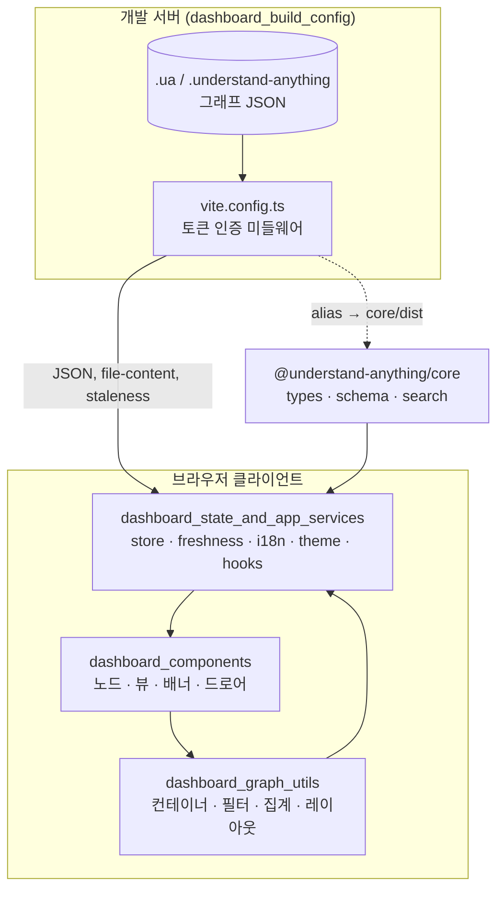
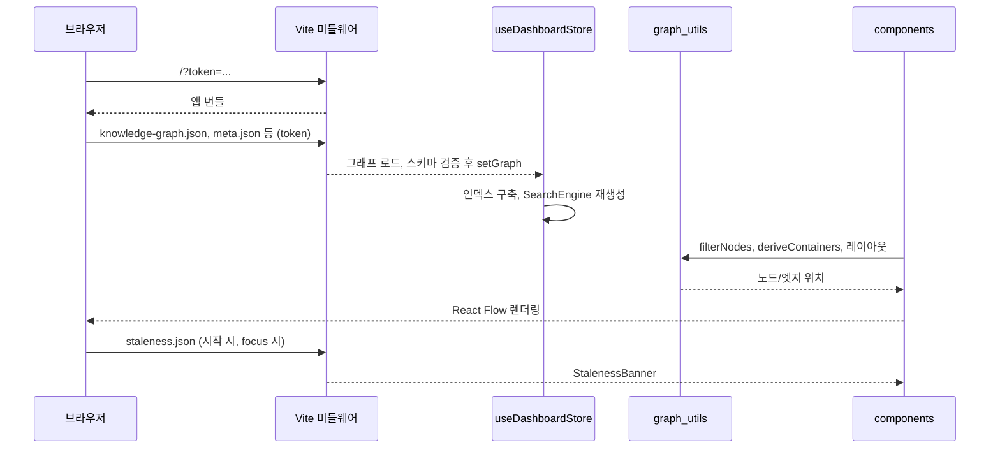

# interactive_dashboard_ui 모듈 개요

## 1. 목적

`interactive_dashboard_ui`(`understand-anything-plugin/packages/dashboard`, 패키지명 `@understand-anything/dashboard`)는 분석이 끝난 **지식 그래프(Knowledge Graph)를 브라우저에서 탐색하는 대시보드**입니다. React, React Flow, Zustand, TailwindCSS v4로 만들었습니다.

- **그래프 중심 시각화**: 구조(structural), 도메인(domain), 지식(knowledge) 세 가지 뷰를 제공합니다. 레이어를 오버뷰에서 상세로 내려가며 볼 수 있고, 검색, 투어, diff 오버레이, 필터, 페르소나(Overview / Learn / Deep Dive)도 지원합니다.
- **로컬 보안 서빙**: Vite 개발 서버 미들웨어가 `.ua/` 또는 레거시 `.understand-anything/`의 그래프 JSON을 토큰 인증 뒤에서 제공합니다. 소스 미리보기는 그래프 기반 허용 목록으로 제한하고, 그래프 신선도(staleness)도 함께 알려 줍니다.
- **브라우저 안전 경계**: core는 `./types`, `./schema`, `./search` 서브패스만 import합니다. Node 전용 코어 엔트리는 가져오지 않습니다.
- **데모 빌드**: `vite.config.demo.ts`로 홈페이지의 `/demo/` 경로에 올릴 정적 데모를 빌드합니다.

## 2. 전체 아키텍처

## 3. 런타임 데이터 흐름

## 4. 하위 모듈

| 모듈 | 경로 | 역할 | 문서 |
|---|---|---|---|
| `dashboard_build_config` | `packages/dashboard` | 빌드, 청크 분할, `tsconfig`, Vitest 설정. 토큰 인증, `/file-content.json` 방어, 신선도 엔드포인트를 담은 개발 서버 미들웨어 | [dashboard_build_config](dashboard_build_config.md) |
| `dashboard_components` | `src/components` | React 표현 계층. `CustomNode`, `FlowNode`, `StepNode`, `PortalNode`, `KnowledgeGraphView`, `LayerLegend`, `PersonaSelector`, `MobileDrawer`, `KeyboardShortcutsHelp`, `StalenessBanner` | [dashboard_components](dashboard_components.md) |
| `dashboard_state_and_app_services` | `src` | 전역 Zustand 스토어(`useDashboardStore`), 신선도 서비스(`freshness.ts`), `I18nProvider`, `ThemeProvider`, `useIsMobile`, `useKeyboardShortcuts` | [dashboard_state_and_app_services](dashboard_state_and_app_services.md) |
| `dashboard_graph_utils` | `src/utils` | React에 의존하지 않는 순수 함수. `deriveContainers`, `filterNodes`/`filterEdges`, 엣지 집계, `computeLayerStats`, force/dagre/ELK 레이아웃, Web Worker | [dashboard_graph_utils](dashboard_graph_utils.md) |

## 5. 핵심 설계 포인트

- **레이아웃과 시각 상태 분리**: 무거운 레이아웃은 Web Worker에서 계산하고, 선택·검색·투어 상태는 `useMemo`로 덧입힙니다. 그래서 상태가 바뀌어도 재레이아웃이 일어나지 않습니다.
- **두 종류의 레이어 인덱스**: 스토어의 `nodeIdToLayerId`(첫 번째 레이어)는 이동용이고, `nodeIdToLayerIds`(모든 레이어)는 필터용입니다. 대형 그래프에서 선형 탐색이 병목이 되는 것을 막기 위한 구분입니다.
- **컨테이너 캐시 무효화**: 컨테이너 자식 집합이 바뀌는 액션은 캐시를 초기화합니다. 이동 액션은 레이어가 실제로 바뀔 때만 초기화합니다.
- **신선도 확인**: Git HEAD와 비교한 결과를 `fresh` / `dirty` / `stale` / `unknown`으로 나눕니다. 시작 시와 창 포커스 시에만 요청하며, 서버 계산(`vite.config.ts`), 클라이언트 검증(`freshness.ts`), 표시(`StalenessBanner`)로 역할이 나뉩니다.
- **다층 파일 미리보기 방어**: 토큰 검증 → 경로 탈출 차단 → 그래프 허용 목록 → 1MiB 상한 → 바이너리 거부 순서로 검사합니다.

## 6. 유지보수 시 확인할 점

- 대시보드 빌드 전에 `pnpm --filter @understand-anything/core build`를 먼저 실행해야 합니다(alias가 `core/dist`를 가리킵니다).
- `vite.config.ts` 미들웨어를 바꾸면 `packages/viewer`의 `bin/viewer.mjs`도 함께 갱신해야 합니다. UI를 바꾸면 viewer 타볼을 다시 패키징해야 합니다.
- core에 `NodeType`이나 엣지 타입을 추가하면 `CustomNode.tsx`의 색상 맵과 스토어의 `EDGE_CATEGORY_MAP`도 갱신해야 합니다.
- `vite.config.ts`와 `vite.config.demo.ts`는 `manualChunks`와 alias가 중복되어 있으므로, 한쪽을 고치면 다른 쪽도 확인합니다.

## 7. 관련 모듈

- [knowledge_graph_core_engine](knowledge_graph_core_engine.md): 그래프 타입, 검색, 스키마, staleness 계산
- [workspace_build_and_delivery](workspace_build_and_delivery.md): 워크스페이스 빌드, CI, 홈페이지 배포