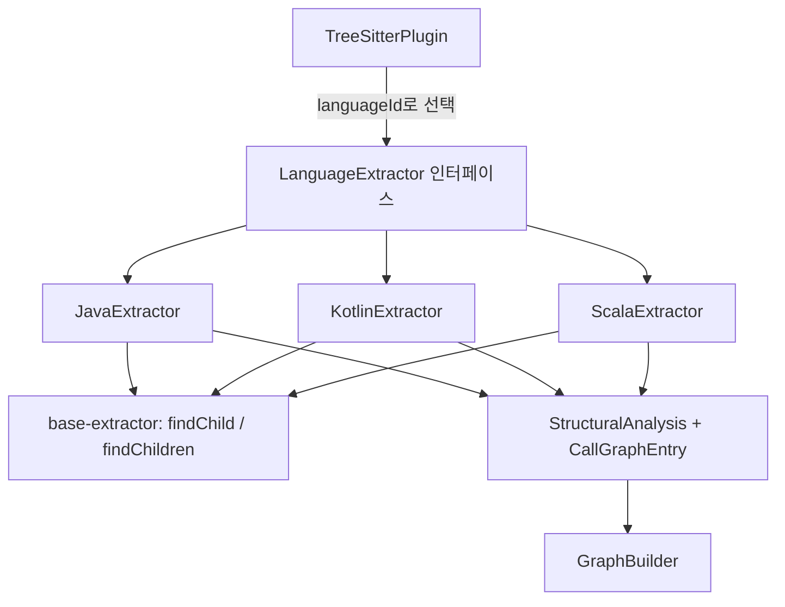
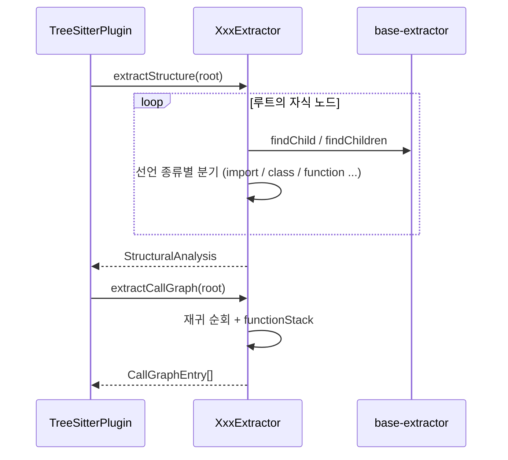

# jvm_extractors 모듈

`jvm_extractors`는 JVM 계열 언어(Java, Kotlin, Scala)의 tree-sitter 구문 트리(AST)에서 프로젝트 공통 구조 정보(`StructuralAnalysis`)와 호출 그래프(`CallGraphEntry[]`)를 뽑아내는 언어별 추출기 모음입니다.

- `understand-anything-plugin/packages/core/src/plugins/extractors/java-extractor.ts` — `JavaExtractor`
- `understand-anything-plugin/packages/core/src/plugins/extractors/kotlin-extractor.ts` — `KotlinExtractor`
- `understand-anything-plugin/packages/core/src/plugins/extractors/scala-extractor.ts` — `ScalaExtractor`
- 테스트: `understand-anything-plugin/packages/core/src/plugins/extractors/__tests__/{java,kotlin,scala}-extractor.test.ts`

상위 모듈은 [core_language_extractors](core_language_extractors.md)이며, 공통 헬퍼(`findChild`, `findChildren`)는 [extractor_base](extractor_base.md)에 있습니다. 추출기를 호출하는 쪽은 [core_plugin_system](core_plugin_system.md)의 `TreeSitterPlugin`이고, 그 결과는 [core_graph_analysis](core_graph_analysis.md)의 `GraphBuilder`가 노드·엣지로 바꿉니다.

---

## 1. 아키텍처

세 추출기는 모두 `LanguageExtractor` 인터페이스(`./types.js`)를 구현합니다.

- `languageIds: string[]` — 각각 `["java"]`, `["kotlin"]`, `["scala"]`
- `extractStructure(rootNode): StructuralAnalysis` — `functions`, `classes`, `imports`, `exports`
- `extractCallGraph(rootNode): CallGraphEntry[]` — `{ caller, callee, lineNumber }`

추출기는 순수 함수처럼 동작합니다. 파일 I/O나 파싱은 하지 않고 이미 파싱된 `TreeSitterNode` 루트만 받으므로, WASM 문법 로딩은 [core_plugin_system](core_plugin_system.md)이 맡습니다.

## 2. 공통 설계 규칙

| 항목 | 규칙 |
|---|---|
| 타입 → `classes` | class/interface/object/trait/enum/record 등을 모두 `classes`에 넣음 |
| 메서드 이중 등록 | 클래스 멤버 함수는 `class.methods`와 최상위 `functions` 양쪽에 등록 |
| 줄 번호 | tree-sitter는 0-기반이므로 `row + 1` |
| 호출 그래프 | `functionStack`으로 현재 함수를 추적하고, 함수 밖 호출은 무시 |
| `exports` | "다른 파일에서 해석 가능한가"라는 그래프 관점의 가시성 |

## 3. JavaExtractor

**처리 대상 (루트 자식)**: `import_declaration`, `class_declaration`/`enum_declaration`/`record_declaration`, `interface_declaration`.

- **함수/생성자**: 생성자는 클래스 이름으로 `functions`와 `methods`에 들어가며 `returnType`이 없습니다. 메서드의 `returnType`은 `type` 필드 텍스트입니다(`List<String>`, `void`). 파라미터는 `formal_parameter`와 가변 인자 `spread_parameter`에서 이름을 가져옵니다.
- **클래스/인터페이스**: 본문 멤버(`method_declaration`, `constructor_declaration`, `field_declaration`)를 수집합니다. enum은 `enum_body_declarations`로 재귀해 메서드를 잡습니다. 인터페이스는 `method_declaration` 시그니처와 `constant_declaration`을 다룹니다.
- **exports**: `modifiers`에 `public`이 있는 클래스, 인터페이스, 메서드, 생성자, 필드만 등록합니다. 그래서 `public class UserService`의 생성자는 같은 이름으로 두 번 export됩니다.
- **imports**: `import java.util.List;`는 source가 `java.util.List`, specifier가 `["List"]`입니다. `import java.util.*;`는 source가 `java.util`, specifier가 `["*"]`입니다.
- **호출 그래프**:
  - `method_invocation`은 `object.name` 또는 `name`으로 기록합니다(예: `System.out.println`).
  - `object_creation_expression`은 `new Bar` 형태로 기록합니다.
  - `method_declaration`과 `constructor_declaration` 진입 시 스택에 push합니다.
  - 필드 초기화 식의 호출은 호출자가 없어 제외됩니다.

## 4. KotlinExtractor

**처리 대상**: `import`, `function_declaration`, `class_declaration`, `object_declaration`. `package_header`는 메타데이터로 보고 건너뜁니다.

- **가시성**: Kotlin 기본값은 public이므로 modifier가 없으면 export됩니다. 명시적 `private`만 제외하고, `internal`과 `protected`는 export로 취급합니다(`isExported`).
- **프로퍼티**: 본문 `property_declaration` 외에 primary constructor의 `val`/`var` 파라미터가 프로퍼티가 됩니다. 일반 파라미터는 제외됩니다. 중첩 `object_declaration`은 이름만 property로 넣습니다.
- **반환 타입**: `function_value_parameters` 이후의 `:` 다음 named 자식 텍스트입니다. 없으면 `undefined`이고, 널 허용 타입은 `T?`로 유지됩니다.
- **imports 세 형태**:

  | 구문 | source | specifiers |
  |---|---|---|
  | `import a.b.C` | `a.b.C` | `["C"]` |
  | `import a.b.*` | `a.b` | `["*"]` |
  | `import a.b.C as D` | `a.b.C` | `["D"]` |

- **호출 그래프**: `call_expression`의 첫 자식이 `identifier`면 그 텍스트를, `navigation_expression`이면 마지막 `identifier`(메서드명)를 callee로 씁니다. 호출자는 `function_declaration` 스택으로 정합니다.

## 5. ScalaExtractor

Scala 2와 3 문법을 함께 다루며, 가장 복잡합니다.

- **분류 상수**: `TYPE_DEFINITION_KINDS`(class, trait, object, package_object, enum), `FUNCTION_DEFINITION_KINDS`(function_definition/declaration), `FIELD_DEFINITION_KINDS`(val/var 정의·선언).
- **`walkTopLevel`**: `package_clause`와 `template_body`(중괄호 package)로 재귀하고, import, export, 함수, 타입, Scala 3 최상위 val/var, `extension_definition`, `given_definition`으로 분기합니다.
- **가시성**: `private`으로 시작하는 access modifier(`private[scope]` 포함)만 비공개입니다. 비공개 타입 안의 멤버는 `exportAllowed=false`로 전파되어 함께 export되지 않습니다.
- **프로퍼티**: case class는 모든 `class_parameter`가 프로퍼티이고, 일반 class는 `val`/`var`만 해당합니다. enum의 `case Red, Green`은 프로퍼티로 넣습니다.
- **중첩 타입**: 컴패니언 객체 ADT(`object Command { case class Create(...) }`)의 내부 타입은 별도 `classes` 항목이 됩니다.
- **함수**: 다중 `parameters` 리스트(커링, using)를 모두 합칩니다. extension 메서드는 최상위 함수로 등록하고, 객체 안에서는 `methods`에도 넣습니다.
- **imports**:

  | 구문 | source | specifiers |
  |---|---|---|
  | `import cats.effect.IO` | `cats.effect.IO` | `["IO"]` |
  | `import a._`, `import a.*` | `a` | `["*"]` |
  | `import a.{B, C => D, E as F}` | `a` | `["B","C","E"]`(원본 이름) |

  쉼표로 이어진 여러 import는 항목별로 분리하고, `A => _` 제외 selector는 건너뜁니다. rename은 원본 이름을 노출해 `A.scala` 파일 해석이 가능하게 합니다.
- **export 선언(Scala 3)**: `export service.{run as start, stop}`처럼 selector의 별칭 이름을 export로 등록합니다.
- **호출 그래프**: `function_definition` 스택 안에서 세 가지를 호출로 봅니다.
  - `call_expression`: 식별자, `field_expression`의 마지막 식별자, 그리고 `generic_function`의 감싼 대상.
  - `infix_expression`: 두 번째 식별자(연산자 위치, 예: `xs map println`의 `map`).
  - `instance_expression`: `new Foo()`는 `Foo`로 기록합니다. Java와 달리 `new ` 접두어가 없습니다.

## 6. 언어별 차이 요약

| 항목 | Java | Kotlin | Scala |
|---|---|---|---|
| 기본 가시성 | package-private (`public`만 export) | public (`private`만 제외) | public (`private*`만 제외) |
| 생성자 | `functions`에 클래스명으로 등록 | primary constructor의 val/var를 프로퍼티로 | `class_parameters`를 프로퍼티로 |
| 생성 호출 표기 | `new Bar` | 일반 `call_expression` | `Bar` (접두어 없음) |
| 별칭 import | 없음 | `as` → 별칭 | `=>`/`as` → 원본 이름 |
| 중첩 타입 재귀 | enum 본문만 | 없음 | 있음 |

## 7. 테스트

각 `__tests__/*-extractor.test.ts`는 `web-tree-sitter`와 WASM 문법(`tree-sitter-java`, `@tree-sitter-grammars/tree-sitter-kotlin`, `tree-sitter-scala`)을 `beforeAll`에서 한 번 로드합니다. 헬퍼 `parse(code)`가 파서, 트리, 루트를 반환하고, 각 테스트는 끝에서 `tree.delete()`와 `parser.delete()`로 WASM 메모리를 해제합니다. 검증 범위는 `languageIds`, 함수·클래스·import·export 구조, 호출 그래프이며, Java의 enum·record와 Scala의 braced package·package object·Scala 3 export도 포함합니다. 실행은 `pnpm --filter @understand-anything/core test`입니다.

## 8. 확장 시 유의점

- 새 JVM 계열 언어를 추가할 때는 이 세 파일의 패턴(루트 순회, 스택 기반 호출 추적, `row + 1`)을 따르고, `languageIds`를 [core_plugin_system](core_plugin_system.md)의 레지스트리에 연결해야 합니다.
- 문법 노드 이름은 tree-sitter 문법 버전에 의존하므로, 문법을 올리면 해당 테스트를 먼저 확인하세요.
- 다른 언어 그룹은 [c_family_extractors](c_family_extractors.md), [scripting_extractors](scripting_extractors.md), [mobile_extractors](mobile_extractors.md)를 참고하세요.
