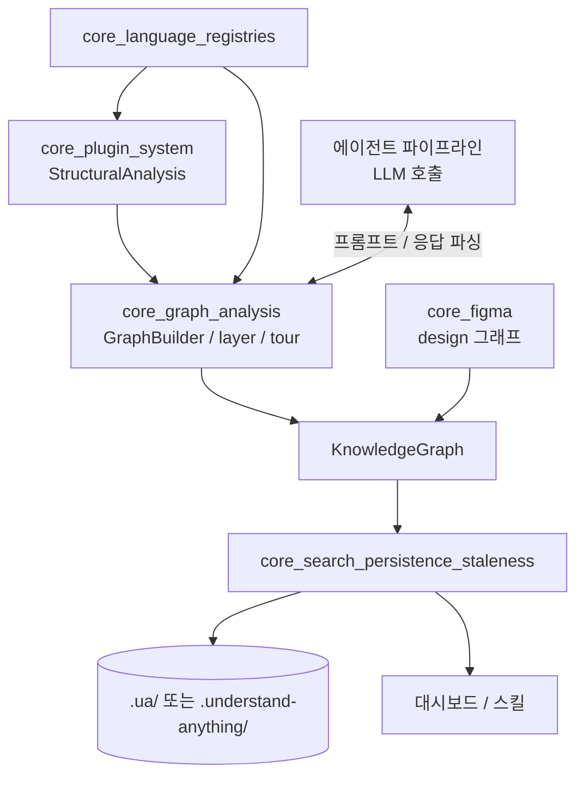
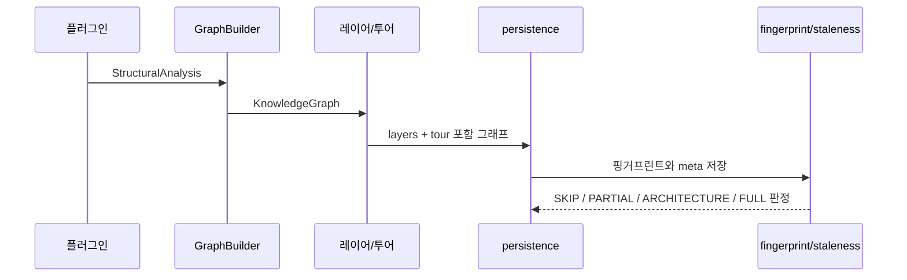

# knowledge_graph_core_engine 개요

## 목적

`knowledge_graph_core_engine`은 `@understand-anything/core` 패키지의 `src/` 전체를 가리키는 모듈입니다. 정적 분석 결과와 LLM 응답을 `KnowledgeGraph`(노드·엣지·레이어·투어)로 조립합니다. 만든 그래프는 저장하고 검색할 수 있고, 변경 여부도 판단할 수 있습니다. Figma 파일은 `kind="design"` 그래프로 변환합니다. 이 모듈에는 LLM 호출 코드가 없습니다. 프롬프트를 만드는 함수와 응답을 파싱하는 함수만 있고, 실제 호출은 에이전트 파이프라인이 맡습니다.

대시보드가 이 패키지를 쓸 때는 브라우저 안전 서브패스(`./search`, `./types`, `./schema`)만 가져와야 합니다.

## 하위 모듈

| 하위 모듈 | 경로 | 책임 |
|---|---|---|
| core_graph_analysis | `src/analyzer` | `GraphBuilder`로 노드·엣지를 조립하고, 레이어 탐지, 투어 생성, 언어 학습 노트, 배치 출력 정규화를 처리 |
| core_search_persistence_staleness | `src` | 퍼지 검색과 시맨틱 검색, `.ua/` 영속화, 핑거프린트, 갱신 범위 분류, 신선도 판단, 무시 규칙 |
| core_language_registries | `src/languages` | `LanguageRegistry`(파일→언어), `FrameworkRegistry`(매니페스트→프레임워크) |
| core_figma | `src/figma` | Figma REST 수집, 문서 파싱, 디자인 토큰 추출, 썸네일, LLM 분석 병합 |

## 아키텍처

## 데이터 흐름

## 핵심 동작 요약

- **그래프 조립**: 노드 ID는 `file:<path>`, `function:<path>:<name>` 같은 규칙을 따릅니다. 엣지 종류는 `contains`, `imports`, `calls`입니다.
- **증분 갱신**: 파일별 SHA-256 해시와 시그니처로 `NONE`, `COSMETIC`, `STRUCTURAL`을 구분합니다. `classifyUpdate`는 이를 `SKIP`, `PARTIAL_UPDATE`, `ARCHITECTURE_UPDATE`, `FULL_UPDATE` 중 하나로 분류합니다.
- **저장 규칙**: `.understand-anything/`이 이미 있으면 그 디렉터리를 쓰고, 없으면 `.ua/`를 씁니다. 저장할 때 절대 경로는 상대 경로나 파일명으로 정리합니다.
- **설정 검증**: 언어·프레임워크 설정은 Zod 스키마로 검증한 뒤 Map 인덱스에 적재합니다.
- **Figma**: 결정적 스캔(Phase 1) 뒤에 LLM 보강(Phase 2)을 거쳐 `mergeDesignGraph`가 병합하고 `validateGraph`로 검증합니다.

## 상세 문서

- [core_graph_analysis](core_graph_analysis.md)
- [core_search_persistence_staleness](core_search_persistence_staleness.md)
- [core_language_registries](core_language_registries.md)
- [core_figma](core_figma.md)

관련 모듈: `core_plugin_system`(`StructuralAnalysis` 생성), `core_language_extractors`, `core_file_parsers`(source_code_parsing_plugins), 대시보드(`interactive_dashboard_ui`).