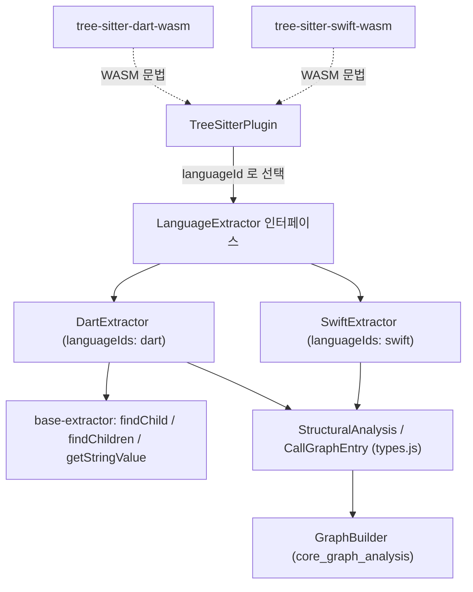
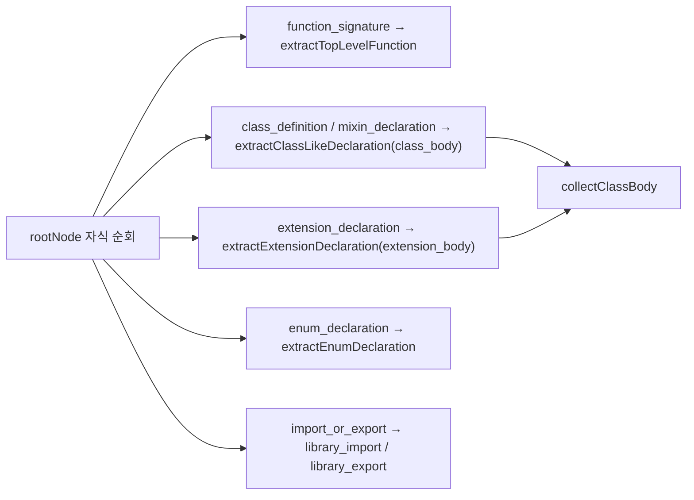
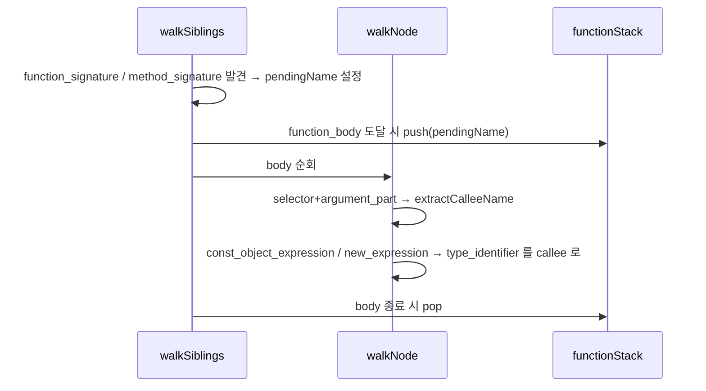

# mobile_extractors 모듈

## 개요

`mobile_extractors`는 모바일 앱 개발 언어인 **Dart(Flutter)** 와 **Swift(iOS/SwiftUI)** 의 소스 코드를 tree-sitter AST에서 구조 정보(`StructuralAnalysis`)와 호출 그래프(`CallGraphEntry[]`)로 변환하는 언어별 추출기 모듈이다. 상위 모듈 [core_language_extractors](core_language_extractors.md)에 속하며, 공통 헬퍼는 [extractor_base](extractor_base.md)에서 가져온다.

| 구성 요소 | 파일 | 역할 |
|---|---|---|
| `DartExtractor` | `understand-anything-plugin/packages/core/src/plugins/extractors/dart-extractor.ts` | Dart AST → 구조/호출 그래프 |
| dart 테스트 (`parse`) | `.../extractors/__tests__/dart-extractor.test.ts` | Dart 추출기 동작 명세 |
| swift 테스트 (`withAnalysis`, `withCalls`) | `.../extractors/__tests__/swift-extractor.test.ts` | `SwiftExtractor` 동작 명세 및 `TreeSitterPlugin` 통합 테스트 |

> 참고: 이 문서에 제공된 소스에는 `swift-extractor.ts` 구현 본체가 포함되어 있지 않다. Swift 동작은 테스트 파일에서 드러나는 계약(contract)을 기준으로 기술한다.

## 아키텍처

- 각 추출기는 `LanguageExtractor`(`extractStructure(rootNode)`, `extractCallGraph(rootNode)`, `languageIds`)를 구현한다. 플러그인 계층은 [core_plugin_system](core_plugin_system.md)을 참고.
- 문법은 `web-tree-sitter`(WASM)로 로드되며, 각각 워크스페이스 패키지 `@understand-anything/tree-sitter-dart-wasm`, `@understand-anything/tree-sitter-swift-wasm`이 제공한다 (`workspace_build_and_delivery` 참고).
- 출력 스키마가 공유 `StructuralAnalysis`뿐이므로 mixin/extension/enum/protocol/actor 등은 모두 `classes[]`에 접어 넣는다 (Kotlin 규칙과 동일, [jvm_extractors](jvm_extractors.md) 참고).

## DartExtractor

### 구조 추출 (`extractStructure`)

`program` 루트의 직계 자식을 순회하며 노드 타입별로 분기한다.

핵심 규칙:

- **가시성**: `isExported(name)` — 이름이 `_`로 시작하면 library-private이므로 `exports`에서 제외한다(Kotlin과 반대). 클래스 멤버·getter도 동일하게 적용.
- **함수 이름/파라미터/반환 타입**: `extractFunctionName`, `extractParams`, `extractReturnType`.
  - `extractParams`는 필수 파라미터와 `optional_formal_parameters`(`[...]`와 `{...}` 모두)를 한 `params[]`로 합친다.
  - `this.x`, `super.x` 파라미터는 `extractParamName`이 필드명(`x`)으로 풀어낸다.
  - 반환 타입은 이름/`formal_parameter_list`/`type_parameters` 이전의 named 노드 텍스트를 이어 붙여 `Future<String>` 같은 제네릭을 복원한다. 선언이 없으면 `undefined`.
- **클래스 본문** (`collectClassBody`): `method_signature`(구체 메서드·getter·setter·factory)와 `declaration`(생성자·추상 메서드/getter/setter·필드)의 두 AST 형태를 모두 처리한다. 메서드는 `methods[]`와 최상위 `functions[]` 양쪽에 기록되고(`pushMethod`), 필드는 `initialized_identifier_list`에서 `properties[]`로 수집된다(`int a, b, c;` → 3개).
- **생성자 이름** (`constructorName`): 이름 없는 생성자는 `Foo`, 이름 있는 생성자/factory는 `Foo.named`.
- **mixin**: `class_body`를 쓰는 클래스형으로 처리. **enum**: 상수는 `properties[]`, `methods`는 빈 배열.
- **extension**: 이름이 있으면 그대로, 익명이면 `"on <TargetType>"`(예: `on int`)로 명명해 그래프 빌더에서 누락되지 않게 한다.
- **import**: `source`는 `uriText`(→ `getStringValue`)로 따옴표 제거. `show` 이름은 `specifiers`, `hide`는 제외, `as` 접두사는 `show/hide`가 없을 때만 유일한 specifier. **export 지시문**은 URI를 `exports[]`의 `name`으로 기록한다(행 번호는 외곽 `import_or_export` 기준).

### 호출 그래프 (`extractCallGraph`)

Dart 문법에서는 `function_signature`와 `function_body`가 **부모-자식이 아니라 형제**이다. 따라서 `walkSiblings`가 `pendingName`을 기억했다가 다음 `function_body` 동안만 `functionStack`에 push한다.

- `method_signature`는 function/getter/setter/constructor/factory 시그니처 중 하나를 감싸므로 모두 분기 처리한다. 그렇지 않으면 생성자·getter·setter 본문의 호출이 누락된다.
- 호출 형태: `foo()`(선행 형제가 `identifier`), `x.foo()`(선행 형제 `selector > unconditional_assignable_selector`의 마지막 identifier), 그리고 Flutter 위젯 트리에서 흔한 `const Foo()` / `new Foo()`.
- `extractCalleeName`은 web-tree-sitter가 `.child(i)` 호출마다 새 래퍼를 반환하므로 `===` 대신 `startIndex`로 형제를 비교한다.
- 함수 스택이 비어 있으면(최상위 호출) 기록하지 않는다.

## SwiftExtractor (테스트로 확인되는 계약)

`swift-extractor.test.ts`는 `withAnalysis(code, fn)` / `withCalls(code, fn)` 헬퍼로 파싱→추출→`tree.delete()`/`parser.delete()` 정리를 보장한다(WASM 메모리 누수 방지).

**구조**
- 함수 파라미터는 외부 레이블이 아닌 **로컬 이름**(`forKey key` → `key`). `async`/`throws`는 무시하고 선언된 반환 타입만 유지(없으면 `undefined`).
- `class`/`struct`/`enum`/`protocol`/`actor`/중첩 타입을 `classes[]`로, `extension`은 `"extension User"` 형태 이름으로 원 타입과 충돌하지 않게 기록.
- `init`/`deinit`/`subscript`는 호출 가능 멤버로 취급하며, `functions[]`에서는 `Box.init` 같이 타입 접두사가 붙는 이름이 쓰인다.
- enum case와 protocol의 `associatedtype`은 `properties[]`, 쉼표 나열(`var x, y`)은 각각 별도 property, 프로퍼티 초기화 클로저 내부의 지역 선언은 property가 아니다.
- import: `import struct Foundation.Date` → `source: "Foundation"`, `specifiers: ["Date"]`; 단순 import는 모듈명이 specifier; `@testable`, `#if canImport` 내부 import도 정확한 행 번호로 처리.
- 가시성: 기본/`internal`/`public`/`open`/`package`는 export, `private`/`fileprivate`(및 private extension의 멤버)는 export 제외이나 `classes`/`functions`에는 남는다. `public private(set)`은 export, 속성(attribute)이 접근 제어자 앞에 와도 인식.

**호출 그래프**
- 멤버 호출은 메서드명(`fetch`), 명확한 정적 한정자는 유지(`Logger.info`), 이니셜라이저형 호출은 타입명(`User`), `super.init`은 그대로 기록.
- SwiftUI `var body: some View { VStack { Text("Hi") } }`처럼 계산 프로퍼티 본문·프로퍼티 옵저버(`didSet`)·클로저 내부 호출을 둘러싼 프로퍼티/함수에 귀속.
- 둘러싼 callable이 없는 최상위 호출은 기록하지 않는다.

**통합**: `TreeSitterPlugin([swiftConfig])`의 `analyzeFile` / `extractCallGraph`가 내장 config와 추출기를 통해 정상 동작함을 스모크 테스트(`@main struct MyApp: App`)로 검증한다.

## 테스트 구성

- 두 테스트 모두 `beforeAll`에서 `web-tree-sitter`를 `Parser.init()` 후 각 `*-wasm` 패키지의 `.wasm`을 `Language.load`한다. Dart 테스트의 `parse()`는 `{ tree, parser, root }`를 반환하며 각 테스트가 끝에 `delete()`를 직접 호출한다.
- Dart 테스트는 함수·파라미터 종류·클래스·getter/setter·생성자·mixin·enum·extension·import/export·호출 그래프·가시성으로 나뉜다.
- 실행: `pnpm --filter @understand-anything/core test` (루트 `vitest.config.ts` 및 core의 `vitest.config.ts` 사용, [core_package_config](core_package_config.md) 참고).

## 다른 모듈과의 관계

- 소비자: [core_plugin_system](core_plugin_system.md)의 `TreeSitterPlugin`이 확장자/언어 ID로 추출기를 선택하고, 결과는 [core_graph_analysis](core_graph_analysis.md)의 `GraphBuilder`가 노드·엣지로 변환한다.
- 같은 계열: [typescript_extractor](typescript_extractor.md), [python_extractor](python_extractor.md), [go_extractor](go_extractor.md), [rust_extractor](rust_extractor.md), [jvm_extractors](jvm_extractors.md), [c_family_extractors](c_family_extractors.md), [scripting_extractors](scripting_extractors.md).

## 유지보수 팁

- 새 AST 형태를 추가할 때는 먼저 실제 파서로 AST를 프로빙하고(소스 주석에 프로브 결과가 남아 있음), 테스트를 추가한다.
- Dart 호출 그래프는 형제 관계에 의존하므로 시그니처와 본문 사이 토큰이 `pendingName`을 초기화하지 않도록 유지해야 한다.
- 노드 동일성 비교에 `===`를 쓰지 말고 `startIndex`를 사용한다.
