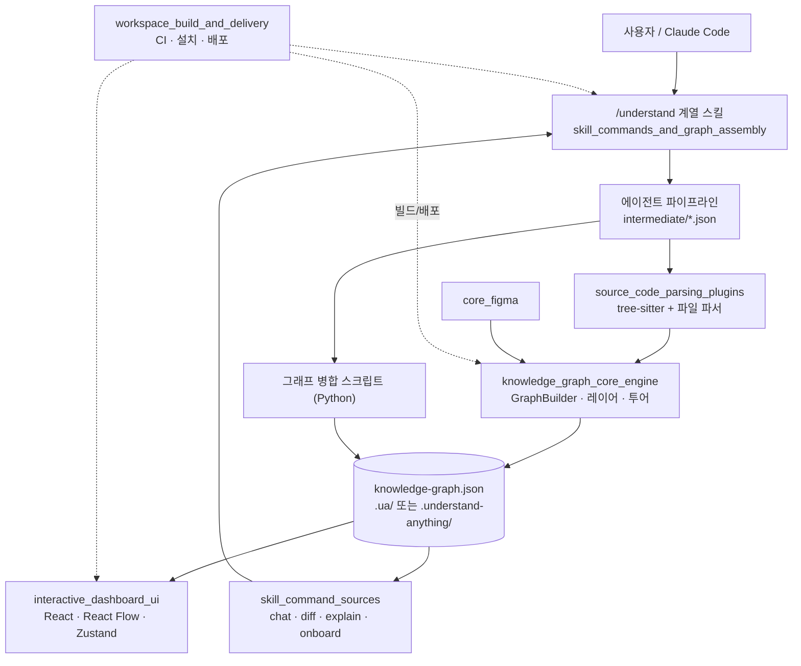
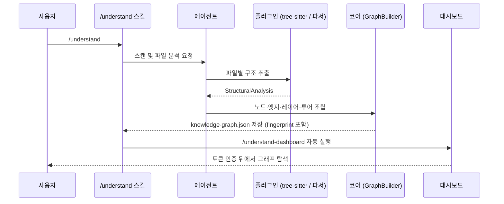

# Understand-Anything 개요

## 1. 목적

Understand-Anything은 **LLM 지능과 정적 분석을 결합해 코드베이스를 이해하기 위한 대화형 대시보드를 만드는 오픈소스 도구**입니다. Claude Code 플러그인으로 동작하며, 다른 AI 플랫폼용 설치 스크립트도 제공합니다.

- **분석**: tree-sitter(WASM) 기반 정적 분석과 에이전트 파이프라인(project-scanner, file-analyzer, architecture-analyzer, tour-builder, graph-reviewer)이 프로젝트를 `KnowledgeGraph`(노드·엣지·레이어·투어)로 변환합니다.
- **저장**: 그래프 JSON은 분석 대상 프로젝트의 `.ua/`에 저장합니다. 레거시 `.understand-anything/`가 이미 있으면 그 디렉터리를 씁니다.
- **탐색**: React 대시보드에서 구조·도메인·지식 뷰, 검색, 투어, diff 오버레이, 코드 뷰어를 사용합니다.
- **질의**: `/understand-chat`, `/understand-diff`, `/understand-explain`, `/understand-onboard` 스킬이 그래프를 소비해 프롬프트와 문서를 만듭니다.
- **확장 입력**: Figma 파일은 디자인 그래프로 변환하고, 지식 베이스(위키)는 별도 그래프로 병합합니다.

## 2. 엔드 투 엔드 아키텍처

### 분석에서 시각화까지의 흐름

### 핵심 설계 요약

- **LLM 호출은 에이전트가 담당**합니다. 코어에는 프롬프트 생성 함수와 응답 파싱 함수만 있습니다.
- **증분 갱신**: 파일 해시와 시그니처로 변경을 분류하고 `SKIP`, `PARTIAL_UPDATE`, `ARCHITECTURE_UPDATE`, `FULL_UPDATE` 중 하나를 고릅니다.
- **브라우저 안전 경계**: 대시보드는 코어의 `./search`, `./types`, `./schema` 서브패스만 import합니다.
- **WASM tree-sitter**: 네이티브 바인딩이 darwin/arm64 + Node 24에서 실패하기 때문에 `web-tree-sitter`를 씁니다.
- **보안 서빙**: 토큰 인증과 그래프 기반 경로 허용 목록으로 `/file-content.json`을 보호합니다.

## 3. 핵심 모듈 문서

| 모듈 | 경로 | 요약 | 문서 |
|---|---|---|---|
| `knowledge_graph_core_engine` | `understand-anything-plugin/packages/core/src` | 그래프 조립, 레이어·투어, 검색, 영속화, 신선도 판정, 언어·프레임워크 레지스트리, Figma 변환 | [knowledge_graph_core_engine](knowledge_graph_core_engine.md) |
| `source_code_parsing_plugins` | `.../core/src/plugins` | `PluginRegistry`, `TreeSitterPlugin`, 언어별 extractor, 비코드 파일 파서 12종 | [source_code_parsing_plugins](source_code_parsing_plugins.md) |
| `interactive_dashboard_ui` | `understand-anything-plugin/packages/dashboard` | React 대시보드, Zustand 스토어, 그래프 유틸, Vite 보안 미들웨어 | [interactive_dashboard_ui](interactive_dashboard_ui.md) |
| `skill_commands_and_graph_assembly` | `understand-anything-plugin` | chat/diff/explain/onboard 프롬프트 생성(`src/`), Python 그래프 병합 스크립트(`skills/`) | [skill_commands_and_graph_assembly](skill_commands_and_graph_assembly.md) |
| `workspace_build_and_delivery` | 저장소 루트, `homepage`, `packages/core` 설정 | pnpm 워크스페이스, CI, 설치 스크립트, 홈페이지 배포 | [workspace_build_and_delivery](workspace_build_and_delivery.md) |

세부 문서: [core_graph_analysis](core_graph_analysis.md) · [core_search_persistence_staleness](core_search_persistence_staleness.md) · [core_language_registries](core_language_registries.md) · [core_figma](core_figma.md) · [core_plugin_system](core_plugin_system.md) · [core_language_extractors](core_language_extractors.md) · [core_file_parsers](core_file_parsers.md) · [dashboard_build_config](dashboard_build_config.md) · [dashboard_components](dashboard_components.md) · [dashboard_state_and_app_services](dashboard_state_and_app_services.md) · [dashboard_graph_utils](dashboard_graph_utils.md) · [skill_command_sources](skill_command_sources.md) · [skill_graph_merge_scripts](skill_graph_merge_scripts.md) · [build_ci_and_workspace_config](build_ci_and_workspace_config.md) · [homepage](homepage.md) · [core_package_config](core_package_config.md)

## 4. How it is built and run

- **빌드**: pnpm 워크스페이스(Node ≥ 22, pnpm ≥ 10) 모노레포입니다. core를 먼저 빌드한 뒤 skill, viewer, dashboard를 빌드합니다. 대시보드가 `core/dist`를 alias로 참조하기 때문입니다.
- **테스트**: Vitest를 사용합니다. 루트 설정은 `packages/core/**`를 제외하므로 core 테스트는 `pnpm --filter @understand-anything/core test`로 따로 실행합니다. 스킬 테스트는 `tests/skill/`에 있습니다.
- **CI**: `.github/workflows/ci.yml`이 `ubuntu-latest`와 `windows-latest`에서 lint, build, test를 실행합니다.
- **패키징**: `install.sh`와 `install.ps1`이 여러 AI 플랫폼에 스킬을 설치합니다. `packages/viewer`는 커밋된 그래프를 Claude Code 없이 보여 주는 타볼(`understand-anything-viewer.tgz`)로 릴리스에 올립니다. 릴리스 때는 여섯 개 매니페스트의 버전을 함께 올려야 합니다.
- **배포**: `deploy-homepage.yml`이 Astro 홈페이지를 빌드하고, 대시보드 데모(`build:demo`)를 `/demo`에 병합해 GitHub Pages에 배포합니다.
- **로컬 실행**: `pnpm dev:dashboard`로 대시보드 개발 서버를 띄웁니다.

자세한 내용은 [workspace_build_and_delivery](workspace_build_and_delivery.md), [build_ci_and_workspace_config](build_ci_and_workspace_config.md), [core_package_config](core_package_config.md), [dashboard_build_config](dashboard_build_config.md)를 참고하십시오.