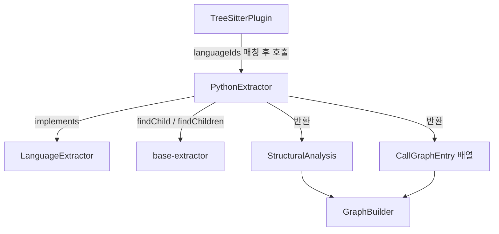
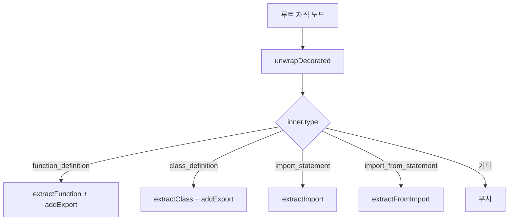
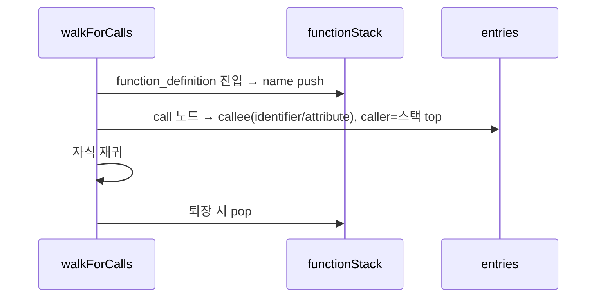

# python_extractor 모듈

## 개요

`python_extractor`는 tree-sitter(`web-tree-sitter`, WASM)로 파싱한 Python AST에서 **구조 정보**(함수, 클래스, import, export)와 **호출 그래프**를 추출하는 언어 전용 추출기입니다. `LanguageExtractor` 인터페이스의 Python 구현체이며, 상위 [core_language_extractors](core_language_extractors.md)에 속합니다. `TreeSitterPlugin`이 이 추출기를 호출하고([core_plugin_system](core_plugin_system.md)), 결과는 `StructuralAnalysis`와 `CallGraphEntry[]`로 반환되어 그래프 빌더([core_graph_analysis](core_graph_analysis.md))에서 사용됩니다.

구성 파일:
- `understand-anything-plugin/packages/core/src/plugins/extractors/python-extractor.ts` — `PythonExtractor`
- `understand-anything-plugin/packages/core/src/plugins/extractors/__tests__/python-extractor.test.ts` — vitest 테스트 (`parse` 헬퍼)

공통 헬퍼(`findChild`, `findChildren`)는 [extractor_base](extractor_base.md)에서 가져옵니다. 다른 언어 구현은 [typescript_extractor](typescript_extractor.md), [go_extractor](go_extractor.md), [rust_extractor](rust_extractor.md) 등을 참고하세요.

## 아키텍처

`languageIds = ["python"]` 이므로 `PluginRegistry`/`TreeSitterPlugin`이 Python 파일에 대해 이 추출기를 선택합니다.

## 주요 컴포넌트

### 모듈 내부 헬퍼 함수

| 함수 | 역할 |
|---|---|
| `extractParams` | `parameters` 노드에서 파라미터 이름 추출. `identifier`, `typed_parameter`, `default_parameter`, `typed_default_parameter`는 이름만, `list_splat_pattern`은 `*name`, `dictionary_splat_pattern`은 `**name`으로 기록. 암묵적 `self`/`cls`는 제외 |
| `extractReturnType` | `return_type` 필드(`->` 뒤 타입)의 텍스트를 반환, 없으면 `undefined` |
| `unwrapDecorated` | `decorated_definition`이면 내부 `function_definition`/`class_definition`을 반환, 아니면 노드 자신 |

### `PythonExtractor.extractStructure(rootNode)`

루트 노드의 **최상위 자식만** 순회합니다(중첩 함수는 구조에 포함되지 않음).

- **함수**: `name`, `lineRange`(1-기반 시작/끝), `params`, `returnType`.
- **클래스**: `body`를 순회하며 `function_definition`(데코레이터 포함)은 `methods`, 타입 주석이 있는 class-level 대입(`name: str`, `value: int = 0`)은 `properties`에 추가. 타입 주석 없는 대입은 속성으로 취급하지 않습니다.
- **import**: `import a, b.c`는 dotted name마다 항목 하나, `import x as y`는 `specifiers`에 별칭을 기록. `from m import a, b as c`는 `source = m`, 별칭이 있으면 별칭을 specifier로 기록, `*`는 `"*"`. 모듈명 dotted_name은 `id` 비교로 specifier에서 제외합니다.
- **export**: Python에는 공식 export 문법이 없으므로 **모든 최상위 함수·클래스**를 export로 간주합니다. `lineNumber`는 데코레이터를 포함한 바깥 노드 기준입니다.

### `PythonExtractor.extractCallGraph(rootNode)`

AST 전체를 재귀 순회하며 `functionStack`으로 현재 함수 컨텍스트를 추적합니다.

- callee는 `call`의 자식 중 첫 `identifier` 또는 `attribute` 텍스트(예: `transform`, `self.setup`, `os.path.join`).
- 중첩 함수 내부 호출의 caller는 가장 안쪽 함수(`inner`).
- 클래스 메서드도 `function_definition`이므로 메서드 이름이 caller가 됩니다(클래스명은 포함되지 않음).
- 함수 밖(모듈 최상위) 호출은 caller가 없어 **기록되지 않습니다**.
- `lineNumber`는 1-기반입니다.

## 동작상 제약 사항

- 최상위 `if`/`try` 블록 안의 정의는 구조 추출에서 누락됩니다.
- `extractStructure`의 `functions`에는 클래스 메서드가 포함되지 않고, `classes[].methods`에만 이름이 들어갑니다.
- `properties`는 `self.x = ...` 형태의 인스턴스 속성을 잡지 않습니다.
- 호출 그래프는 이름 기반이며 동일 이름 함수(다른 클래스의 같은 메서드명)를 구분하지 않습니다. 호출 대상 `call`이 `identifier`/`attribute`가 아닌 경우(예: `f()()`)는 무시됩니다.
- 선언된 파라미터 `self`/`cls`는 이름이 정확히 일치할 때만 제외됩니다.

## 테스트

`__tests__/python-extractor.test.ts`는 `beforeAll`에서 `web-tree-sitter`를 초기화하고 `tree-sitter-python/tree-sitter-python.wasm`을 로드합니다. `parse(code)` 헬퍼가 트리를 만들며, 각 테스트는 끝에서 `tree.delete()`/`parser.delete()`로 WASM 메모리를 해제합니다. 검증 범위:

- 함수: 타입 주석, 기본값, `*args/**kwargs`, 데코레이터, 라인 범위
- 클래스: 메서드/속성, dataclass 스타일, 데코레이터 클래스/메서드, `self`/`cls` 필터링
- import: 단순, from, 별칭, dotted, 와일드카드, 라인 번호
- export: 최상위 함수/클래스, 데코레이터 정의, import 제외
- 호출 그래프: 단순/속성 호출, 중첩 컨텍스트, 라인 번호, 최상위 호출 무시, 클래스 메서드
- 종합 실제 모듈 시나리오

실행: `pnpm --filter @understand-anything/core test`. 테스트 설정은 `understand-anything-plugin/packages/core/vitest.config.ts`를 참고하세요([core_package_config](core_package_config.md)).
