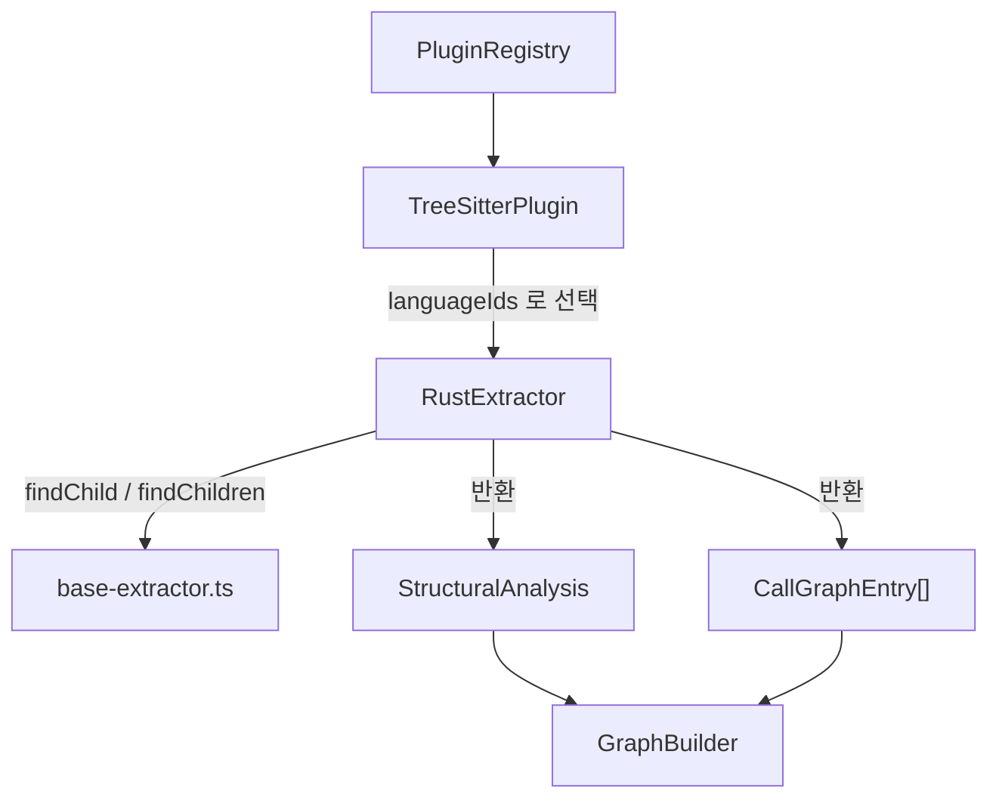
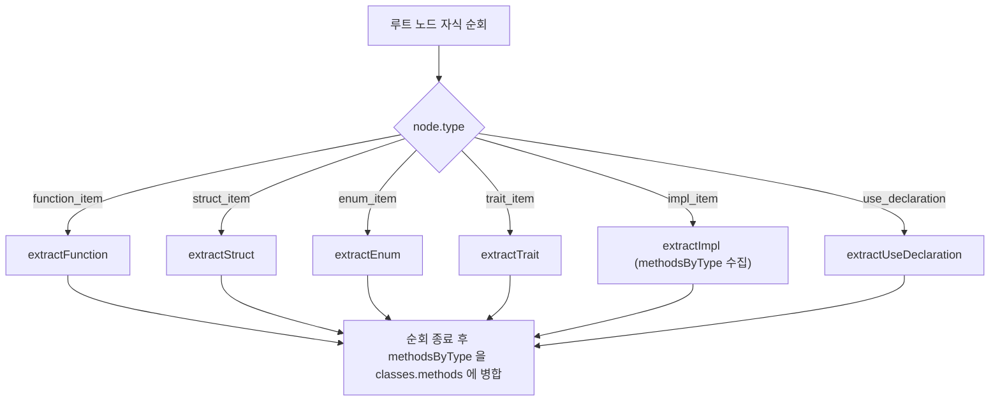
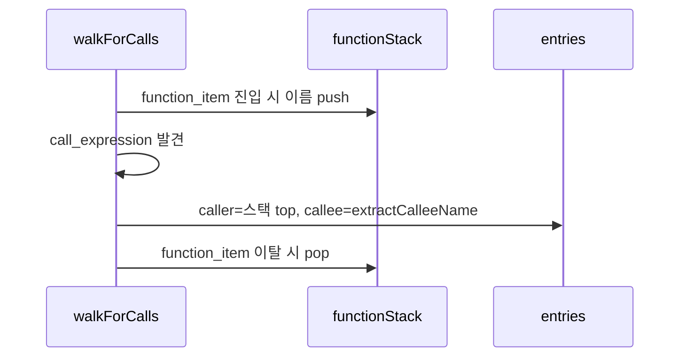

# rust_extractor 모듈

## 개요

`rust_extractor`는 tree-sitter(`web-tree-sitter`, WASM)가 만든 Rust 구문 트리(AST)에서 **구조 정보**(함수, 타입, import, export)와 **호출 그래프**를 뽑아내는 언어별 추출기입니다.

- 구현: `understand-anything-plugin/packages/core/src/plugins/extractors/rust-extractor.ts` (`RustExtractor`)
- 테스트: `understand-anything-plugin/packages/core/src/plugins/extractors/__tests__/rust-extractor.test.ts`
- 인터페이스: `LanguageExtractor` (`languageIds = ["rust"]`)
- 상위 모듈: `core_language_extractors` (공통 헬퍼는 [extractor_base](extractor_base.md), 플러그인 실행 환경은 [core_plugin_system](core_plugin_system.md) 참고)

## 아키텍처와 의존 관계

`TreeSitterPlugin`이 Rust 파일을 파싱해 루트 노드를 넘기면 `extractStructure`와 `extractCallGraph`가 각각 호출됩니다. 결과는 `GraphBuilder`가 지식 그래프의 노드와 엣지로 바꿉니다. 자세한 내용은 [core_graph_analysis](core_graph_analysis.md)를 참고하세요.

## 공개 API

| 메서드 | 역할 |
|---|---|
| `extractStructure(rootNode)` | `StructuralAnalysis { functions, classes, imports, exports }` 반환 |
| `extractCallGraph(rootNode)` | `CallGraphEntry { caller, callee, lineNumber }[]` 반환 |

## Rust → 공통 스키마 매핑

| Rust 요소 | 매핑 결과 |
|---|---|
| `function_item` (최상위) | `functions` (`owner: ""`) |
| `struct_item` | `classes`, 필드 이름은 `properties` |
| `enum_item` | `classes`, variant 이름은 `properties` |
| `trait_item` | `classes`, `function_signature_item`과 기본 구현 `function_item`은 `methods` |
| `impl_item` 내부 함수 | `functions` + 대상 타입의 `methods`에 연결 |
| `use_declaration` | `imports` |
| `pub`(`pub(crate)` 등) | `exports` |

### 구조 추출 흐름

순회는 루트의 **직계 자식만** 대상으로 합니다. 따라서 `mod { ... }` 안쪽 항목은 추출되지 않습니다.

## 핵심 동작 상세

### 함수 (`extractFunction`, `extractParams`, `extractReturnType`)
- 파라미터는 `parameter` 노드의 `pattern` 필드 텍스트만 수집합니다. `self_parameter`(`&self`, `&mut self`, `self`)는 건너뜁니다.
- 반환 타입은 `return_type` 필드 텍스트이고, 없으면 `undefined`입니다.
- `lineRange`는 1-based입니다.

### impl 블록와 owner (`extractImpl`)
`owner` 값 규칙은 테스트 `preserves impl ownership and leaves trait identity unresolved`에 고정되어 있습니다.

| 형태 | `owner` |
|---|---|
| 최상위 `fn` | `""` |
| `impl A { fn }` | `"A"` |
| `impl B<u32> { fn }` | `"B<u32>"` (제네릭 텍스트 그대로) |
| `impl Trait for A { fn }` | `null` |

trait impl은 trait 정체성과 receiver 정체성을 함께 다뤄야 하는데 아직 모델링되어 있지 않습니다. 그래서 inherent 메서드와 같다고 보지 않도록 `null`로 둡니다. 다만 `methodsByType`에는 계속 등록되므로, `impl Displayable for Server`의 `display`는 `Server.methods`에 들어갑니다.

impl 블록 안의 `pub fn`은 `exports`에 추가됩니다.

### import (`extractUseDeclaration`, `extractScopedPath`)

| 구문 | `source` | `specifiers` |
|---|---|---|
| `use foo;` | `foo` | `["foo"]` |
| `use std::collections::HashMap;` | `std::collections` | `["HashMap"]` |
| `use std::io::{self, Read};` | `std::io` | `["self", "Read"]` |
| `use std::prelude::*;` | `std::prelude` | `["*"]` |
| 그 외(예: `use a as b;`) | 전체 텍스트 | `[전체 텍스트]` |

### 호출 그래프 (`extractCallGraph`)

- 재귀 DFS와 함수 이름 스택으로 가장 안쪽 함수를 caller로 삼습니다.
- 스택이 비어 있으면(예: `static X: i32 = compute();`) 호출을 무시합니다.
- callee 이름 규칙: 식별자는 `check_port`, 메서드 호출은 `self.validate`(`value.field`), 경로 호출은 `Vec::new`로 기록합니다. 그 밖의 형태는 함수 노드 전체 텍스트를 씁니다.
- caller는 이름만 저장합니다. 서로 다른 impl의 같은 이름 메서드는 구분되지 않습니다.
- 매크로 호출(`println!`, `format!`)은 `call_expression`이 아니라서 잡히지 않습니다.

## 알려진 한계

- `mod` 내부와 중첩 함수는 구조 추출에서 제외됩니다. 호출 그래프는 중첩 `function_item`도 스택으로 처리합니다.
- 같은 이름의 타입이 여러 impl에 있으면 `methodsByType`이 이름 기준으로 합쳐집니다.
- trait의 `properties`는 항상 빈 배열입니다.
- 튜플 struct 필드는 `field_declaration_list`가 없어 `properties`가 비어 있습니다.

## 테스트

`rust-extractor.test.ts`는 `web-tree-sitter`와 `tree-sitter-rust/tree-sitter-rust.wasm`을 `beforeAll`에서 한 번 로드합니다. `parse(code)` 헬퍼가 트리를 만들고, 각 테스트는 끝에서 `tree.delete()`와 `parser.delete()`로 WASM 메모리를 해제합니다.

검증 범위는 다음과 같습니다.
- 함수 시그니처와 라인 범위
- impl 연결과 `owner`
- struct, enum, trait
- 네 가지 import 형태와 라인 번호
- `pub` export 규칙
- 호출 그래프 (단순, 메서드, 경로, 최상위 무시)
- 종합 시나리오

실행 방법: `pnpm --filter @understand-anything/core test` (설정은 `understand-anything-plugin/packages/core/vitest.config.ts`).

## 관련 문서
- [core_language_extractors](core_language_extractors.md), [extractor_base](extractor_base.md)
- [go_extractor](go_extractor.md), [python_extractor](python_extractor.md), [typescript_extractor](typescript_extractor.md)
- [core_plugin_system](core_plugin_system.md)
