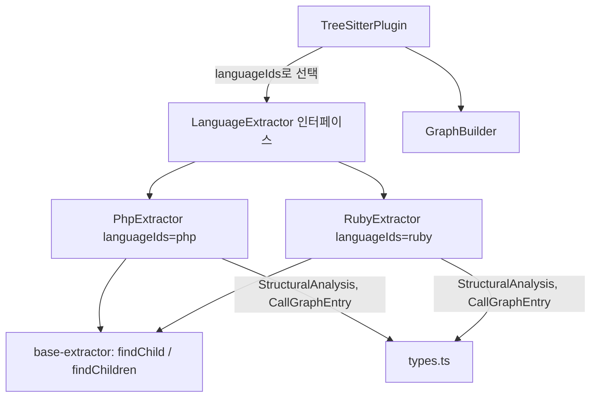
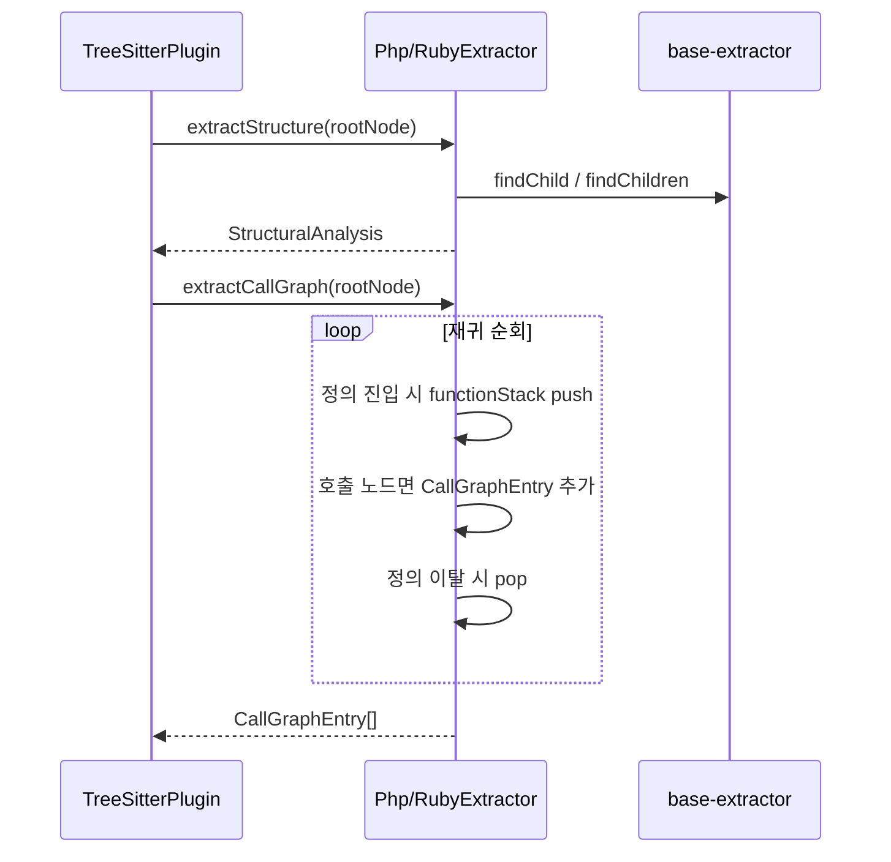

# scripting_extractors 모듈

`scripting_extractors`는 동적/스크립팅 언어인 **PHP**와 **Ruby**의 tree-sitter 구문 트리(AST)를 받아 언어 중립적인 구조 분석 결과(`StructuralAnalysis`)와 호출 그래프(`CallGraphEntry[]`)로 변환하는 두 개의 언어 추출기(`PhpExtractor`, `RubyExtractor`)로 구성됩니다.

- `understand-anything-plugin/packages/core/src/plugins/extractors/php-extractor.ts`
- `understand-anything-plugin/packages/core/src/plugins/extractors/ruby-extractor.ts`
- 테스트: `.../extractors/__tests__/php-extractor.test.ts`, `.../extractors/__tests__/ruby-extractor.test.ts`

상위 모듈은 [core_language_extractors](core_language_extractors.md)이며, 공통 헬퍼(`findChild`, `findChildren`)는 [extractor_base](extractor_base.md)에 있습니다. 추출기를 호출하는 쪽은 [core_plugin_system](core_plugin_system.md)의 `TreeSitterPlugin`입니다.

---

## 1. 아키텍처

두 클래스는 모두 `LanguageExtractor`를 구현하며 다음 두 메서드를 노출합니다.

| 메서드 | 입력 | 출력 |
|---|---|---|
| `extractStructure(rootNode)` | tree-sitter 루트 노드 | `{ functions, classes, imports, exports }` |
| `extractCallGraph(rootNode)` | tree-sitter 루트 노드 | `{ caller, callee, lineNumber }[]` |

줄 번호는 모두 1부터 시작합니다(`startPosition.row + 1`).

---

## 2. PhpExtractor

### 2.1 노드 → 구조 매핑

| PHP 노드 | 결과 |
|---|---|
| `function_definition` | `functions` + `exports` |
| `class_declaration` | `classes` + `exports`, 메서드는 `functions`에도 추가 |
| `interface_declaration` | `classes`(메서드 시그니처만) + `exports` |
| `property_declaration` | 클래스 `properties`(`$` 제외한 이름) |
| `namespace_use_declaration` | `imports` (단순/별칭/그룹 `use`) |
| `namespace_definition` | 블록 스코프(`namespace Foo { ... }`)면 `compound_statement` 내부를 재귀 순회 |

- PHP에는 공식 export 문법이 없으므로 최상위 함수·클래스·인터페이스를 모두 export로 간주합니다.
- `params`는 `$` 접두어를 포함한 변수명(`$x`)이며, `returnType`은 `:` 뒤의 `primitive_type`/`named_type`/`optional_type`/`union_type` 텍스트입니다(`?User` 유지). 없으면 `undefined`.
- import: `use App\Models\User;` → `source="App\Models\User"`, `specifiers=["User"]`. 별칭(`as Repo`)도 원래 이름이 specifier로 남습니다. 그룹 `use App\Models\{User, Post};`는 하나의 import로 `source="App\Models\{User, Post}"`, `specifiers=["User","Post"]`가 됩니다.
- 헬퍼: `extractParams`, `extractReturnType`, `extractUseName`, `lastSegment`.

### 2.2 호출 그래프

`function_definition`/`method_declaration` 진입 시 이름을 `functionStack`에 push하고 나올 때 pop합니다. 스택이 비어 있으면(최상위 호출) 기록하지 않습니다.

| 노드 | callee 형식 |
|---|---|
| `function_call_expression` | `transform` |
| `member_call_expression` | `$this->fetchFromDb` (수신자 텍스트 + `->`) |
| `scoped_call_expression` | `Bar::staticMethod` (child[0] + `::` + child[2]) |

---

## 3. RubyExtractor

### 3.1 노드 → 구조 매핑

| Ruby 노드 | 결과 |
|---|---|
| `method` | `functions` + `exports` |
| `singleton_method` (`def self.foo`) | 이름에 `self.` 접두어 |
| `class`, `module` | 모두 `classes`에 기록 (`Foo::Bar` 같은 네임스페이스 이름 유지) |
| `attr_accessor` / `attr_reader` / `attr_writer` | 클래스 `properties` (심볼의 `:` 제거) |
| `require`, `require_relative` | `imports` (`source`=`specifiers[0]`=문자열 내용) |

- 파라미터: 일반 식별자, 옵션(`port = 8080` → `port`), `*args`, `**kwargs`, `&block`.
- Ruby에는 반환 타입이 없으므로 `returnType`은 설정되지 않습니다.
- 최상위 정의(메서드, 클래스, 모듈)만 export이며 import 호출은 export가 아닙니다. 최상위 노드만 순회하므로 중첩 모듈 내부의 클래스는 별도 항목이 되지 않습니다(클래스 본문에서 메서드/attr만 수집).

### 3.2 호출 그래프

- `method`/`singleton_method`(`self.` 접두어) 진입 시 스택 관리.
- `call` 노드: `receiver.method` 또는 `method`. `require`, `require_relative`, `attr_*`는 제외.
- 인자 없는 bare 호출(`setup`)은 `call`이 아닌 `identifier`로 파싱되므로, 부모가 `body_statement`인 `identifier`를 호출로 처리합니다.
- 메서드 밖 호출은 무시합니다.

---

## 4. 두 추출기 비교

| 항목 | PHP | Ruby |
|---|---|---|
| 클래스류 | class, interface | class, module |
| 반환 타입 | 지원 | 없음 |
| 파라미터 표기 | `$name` | `name`, `*args`, `**kw`, `&blk` |
| 프로퍼티 | `property_declaration` | `attr_*` 매크로 |
| import | `use` | `require`/`require_relative` |
| 정적 호출 표기 | `Cls::m` | `Cls.m` |
| 최상위 순회 | 블록 네임스페이스 재귀 | 최상위 직계 자식만 |

## 5. 테스트

두 테스트 파일은 `web-tree-sitter`로 `tree-sitter-php.wasm`, `tree-sitter-ruby.wasm`을 로드하고, 로컬 `parse(code)` 헬퍼로 실제 AST를 만들어 함수·클래스·import·export·호출 그래프·줄 번호·종합 픽스처를 검증합니다. 매 테스트마다 `tree.delete()`와 `parser.delete()`로 WASM 메모리를 해제합니다. 실행: `pnpm --filter @understand-anything/core test`.

## 6. 유의사항

- 호출 그래프는 이름 기반 정적 분석이므로 동적 디스패치나 메타프로그래밍은 해석하지 못합니다.
- 클래스 메서드는 `classes[].methods`와 최상위 `functions` 양쪽에 중복 등록됩니다(의도된 동작).
- 새 언어를 추가할 때는 이 두 파일과 동일한 `LanguageExtractor` 패턴을 따르고 [core_language_extractors](core_language_extractors.md)에 등록하세요.
