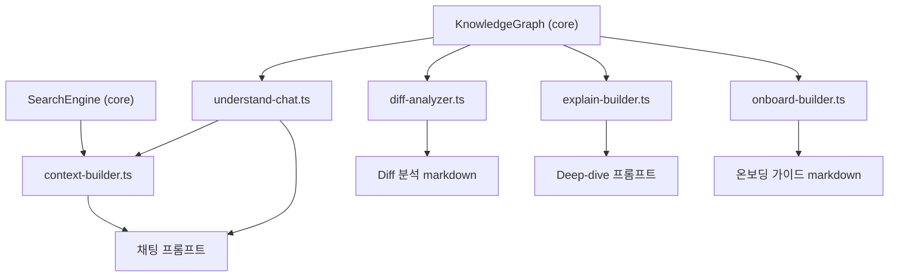
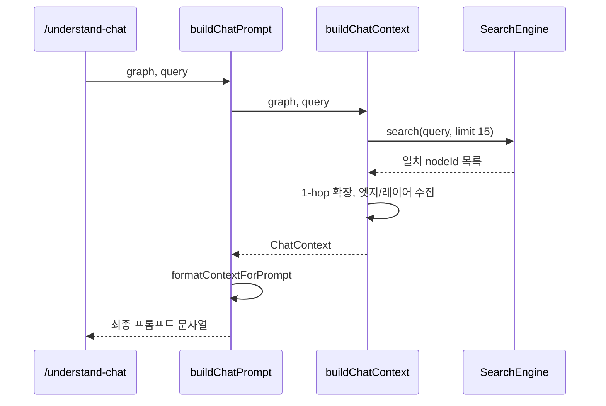

# skill_command_sources 모듈

## 개요

`skill_command_sources`는 `understand-anything-plugin/src/` 아래에 있는 TypeScript 소스로, 슬래시 커맨드 `/understand-chat`, `/understand-diff`, `/understand-explain`, `/understand-onboard`가 사용하는 **프롬프트/문서 생성 로직**을 담고 있습니다. 각 함수는 `KnowledgeGraph`(`@understand-anything/core`)를 입력으로 받아 LLM 또는 사람이 읽을 수 있는 markdown 문자열을 반환합니다. 모두 순수 함수이며 파일 I/O나 LLM 호출은 하지 않습니다.

| 파일 | 커맨드 | 핵심 함수 |
|---|---|---|
| `src/understand-chat.ts` | `/understand-chat` | `buildChatPrompt` |
| `src/context-builder.ts` | (chat 보조) | `buildChatContext`, `formatContextForPrompt` |
| `src/diff-analyzer.ts` | `/understand-diff` | `buildDiffContext`, `formatDiffAnalysis` |
| `src/explain-builder.ts` | `/understand-explain` | `buildExplainContext`, `formatExplainPrompt` |
| `src/onboard-builder.ts` | `/understand-onboard` | `buildOnboardingGuide` |
| `src/__tests__/context-builder.test.ts` | — | `makeNode` (테스트 헬퍼) |

> `context-builder.ts`는 제공된 핵심 컴포넌트 목록에는 없지만 `understand-chat.ts`가 직접 의존하므로 함께 설명합니다.

## 아키텍처

외부 의존성은 `@understand-anything/core`의 타입(`KnowledgeGraph`, `GraphNode`, `GraphEdge`, `Layer`)과 `SearchEngine`뿐입니다. 그래프 생성·저장은 [knowledge_graph_core_engine](knowledge_graph_core_engine.md), 그래프 병합 스크립트는 [skill_graph_merge_scripts](skill_graph_merge_scripts.md)를 참고하세요.

## 컴포넌트 상세

### `/understand-chat` — `understand-chat.ts`, `context-builder.ts`

`buildChatPrompt(graph, query)`는 두 단계로 동작합니다.

1. `buildChatContext(graph, query, maxNodes = 15)`
   - `SearchEngine.search(query, { limit })`로 직접 일치 노드를 찾습니다.
   - 일치 노드에서 엣지를 따라 **1-hop 확장**(source/target 양방향)합니다.
   - 확장된 집합 안에서 양 끝점이 모두 포함된 엣지만 `relevantEdges`로 남기고, 노드를 하나라도 포함하는 `Layer`를 `relevantLayers`로 수집합니다.
   - 일치가 없으면 노드·엣지·레이어 모두 빈 배열입니다.
2. `formatContextForPrompt(ctx)`가 프로젝트 헤더, Relevant Layers, Code Components(파일 경로, complexity, summary, tags, languageNotes), Relationships 섹션을 markdown으로 만듭니다.

`buildChatPrompt`는 여기에 시스템 지침(코드 위치를 근거로 간결하게 답변)과 `**User question:**`을 붙입니다.

### `/understand-diff` — `diff-analyzer.ts`

`buildDiffContext(graph, changedFiles)`는 변경 파일의 영향 범위를 계산합니다.

- `node.filePath === file`인 노드를 `changedNodes`로 매핑하고, 매핑되지 않은 파일은 `unmappedFiles`에 넣습니다.
- 변경된 노드의 `contains` 자식도 변경 노드에 포함합니다.
- 변경 노드와 연결된 엣지를 `impactedEdges`, 반대편 노드(1-hop)를 `affectedNodes`로 수집합니다.
- 영향 받은 노드가 속한 `Layer`를 `affectedLayers`로 계산합니다.

`formatDiffAnalysis(ctx)`는 Changed / Affected Components, Affected Layers, Impacted Relationships, Unmapped Files, **Risk Assessment**를 출력합니다. 위험 규칙은 다음과 같습니다.

| 조건 | 메시지 |
|---|---|
| `complexity === "complex"` 노드가 변경됨 | High complexity |
| 영향 레이어가 2개 이상 | Cross-layer impact |
| `affectedNodes` 5개 초과 | Wide blast radius |
| `unmappedFiles` 존재 | New/unmapped files (재분석 필요) |
| 위 조건 모두 아님 | Low risk |

### `/understand-explain` — `explain-builder.ts`

`buildExplainContext(graph, path)`는 `src/auth.ts` 또는 `src/auth.ts:login` 형식을 지원합니다. 마지막 `:`(단, `://` 포함 시 제외)로 분리해 `filePath`+`name`으로 먼저 찾고, 실패하면 파일 경로 전체로 다시 찾습니다. 대상 노드를 찾으면 `contains` 자식, 1-hop 연결 노드, 관련 엣지, 소속 레이어를 모읍니다. 못 찾으면 `targetNode: null`인 컨텍스트를 반환합니다.

`formatExplainPrompt(ctx)`는 `targetNode`가 없으면 "Component Not Found" 안내(`/understand`를 먼저 실행하라는 등)를 반환하고, 있으면 Deep Dive 문서(타입, 복잡도, 파일, 라인 범위, 레이어, 내부/연결 컴포넌트, `contains`를 제외한 관계, Language Notes)와 5개 항목의 설명 지침을 생성합니다.

### `/understand-onboard` — `onboard-builder.ts`

`buildOnboardingGuide(graph)`는 LLM 없이 그래프만으로 독립 실행 가능한 markdown 문서를 만듭니다. 섹션 순서는 다음과 같습니다.

1. 프로젝트 개요 표(언어, 프레임워크, 노드/엣지 수, `analyzedAt`)
2. Architecture (레이어별 대표 컴포넌트)
3. Key Concepts (`type === "concept"`)
4. Getting Started (`tour` 단계, 관련 파일, `languageLesson`)
5. File Map (`type === "file"` 표)
6. Complexity Hotspots (`complexity === "complex"`)
7. 푸터 (그래프 버전 표시)

비어 있는 섹션은 생략됩니다.

## 테스트

`src/__tests__/context-builder.test.ts`는 `makeNode` 헬퍼로 샘플 노드/엣지/레이어를 만든 뒤 다음을 검증합니다.

- 쿼리 관련 노드 검색과 1-hop 확장(`auth-ctrl` → `user-model`, `auth-middleware`)
- 프로젝트 메타데이터 및 `query` 보존
- 관련 레이어·엣지 수집, `maxNodes` 제한, 무일치 쿼리 시 빈 결과
- `formatContextForPrompt` 출력에 이름, 요약, 파일 경로, complexity/type, `depends_on` 관계, 레이어가 포함되는지

테스트 실행: `pnpm test` (루트 `vitest.config.ts`가 `tests/skill/`을 포함해 수집. 빌드/테스트 설정은 [workspace_build_and_delivery](workspace_build_and_delivery.md) 참고).

## 설계 메모 및 제약

- 모든 함수가 순수 함수이므로 단위 테스트가 쉽고, 그래프 로딩(`loadGraph` 등)은 호출하는 스킬 쪽 책임입니다 ([core_search_persistence_staleness](core_search_persistence_staleness.md)).
- Diff/Explain의 노드 매핑은 `filePath` 정확 일치만 지원하므로, 경로 표기가 그래프와 다르면 미매핑 처리됩니다.
- 1-hop 확장만 수행하므로 간접 영향(2-hop 이상)은 반영되지 않습니다.
- Chat의 검색 품질은 core의 `SearchEngine`에 좌우됩니다.
