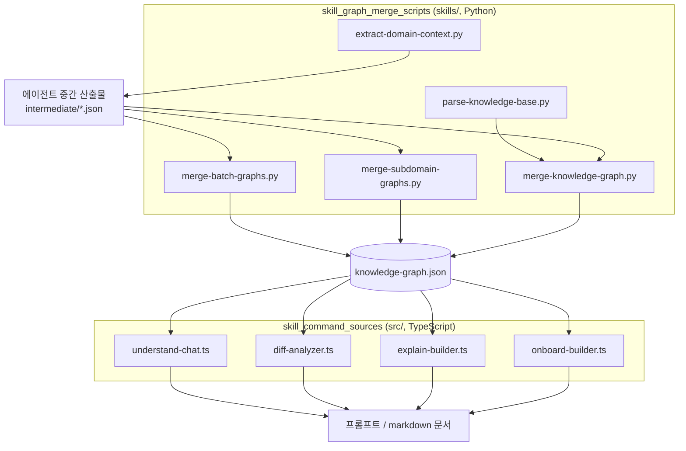
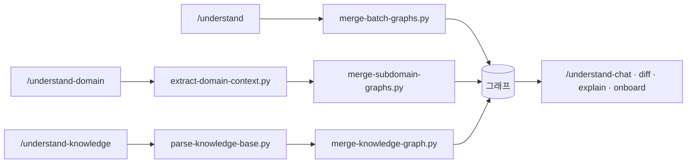

# skill_commands_and_graph_assembly 모듈 개요

## 목적

`understand-anything-plugin` 아래에서 Claude Code 슬래시 커맨드(스킬)를 실제로 동작시키는 두 부분을 묶은 모듈입니다.

- **커맨드 소스 (`src/`)**: 완성된 `KnowledgeGraph`를 읽어 `/understand-chat`, `/understand-diff`, `/understand-explain`, `/understand-onboard`용 프롬프트와 markdown 문서를 만드는 TypeScript 순수 함수입니다. 파일 I/O와 LLM 호출은 하지 않습니다.
- **그래프 병합 스크립트 (`skills/`)**: 에이전트가 만든 중간 산출물(`batch-*.json` 등)을 정규화, 중복 제거, 병합해서 최종 `knowledge-graph.json`의 재료로 만드는 독립 실행형 Python 스크립트 5개입니다. 표준 라이브러리만 쓰고, 결과는 데이터 디렉터리(`.ua/` 또는 레거시 `.understand-anything/`)에 씁니다.

즉 그래프를 **만드는 쪽**(병합 스크립트)과 그래프를 **소비하는 쪽**(커맨드 소스)을 함께 다룹니다.

## 아키텍처

### 스킬별 흐름

## 하위 모듈

| 모듈 | 경로 | 역할 | 문서 |
|---|---|---|---|
| `skill_command_sources` | `understand-anything-plugin/src` | 채팅, diff, explain, onboard 프롬프트·문서 생성 (`buildChatPrompt`, `buildDiffContext`, `buildExplainContext`, `buildOnboardingGuide` 등) | [skill_command_sources.md](skill_command_sources.md) |
| `skill_graph_merge_scripts` | `understand-anything-plugin/skills` | 배치·서브도메인·위키 그래프 병합, ID·타입·복잡도 정규화, `tested_by` 링크, import 복구 | [skill_graph_merge_scripts.md](skill_graph_merge_scripts.md) |

## 핵심 포인트

- **커맨드 소스**: 1-hop 확장으로 관련 노드를 모으고(chat, diff, explain), 그래프만으로 온보딩 문서를 생성합니다. diff는 복잡도, 레이어 교차, 영향 범위로 위험도를 평가합니다.
- **병합 스크립트**:
  - `merge-batch-graphs.py`: 노드 ID와 복잡도를 정규화하고, 노드와 엣지의 중복 및 dangling 엣지를 제거하며, `tested_by` 링크와 누락된 import를 복구합니다.
  - `merge-subdomain-graphs.py`: 구조 엣지가 유실되면 `merge-report.json`에 남겨 다음 실행에서 재시도합니다.
- **유지보수 주의**:
  - 노드·엣지 타입, `direction`, 복잡도 규칙은 core의 `types.ts`, `schema.ts`와 손으로 맞춰져 있습니다.
  - `resolve_ua_dir` 등 일부 함수는 스크립트마다 복사되어 있어 함께 고쳐야 합니다.

## 관련 문서

- [knowledge_graph_core_engine](knowledge_graph_core_engine.md): 그래프 타입, 스키마, 검색, 저장
- [workspace_build_and_delivery](workspace_build_and_delivery.md): 빌드와 테스트 설정