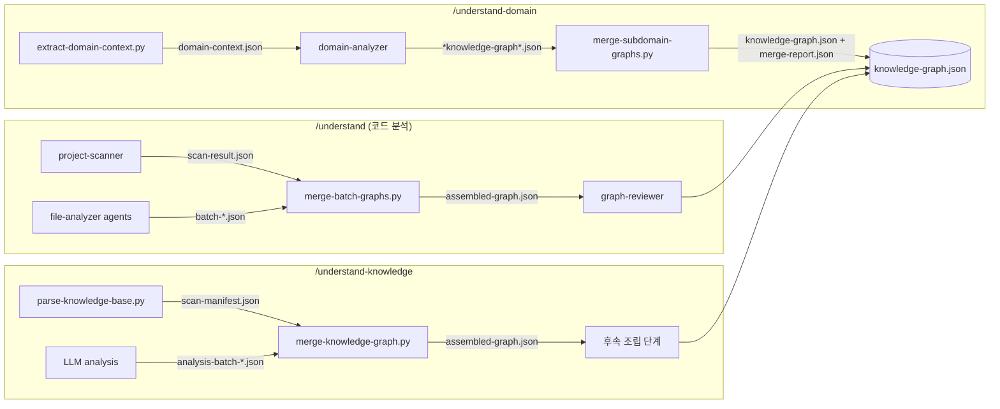
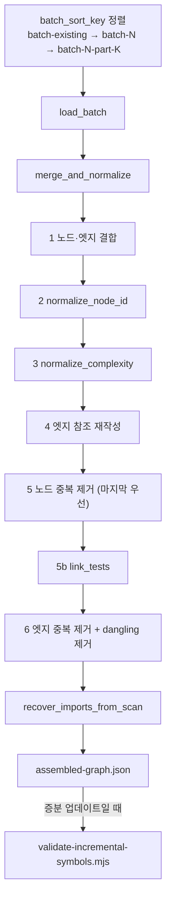

# skill_graph_merge_scripts

`understand-anything-plugin/skills/` 아래에 있는 독립 실행형 Python 스크립트 5개를 다루는 모듈이다. 에이전트(LLM)가 만든 중간 산출물을 결정론적으로 정리하고 병합해서 최종 지식 그래프(`knowledge-graph.json`)의 재료로 만든다. 스크립트는 모두 표준 라이브러리만 쓰고, CLI 인자로 프로젝트(또는 위키) 루트를 받는다. 결과 JSON은 `.ua/`(또는 레거시 `.understand-anything/`) 데이터 디렉터리에 쓴다.

상위 모듈: [skill_commands_and_graph_assembly](skill_commands_and_graph_assembly.md). 형제 모듈: [skill_command_sources](skill_command_sources.md). 스크립트가 출력하는 그래프는 [knowledge_graph_core_engine](knowledge_graph_core_engine.md)의 스키마·`normalizeBatchOutput`(TypeScript)과 같은 규칙을 따르도록 맞춰져 있다.

## 구성 요소

| 스크립트 | 스킬 | 입력 | 출력 |
|---|---|---|---|
| `understand-domain/extract-domain-context.py` | `/understand-domain` | 프로젝트 루트 | `intermediate/domain-context.json` |
| `understand-knowledge/parse-knowledge-base.py` | `/understand-knowledge` | 위키 디렉터리 | `intermediate/scan-manifest.json` |
| `understand-knowledge/merge-knowledge-graph.py` | `/understand-knowledge` | `scan-manifest.json` + `analysis-batch-*.json` | `intermediate/assembled-graph.json` |
| `understand/merge-batch-graphs.py` | `/understand` (2단계 끝) | `batch-*.json`, `scan-result.json` | `intermediate/assembled-graph.json` |
| `understand/merge-subdomain-graphs.py` | `/understand-domain` 계열 | `*knowledge-graph*.json` | `knowledge-graph.json`, `merge-report.json` |

공통점:
- `resolve_ua_dir(root)`: core의 `resolveUaDir`를 그대로 옮긴 함수다. `.understand-anything/`가 이미 있으면 그쪽을 쓰고, 없으면 `.ua/`를 쓴다. 스크립트가 서로 독립적이라 각 파일에 복사해 두었다.
- 진행 로그와 경고는 stderr로 내보낸다. 오류가 나면 종료 코드 1로 끝난다.
- 잘못된 입력은 조용히 건너뛰되, 리포트에 남겨서 후속 리뷰 단계(에이전트)가 볼 수 있게 한다.

## 아키텍처와 데이터 흐름



## extract-domain-context.py

프로젝트를 가볍게 훑어서 domain-analyzer 에이전트가 쓸 컨텍스트 JSON을 만든다.

처리 순서 (`main`):
1. `parse_gitignore`로 `.gitignore`를 정규식으로 단순 변환한다. `is_ignored`가 이 패턴으로 경로를 검사한다.
2. `scan_file_tree`가 소스 확장자(`SOURCE_EXTENSIONS`)만 수집한다. `SKIP_DIRS`와 심볼릭 링크는 건너뛴다. 깊이 6, 디렉터리당 50개, 전체 5000개가 상한이다.
3. `detect_entry_points`가 `ENTRY_POINT_PATTERNS`의 정규식으로 진입점을 찾는다. 종류는 http(Express, 데코레이터, Next.js, GraphQL, gRPC), cli, event, cron, manual이다. 테스트 파일은 제외하고 최대 200개까지 모은다.
4. `extract_file_signatures`가 파일 이름에 controller, service 같은 키워드가 많이 들어간 순으로 최대 40개를 골라 export, import, 미리보기를 뽑는다.
5. `extract_metadata`가 `package.json`, `pyproject.toml`, README 같은 메타데이터 파일을 읽는다.
6. `_truncate_to_fit`이 출력이 512KB를 넘지 않게 단계적으로 줄인다. 순서는 파일 트리, 미리보기, 스니펫, 시그니처·진입점 개수 순이다.

## parse-knowledge-base.py

Karpathy 패턴 LLM 위키(raw + wiki 마크다운 + 스키마 파일)를 결정론적으로 파싱한다.

- `detect_format`: `index.md`가 있고 마크다운이 3개 이상이면 위키로 판단한다. 아니면 종료 코드 1로 끝난다.
- `find_markdown_case_insensitive`: 같은 디렉터리 안에서만 대소문자를 무시하고 찾는다. 정확히 일치하는 이름이 우선한다.
- 문서마다 `article:<stem>` 노드를 만든다. 위키 루트의 `INFRA_FILES`(`index.md`, `log.md` 등)는 제외한다. 복잡도는 위키링크 수로 정한다(5개 초과면 moderate, 15개 초과면 complex).
- `parse_index`가 `## ` 제목마다 카테고리를 만들고, 각각 `topic:<slug>` 노드와 `categorized_under` 엣지가 된다.
- `resolve_wikilink`와 `build_name_to_stem_map`이 위키링크를 문서 ID로 바꾼다. 같은 이름의 문서가 여러 개면 그 이름은 모호하다고 보고 매핑에서 뺀다. `[[wiki/...]]`처럼 루트 접두어가 붙은 링크도 처리한다. 해결되지 않은 링크는 경고로 남긴다(최대 50개).
- `raw/` 안의 파일은 `source:` 노드가 된다. 위키링크로부터 `related` 엣지와 백링크를 계산하고, 엣지는 중복을 제거한다.

## merge-knowledge-graph.py

`scan-manifest.json`(결정론적 기반)에 LLM 분석 배치 `analysis-batch-*.json`을 합친다.

1. **정규화**: `NODE_TYPE_ALIASES`와 `EDGE_TYPE_ALIASES`로 타입 별칭을 표준 타입으로 바꾼다. 알 수 없는 노드 타입은 건너뛰고, 알 수 없는 엣지 타입은 `related`로 바꾼다. 허용 타입 집합은 `core/src/types.ts`와 같아야 한다.
2. **엔티티 중복 제거**: `normalize_entity_name`으로 이름을 정규화하고, 중복된 ID는 `dedup_remap`에 기록한다. 엣지 끝점을 이 표로 다시 매핑한 뒤 양 끝 노드가 존재하는 엣지만 남긴다. 끝점이 없는 엣지는 버린다.
3. **레이어**: 카테고리마다 `layer:<slug>`를 만든다. entity/claim 노드는 (a) 문서와 연결된 엣지, (b) ID 접두어(stem) 일치, (c) 이름이 문서 이름이나 본문에 포함되는지 순으로 소속 문서를 찾아, 그 문서의 레이어에 넣는다. 어디에도 못 넣은 노드는 `layer:other`에 들어간다.
4. **투어**: 카테고리 순서대로 단계를 만들고, 단계마다 대표 문서를 최대 3개 고른다.
5. 프로젝트 이름은 `index.md`의 H1에서 가져오고, `git rev-parse HEAD`로 커밋 해시를 채운다. 결과는 `kind: "knowledge"` 그래프다.

## merge-batch-graphs.py

`/understand` 2단계 끝에서 `batch-*.json`을 하나의 `assembled-graph.json`으로 합친다. 파일 하나가 이 모듈에서 가장 크고, 리포트(Fixed / Could not fix)를 만든다.



핵심 동작:
- **배치 파일명**: `parse_batch_filename`이 `batch-existing.json`(증분 기준선, 인덱스 -1), `batch-<N>.json`, `batch-<N>-part-<K>.json`만 인식한다. `batch_sort_key`로 숫자 순서 정렬해서, 뒤에 오는 새 배치가 기준선의 같은 노드를 덮어쓴다. 다른 이름의 파일은 버려지고 경고가 남는다. 파트 번호에 빠진 곳이 있거나 비어 있는 배치도 경고한다.
- **ID 정규화** (`normalize_node_id`): `file:file:` 같은 이중 접두어를 제거하고, `my-project:file:...` 같은 프로젝트명 접두어를 제거한다. `func:`는 `function:`으로 바꾸고, 접두어 없는 경로에는 타입에 맞는 접두어를 붙인다. `filePath`가 없는 function/class는 `__nofilepath__` 자리표시자를 넣어 충돌이 리포트에서 드러나게 한다.
- **복잡도** (`normalize_complexity`): 별칭과 숫자 값을 `simple`, `moderate`, `complex`로 바꾼다. 알 수 없는 값은 `moderate`로 두되 "Could not fix"에 기록한다.
- **`direction`** (`normalize_direction`): `both`, `mutual`을 `bidirectional`로 바꾼다. 나머지 알 수 없는 값은 `forward`로 둔다. 이 규칙은 `core/src/schema.ts`와 같다.
- **`link_tests`** (`tested_by` 링커, 2단계):
  1. 기존 `tested_by` 엣지를 정리한다. LLM은 테스트 파일을 분석할 때 관계를 보기 때문에 방향이 뒤집혀 나오는 경우가 많다. 그래서 테스트→프로덕션 엣지는 뒤집어서 프로덕션→테스트로 만든다. 끝점이 없거나 test↔test, prod↔prod인 엣지는 버린다. 같은 쌍이 중복이면 weight가 큰 쪽을 남긴다.
  2. 아직 짝이 없는 테스트 파일은 `is_test_path`와 `production_candidates`로 경로 규칙(JS/TS `__tests__`, Go `_test.go`, Python `test_*`, Maven/Gradle/sbt의 `src/test` 구조, .NET `.Tests` 프로젝트 등)에 따라 짝을 찾아 새 엣지(weight 0.5)를 만든다.
  프로덕션 노드에는 `tested` 태그를 붙인다.
- **엣지 중복 제거**: 키는 `(source, target, type, direction)`이다. 같은 키에서는 weight가 큰 엣지를 남기고, 끝점이 없는 엣지는 버린다.
- **`recover_imports_from_scan`**: `scan-result.json#importMap`이 확정된 내부 import 목록이다. file-analyzer가 이 중 약 25%를 빠뜨리기 때문에, 없는 `imports` 엣지를 `recoveredFromImportMap: true` 표시와 함께 다시 만든다. 대상은 `build_whole_file_node_index`가 만든 파일 단위 노드(`<type>:<filePath>`)뿐이다.
- **증분 업데이트**: `incremental-plan.json`의 `action`이 `PARTIAL_UPDATE`나 `ARCHITECTURE_UPDATE`이면, 현재 분석에서 나온 뒤 끝점이 없어서 버려진 엣지를 `incremental-edge-candidates.json`에 저장한다. 그 뒤 `validate-incremental-symbols.mjs`를 실행하고, 실패하면 그 종료 코드로 끝낸다.

## merge-subdomain-graphs.py

서브도메인별 지식 그래프를 하나의 `knowledge-graph.json`으로 합친다.

- 파일 목록은 인자로 지정할 수도 있고, 없으면 `*knowledge-graph*.json`을 자동으로 찾는다. 이때 `knowledge-graph.json` 자신은 제외해서 반복 실행 시 스스로를 합치지 않게 한다. 기존 `knowledge-graph.json`은 기반으로 맨 앞에 넣는다. 그래서 충돌이 나면 서브도메인 쪽 데이터가 이긴다.
- `merge_graphs`:
  - 노드는 ID 기준으로 합치고 나중 것이 이긴다.
  - 엣지는 `(source, target, type)` 기준으로 합치고 weight가 큰 쪽이 이긴다.
  - 끝점이 없는 엣지는 버린다.
  - 레이어는 ID로 합치고 `nodeIds`를 합집합으로 만든 뒤, 존재하지 않는 참조를 제거한다.
  - 투어는 제목이 같은 단계끼리 합치고(긴 설명을 유지) 다시 번호를 매긴다.
  - 프로젝트 메타데이터는 언어, 프레임워크, 설명을 합치고 `analyzedAt`이 가장 최근인 쪽의 커밋 해시를 쓴다.
- **구조 엣지 재시도**: `contains_flow`, `flow_step`, `cross_domain`(`STRUCTURAL_EDGE_TYPES`)은 도메인 계층을 이루는 엣지다. 끝점이 없어서 버려지면 경고를 크게 내고 `merge-report.json`의 `droppedEdges`에 기록한다. 서브도메인 파일은 조립 후 삭제되므로, 다음 실행 때 `load_pending_structural_edges`가 이 리포트에서 엣지를 다시 읽어 넣는다. 끝점이 그 사이 생겼다면 이번에 복구된다(`recoveredStructuralEdges`).

## 실행 예

```bash
python understand-anything-plugin/skills/understand/merge-batch-graphs.py <project-root>
python understand-anything-plugin/skills/understand/merge-subdomain-graphs.py <project-root> [a.json b.json]
python understand-anything-plugin/skills/understand-domain/extract-domain-context.py <project-root>
python understand-anything-plugin/skills/understand-knowledge/parse-knowledge-base.py <wiki-dir>
python understand-anything-plugin/skills/understand-knowledge/merge-knowledge-graph.py <wiki-dir>
```

## 유지보수 시 주의할 점

- 노드·엣지 타입, `direction`, 복잡도 규칙은 TypeScript 쪽(`core/src/types.ts`, `core/src/schema.ts`)과 손으로 맞춰 둔 것이다. 한쪽을 바꾸면 다른 쪽도 바꿔야 한다. 관련 내용은 [knowledge_graph_core_engine](knowledge_graph_core_engine.md)를 참고한다.
- `resolve_ua_dir`와 `find_markdown_case_insensitive`는 스크립트마다 복사되어 있다. 고칠 때는 모든 복사본을 함께 고쳐야 한다.
- `merge-batch-graphs.py`의 `_PROJECT_PREFIX_RE`는 import 시점에 한 번만 컴파일한다. 노드마다 패턴 문자열을 다시 만들던 이전 방식보다 큰 그래프에서 약 15배 빠르다.
- 스크립트는 파일명 패턴에 의존한다(`batch-*.json`, `analysis-batch-*.json`). file-analyzer 에이전트의 출력 파일명을 바꾸면 이 스크립트도 바꿔야 한다.
