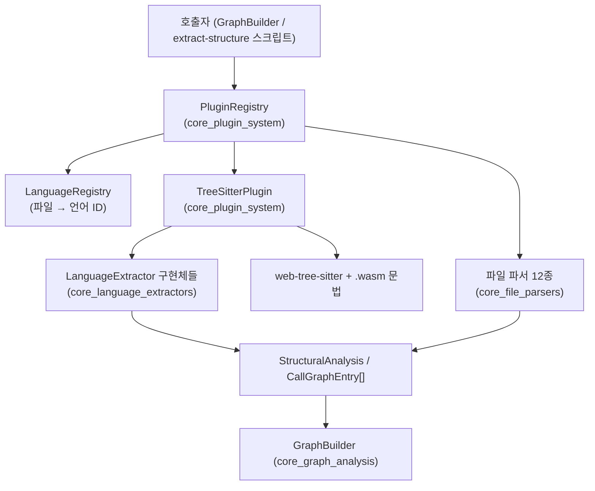
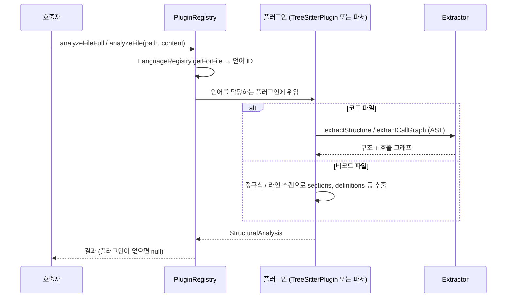
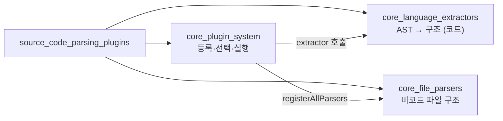

# source_code_parsing_plugins 모듈 개요

## 1. 목적

`source_code_parsing_plugins`(`understand-anything-plugin/packages/core/src/plugins`)는 `@understand-anything/core`에서 **소스 파일을 파싱해 언어 중립적인 `StructuralAnalysis`로 바꾸는 계층**입니다. 이 결과를 `GraphBuilder`(`core_graph_analysis`)가 지식 그래프의 노드와 엣지로 변환합니다.

이 모듈은 파일 종류에 따라 분석 경로를 둘로 나눕니다.

- **코드 파일**: `TreeSitterPlugin`이 `web-tree-sitter`(WASM)로 AST를 만들고, 언어별 extractor가 함수·클래스·import·export와 호출 그래프를 추출합니다.
- **비코드 파일**: Markdown, YAML, JSON, TOML, `.env`, Dockerfile, SQL, GraphQL, Protobuf, Terraform, Makefile, Shell 파일은 정규식과 라인 스캔 기반 파서가 처리합니다.
- **플러그인 등록과 조회**: `PluginRegistry`가 둘을 같은 `AnalyzerPlugin` 인터페이스로 묶어 등록하고, 파일 경로를 언어 ID로 매핑해 알맞은 플러그인에 위임합니다.

## 2. 아키텍처

### 분석 흐름

### 하위 모듈 구성

## 3. 핵심 설계 포인트

- **WASM 사용**: 네이티브 `tree-sitter`가 darwin/arm64 + Node 24에서 실패하기 때문에 `web-tree-sitter`를 씁니다.
- **`init()` 선행 필수**: `TreeSitterPlugin`은 동기 메서드를 호출하기 전에 `await init()`을 해야 합니다. 그렇지 않으면 `getParser`가 예외를 던집니다.
- **후순위 등록 우선**: 같은 언어에 여러 플러그인이 있으면 나중에 등록된 플러그인이 이깁니다.
- **미지원 계약이 두 가지**: 레지스트리는 `null`을 반환하고, `TreeSitterPlugin`은 빈 결과를 반환합니다. 엄격 모드(`analyzeFileStrict`)는 `succeeded`, `unsupported`, `failed`를 구분합니다.
- **한 번 파싱으로 구조와 호출 그래프 추출**: `analyzeFileFull`이 파싱을 한 번만 하며, 주석상 파싱 비용이 약 40% 줄어듭니다.
- **이름 기반 분석**: extractor는 심볼을 해석하지 않고 텍스트 이름만 기록합니다. 동명 메서드나 오버로드는 구분하지 못합니다.
- **언어 ID 동기화**: 파서의 `languages`는 `core_language_registries`가 부여한 ID와 일치해야 합니다. 일치하지 않으면 구조 추출이 조용히 누락됩니다.
- **Node 전용**: 이 모듈은 Node 전용 API를 씁니다. 대시보드는 코어 메인 엔트리가 아니라 브라우저 안전 subpath(`./search`, `./types`, `./schema`)만 import해야 합니다.

## 4. 하위 모듈 문서

| 모듈 | 역할 | 문서 |
|---|---|---|
| `core_plugin_system` | `PluginRegistry`, `TreeSitterPlugin`, 플러그인 설정(`discovery.ts`) | [core_plugin_system](core_plugin_system.md) |
| `core_language_extractors` | 언어별 AST 추출기 (TypeScript, Python, Go, Rust, JVM, C 계열, PHP/Ruby, Dart/Swift) | [core_language_extractors](core_language_extractors.md) |
| `core_file_parsers` | 비코드 파일 파서 12종과 `registerAllParsers` | [core_file_parsers](core_file_parsers.md) |

`core_language_extractors`의 세부 문서는 다음과 같습니다.
[extractor_base](extractor_base.md), [typescript_extractor](typescript_extractor.md), [python_extractor](python_extractor.md), [go_extractor](go_extractor.md), [rust_extractor](rust_extractor.md), [jvm_extractors](jvm_extractors.md), [c_family_extractors](c_family_extractors.md), [scripting_extractors](scripting_extractors.md), [mobile_extractors](mobile_extractors.md)

## 5. 관련 모듈

- [core_language_registries](core_language_registries.md): 파일 확장자를 언어 ID로 매핑합니다.
- [core_graph_analysis](core_graph_analysis.md): 분석 결과를 지식 그래프로 조립합니다.
- [core_package_config](core_package_config.md): 코어 패키지의 빌드·테스트 설정입니다.

## 6. 확장 방법

- **새 코드 언어**: `LanguageExtractor`를 구현하고, `languageIds`를 `TreeSitterPlugin` 설정과 언어 레지스트리에 연결합니다. 그 뒤 `__tests__`에 테스트를 추가합니다.
- **새 비코드 포맷**: `AnalyzerPlugin`을 구현하고, `parsers/index.ts`에 export와 `registry.register(...)`를 추가합니다. 언어 레지스트리의 언어 ID도 함께 갱신합니다.
- **테스트 실행**: `pnpm --filter @understand-anything/core test`