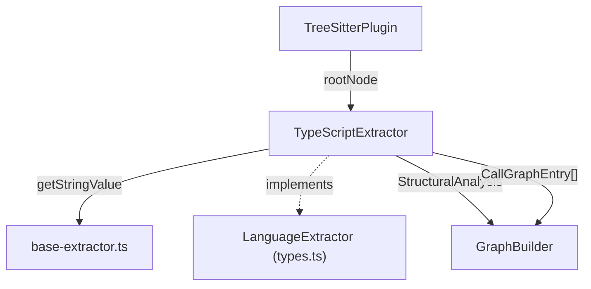
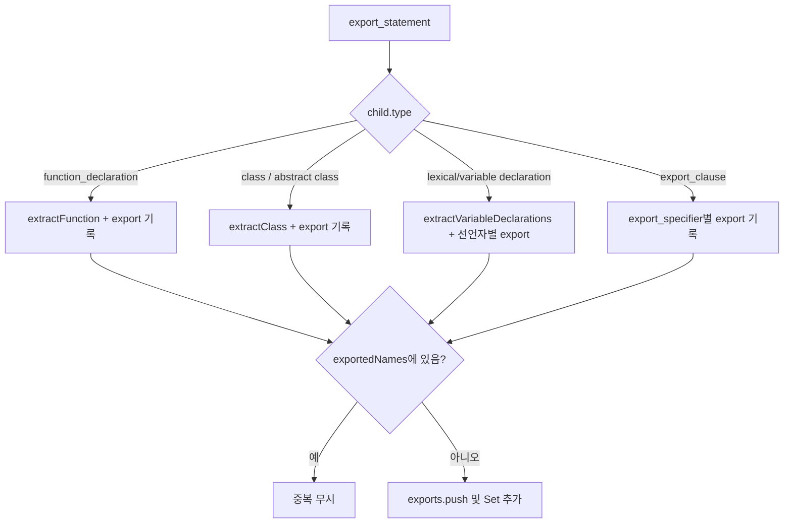
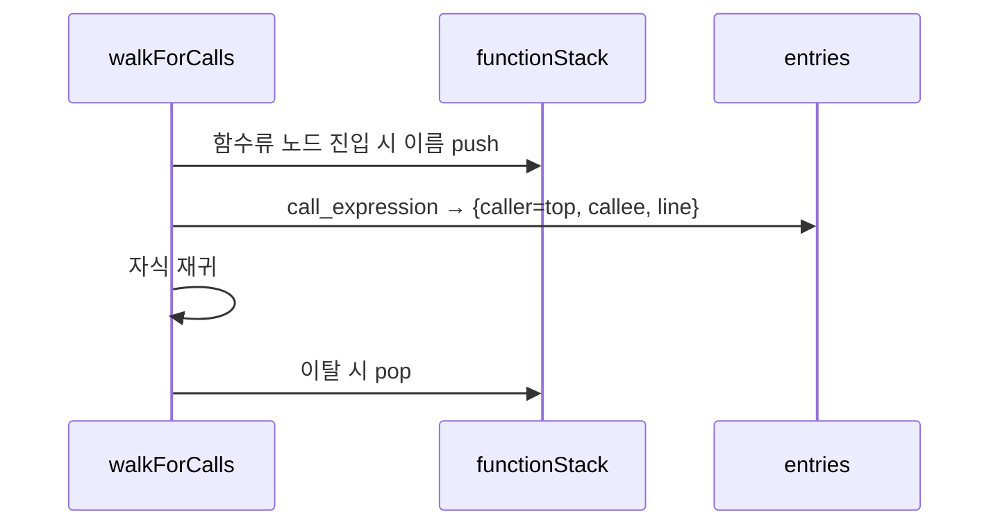

# typescript_extractor 모듈

## 소개

`typescript_extractor`는 tree-sitter가 생성한 **TypeScript/JavaScript AST**에서 구조 정보(함수, 클래스, import, export)와 호출 그래프(caller → callee)를 추출하는 언어별 추출기입니다. `TypeScriptExtractor` 클래스 하나가 `LanguageExtractor` 인터페이스를 구현하며, `languageIds`는 `["typescript", "javascript"]`입니다.

- 구현: `understand-anything-plugin/packages/core/src/plugins/extractors/typescript-extractor.ts`
- 테스트: `understand-anything-plugin/packages/core/src/plugins/extractors/__tests__/typescript-extractor.test.ts`

상위 컨텍스트는 [core_language_extractors](core_language_extractors.md), 공통 유틸(`getStringValue`, `hasChildOfType`)은 [extractor_base](extractor_base.md), 이 추출기를 호출하는 쪽은 [core_plugin_system](core_plugin_system.md)(`TreeSitterPlugin`)을 참고하세요.

## 아키텍처

추출기는 순수 함수형에 가깝습니다. 상태 없이 `TreeSitterNode`(루트)만 받아 결과 객체를 반환하며, 파서 초기화·WASM 로딩은 [core_plugin_system](core_plugin_system.md)이 담당합니다.

## 공개 API

### `extractStructure(rootNode): StructuralAnalysis`

루트의 **직속 자식만** 순회하고(`processTopLevelNode`), 중첩된 선언은 탐색하지 않습니다. 반환값은 `{ functions, classes, imports, exports }`.

| 노드 타입 | 처리 |
|---|---|
| `function_declaration` | `extractFunction` → 이름, 줄 범위, 파라미터, 반환 타입 |
| `class_declaration`, `abstract_class_declaration` | `extractClass` → 메서드/프로퍼티 목록 |
| `lexical_declaration`, `variable_declaration` | 값이 `arrow_function`/`function_expression`/`function`인 선언자만 함수로 등록 |
| `import_statement` | `extractImport` → source, specifiers, lineNumber |
| `export_statement` | `processExportStatement` → 내부 선언 추출 + exports 기록 |

### `extractCallGraph(rootNode): CallGraphEntry[]`

재귀 DFS로 전체 트리를 걷습니다. `functionStack`에 현재 함수 이름을 push/pop하며, `call_expression`을 만나면 스택 최상단을 caller로 하여 `{ caller, callee: callee.text, lineNumber }`를 기록합니다.

함수 이름 결정 규칙:
- `function_declaration`: `name` 필드 또는 첫 `identifier`
- `method_definition`: 첫 `property_identifier`
- `arrow_function`/`function_expression`: 부모가 `variable_declarator`일 때 그 `name`

## 내부 헬퍼

- `extractParams`: `required_parameter`/`optional_parameter`(`pattern` 또는 `name` 필드, 없으면 첫 identifier), JS의 bare `identifier`, `rest_pattern`/`rest_element`(`...name`).
- `extractReturnType`: `return_type` 필드가 `type_annotation`이면 앞의 `:`를 제거한 텍스트.
- `extractImportSpecifiers`: named import(alias 우선), `* as ns`, default import.

## 동작상 주의점 / 제약

- **최상위만**: 함수·클래스·import는 루트 직속 노드(또는 `export_statement` 자식)에서만 추출됩니다. 함수 내부의 중첩 함수는 구조에 나오지 않습니다(호출 그래프에서는 스택으로 반영).
- **익명 호출자 제외**: 이름을 얻지 못한 함수(예: 변수에 대입되지 않은 콜백) 안의 호출은 바깥 이름 있는 함수의 caller로 귀속되고, 최상위 호출(스택 비어 있음)은 기록되지 않습니다.
- **callee는 원문 텍스트**: `a.b.c()`는 `"a.b.c"`로 기록되며 심볼 해석은 하지 않습니다.
- **export 중복 제거**: `exportedNames` Set으로 이름 기준 중복을 막습니다. `export default function () {}`는 이름 `"default"`로 기록되고, 이름 있는 default 클래스는 `"default"` 이름으로 기록됩니다(함수는 원래 이름 유지, `isDefault`만 true).
- **variable export의 `isDefault`**: 변수/`export_clause` export에는 `isDefault`가 설정되지 않습니다.
- 클래스 멤버: `method_definition`, `abstract_method_signature` → methods; `public_field_definition`, `property_definition` → properties.

## 테스트

`typescript-extractor.test.ts`는 `web-tree-sitter`와 `tree-sitter-typescript.wasm`을 `beforeAll`에서 한 번 로드하고, 헬퍼 `parse(code)`로 트리를 만든 뒤 `tree.delete()`/`parser.delete()`로 WASM 메모리를 해제합니다. 검증 항목:

1. 일반 클래스 추출(회귀 방지)
2. 추상 클래스: 구체 메서드와 추상 메서드 시그니처(`find`)가 모두 `methods`에 포함
3. `export abstract class`가 `exports`에 기록되며 `isDefault === false`

테스트 실행: `pnpm --filter @understand-anything/core test` (설정: `understand-anything-plugin/packages/core/vitest.config.ts`, 빌드/테스트 구성은 [core_package_config](core_package_config.md) 참고).

## 다른 추출기와의 관계

동일한 `LanguageExtractor` 계약을 따르는 형제 모듈: [python_extractor](python_extractor.md), [go_extractor](go_extractor.md), [rust_extractor](rust_extractor.md), [jvm_extractors](jvm_extractors.md), [c_family_extractors](c_family_extractors.md), [scripting_extractors](scripting_extractors.md), [mobile_extractors](mobile_extractors.md).
