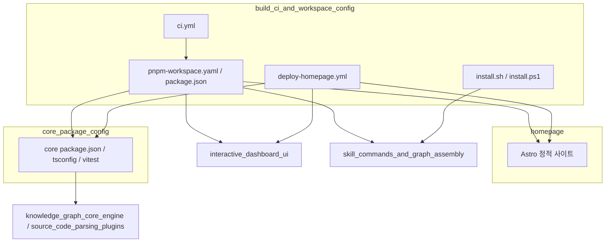
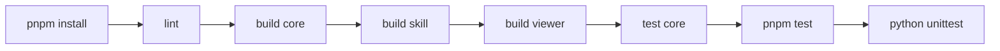
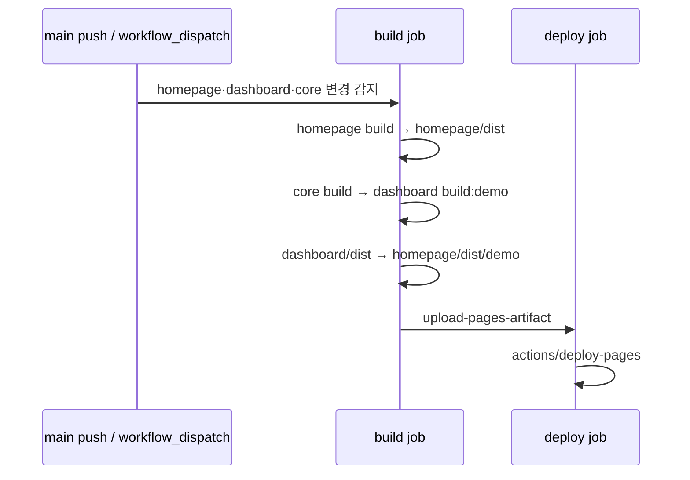

# workspace_build_and_delivery 모듈 개요

## 목적

`workspace_build_and_delivery`는 Understand-Anything 모노레포를 **빌드하고 검증하며 사용자에게 전달하는 계층**입니다. 분석 엔진이나 대시보드 같은 애플리케이션 로직은 들어 있지 않습니다. 이 모듈이 맡는 일은 다음과 같습니다.

- pnpm 워크스페이스, 공용 TypeScript·Vitest 설정, 루트 스크립트 구성
- GitHub Actions CI(lint, build, test)와 GitHub Pages 배포
- 여러 플랫폼용 스킬 설치 스크립트(`install.sh`, `install.ps1`)
- 마케팅 사이트(`homepage`, Astro 정적 사이트)와 `/demo` 대시보드 배포
- `@understand-anything/core` 패키지의 빌드·패키징·테스트 설정

## 하위 모듈

| 하위 모듈 | 경로 | 역할 | 문서 |
|---|---|---|---|
| `build_ci_and_workspace_config` | `.` (루트) | 워크스페이스, 루트 스크립트, CI/배포 워크플로, 설치 스크립트, 하위 패키지 매니페스트 | [build_ci_and_workspace_config](build_ci_and_workspace_config.md) |
| `homepage` | `homepage` | Astro 기반 공개 사이트. 대시보드 데모를 `/demo`에 병합 | [homepage](homepage.md) |
| `core_package_config` | `understand-anything-plugin/packages/core` | core의 `package.json` exports, `tsconfig.json`, `vitest.config.ts` | [core_package_config](core_package_config.md) |

## 아키텍처

### 전체 구조

워크스페이스 정의가 core, dashboard, viewer, homepage를 하나의 pnpm 설치로 묶습니다. CI와 배포 워크플로는 이 워크스페이스를 기준으로 동작합니다. 설치 스크립트는 워크스페이스와 별개로, 스킬을 각 AI 플랫폼에 배포하는 경로입니다.

### 빌드 및 검증 흐름

- **빌드 순서**: skill이 `@understand-anything/core`에 `workspace:*`로 의존하고 dashboard도 core의 `dist/`를 쓰므로, core를 먼저 빌드해야 합니다.
- **테스트 분리**: 루트 `vitest.config.ts`는 `packages/core/**`를 제외합니다. core 테스트는 `pnpm --filter @understand-anything/core test`로 따로 실행합니다.
- **CI 매트릭스**: `ubuntu-latest`와 `windows-latest`에서 Node 22로 실행합니다.

### 배포 흐름

dashboard와 core가 바뀌어도 홈페이지가 다시 배포되는 이유는, `/demo`에 대시보드 데모 빌드가 들어가기 때문입니다. 데모 그래프 위치는 저장소 변수 `DEMO_GRAPH_URL`, `DEMO_DOMAIN_GRAPH_URL`, `DEMO_META_URL`로 주입합니다.

## 유지보수 시 참고

- **버전 동기화**: 푸시할 때 6개 매니페스트 파일의 `version`을 함께 올립니다. 목록은 CLAUDE.md의 Versioning 절에 있습니다. core 패키지 버전은 이 목록에 포함되지 않습니다.
- **네이티브 문법 의존성**: 새로 추가하면 `pnpm-workspace.yaml`의 `allowBuilds`와 관련 `onlyBuiltDependencies` 목록을 함께 갱신해야 합니다.
- **core `exports`**: 브라우저(dashboard)가 쓰는 서브패스(`./search`, `./types`, `./schema`)에는 Node 전용 모듈이 섞이지 않게 합니다.
- **새 설치 플랫폼**: `install.sh`의 `platforms_table`과 `install.ps1`의 `$Platforms`를 동시에 수정합니다.
- **viewer 패키지**: dashboard UI나 `vite.config.ts` 미들웨어가 바뀌면 viewer를 다시 패킹하고, 릴리스 tarball을 `understand-anything-viewer.tgz`라는 이름으로 다시 올립니다.

## 관련 모듈

- [knowledge_graph_core_engine](knowledge_graph_core_engine.md), [source_code_parsing_plugins](source_code_parsing_plugins.md): core 설정이 빌드하는 코드
- [interactive_dashboard_ui](interactive_dashboard_ui.md): `/demo` 빌드와 브라우저 측 core 소비
- [skill_commands_and_graph_assembly](skill_commands_and_graph_assembly.md): CI의 Python 테스트와 설치 스크립트의 대상