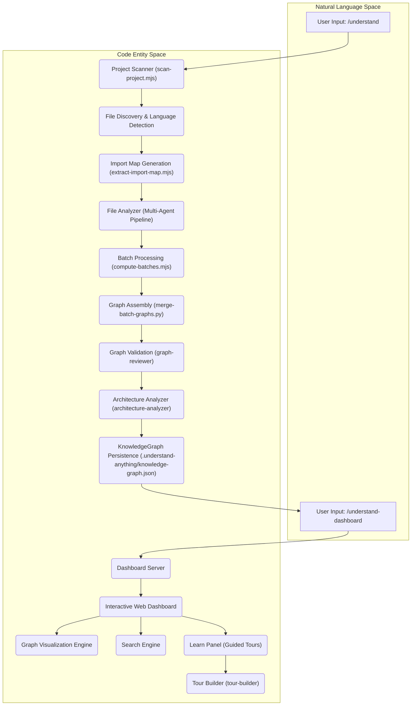
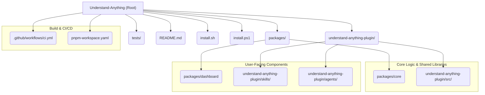

# Overview

<details>
<summary>Relevant source files</summary>

The following files were used as context for generating this wiki page:

- [.claude-plugin/marketplace.json](.claude-plugin/marketplace.json)
- [.claude-plugin/plugin.json](.claude-plugin/plugin.json)
- [.copilot-plugin/plugin.json](.copilot-plugin/plugin.json)
- [.cursor-plugin/plugin.json](.cursor-plugin/plugin.json)
- [.github/workflows/ci.yml](.github/workflows/ci.yml)
- [.gitignore](.gitignore)
- [.npmrc](.npmrc)
- [README.md](README.md)
- [READMEs/README.es-ES.md](READMEs/README.es-ES.md)
- [READMEs/README.ja-JP.md](READMEs/README.ja-JP.md)
- [READMEs/README.ko-KR.md](READMEs/README.ko-KR.md)
- [READMEs/README.tr-TR.md](READMEs/README.tr-TR.md)
- [READMEs/README.zh-CN.md](READMEs/README.zh-CN.md)
- [READMEs/README.zh-TW.md](READMEs/README.zh-TW.md)
- [install.ps1](install.ps1)
- [install.sh](install.sh)
- [package.json](package.json)
- [pnpm-workspace.yaml](pnpm-workspace.yaml)
- [tsconfig.json](tsconfig.json)
- [understand-anything-plugin/.claude-plugin/plugin.json](understand-anything-plugin/.claude-plugin/plugin.json)
- [understand-anything-plugin/package.json](understand-anything-plugin/package.json)

</details>


Understand Anything is an AI-powered plugin designed to transform any codebase, knowledge base, or documentation into an interactive knowledge graph. This graph allows users to explore, search, and ask questions about their projects, providing a comprehensive understanding of how different components fit together [README.md:3-5](). The system employs a multi-agent pipeline to analyze projects, building a detailed knowledge graph of files, functions, classes, and dependencies [README.md:46-47](). The output is then presented through an interactive dashboard for visual exploration [README.md:47-48]().

This page provides a high-level introduction to Understand Anything, its end-to-end workflow, the monorepo structure, and links to its major subsystems. It also covers installation, supported platforms, and key commands. For detailed instructions on installation and initial setup, refer to [Getting Started & Installation](#1.1). To understand the project's directory structure, see [Repository Structure & Monorepo Layout](#1.2). For a comprehensive list of available commands and their usage, consult the [Skills Reference](#1.3).

## How it Works: End-to-End Flow

Understand Anything operates through a multi-agent pipeline that processes a project and generates a knowledge graph. The core process involves scanning the project, extracting structural information, analyzing content, and then assembling this information into a navigable graph.

The process begins with the `/understand` command, which initiates the analysis. A multi-agent pipeline scans the project, extracts every file, function, class, and dependency, and then builds a knowledge graph saved to `.understand-anything/knowledge-graph.json` [README.md:119-120](). This graph can then be explored using the `/understand-dashboard` command, which launches an interactive web interface [README.md:140-143]().

### Diagram: Understand Anything End-to-End Flow


Sources: [README.md:46-48](), [README.md:119-120](), [README.md:140-143]()

## Monorepo Layout

The Understand Anything project is structured as a pnpm monorepo, which helps manage multiple interdependent packages within a single repository. This setup facilitates shared code, consistent tooling, and streamlined development workflows.

The primary packages include `@understand-anything/core` and `@understand-anything/dashboard`. The `understand-anything-plugin` directory contains the core logic for the plugin itself, including skills and agents [understand-anything-plugin/package.json:1-2]().

For a detailed breakdown of the repository's structure, including `packages/core`, `packages/dashboard`, `src/`, `skills/`, `agents/`, `hooks/`, and the root test suite, please refer to [Repository Structure & Monorepo Layout](#1.2).

### Diagram: Monorepo Structure


Sources: [pnpm-workspace.yaml:1-5](), [understand-anything-plugin/package.json:1-2](), [install.sh:1-200](), [install.ps1:1-198](), [README.md:1-37]()

## Installation and Supported Platforms

Understand Anything is designed to be highly compatible across various AI coding platforms. It can be installed as a plugin for environments like Claude Code, Cursor, Copilot, and other CLI-based AI assistants.

### Quick Start Installation

To get started, you typically add the plugin from a marketplace and then install it. For Claude Code, the commands are:
```bash
/plugin marketplace add Lum1104/Understand-Anything
/plugin install understand-anything
```
[README.md:109-111]()

For other platforms like Codex, OpenCode, Gemini CLI, and VS Code Copilot, a one-line installer script is provided for macOS/Linux and Windows [README.md:184-197](). This script clones the repository to `~/.understand-anything/repo` and creates symbolic links for the chosen platform [README.md:198-199]().

For detailed, step-by-step installation guides for each supported platform, including configuration and troubleshooting, please refer to [Getting Started & Installation](#1.1).

### Supported Platforms

Understand Anything supports a wide range of AI coding platforms:

*   **Claude Code**: Native support via marketplace [README.md:178-182]()
*   **Cursor**: Automatic discovery via `.cursor-plugin/plugin.json` [README.md:205-207]()
*   **VS Code + GitHub Copilot**: Automatic discovery via `.copilot-plugin/plugin.json` [README.md:211-213]()
*   **Copilot CLI**: Installation via `copilot plugin install` [README.md:217-219]()
*   **Codex, OpenCode, OpenClaw, Antigravity, Gemini CLI, Pi Agent, Vibe CLI, Hermes, Cline, KIMI CLI**: Supported via `install.sh` or `install.ps1` scripts [README.md:184-203]()

Sources: [README.md:109-111](), [README.md:178-219](), [.claude-plugin/plugin.json:1-18](), [.cursor-plugin/plugin.json:1-15](), [.copilot-plugin/plugin.json:1-14]()

## Key Commands and Skills

Understand Anything provides a suite of slash commands (skills) to interact with the codebase and the generated knowledge graph. These commands allow users to analyze, visualize, chat, and extract specific information.

The primary command is `/understand`, which triggers the project analysis and knowledge graph generation [README.md:116](). Once the graph is built, `/understand-dashboard` launches the interactive visualization [README.md:140]().

Other key commands include:
*   `/understand-chat`: Ask questions about the codebase [README.md:144-145]()
*   `/understand-diff`: Analyze the impact of current changes [README.md:147-148]()
*   `/understand-explain [file/function]`: Deep dive into a specific file or function [README.md:150-151]()
*   `/understand-onboard`: Generate an onboarding guide for new team members [README.md:153-154]()
*   `/understand-domain`: Extract business domain knowledge (domains, flows, steps) [README.md:156-157]()
*   `/understand-knowledge [path/to/wiki]`: Analyze a Karpathy-pattern LLM Wiki knowledge base [README.md:159-160]()

For a complete reference of all user-facing slash commands, their arguments, flags, and expected outputs, please refer to [Skills Reference](#1.3).

Sources: [README.md:116](), [README.md:140](), [README.md:144-160]()
