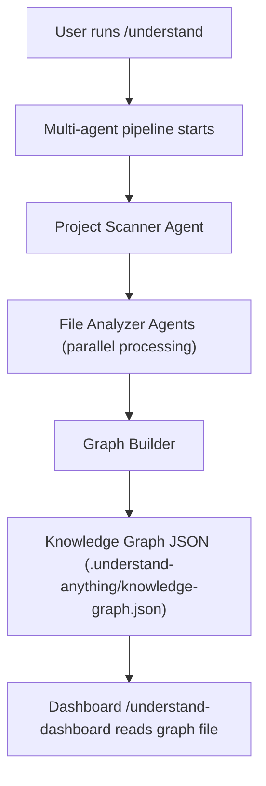
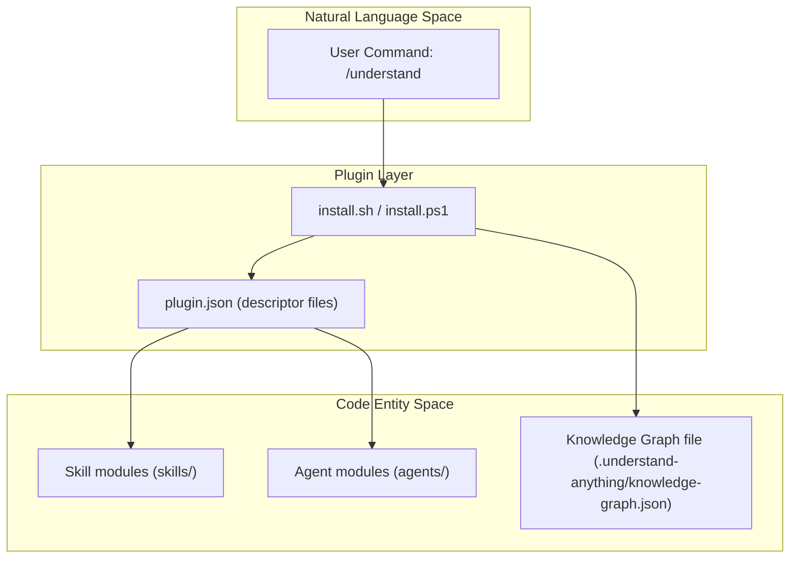

# Getting Started & Installation

<details>
<summary>Relevant source files</summary>

The following files were used as context for generating this wiki page:

- [.claude-plugin/marketplace.json](.claude-plugin/marketplace.json)
- [.claude-plugin/plugin.json](.claude-plugin/plugin.json)
- [.copilot-plugin/plugin.json](.copilot-plugin/plugin.json)
- [.cursor-plugin/plugin.json](.cursor-plugin/plugin.json)
- [.github/workflows/deploy-homepage.yml](.github/workflows/deploy-homepage.yml)
- [CONTRIBUTING.md](CONTRIBUTING.md)
- [README.md](README.md)
- [READMEs/README.es-ES.md](READMEs/README.es-ES.md)
- [READMEs/README.ja-JP.md](READMEs/README.ja-JP.md)
- [READMEs/README.ko-KR.md](READMEs/README.ko-KR.md)
- [READMEs/README.tr-TR.md](READMEs/README.tr-TR.md)
- [READMEs/README.zh-CN.md](READMEs/README.zh-CN.md)
- [READMEs/README.zh-TW.md](READMEs/README.zh-TW.md)
- [homepage/public/images/overview-domain.gif](homepage/public/images/overview-domain.gif)
- [homepage/public/images/overview-structural.gif](homepage/public/images/overview-structural.gif)
- [install.ps1](install.ps1)
- [install.sh](install.sh)
- [understand-anything-plugin/.claude-plugin/plugin.json](understand-anything-plugin/.claude-plugin/plugin.json)
- [understand-anything-plugin/package.json](understand-anything-plugin/package.json)

</details>


This section provides a comprehensive step-by-step guide to install and configure the **Understand Anything** plugin across various supported platforms, including macOS/Linux and Windows. Additionally, it covers initial usage and integration with popular AI coding environments like Claude Code, Cursor, GitHub Copilot, and others. It details how to run the initial `/understand` command, which launches the multi-agent analysis pipeline, and explains key implementation details for the installation scripts and plugin discovery mechanisms.

---

## 1. Introduction

**Understand Anything** is an AI-powered plugin designed to analyze any codebase, knowledge base, or documentation, and transform it into an interactive knowledge graph. It works across multiple AI platforms by integrating a multi-agent pipeline that extracts semantic structure from projects, builds a knowledge graph, and provides an interactive dashboard for exploration.

Supported platforms include:

- Claude Code (native plugin marketplace)
- Cursor
- GitHub Copilot (VS Code extension)
- Copilot CLI
- Codex, OpenCode, Gemini CLI, and various proprietary CLIs

This guide presents explicit installation instructions, how the installer scripts function internally, and an overview of plugin configuration files per platform.

---

## 2. Installation on macOS/Linux

### 2.1. One-line Installer (`install.sh`)

A shell script, `install.sh`, enables quick installation on macOS/Linux terminals. The installer:

- Clones the repository into the user’s home directory at `~/.understand-anything/repo`.
- Creates platform-specific symbolic links to the relevant plugin files.
- Supports direct platform argument to skip interactive selection.
- Supports update and uninstall commands.

#### Example installation command:

```bash
curl -fsSL https://raw.githubusercontent.com/Lum1104/Understand-Anything/main/install.sh | bash
```

Or, to specify a platform directly (e.g., `codex`):

```bash
curl -fsSL https://raw.githubusercontent.com/Lum1104/Understand-Anything/main/install.sh | bash -s codex
```

#### Usage options:

- `--update` : Update the existing cloned repository to latest.
- `--uninstall <platform>` : Remove installed symlinks for a given platform.

#### Installation flow:

1. Clone repo if not already present.
2. Create symbolic links in `~/.understand-anything/` pointing to the plugin directory matching the selected platform.
3. Notify user to restart their terminal or IDE session.

*The script automates this multi-step setup for seamless integration across different AI CLIs.*

---

## 3. Installation on Windows (PowerShell)

Windows users can install with the provided PowerShell one-liner executing `install.ps1`, which performs an equivalent operation:

```powershell
iwr -useb https://raw.githubusercontent.com/Lum1104/Understand-Anything/main/install.ps1 | iex
```

This script clones the repo to the same user-local path and sets up Windows symlinks or junctions as needed for the chosen platform.

Both install scripts handle:

- Fetching the latest stable release (`v2.7.6` at time of writing).
- Setting up environment and plugin registration files.
- Platform-specific configuration linkage.

---

## 4. Supported Platforms & Plugin Configuration

Each platform uses a plugin descriptor JSON inside a specialized folder for automatic discovery and integration.

| Platform      | Descriptor Path                      | Description                                                       |
|---------------|------------------------------------|------------------------------------------------------------------|
| Claude Code   | `.claude-plugin/plugin.json`       | Native plugin with metadata, version, and keywords.              |
| Cursor        | `.cursor-plugin/plugin.json`        | Cursor automatically detects this file when the repo is cloned. |
| VS Code + GitHub Copilot  | `.copilot-plugin/plugin.json`     | Auto-discovered by GitHub Copilot in VSCode post-installation.  |
| Copilot CLI   | `.copilot-plugin/plugin.json`      | Same descriptor used for CLI plugin registration.                 |

### Example plugin.json structure (common elements):

```json
{
  "name": "understand-anything",
  "description": "AI-powered codebase understanding — analyze, visualize, and explain any project",
  "version": "2.7.6",
  "author": {
    "name": "Lum1104"
  },
  "homepage": "https://github.com/Lum1104/Understand-Anything",
  "repository": "https://github.com/Lum1104/Understand-Anything",
  "license": "MIT",
  "keywords": [
    "codebase-analysis",
    "knowledge-graph",
    "architecture",
    "onboarding",
    "dashboard"
  ],
  "skills": "./understand-anything-plugin/skills/",
  "agents": "./understand-anything-plugin/agents/"
}
```

For Claude Code and Cursor, the repo is auto-registered by presence of this `plugin.json`.

---

## 5. Running the First `/understand` Command

After installation, launch the initial analysis of your project by running the command:

```bash
/understand
```

This triggers:

- Multi-agent pipeline execution that scans the project directory.
- Extraction of files, functions, classes, dependencies.
- Knowledge graph construction saved at `.understand-anything/knowledge-graph.json`.
- Localized output respects optional `--language` parameter (supported: `en`, `zh`, `zh-TW`, `ja`, `ko`, `ru`).

Example for generating Chinese content:

```bash
/understand --language zh
```

If running `/understand` for the first time without language override, it detects your conversation language and prompts for confirmation if not English. The choice stores in `.understand-anything/config.json`.

---

## 6. Plugin Command Invocation Flow & Data Movement

### Simplified flow of `/understand` command:



- The **Multi-agent pipeline** is a distributed process whereby different agents specialize in various phases such as scanning files, analyzing source code syntax, and merging intermediate results.
- The pipeline outputs a structured **Knowledge Graph** capturing code entities, relationships, and semantic summaries.
- The graph file is consumed by the dashboard UI for interactive exploration.

Sources: `README.md:104-148`, `.claude-plugin/plugin.json`, `.cursor-plugin/plugin.json`, `.copilot-plugin/plugin.json`.

---

## 7. Installer Scripts: Implementation Overview

### 7.1 `install.sh` (macOS/Linux)

- Clones repo into `~/.understand-anything/repo`.
- Displays an interactive prompt unless a platform argument is provided.
- Creates symlink in `~/.understand-anything` named after the chosen platform linking to the plugin source folder.
- Handles flags for update and uninstall.
- Ensures proper permissions and path environment assumptions.

### 7.2 `install.ps1` (Windows PowerShell)

- Equivalent to `install.sh`, adapted for Windows environment.
- Uses PowerShell commands such as `Invoke-WebRequest` to download, `New-Item` and `New-Item -ItemType Junction` or `SymbolicLink` for symlinks.
- Handles platform selection similarly and outputs guidance.

---

## 8. Platform-to-Code Entity Mapping Diagram

This diagram illustrates how natural language platform commands correspond to the code entities and files inside the repository.

```mermaid
flowchart LR
  subgraph "Natural Language Space"
    UC["/understand Command"]
    UD["/understand-dashboard Command"]
    US["/understand-skill Commands (chat, diff, explain…)"]
  end

  subgraph "Platform Plugin Layer"
    PC[".claude-plugin/plugin.json"]
    CC[ ".cursor-plugin/plugin.json" ]
    CP[ ".copilot-plugin/plugin.json" ]
  end

  subgraph "Repository Source Code"
    SK[ "understand-anything-plugin/skills/*" ]
    AG[ "understand-anything-plugin/agents/*" ]
    IS[ "install.sh & install.ps1" ]
  end

  UC --> PC
  UD --> PC
  US --> PC

  PC --> SK
  PC --> AG

  CC --> SK
  CC --> AG
  
  CP --> SK
  CP --> AG
  
  IS --> PC
  IS --> CC
  IS --> CP
```

---

## 9. Post Installation: Recommended Next Steps

1. **Restart your terminal or IDE**: To ensure the plugin paths and symlinks are loaded.
2. **Run `/understand`**: Kick off first codebase analysis in your project.
3. **Launch `/understand-dashboard`**: Open the interactive web-based dashboard to visualize and explore the knowledge graph.
4. **Explore other commands**: Such as `/understand-chat` for natural language Q&A, `/understand-diff` for change impact analysis, `/understand-explain` for deep dives.
5. **Configure continuous updates**: Optionally set up a post-commit hook or run `/understand --auto-update` for incremental graph maintenance.

---

## Summary

- **Installation supported across many platforms with one-line scripts for macOS/Linux and Windows.**
- **Platform-specific plugin descriptor JSON files enable automatic discovery by supported IDEs and CLIs.**
- **The `/understand` command launches a multi-agent pipeline for code analysis, generating a knowledge graph file locally.**
- **Interactive visualization is available via `/understand-dashboard`.**
- **Installer scripts automate cloning, linking, and configuration to minimize manual setup.**

---

# Appendix: Key File References

| Filename | Description |
|----------|--------------|
| `README.md:104-148` | Quick start commands and high-level installation instructions |
| `.claude-plugin/plugin.json:1-18` | Claude Code plugin descriptor metadata |
| `.cursor-plugin/plugin.json:1-15` | Cursor plugin descriptor for auto discovery |
| `.copilot-plugin/plugin.json:1-14` | GitHub Copilot plugin descriptor for VS Code |
| `install.sh` | Shell script to clone repo, create symlinks, and prepare plugin installation on macOS/Linux |
| `install.ps1` | PowerShell script for similar installation on Windows |

---

# Additional Mermaid Diagram

### Platform Invocation Command vs Code Entities Association



---

**Sources:**  
`README.md:104-148`  
`.claude-plugin/plugin.json`  
`.cursor-plugin/plugin.json`  
`.copilot-plugin/plugin.json`  
`install.sh`  
`install.ps1`
