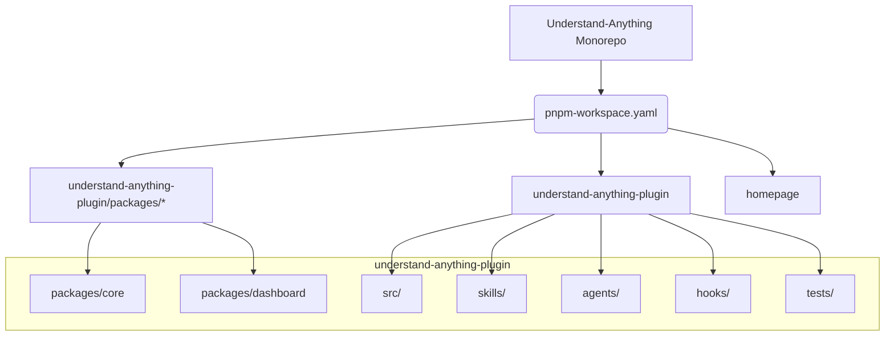
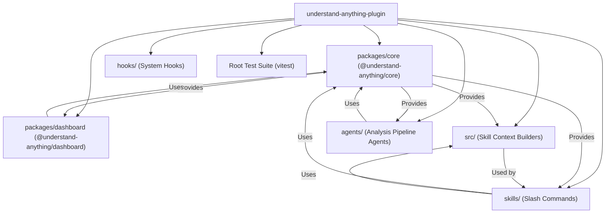
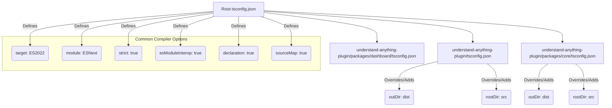

# Repository Structure & Monorepo Layout

<details>
<summary>Relevant source files</summary>

The following files were used as context for generating this wiki page:

- [.github/workflows/ci.yml](.github/workflows/ci.yml)
- [.gitignore](.gitignore)
- [.npmrc](.npmrc)
- [package.json](package.json)
- [pnpm-workspace.yaml](pnpm-workspace.yaml)
- [tsconfig.json](tsconfig.json)
- [understand-anything-plugin/packages/core/tsconfig.json](understand-anything-plugin/packages/core/tsconfig.json)
- [understand-anything-plugin/packages/core/vitest.config.ts](understand-anything-plugin/packages/core/vitest.config.ts)
- [understand-anything-plugin/tsconfig.json](understand-anything-plugin/tsconfig.json)

</details>


This page details the monorepo structure of the Understand Anything project, which is managed using pnpm workspaces. It outlines the organization of packages, core directories, build processes, TypeScript configurations, and ESLint setup.

## Monorepo Overview

The Understand Anything project is structured as a pnpm monorepo, enabling efficient management of multiple interdependent packages and applications. The `pnpm-workspace.yaml` file defines the workspace roots [pnpm-workspace.yaml:1-3]().

```yaml
# pnpm-workspace.yaml
packages:
  - 'understand-anything-plugin/packages/*'
  - 'understand-anything-plugin'
  - 'homepage'
```
Sources: [pnpm-workspace.yaml:1-3]()

This configuration indicates three main workspace roots:
1.  `understand-anything-plugin/packages/*`: This glob pattern includes all subdirectories within `understand-anything-plugin/packages/` as individual pnpm packages. This is where shared libraries and core components reside.
2.  `understand-anything-plugin`: This refers to the main plugin directory itself, which likely contains the primary application logic and entry points for the Understand Anything tool.
3.  `homepage`: This refers to the project's marketing website.

### Diagram: Monorepo Workspace Layout


Sources: [pnpm-workspace.yaml:1-3]()

## Core Directories and Packages

The primary functional components of the Understand Anything tool are located within the `understand-anything-plugin` directory. This directory contains several key subdirectories and pnpm packages:

### `packages/core`

This directory (`understand-anything-plugin/packages/core`) houses the `@understand-anything/core` package. This is a shared TypeScript library containing fundamental types, schema validation, graph construction logic, search capabilities, persistence mechanisms, and the plugin architecture. It is a critical dependency for other parts of the system.

### `packages/dashboard`

This directory (`understand-anything-plugin/packages/dashboard`) contains the `@understand-anything/dashboard` package. This is a React-based interactive visualization dashboard that provides a graphical interface for exploring the generated Knowledge Graphs. It includes the Vite development server with a data API middleware.

### `src/`

The `src/` directory (`understand-anything-plugin/src/`) contains TypeScript modules responsible for building context for various skills. These modules, such as `context-builder`, `diff-analyzer`, and `explain-builder`, are crucial for generating relevant information for LLM interactions and user queries.

### `skills/`

This directory (`understand-anything-plugin/skills/`) likely contains the implementations of the various user-facing slash commands (e.g., `/understand`, `/understand-dashboard`). These scripts orchestrate the use of the core library and other components to perform specific tasks.

### `agents/`

The `agents/` directory (`understand-anything-plugin/agents/`) is expected to contain the logic for the multi-agent pipeline that transforms a codebase into a KnowledgeGraph. This includes agents like `project-scanner` and `file-analyzer`.

### `hooks/`

The `hooks/` directory (`understand-anything-plugin/hooks/`) manages the system's hooks, such as `hooks.json`, which define triggers for actions like `PostToolUse` and `SessionStart`. It also relates to the auto-update mechanism.

### Root Test Suite

The root `package.json` defines a `test` script that runs `vitest run` [package.json:32](). This command executes tests across the entire monorepo, ensuring the integrity of all components. Individual packages may also have their own test configurations, such as `understand-anything-plugin/packages/core/vitest.config.ts` [understand-anything-plugin/packages/core/vitest.config.ts:1-7]().

### Diagram: `understand-anything-plugin` Internal Structure


Sources: [pnpm-workspace.yaml:1-3](), [package.json:32](), [understand-anything-plugin/packages/core/vitest.config.ts:1-7]()

## Build Commands

The monorepo leverages pnpm's workspace capabilities for building.

*   **`pnpm prepare`**: This script is executed automatically after `pnpm install`. It specifically builds the `@understand-anything/core` package [package.json:30](). This ensures that the core library is always built and ready for use by other packages.
*   **`pnpm build`**: This command runs `pnpm -r build` [package.json:31](), which executes the `build` script in all packages within the monorepo that define one. This is the primary command for building the entire project.
*   **`pnpm dev:dashboard`**: This script specifically starts the development server for the `@understand-anything/dashboard` package [package.json:33]().

The CI workflow (`.github/workflows/ci.yml`) also includes explicit build steps for `core` and `skill` (which refers to `understand-anything-plugin`) [.github/workflows/ci.yml:40-45]().

```yaml
# .github/workflows/ci.yml
      - name: Build core
        run: pnpm --filter @understand-anything/core build

      - name: Build skill
        run: pnpm --filter @understand-anything/skill build
```
Sources: [package.json:30-33](), [.github/workflows/ci.yml:40-45]()

## TypeScript Configuration

The project uses TypeScript extensively. There are several `tsconfig.json` files:

*   **Root `tsconfig.json`**: This file defines the base TypeScript compiler options for the entire project [tsconfig.json:1-16](). Key options include:
    *   `target: "ES2022"`: Specifies the ECMAScript target version.
    *   `module: "ESNext"`: Specifies the module system.
    *   `lib: ["ES2022"]`: Includes standard library definitions.
    *   `strict: true`: Enables all strict type-checking options.
    *   `esModuleInterop: true`: Enables compatibility with CommonJS modules.
    *   `declaration: true`, `declarationMap: true`, `sourceMap: true`: Generates declaration files and source maps for better debugging and library usage.

*   **Package-specific `tsconfig.json`**: Packages like `@understand-anything/core` have their own `tsconfig.json` files (e.g., `understand-anything-plugin/packages/core/tsconfig.json`) [understand-anything-plugin/packages/core/tsconfig.json:1-19](). These files typically extend or override the root configuration and specify `outDir` and `rootDir` for their specific build outputs. For example, `packages/core` outputs to `dist` from `src` [understand-anything-plugin/packages/core/tsconfig.json:15-16](). The `understand-anything-plugin` root also has its own `tsconfig.json` [understand-anything-plugin/tsconfig.json:1-19]().

### Diagram: TypeScript Configuration Inheritance


Sources: [tsconfig.json:1-16](), [understand-anything-plugin/packages/core/tsconfig.json:1-19](), [understand-anything-plugin/tsconfig.json:1-19]()

## ESLint Setup

ESLint is used for code linting to maintain code quality and consistency. The root `package.json` defines a `lint` script that runs `eslint .` [package.json:34](). The development dependencies include `@eslint/js`, `eslint`, `globals`, and `typescript-eslint` [package.json:37-41](), indicating a modern ESLint setup with TypeScript support. The CI workflow also includes a linting step [.github/workflows/ci.yml:38]().

```yaml
# .github/workflows/ci.yml
      - name: Lint
        run: pnpm lint
```
Sources: [package.json:34](), [package.json:37-41](), [.github/workflows/ci.yml:38]()

## pnpm Configuration

The `.npmrc` file contains pnpm-specific configurations [.npmrc:1-2]():
*   `shamefully-hoist=false`: This prevents pnpm from hoisting all dependencies to the root `node_modules` directory, ensuring a stricter dependency graph and avoiding "phantom dependencies."
*   `strict-peer-dependencies=false`: This relaxes peer dependency checks, which can be useful in monorepos where peer dependencies might not always be perfectly aligned across all packages.

The root `package.json` also specifies `pnpm.onlyBuiltDependencies` [package.json:44-59](). This configuration ensures that certain native modules or complex dependencies are only built when explicitly required, optimizing installation times and avoiding unnecessary compilation.

```json
// package.json
  "pnpm": {
    "onlyBuiltDependencies": [
      "esbuild",
      "sharp",
      "tree-sitter-c",
      "tree-sitter-c-sharp",
      "tree-sitter-cpp",
      "tree-sitter-go",
      "tree-sitter-java",
      "tree-sitter-javascript",
      "tree-sitter-php",
      "tree-sitter-python",
      "tree-sitter-ruby",
      "tree-sitter-rust",
      "tree-sitter-typescript"
    ]
  }
```
Sources: [.npmrc:1-2](), [package.json:44-59]()

## Ignored Files

The `.gitignore` file specifies files and directories that should be ignored by Git [.gitignore:1-20](). This includes common build outputs (`node_modules`, `dist`), temporary files (`.DS_Store`, `*.tsbuildinfo`), environment files (`.env`), cache directories (`coverage/`, `__pycache__/`), and specific tool-related directories (`.claude/`, `.worktrees/`). It also includes a `.private/` directory, suggesting a place for sensitive or local-only files.

Sources: [.gitignore:1-20]()
