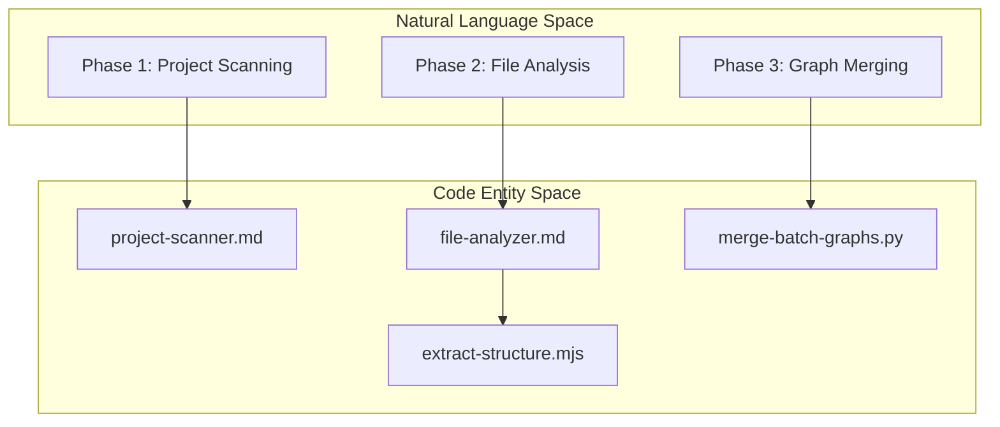
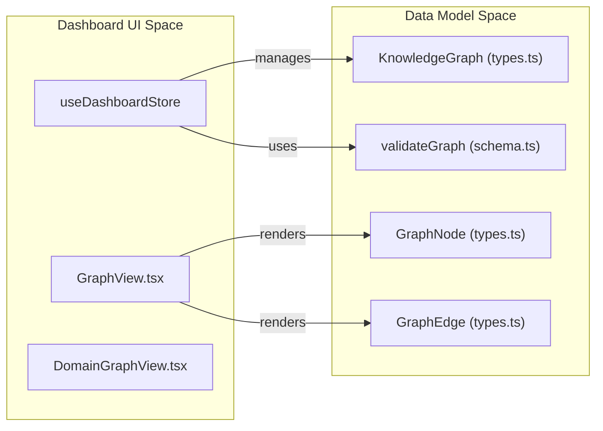

# Glossary

Relevant source files

The following files were used as context for generating this wiki page:

- [CLAUDE.md](CLAUDE.md)
- [README.md](README.md)
- [READMEs/README.es-ES.md](READMEs/README.es-ES.md)
- [READMEs/README.ja-JP.md](READMEs/README.ja-JP.md)
- [READMEs/README.ko-KR.md](READMEs/README.ko-KR.md)
- [READMEs/README.tr-TR.md](READMEs/README.tr-TR.md)
- [READMEs/README.zh-CN.md](READMEs/README.zh-CN.md)
- [READMEs/README.zh-TW.md](READMEs/README.zh-TW.md)
- [install.ps1](install.ps1)
- [install.sh](install.sh)
- [understand-anything-plugin/agents/architecture-analyzer.md](understand-anything-plugin/agents/architecture-analyzer.md)
- [understand-anything-plugin/agents/article-analyzer.md](understand-anything-plugin/agents/article-analyzer.md)
- [understand-anything-plugin/agents/assemble-reviewer.md](understand-anything-plugin/agents/assemble-reviewer.md)
- [understand-anything-plugin/agents/domain-analyzer.md](understand-anything-plugin/agents/domain-analyzer.md)
- [understand-anything-plugin/agents/file-analyzer.md](understand-anything-plugin/agents/file-analyzer.md)
- [understand-anything-plugin/agents/graph-reviewer.md](understand-anything-plugin/agents/graph-reviewer.md)
- [understand-anything-plugin/agents/knowledge-graph-guide.md](understand-anything-plugin/agents/knowledge-graph-guide.md)
- [understand-anything-plugin/agents/project-scanner.md](understand-anything-plugin/agents/project-scanner.md)
- [understand-anything-plugin/agents/tour-builder.md](understand-anything-plugin/agents/tour-builder.md)
- [understand-anything-plugin/hooks/auto-update-prompt.md](understand-anything-plugin/hooks/auto-update-prompt.md)
- [understand-anything-plugin/hooks/hooks.json](understand-anything-plugin/hooks/hooks.json)
- [understand-anything-plugin/packages/core/src/__tests__/change-classifier.test.ts](understand-anything-plugin/packages/core/src/__tests__/change-classifier.test.ts)
- [understand-anything-plugin/packages/core/src/__tests__/domain-persistence.test.ts](understand-anything-plugin/packages/core/src/__tests__/domain-persistence.test.ts)
- [understand-anything-plugin/packages/core/src/__tests__/domain-types.test.ts](understand-anything-plugin/packages/core/src/__tests__/domain-types.test.ts)
- [understand-anything-plugin/packages/core/src/__tests__/fingerprint.test.ts](understand-anything-plugin/packages/core/src/__tests__/fingerprint.test.ts)
- [understand-anything-plugin/packages/core/src/__tests__/plugin-discovery.test.ts](understand-anything-plugin/packages/core/src/__tests__/plugin-discovery.test.ts)
- [understand-anything-plugin/packages/core/src/__tests__/schema.test.ts](understand-anything-plugin/packages/core/src/__tests__/schema.test.ts)
- [understand-anything-plugin/packages/core/src/fingerprint.ts](understand-anything-plugin/packages/core/src/fingerprint.ts)
- [understand-anything-plugin/packages/core/src/persistence/index.ts](understand-anything-plugin/packages/core/src/persistence/index.ts)
- [understand-anything-plugin/packages/core/src/persistence/persistence.test.ts](understand-anything-plugin/packages/core/src/persistence/persistence.test.ts)
- [understand-anything-plugin/packages/core/src/plugins/tree-sitter-plugin.ts](understand-anything-plugin/packages/core/src/plugins/tree-sitter-plugin.ts)
- [understand-anything-plugin/packages/core/src/schema.ts](understand-anything-plugin/packages/core/src/schema.ts)
- [understand-anything-plugin/packages/core/src/types.test.ts](understand-anything-plugin/packages/core/src/types.test.ts)
- [understand-anything-plugin/packages/core/src/types.ts](understand-anything-plugin/packages/core/src/types.ts)
- [understand-anything-plugin/packages/dashboard/src/App.tsx](understand-anything-plugin/packages/dashboard/src/App.tsx)
- [understand-anything-plugin/packages/dashboard/src/components/CustomNode.tsx](understand-anything-plugin/packages/dashboard/src/components/CustomNode.tsx)
- [understand-anything-plugin/packages/dashboard/src/components/GraphView.tsx](understand-anything-plugin/packages/dashboard/src/components/GraphView.tsx)
- [understand-anything-plugin/packages/dashboard/src/components/NodeInfo.tsx](understand-anything-plugin/packages/dashboard/src/components/NodeInfo.tsx)
- [understand-anything-plugin/packages/dashboard/src/store.ts](understand-anything-plugin/packages/dashboard/src/store.ts)
- [understand-anything-plugin/skills/understand/SKILL.md](understand-anything-plugin/skills/understand/SKILL.md)
- [understand-anything-plugin/skills/understand/merge-batch-graphs.py](understand-anything-plugin/skills/understand/merge-batch-graphs.py)
- [understand-anything-plugin/skills/understand/merge-subdomain-graphs.py](understand-anything-plugin/skills/understand/merge-subdomain-graphs.py)

This page defines the technical terms, jargon, and domain-specific concepts used throughout the Understand Anything codebase. It serves as a reference for onboarding engineers to understand the mapping between abstract concepts and concrete code implementations.

## Core Concepts

### Knowledge Graph
The central data structure representing the project. It is a directed graph where nodes represent entities (files, functions, classes, etc.) and edges represent relationships (calls, imports, depends_on).
*   **Implementation:** Defined as the `KnowledgeGraph` interface in [understand-anything-plugin/packages/core/src/types.ts:161-175]().
*   **Validation:** Managed via Zod schema in [understand-anything-plugin/packages/core/src/schema.ts:182-205]().

### Node Types
Entities within the graph are categorized into specific types.
*   **Code Entities:** `file`, `function`, `class`, `module`, `concept`.
*   **Infrastructure:** `service`, `resource`, `pipeline`.
*   **Data:** `table`, `endpoint`, `schema`.
*   **Domain:** `domain`, `flow`, `step`.
*   **Knowledge:** `article`, `entity`, `topic`, `claim`, `source`.
*   **Source:** Defined in the `NodeType` enum [understand-anything-plugin/packages/core/src/types.ts:7-31]().

### Edge Categories
Edges are grouped into logical categories for filtering in the Dashboard.
*   **Structural:** `imports`, `contains`, `inherits`.
*   **Behavioral:** `calls`, `subscribes`.
*   **Data Flow:** `reads_from`, `writes_to`.
*   **Source:** Mapped in `EDGE_CATEGORY_MAP` [understand-anything-plugin/packages/dashboard/src/store.ts:31-40]().

---

## Analysis Pipeline Terms

### Multi-Agent Pipeline
The process of transforming raw code into a Knowledge Graph using specialized LLM agents (e.g., `file-analyzer`, `architecture-analyzer`).
*   **Source:** Described in the Analysis Pipeline overview [understand-anything-plugin/skills/understand/SKILL.md:23-40]().

### Phase Transitions
The analysis is divided into 8 distinct phases (0-7).
*   **Phase 1 (Scanner):** File discovery and language detection [understand-anything-plugin/agents/project-scanner.md:1-15]().
*   **Phase 2 (Analyzer):** Parallel batch processing of files [understand-anything-plugin/agents/file-analyzer.md:8-25]().
*   **Phase 3 (Merge):** Canonicalization of IDs and merging batch results [understand-anything-plugin/skills/understand/merge-batch-graphs.py:3-19]().

### Batching
To handle large codebases, files are grouped into batches for parallel processing by `file-analyzer` agents.
*   **Source:** Handled by the dispatcher logic described in [understand-anything-plugin/agents/file-analyzer.md:31-52]().

### ID Normalization
The process of ensuring every node has a unique, canonical string ID (e.g., `function:src/utils.ts:formatDate`).
*   **Implementation:** The `normalize_node_id` function in [understand-anything-plugin/skills/understand/merge-batch-graphs.py:178-205]().

---

## Technical Mapping: Space Association

The following diagrams bridge the gap between high-level system concepts and the actual code entities.

### Diagram 1: Analysis Pipeline to Code Entities
This diagram shows how the conceptual phases of analysis map to specific scripts and agent definitions.

**Sources:** [understand-anything-plugin/agents/project-scanner.md:1-10](), [understand-anything-plugin/agents/file-analyzer.md:1-10](), [understand-anything-plugin/skills/understand/merge-batch-graphs.py:1-10]().

### Diagram 2: Dashboard State to Data Models
This diagram shows how the Dashboard UI state (Zustand) interacts with the core data types.

**Sources:** [understand-anything-plugin/packages/dashboard/src/store.ts:100-110](), [understand-anything-plugin/packages/dashboard/src/components/GraphView.tsx:26-32](), [understand-anything-plugin/packages/core/src/types.ts:161-175](), [understand-anything-plugin/packages/core/src/schema.ts:182-190]().

---

## Dashboard Jargon

### ELK Layout
The layout engine used to position nodes in the graph. It uses the Eclipse Layout Kernel (ELK).
*   **Implementation:** `applyElkLayout` in [understand-anything-plugin/packages/dashboard/src/components/GraphView.tsx:45]().

### Persona-Adaptive UI
The ability of the dashboard to change the detail level (e.g., hiding private functions) based on the user's role.
*   **Roles:** `non-technical`, `junior`, `experienced` [understand-anything-plugin/packages/dashboard/src/store.ts:12]().

### Focus Mode
A UI state that isolates a specific node and its "1-hop" neighbors (direct connections) to reduce visual noise.
*   **Implementation:** `focusNodeId` in [understand-anything-plugin/packages/dashboard/src/store.ts:134]().

### Layer Cluster
A visual grouping of nodes belonging to the same architectural layer (e.g., "API Layer").
*   **Implementation:** `LayerClusterNode` component in [understand-anything-plugin/packages/dashboard/src/components/GraphView.tsx:19]().

---

## Domain & Knowledge Terms

### Karpathy-pattern Wiki
A specific format for LLM-readable wikis (using `index.md` for structure) that the system can parse into a Knowledge Graph.
*   **Source:** Referenced in [README.md:67]().

### Domain Meta
Metadata describing business domains, business flows, and individual steps.
*   **Implementation:** Defined in `DomainMeta` within [understand-anything-plugin/packages/core/src/types.ts:177-185]().

### Fingerprinting
A hashing mechanism used to detect if a file has changed, determining if an incremental update is needed.
*   **Implementation:** `FileFingerprint` in [understand-anything-plugin/packages/core/src/fingerprint.ts]().

---

## Abbreviations Table

| Abbreviation | Full Term | Context |
| :--- | :--- | :--- |
| **KG** | Knowledge Graph | The primary data output. |
| **PR** | Project Root | The absolute path to the analyzed project. |
| **AST** | Abstract Syntax Tree | Used by `tree-sitter` for structural extraction. |
| **RAF** | Request Animation Frame | Used in `GraphView` for smooth zooming [understand-anything-plugin/packages/dashboard/src/components/GraphView.tsx:132](). |
| **Zod** | Zod Schema | The library used for graph validation [understand-anything-plugin/packages/core/src/schema.ts](). |

**Sources:**
- [understand-anything-plugin/packages/core/src/types.ts]()
- [understand-anything-plugin/packages/core/src/schema.ts]()
- [understand-anything-plugin/packages/dashboard/src/store.ts]()
- [understand-anything-plugin/packages/dashboard/src/components/GraphView.tsx]()
- [understand-anything-plugin/skills/understand/merge-batch-graphs.py]()
- [understand-anything-plugin/agents/file-analyzer.md]()
- [understand-anything-plugin/agents/project-scanner.md]()
