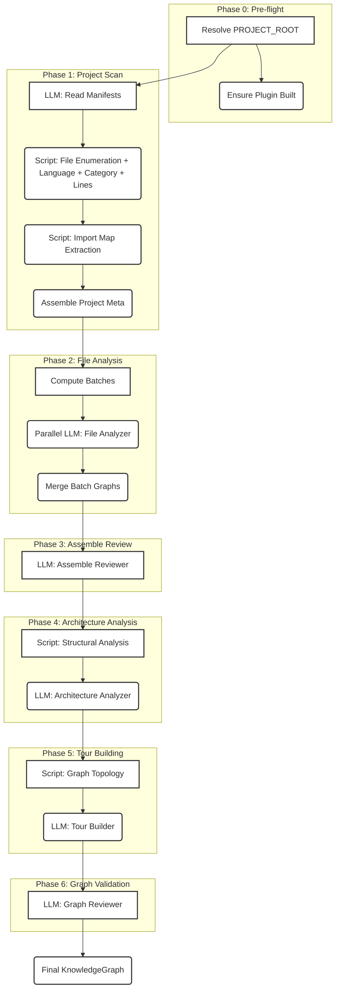
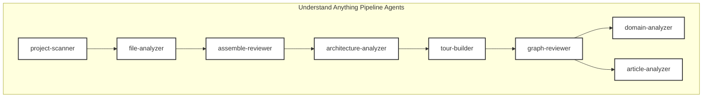
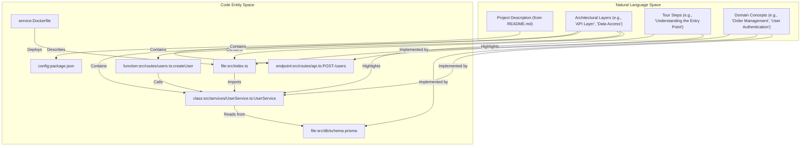
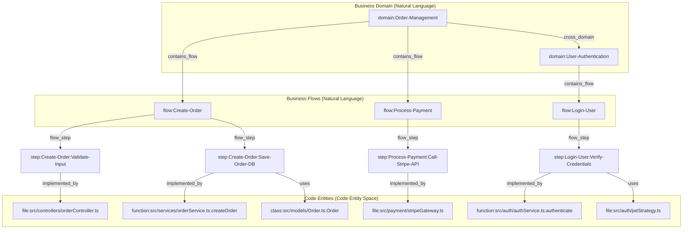

# Analysis Pipeline

Relevant source files

The following files were used as context for generating this wiki page:

- [CLAUDE.md](CLAUDE.md)
- [understand-anything-plugin/agents/architecture-analyzer.md](understand-anything-plugin/agents/architecture-analyzer.md)
- [understand-anything-plugin/agents/article-analyzer.md](understand-anything-plugin/agents/article-analyzer.md)
- [understand-anything-plugin/agents/assemble-reviewer.md](understand-anything-plugin/agents/assemble-reviewer.md)
- [understand-anything-plugin/agents/domain-analyzer.md](understand-anything-plugin/agents/domain-analyzer.md)
- [understand-anything-plugin/agents/file-analyzer.md](understand-anything-plugin/agents/file-analyzer.md)
- [understand-anything-plugin/agents/graph-reviewer.md](understand-anything-plugin/agents/graph-reviewer.md)
- [understand-anything-plugin/agents/knowledge-graph-guide.md](understand-anything-plugin/agents/knowledge-graph-guide.md)
- [understand-anything-plugin/agents/project-scanner.md](understand-anything-plugin/agents/project-scanner.md)
- [understand-anything-plugin/agents/tour-builder.md](understand-anything-plugin/agents/tour-builder.md)
- [understand-anything-plugin/skills/understand/SKILL.md](understand-anything-plugin/skills/understand/SKILL.md)
- [understand-anything-plugin/skills/understand/merge-batch-graphs.py](understand-anything-plugin/skills/understand/merge-batch-graphs.py)
- [understand-anything-plugin/skills/understand/merge-subdomain-graphs.py](understand-anything-plugin/skills/understand/merge-subdomain-graphs.py)

The Understand Anything analysis pipeline transforms a codebase into a rich, interactive KnowledgeGraph. This process involves a multi-agent system that orchestrates several phases, combining deterministic static analysis with LLM-driven semantic understanding. The pipeline is designed to be robust, scalable, and capable of handling diverse codebases.

This page provides a high-level overview of the seven phases, the roles of the agents involved, and the strategic split between deterministic and LLM-based processing. For detailed technical information on each phase, refer to the linked child pages.

## Pipeline Overview

The `/understand` skill orchestrates the entire analysis process, reporting progress at each phase transition and during batch processing [understand-anything-plugin/skills/understand/SKILL.md:22-39](). The pipeline consists of seven main phases, starting from pre-flight checks and culminating in a fully assembled and validated KnowledgeGraph.

### Deterministic vs. LLM Processing

A core design principle of the pipeline is to leverage the strengths of both deterministic algorithms and Large Language Models (LLMs).
- **Deterministic steps** handle tasks that require precision, speed, and consistency, such as file enumeration, language detection, structural parsing (via Tree-sitter), import resolution, and graph merging. These steps are implemented as dedicated scripts (e.g., `scan-project.mjs`, `extract-import-map.mjs`, `merge-batch-graphs.py`) [understand-anything-plugin/agents/project-scanner.md:15-17]().
- **LLM-driven steps** are reserved for tasks requiring semantic understanding, summarization, architectural reasoning, and pedagogical tour generation. Agents like `file-analyzer`, `architecture-analyzer`, and `tour-builder` utilize LLMs for these complex tasks [understand-anything-plugin/agents/file-analyzer.md:1-6](), [understand-anything-plugin/agents/architecture-analyzer.md:1-6](), [understand-anything-plugin/agents/tour-builder.md:1-6]().

This hybrid approach ensures accuracy and efficiency while maximizing the semantic richness of the generated KnowledgeGraph.

## The Seven Phases

The analysis pipeline is structured into seven distinct phases, each building upon the output of the previous one.

Sources: [understand-anything-plugin/skills/understand/SKILL.md:41-42]()

### Phase 0: Pre-flight

This initial phase handles setup and environment checks. It involves resolving the `PROJECT_ROOT` and ensuring the plugin's core components are built and ready for execution. It also includes logic for handling git worktrees to ensure consistent output locations [understand-anything-plugin/skills/understand/SKILL.md:42-120]().

### Phase 1: Project Scan

The project scan phase inventories the codebase. It combines LLM analysis of manifest files (like `package.json` or `go.mod`) for narrative metadata with deterministic scripts for file enumeration, language detection, categorization, and import map generation. This phase produces a comprehensive `ProjectMeta` object and an `importMap` [understand-anything-plugin/agents/project-scanner.md:21-22]().

For details, see [Project Scanner & File Discovery](#2.1).

### Phase 2: File Analysis

In this phase, individual files are analyzed to extract structural and semantic information. Files are grouped into batches and processed in parallel by `file-analyzer` subagents. Each subagent uses a bundled script for deterministic structural extraction (e.g., functions, classes, call graphs via Tree-sitter) and then an LLM for semantic summarization, tagging, and complexity assessment [understand-anything-plugin/agents/file-analyzer.md:11-17](). The results from all batches are then merged.

For details, see [File Analyzer & Batch Processing](#2.2).

### Phase 3: Assemble Review

After individual file analyses are merged, the `assemble-reviewer` agent performs a critical review. This LLM-driven phase addresses semantic issues that deterministic merging cannot resolve, such as recovering dropped nodes or edges and filling cross-batch gaps using the generated `importMap` [understand-anything-plugin/agents/assemble-reviewer.md:1-6]().

For details, see [Graph Assembly & Validation](#2.3).

### Phase 4: Architecture Analysis

The `architecture-analyzer` agent identifies logical architectural layers within the codebase. It uses a script to compute structural patterns from the import graph and file paths, then an LLM to interpret these patterns and assign every file node to exactly one layer. This provides a high-level view of the project's organization [understand-anything-plugin/agents/architecture-analyzer.md:1-6]().

For details, see [Graph Assembly & Validation](#2.3) and [Tour Builder & Architecture Analyzer](#2.4).

### Phase 5: Tour Building

The `tour-builder` agent designs guided learning paths through the codebase. It uses a script to analyze graph topology (fan-in/fan-out, entry points, dependency chains) and then an LLM to create a pedagogical sequence of 5-15 steps. Each step highlights key nodes and concepts, providing a coherent narrative for understanding the project [understand-anything-plugin/agents/tour-builder.md:1-6]().

For details, see [Tour Builder & Architecture Analyzer](#2.4).

### Phase 6: Graph Validation

The final phase involves the `graph-reviewer` agent, which rigorously validates the assembled KnowledgeGraph for correctness, completeness, and quality. It performs systematic checks against the schema, referential integrity, and other quality metrics, providing a structured validation report [understand-anything-plugin/agents/graph-reviewer.md:1-6]().

For details, see [Graph Assembly & Validation](#2.3).

## Agent Roles

The pipeline employs several specialized agents, each with a distinct role in transforming the codebase into a KnowledgeGraph.

Sources: [CLAUDE.md:17-18]()

- **`project-scanner`**: Scans the codebase, enumerates files, detects languages, applies `.understandignore` filters, and generates an `importMap` and `ProjectMeta` [understand-anything-plugin/agents/project-scanner.md:1-6]().
- **`file-analyzer`**: Analyzes batches of source files, extracting structural data via Tree-sitter and generating semantic summaries, tags, and relationships using an LLM [understand-anything-plugin/agents/file-analyzer.md:1-6]().
- **`assemble-reviewer`**: Reviews the merged output from `file-analyzer` batches, correcting semantic issues, recovering dropped nodes/edges, and filling cross-batch gaps [understand-anything-plugin/agents/assemble-reviewer.md:1-6]().
- **`architecture-analyzer`**: Identifies logical architectural layers and assigns file nodes to them based on structural patterns and semantic interpretation [understand-anything-plugin/agents/architecture-analyzer.md:1-6]().
- **`tour-builder`**: Designs guided learning tours through the codebase, creating pedagogical steps that explain architecture and key concepts [understand-anything-plugin/agents/tour-builder.md:1-6]().
- **`graph-reviewer`**: Validates the final KnowledgeGraph for correctness, completeness, and quality against a predefined schema and integrity rules [understand-anything-plugin/agents/graph-reviewer.md:1-6]().
- **`domain-analyzer`**: (Used by `/understand-domain` skill) Extracts business domain knowledge, including domains, business flows, and process steps, producing a `domain-graph.json` [understand-anything-plugin/agents/domain-analyzer.md:1-6]().
- **`article-analyzer`**: (Used by `/understand-knowledge` skill) Parses wiki-like articles to extract entities, claims, and relationships, forming a knowledge base.

## Bridging Natural Language and Code Entities

The pipeline effectively bridges the gap between natural language descriptions and concrete code entities. This is achieved by associating high-level concepts and architectural layers with specific files, functions, and other code elements.

Sources: [understand-anything-plugin/agents/knowledge-graph-guide.md:35-54](), [understand-anything-plugin/agents/knowledge-graph-guide.md:56-66]()

The `architecture-analyzer` assigns file-level nodes (e.g., `file:src/routes/index.ts`, `config:tsconfig.json`, `document:README.md`, `service:Dockerfile`) to specific architectural layers [understand-anything-plugin/agents/architecture-analyzer.md:30-37](). Similarly, the `tour-builder` links natural language tour steps to concrete `nodeIds` within the graph [understand-anything-plugin/agents/tour-builder.md:78-87]().

The `domain-analyzer` further extends this by mapping business domain concepts (`domain:order-management`, `flow:create-order`, `step:validate-input`) to the underlying code files and functions that implement them [understand-anything-plugin/agents/domain-analyzer.md:48-83]().

Sources: [understand-anything-plugin/agents/domain-analyzer.md:39-88](), [understand-anything-plugin/agents/knowledge-graph-guide.md:83-88]()

## Domain & Knowledge Graph Skills

Beyond the core structural analysis, the pipeline supports specialized skills for extracting domain-specific and general knowledge.

- **`/understand-domain`**: This skill leverages the `domain-analyzer` agent to extract business domain knowledge from the codebase. It identifies domains, business flows, and process steps, producing a `domain-graph.json` that maps how business logic flows through the code [understand-anything-plugin/agents/domain-analyzer.md:1-6](). This graph uses specific node types like `domain`, `flow`, and `step` [understand-anything-plugin/agents/knowledge-graph-guide.md:52-54]().

- **`/understand-knowledge`**: This skill (powered by the `article-analyzer` agent) is designed to parse wiki-like articles or other textual knowledge bases within the repository. It extracts entities, claims, and relationships, integrating them into the KnowledgeGraph as `article`, `entity`, `topic`, `claim`, and `source` nodes [understand-anything-plugin/skills/understand/merge-batch-graphs.py:37-39]().

For details, see [Domain & Knowledge Graph Skills](#2.5).
