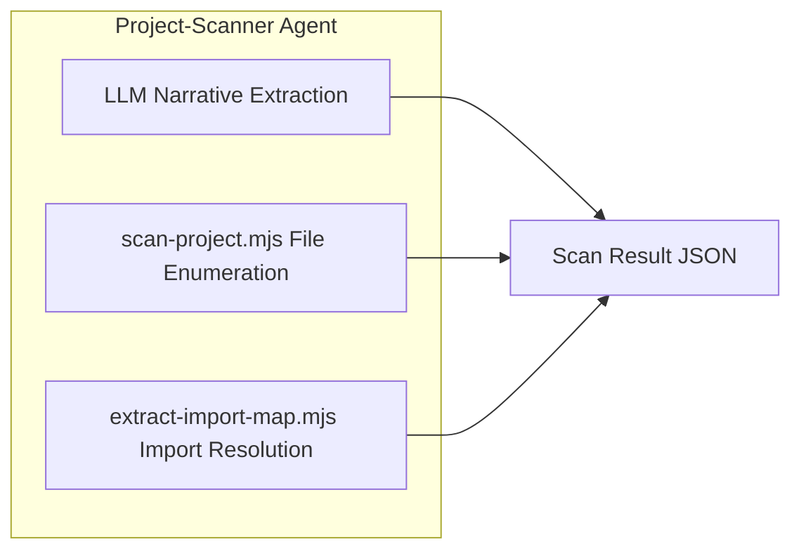
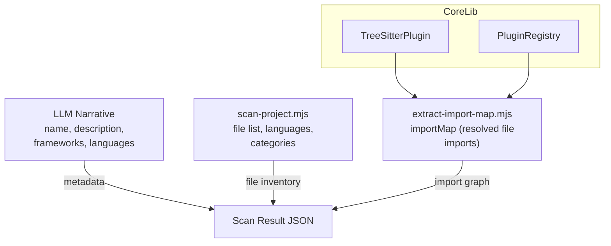

# Project Scanner & File Discovery

<details>
<summary>Relevant source files</summary>

The following files were used as context for generating this wiki page:

- [CLAUDE.md](CLAUDE.md)
- [tests/skill/understand/test_extract_import_map.test.mjs](tests/skill/understand/test_extract_import_map.test.mjs)
- [understand-anything-plugin/agents/architecture-analyzer.md](understand-anything-plugin/agents/architecture-analyzer.md)
- [understand-anything-plugin/agents/article-analyzer.md](understand-anything-plugin/agents/article-analyzer.md)
- [understand-anything-plugin/agents/assemble-reviewer.md](understand-anything-plugin/agents/assemble-reviewer.md)
- [understand-anything-plugin/agents/domain-analyzer.md](understand-anything-plugin/agents/domain-analyzer.md)
- [understand-anything-plugin/agents/graph-reviewer.md](understand-anything-plugin/agents/graph-reviewer.md)
- [understand-anything-plugin/agents/knowledge-graph-guide.md](understand-anything-plugin/agents/knowledge-graph-guide.md)
- [understand-anything-plugin/agents/project-scanner.md](understand-anything-plugin/agents/project-scanner.md)
- [understand-anything-plugin/agents/tour-builder.md](understand-anything-plugin/agents/tour-builder.md)
- [understand-anything-plugin/packages/core/src/__tests__/ignore-filter.test.ts](understand-anything-plugin/packages/core/src/__tests__/ignore-filter.test.ts)
- [understand-anything-plugin/packages/core/src/ignore-filter.ts](understand-anything-plugin/packages/core/src/ignore-filter.ts)
- [understand-anything-plugin/skills/understand/compute-batches.mjs](understand-anything-plugin/skills/understand/compute-batches.mjs)
- [understand-anything-plugin/skills/understand/extract-import-map.mjs](understand-anything-plugin/skills/understand/extract-import-map.mjs)
- [understand-anything-plugin/skills/understand/scan-project.mjs](understand-anything-plugin/skills/understand/scan-project.mjs)

</details>


This section documents the initial phases (Phase 0–1) of the Understand Anything analysis pipeline focused on project scanning, file discovery, language detection, `.understandignore` filtering, and import map generation. It covers the project-scanner agent's orchestration, the deterministic file enumeration performed by the `scan-project.mjs` script, and the import resolution via `extract-import-map.mjs` utilizing Tree-sitter for syntax-aware parsing.

---

## Purpose and Scope

The **Project Scanner & File Discovery** phase prepares a detailed, structured inventory of a codebase’s files, languages, frameworks, and import relations that serve as foundational data for subsequent analysis. This phase splits work between deterministic static analysis scripts and guided LLM narrative tasks:

- **Deterministic scanning**: enumerate and classify all files by language, category, size, line count, and complexity. Filter files via `.understandignore`. This is implemented in `scan-project.mjs`.

- **Import map extraction**: parse all code files using the Tree-sitter parser ecosystem to extract raw import paths, then resolve these to project-internal paths considering language-specific rules, tsconfig aliases, and filesystem layout. This is implemented in `extract-import-map.mjs`.

- **LLM narrative synthesis**: read README and manifest files to generate high-level project metadata such as project name, natural-language description, detected frameworks, and aggregate language sets. This metadata is combined with deterministic results to produce the overall scan result.

---

## Overview of Scan Workflow (Phase 0–1)

The **project-scanner** agent orchestrates three main steps within Phase 1 of scanning:

1. **LLM-driven narrative extraction (Step A)**  
   Reads top-level manifests and README files to extract project `name`, textual `rawDescription`, introduction snippet (`readmeHead`), framework detection from dependencies, and preliminary language signals. This step is performed using the text prompts for the agent and does not enumerate files.

2. **Deterministic file enumeration (Step B)**  
   Runs the `scan-project.mjs` script to enumerate all files reliably on disk, apply `.understandignore` filtering, detect file languages based on extensions or pattern matching, assign file categories, count lines, and estimate project complexity. Outputs a JSON file of all files with their detected attributes.

3. **Import map extraction (Step C)**  
   Runs the `extract-import-map.mjs` script which parses code files using the imported Tree-sitter plugins and applies language-specific import resolution rules to map import statements or require calls to actual files within the project. This produces an import graph data structure mapping each file to its resolved imports.

The final scan result merges outputs of these three steps, combining deterministic file data, import relations, and narrative metadata for further pipeline phases.



**Sources:** `understand-anything-plugin/agents/project-scanner.md:8-90`


---

## Detailed Components

### 1. `project-scanner` Agent

- The agent's role is to produce a JSON inventory of the project files, detected languages, frameworks, import maps, and estimated complexity — with absolute accuracy and no guesswork in file enumeration.

- The agent splits responsibility:
   - LLM reads manifests (`package.json`, `pyproject.toml`, `Cargo.toml`, `go.mod`, `.github/workflows/`, `Dockerfile`, etc.) and README to generate narrative fields.
   - Scripts enumerate files and detect languages deterministically; the agent only merges their output.
   
- Extracted framework detections include popular JavaScript (e.g. React, Vue), TypeScript, Python (e.g. Django, FastAPI), Ruby, Go, Rust, JVM, PHP frameworks, and infrastructure tools (Docker, Terraform, GitHub Actions, GitLab CI).

- Language detection and category assignment per file is authoritative from the `scan-project.mjs` script.

**Sources:** `understand-anything-plugin/agents/project-scanner.md:8-89`

---

### 2. File Enumeration and Language/Category Detection (`scan-project.mjs`)

- **Purpose:** Perform deterministic file enumeration, filtering, language detection, file categorization, line counting, and complexity estimation.

- **Implementation details:**
  - Uses `git ls-files` for enumeration when possible; falls back to a recursive directory walk otherwise.
  - `.understandignore` filtering is applied using `createIgnoreFilter` from the core library, honoring negation (`!`) and custom patterns (overrides default ignores).
  - Language detection is based on two canonical maps (extension → language, filename → language) that align with the official mapping documented in `project-scanner.md`.
  - Assigns files a `fileCategory` from: `code`, `config`, `docs`, `infra`, `data`, `script`, or `markup` based on filename patterns and location (with priority rules).
  - Counts lines in each file to support project complexity heuristics.
  - Estimates project-level complexity as one of `small`, `moderate`, `large`, or `very-large`.

- **Output shape:**

```json
{
  "scriptCompleted": true,
  "files": [
    { "path": "src/index.ts", "language": "typescript", "sizeLines": 150, "fileCategory": "code" },
    { "path": "README.md", "language": "markdown", "sizeLines": 45, "fileCategory": "docs" },
    { "path": "Dockerfile", "language": "dockerfile", "sizeLines": 22, "fileCategory": "infra" }
  ],
  "totalFiles": 42,
  "filteredByIgnore": 0,
  "estimatedComplexity": "moderate",
  "stats": {
    "filesScanned": 42,
    "byCategory": {
      "code": 28,
      "config": 6,
      "docs": 4,
      "infra": 2,
      "script": 2
    },
    "byLanguage": {
      "typescript": 22,
      "javascript": 6,
      "json": 5,
      "markdown": 4,
      "yaml": 3,
      "shell": 2
    }
  }
}
```

- Files are sorted lexicographically by path, ensuring deterministic output.

- Resilience: permission errors, malformed files, or vanished files are skipped with warnings noted on stderr.

**Sources:** `understand-anything-plugin/skills/understand/scan-project.mjs:1-194`

---

### 3. Import Map Generation (`extract-import-map.mjs`)

- **Purpose:** Build the import graph mapping code files to the local files they import by parsing source code to detect import/require statements.

- **Approach:**
  - Uses `PluginRegistry` and `TreeSitterPlugin` from the `@understand-anything/core` package to parse source files.
  - Extracts raw import paths via Tree-sitter-based language extractors.
  - Resolves raw imports to absolute project-relative POSIX paths using language-specific rules and config files:
     - Supports TypeScript `tsconfig.json` path aliases, `package.json` exports, Go modules, Rust crates, and Node.js resolution semantics.
     - Supports file extension probing and directory index resolution (`./foo` → `foo.ts` or `foo/index.ts`).
  - Filters out external dependencies (packages from `node_modules` or other systems not part of the project files).
  - If a file fails to parse or read, it logs a warning but continues processing other files.

- **Input shape:**

```json
{
  "projectRoot": "/abs/project/root",
  "files": [
    { "path": "src/index.ts", "language": "typescript", "fileCategory": "code" },
    { "path": "README.md", "language": "markdown", "fileCategory": "docs" }
  ]
}
```

- **Output shape:**

```json
{
  "scriptCompleted": true,
  "stats": {
    "filesScanned": 42,
    "filesWithImports": 28,
    "totalEdges": 84
  },
  "importMap": {
    "src/index.ts": ["src/utils.ts", "src/config.ts"],
    "src/utils.ts": []
  }
}
```

- The `importMap` maps each file path to an array of resolved import paths it references.

---

### 4. Language Detection & File Categorization Highlights

- **Language detection keys:**
  - Based on extensions such as `.ts` → `typescript`, `.py` → `python`, `.java` → `java`, `.rb` → `ruby`, and specialized files like `Dockerfile`.
  - Certain filename conventions override extensions (e.g., `Dockerfile.*`, `Makefile`).
  - Unknown or no-extension files not matching special cases are labeled `"unknown"`.

- **File categories have priority rules:**
  - E.g., `Dockerfile` is `infra`, `.md` files are `docs` (except `LICENSE` counted as `code`), JSON/YAML used in config are `config`, source files (`.ts`, `.js`, `.py`) are `code`.

**Sources:**  
 - `understand-anything-plugin/skills/understand/scan-project.mjs:99-193`  
 - `understand-anything-plugin/agents/project-scanner.md:81-96`

---

## Data Flow Diagram Bridging Natural Language & Code Entity Space

```mermaid
flowchart LR
  subgraph NaturalLanguageSpace
    NL_MD[README.md & Manifest Files]
    NL_LLM[LLM Narrative]
  end

  subgraph DeterministicScripts
    SP[scan-project.mjs]
    EIM[extract-import-map.mjs]
  end

  subgraph CoreLibrary
    TSPlugin[TreeSitterPlugin<br/> (Core)]
    PluginReg[PluginRegistry<br/> (Core)]
  end

  NL_MD --> NL_LLM
  NL_LLM -->|Synthesizes name, description, frameworks, languages| ScanResult
  SP -->|Enumerates files, detects languages/categories, counts lines| ScanResult
  EIM -->|Parses code imports via TreeSitterPlugin| ImportMap
  ImportMap --> ScanResult

  TSPlugin --> EIM
  PluginReg --> EIM
```

**Explanation:**  
The agent's LLM reads textual project metadata (README and manifests), producing narrative fields. Independently, `scan-project.mjs` enumerates files deterministically, detecting language and file categories. `extract-import-map.mjs` relies on core library's TreeSitterPlugin and PluginRegistry to parse code and resolve imports. Together, outputs are merged into a comprehensive scan result.

**Sources:**  
- `understand-anything-plugin/agents/project-scanner.md:10-90`  
- `understand-anything-plugin/skills/understand/extract-import-map.mjs:1-130`  
- `understand-anything-plugin/skills/understand/scan-project.mjs:1-193`  

---

## Key Functions and Classes

| Component               | Role / Responsibility                      | Location / Reference                  |
|------------------------|--------------------------------------------|-------------------------------------|
| `project-scanner` Agent | Orchestrates Phases 0–1: narrative + scan + import map | `agents/project-scanner.md`            |
| `scan-project.mjs`      | Enumerates files, applies ignore filter, detects language/category, counts lines, estimates complexity | `skills/understand/scan-project.mjs:1-193`    |
| `extract-import-map.mjs`| Parses source files using Tree-sitter, resolves import paths to project files | `skills/understand/extract-import-map.mjs:1-130`  |
| `TreeSitterPlugin`      | Core plugin implementing Tree-sitter parsing and language extraction | `@understand-anything/core` (imported)  |
| `PluginRegistry`        | Registry managing parsers and extraction logic | `@understand-anything/core` (imported)  |
| `createIgnoreFilter`    | Utility to create combined .understandignore filters | `@understand-anything/core` (imported)  |

---

## Interaction Details

- **File Enumeration**: `scan-project.mjs` either runs `git ls-files` or recursively enumerates directory entries, applies ignore filtering, then collects stats:

```js
const ignoreFilter = createIgnoreFilter(projectRoot);
// Walk files, apply ignoreFilter(path)
```

- **Language detection** is via dictionaries mapping extension and filename to language IDs (lowercased extensions, case-sensitive filenames).

- **Import Map Extraction**:  
  `extract-import-map.mjs` reads all files in parallel, uses `PluginRegistry` with `TreeSitterPlugin` to parse code, traverses ASTs to extract imports (ESM, CommonJS, Rust, Go, etc.), then resolves paths considering nearest `tsconfig.json` and `package.json` path aliases.

- External package imports are filtered out, so the import graph only contains project-internal files.

- Errors and warnings in reading or parsing files do not halt processing; they output warnings to stderr.

---

## Filtering `.understandignore`

Files filtered out are counted and omitted from output. The filter matches:

- Defaults (common VCS ignores)
- User patterns defined in `.understandignore`

Negation rules (`!`) re-include files previously ignored.

Warnings appear on stderr for skipped files due to denylist or read errors.

---

## Summary

Phase 0–1 project scanning and file discovery is a hybrid deterministic+LLM approach where:

- **`scan-project.mjs`** performs fast, deterministic, and accurate file enumeration with language and category detection, line counting, and complexity estimation.

- **`extract-import-map.mjs`** performs source code parsing via Tree-sitter to extract and resolve import relationships into a project-aware import map.

- The **project-scanner agent** combines these deterministic outputs with LLM-synthesized narrative metadata from project manifests and README files, producing a comprehensive project inventory JSON file that grounds all subsequent analysis phases.

This design emphasizes correctness, determinism, scalability, and robustness to real-world repositories with diverse language ecosystems and multi-framework layouts.

---

## Visual Summary: From Natural Language to Code Entities and Back



---

## References and Sources

- `understand-anything-plugin/agents/project-scanner.md:1-90`  
- `understand-anything-plugin/skills/understand/scan-project.mjs:1-193`  
- `understand-anything-plugin/skills/understand/extract-import-map.mjs:1-130`  
- `tests/skill/understand/test_extract_import_map.test.mjs:1-191` (Test coverage demonstrates import map handling)
