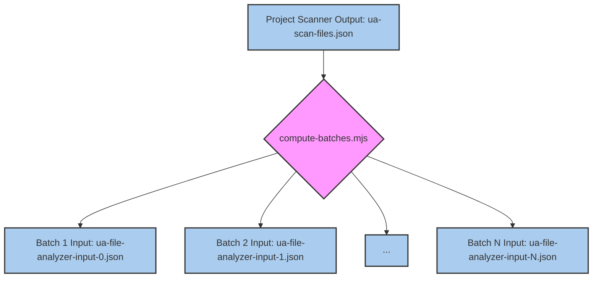
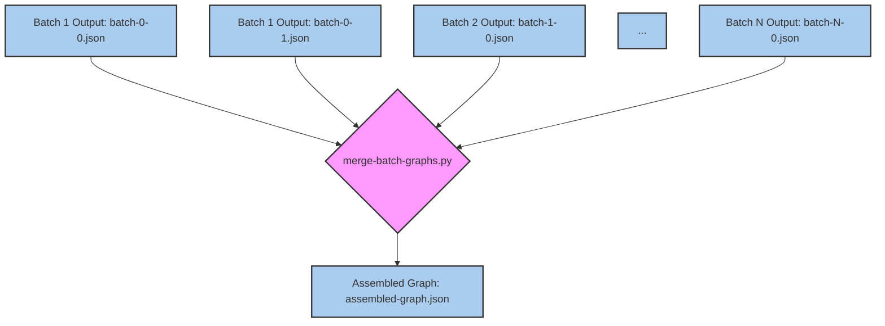

# File Analyzer & Batch Processing

<details>
<summary>Relevant source files</summary>

The following files were used as context for generating this wiki page:

- [CLAUDE.md](CLAUDE.md)
- [docs/superpowers/plans/2026-05-24-semantic-batching-and-output-chunking-impl.md](docs/superpowers/plans/2026-05-24-semantic-batching-and-output-chunking-impl.md)
- [docs/superpowers/specs/2026-05-24-semantic-batching-and-output-chunking-design.md](docs/superpowers/specs/2026-05-24-semantic-batching-and-output-chunking-design.md)
- [tests/skill/understand/fixtures/scan-result-3-cliques.json](tests/skill/understand/fixtures/scan-result-3-cliques.json)
- [tests/skill/understand/fixtures/scan-result-large-community.json](tests/skill/understand/fixtures/scan-result-large-community.json)
- [tests/skill/understand/test_extract_import_map.test.mjs](tests/skill/understand/test_extract_import_map.test.mjs)
- [understand-anything-plugin/agents/architecture-analyzer.md](understand-anything-plugin/agents/architecture-analyzer.md)
- [understand-anything-plugin/agents/article-analyzer.md](understand-anything-plugin/agents/article-analyzer.md)
- [understand-anything-plugin/agents/assemble-reviewer.md](understand-anything-plugin/agents/assemble-reviewer.md)
- [understand-anything-plugin/agents/domain-analyzer.md](understand-anything-plugin/agents/domain-analyzer.md)
- [understand-anything-plugin/agents/file-analyzer.md](understand-anything-plugin/agents/file-analyzer.md)
- [understand-anything-plugin/agents/graph-reviewer.md](understand-anything-plugin/agents/graph-reviewer.md)
- [understand-anything-plugin/agents/knowledge-graph-guide.md](understand-anything-plugin/agents/knowledge-graph-guide.md)
- [understand-anything-plugin/agents/project-scanner.md](understand-anything-plugin/agents/project-scanner.md)
- [understand-anything-plugin/agents/tour-builder.md](understand-anything-plugin/agents/tour-builder.md)
- [understand-anything-plugin/skills/understand/SKILL.md](understand-anything-plugin/skills/understand/SKILL.md)
- [understand-anything-plugin/skills/understand/compute-batches.mjs](understand-anything-plugin/skills/understand/compute-batches.mjs)
- [understand-anything-plugin/skills/understand/extract-import-map.mjs](understand-anything-plugin/skills/understand/extract-import-map.mjs)
- [understand-anything-plugin/skills/understand/merge-batch-graphs.py](understand-anything-plugin/skills/understand/merge-batch-graphs.py)
- [understand-anything-plugin/skills/understand/merge-subdomain-graphs.py](understand-anything-plugin/skills/understand/merge-subdomain-graphs.py)

</details>


This page details Phase 2 of the Understand Anything analysis pipeline, focusing on how files are processed in batches. It covers the role of `compute-batches.mjs` in segmenting files, the parallel dispatch of these batches to `file-analyzer` subagents, and the multi-part output protocol designed to handle token limits imposed by LLMs.

## Overview of Phase 2

Phase 2, "Analyzing files," is a critical step where the raw file list generated by the Project Scanner is transformed into a preliminary set of KnowledgeGraph nodes and edges. This phase is designed for efficiency and scalability, leveraging parallel processing and a robust output handling mechanism.

The process involves:
1. **Batch Computation**: Grouping files into manageable batches.
2. **Parallel Analysis**: Dispatching these batches to `file-analyzer` agents concurrently.
3. **Structural Extraction**: Each `file-analyzer` agent uses a bundled script (`extract-structure.mjs`) for deterministic structural analysis.
4. **Semantic Analysis**: The `file-analyzer` agent then performs LLM-driven semantic analysis on the extracted structures.
5. **Multi-part Output**: Handling large outputs by splitting them into multiple files if necessary.

This phase is reported to the user with progress updates, indicating the current batch being processed [understand-anything-plugin/skills/understand/SKILL.md:32-35]().

## Batch Computation with `compute-batches.mjs`

The `compute-batches.mjs` script is responsible for taking the list of files from the Project Scanner and organizing them into batches. The primary goal is to create batches that are small enough to be processed efficiently by individual `file-analyzer` agents, respecting LLM token limits, while also being large enough to minimize overhead.

The script considers several factors when forming batches:
*   **File Size**: Larger files consume more tokens, so they might be batched individually or with fewer other files.
*   **Language**: Files of the same language might be grouped to leverage language-specific processing efficiencies.
*   **Import Relationships**: Files that import each other are ideally kept in the same batch to provide better context for the `file-analyzer` agent, though cross-batch imports are handled via `neighborMap` [understand-anything-plugin/agents/file-analyzer.md:55-63]().

The output of `compute-batches.mjs` is a series of JSON files, each representing a batch, stored in the intermediate directory.

### `compute-batches.mjs` Data Flow


Title: `compute-batches.mjs` Data Flow
Sources: [understand-anything-plugin/skills/understand/SKILL.md:247-250]()

## File Analyzer Subagents

Each batch generated by `compute-batches.mjs` is dispatched to a `file-analyzer` subagent. These agents operate in parallel, significantly speeding up the analysis of large codebases. The `file-analyzer` agent is defined in [understand-anything-plugin/agents/file-analyzer.md]().

The `file-analyzer` agent performs a two-phase analysis for each file in its assigned batch:

### Phase 1: Structural Extraction (Bundled Script)

The first phase is deterministic and relies on a pre-built structural extraction script, `extract-structure.mjs`. This script uses `tree-sitter` for code files and specialized parsers for non-code files to extract high-quality structural data [understand-anything-plugin/agents/file-analyzer.md:27-30]().

The input to `extract-structure.mjs` is a JSON file containing the `projectRoot`, `batchFiles` (list of files with `path`, `language`, `sizeLines`, `fileCategory`), and `batchImportData` (resolved imports for the batch) [understand-anything-plugin/agents/file-analyzer.md:40-50](). The `batchImportData` is generated by `extract-import-map.mjs` during Phase 1 of the Project Scanner [understand-anything-plugin/skills/understand/extract-import-map.mjs:1-15]().

The script outputs a JSON file containing detailed structural information for each file, such as functions, classes, exports, call graphs, and metrics [understand-anything-plugin/agents/file-analyzer.md:83-115](). For non-code files, it extracts relevant structural fields like `sections`, `definitions`, `services`, `endpoints`, `steps`, and `resources` [understand-anything-plugin/agents/file-analyzer.md:119-129]().

```mermaid
graph TD
    A[Batch Input: ua-file-analyzer-input-<batchIndex>.json] --> B{node extract-structure.mjs};
    B --> C[Extraction Results: ua-file-extract-results-<batchIndex>.json];
    C --> D[File Analyzer Agent (LLM)];

    style A fill:#ace,stroke:#333,stroke-width:2px;
    style B fill:#f9f,stroke:#333,stroke-width:2px;
    style C fill:#ace,stroke:#333,stroke-width:2px;
    style D fill:#ace,stroke:#333,stroke-width:2px;
```
Title: Structural Extraction Data Flow
Sources: [understand-anything-plugin/agents/file-analyzer.md:68-74]()

### Phase 2: LLM Semantic Analysis

After structural extraction, the `file-analyzer` agent (an LLM) uses these results as a foundation for semantic analysis. It generates:
*   **Summaries**: Concise descriptions of the file's purpose.
*   **Tags**: Keywords describing the file's content or role.
*   **Complexity Ratings**: `simple`, `moderate`, or `complex` [understand-anything-plugin/agents/file-analyzer.md:19-21]().
*   **Semantic Edges**: Relationships between files and their internal components that go beyond simple imports (e.g., `calls`, `related`, `inherits`, `implements`) [understand-anything-plugin/agents/file-analyzer.md:19-21]().

The agent also considers cross-batch context provided by the `neighborMap` to boost confidence in cross-batch edges [understand-anything-plugin/agents/file-analyzer.md:55-63]().

The output of the `file-analyzer` agent is a JSON object containing `nodes` and `edges` for the KnowledgeGraph, specific to the files in its batch [understand-anything-plugin/agents/file-analyzer.md:139-142]().

## Multi-Part Output Protocol

To handle potential token limits of LLMs, especially for large batches or verbose analyses, the `file-analyzer` agent employs a multi-part output protocol. If the generated JSON output exceeds a certain size, it is split into multiple files.

The `file-analyzer` agent is instructed to write its output to a specific path, typically `$PROJECT_ROOT/.understand-anything/intermediate/batch-<batchIndex>-<partIndex>.json` [understand-anything-plugin/agents/file-analyzer.md:145-146](). The `<partIndex>` allows for multiple parts per batch.

This mechanism ensures that even if a single batch's analysis is extensive, it can still be fully captured without hitting LLM output truncation limits. Subsequent phases, particularly `merge-batch-graphs.py`, are designed to read and combine these multi-part outputs seamlessly.

## Output Merging

Once all `file-analyzer` agents have completed their processing, the `merge-batch-graphs.py` script is invoked. This Python script is responsible for combining all the individual batch outputs (including multi-part outputs) into a single, coherent KnowledgeGraph.

Key functions of `merge-batch-graphs.py` include:
*   **Loading Batches**: Iterating through all `batch-*.json` files in the intermediate directory [understand-anything-plugin/skills/understand/merge-batch-graphs.py:133-149]().
*   **ID Normalization**: Canonicalizing node IDs to ensure consistency across the entire graph. This involves stripping double prefixes, project-name prefixes, and canonicalizing legacy prefixes (e.g., `func:` to `function:`) [understand-anything-plugin/skills/understand/merge-batch-graphs.py:178-202]().
*   **Complexity Normalization**: Mapping various complexity terms (e.g., "easy", "hard") to a canonical set (`simple`, `moderate`, `complex`) [understand-anything-plugin/skills/understand/merge-batch-graphs.py:68-78]().
*   **Edge Direction Normalization**: Canonicalizing edge `direction` values to `forward`, `backward`, or `bidirectional` [understand-anything-plugin/skills/understand/merge-batch-graphs.py:115-121]().
*   **Deduplication**: Ensuring no duplicate nodes or edges exist after merging.
*   **`tested_by` Linking**: Identifying test files and linking them to the code they test based on naming conventions and file paths [understand-anything-plugin/skills/understand/merge-batch-graphs.py:81-106]().
*   **Dangling Edge Dropping**: Removing edges that point to non-existent nodes, acting as a safety net for unresolvable targets [understand-anything-plugin/agents/file-analyzer.md:65]().

The final output of `merge-batch-graphs.py` is `assembled-graph.json`, which serves as the input for Phase 3 (Graph Assembly & Validation) [understand-anything-plugin/skills/understand/merge-batch-graphs.py:17-18]().


Title: Multi-Part Output Merging
Sources: [understand-anything-plugin/skills/understand/merge-batch-graphs.py:133-149]()

Sources:
- [understand-anything-plugin/skills/understand/SKILL.md:32-35]()
- [understand-anything-plugin/skills/understand/SKILL.md:247-250]()
- [understand-anything-plugin/agents/file-analyzer.md:19-21]()
- [understand-anything-plugin/agents/file-analyzer.md:27-30]()
- [understand-anything-plugin/agents/file-analyzer.md:40-50]()
- [understand-anything-plugin/agents/file-analyzer.md:55-63]()
- [understand-anything-plugin/agents/file-analyzer.md:65]()
- [understand-anything-plugin/agents/file-analyzer.md:68-74]()
- [understand-anything-plugin/agents/file-analyzer.md:83-115]()
- [understand-anything-plugin/agents/file-analyzer.md:119-129]()
- [understand-anything-plugin/agents/file-analyzer.md:139-142]()
- [understand-anything-plugin/agents/file-analyzer.md:145-146]()
- [understand-anything-plugin/skills/understand/extract-import-map.mjs:1-15]()
- [understand-anything-plugin/skills/understand/merge-batch-graphs.py:17-18]()
- [understand-anything-plugin/skills/understand/merge-batch-graphs.py:68-78]()
- [understand-anything-plugin/skills/understand/merge-batch-graphs.py:81-106]()
- [understand-anything-plugin/skills/understand/merge-batch-graphs.py:115-121]()
- [understand-anything-plugin/skills/understand/merge-batch-graphs.py:133-149]()
- [understand-anything-plugin/skills/understand/merge-batch-graphs.py:178-202]()
