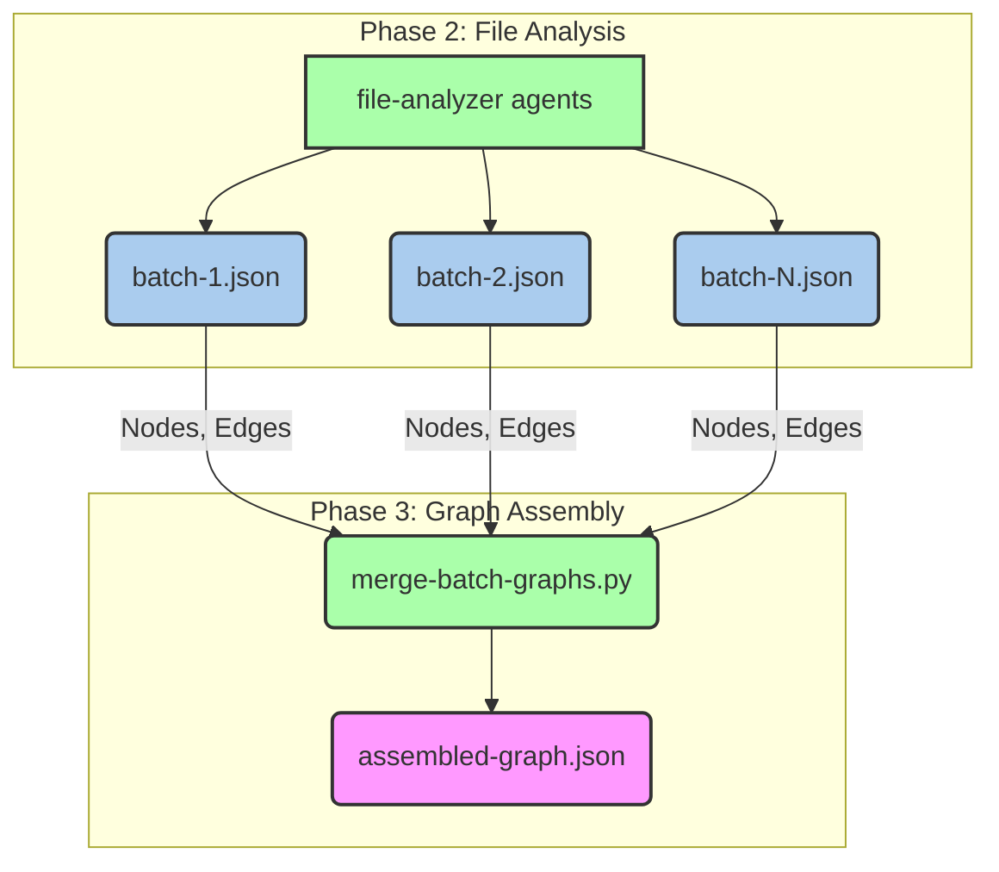
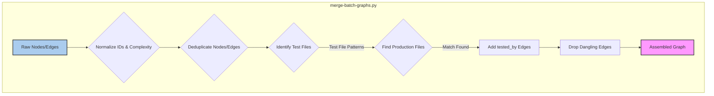
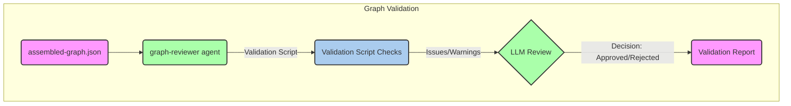
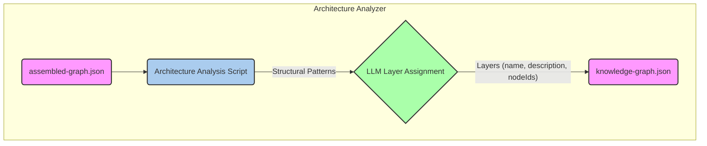

# Graph Assembly & Validation

Relevant source files

The following files were used as context for generating this wiki page:

- [CLAUDE.md](CLAUDE.md)
- [understand-anything-plugin/agents/architecture-analyzer.md](understand-anything-plugin/agents/architecture-analyzer.md)
- [understand-anything-plugin/agents/article-analyzer.md](understand-anything-plugin/agents/article-analyzer.md)
- [understand-anything-plugin/agents/assemble-reviewer.md](understand-anything-plugin/agents/assemble-reviewer.md)
- [understand-anything-plugin/agents/domain-analyzer.md](understand-anything-plugin/agents/domain-analyzer.md)
- [understand-anything-plugin/agents/file-analyzer.md](understand-anything-plugin/agents/file-analyzer.md)
- [understand-anything-plugin/agents/graph-reviewer.md](understand-anything-plugin/agents/graph-reviewer.md)
- [understand-anything-plugin/agents/knowledge-graph-guide.md](understand-anything-plugin/agents/knowledge-graph-guide.md)
- [understand-anything-plugin/agents/project-scanner.md](understand-anything-plugin/agents/project-scanner.md)
- [understand-anything-plugin/agents/tour-builder.md](understand-anything-plugin/agents/tour-builder.md)
- [understand-anything-plugin/packages/core/src/__tests__/domain-normalize.test.ts](understand-anything-plugin/packages/core/src/__tests__/domain-normalize.test.ts)
- [understand-anything-plugin/packages/core/src/__tests__/normalize-graph.test.ts](understand-anything-plugin/packages/core/src/__tests__/normalize-graph.test.ts)
- [understand-anything-plugin/packages/core/src/analyzer/normalize-graph.ts](understand-anything-plugin/packages/core/src/analyzer/normalize-graph.ts)
- [understand-anything-plugin/packages/core/src/index.ts](understand-anything-plugin/packages/core/src/index.ts)
- [understand-anything-plugin/skills/understand/SKILL.md](understand-anything-plugin/skills/understand/SKILL.md)
- [understand-anything-plugin/skills/understand/merge-batch-graphs.py](understand-anything-plugin/skills/understand/merge-batch-graphs.py)
- [understand-anything-plugin/skills/understand/merge-subdomain-graphs.py](understand-anything-plugin/skills/understand/merge-subdomain-graphs.py)

This page details Phases 3 and 4 of the Understand Anything analysis pipeline, focusing on how the raw, batch-processed graph data is assembled, canonicalized, and validated. This involves ID canonicalization, `tested_by` linking, semantic recovery by `assemble-reviewer`, referential integrity checks by `graph-reviewer`, and architectural layer assignment by `architecture-analyzer`.

## Phase 3: Graph Assembly

After individual files and batches have been analyzed by `file-analyzer` agents, their outputs (nodes and edges) are merged into a single, coherent graph. This phase primarily uses the `merge-batch-graphs.py` script to perform initial consolidation and normalization.

### 3.1. Merging Batch Outputs

The `merge-batch-graphs.py` script is responsible for combining all `batch-*.json` files generated by the `file-analyzer` agents into a single `assembled-graph.json` file [understand-anything-plugin/skills/understand/merge-batch-graphs.py:1-19](). It handles several critical tasks to ensure the graph is consistent and well-formed.

#### Data Flow

Title: Data Flow for Graph Assembly
Sources: [understand-anything-plugin/skills/understand/merge-batch-graphs.py:1-19]()

#### ID Canonicalization

A crucial step in merging is to ensure all node IDs adhere to a canonical format. The `normalize_node_id` function [understand-anything-plugin/skills/understand/merge-batch-graphs.py:178-209]() in `merge-batch-graphs.py` performs this by:
- Stripping double prefixes (e.g., `file:file:src/foo.ts` becomes `file:src/foo.ts`) [understand-anything-plugin/skills/understand/merge-batch-graphs.py:182-187]().
- Removing project-name prefixes (e.g., `my-project:file:src/foo.ts` becomes `file:src/foo.ts`) [understand-anything-plugin/skills/understand/merge-batch-graphs.py:190-197]().
- Canonicalizing legacy prefixes (e.g., `func:` becomes `function:`) [understand-anything-plugin/skills/understand/merge-batch-graphs.py:199]().
- Adding missing prefixes based on the node's `type` (e.g., `src/foo.ts` becomes `file:src/foo.ts`) [understand-anything-plugin/skills/understand/merge-batch-graphs.py:202-209]().

This ensures that all references to a node, regardless of how it was initially generated by an LLM, point to the same canonical ID. The `normalizeBatchOutput` function in TypeScript also performs similar normalization [understand-anything-plugin/packages/core/src/analyzer/normalize-graph.ts:202-211]().

The `VALID_NODE_PREFIXES` [understand-anything-plugin/skills/understand/merge-batch-graphs.py:32-39]() and `TYPE_TO_PREFIX` [understand-anything-plugin/skills/understand/merge-batch-graphs.py:42-66]() mappings define the allowed prefixes and their canonical forms.

#### Complexity Normalization

Node `complexity` values are also normalized to a standard set: `"simple"`, `"moderate"`, or `"complex"`. The `normalize_complexity` function [understand-anything-plugin/skills/understand/merge-batch-graphs.py:212-229]() handles various string aliases (e.g., "low", "easy" map to "simple") and numeric scales. This ensures consistency across different LLM outputs. The TypeScript equivalent is `normalizeComplexity` [understand-anything-plugin/packages/core/src/analyzer/normalize-graph.ts:134-152]().

#### Edge Rewriting and Deduplication

After node IDs are canonicalized, edges are rewritten to use the new canonical IDs. The script also deduplicates nodes and edges, ensuring that the final graph contains unique entities. Dangling edges (those referencing non-existent source or target nodes) are identified and dropped [understand-anything-plugin/skills/understand/merge-batch-graphs.py:300-302]().

#### `tested_by` Linking

The `merge-batch-graphs.py` script includes logic to automatically infer `tested_by` relationships between code files and their corresponding test files. This is done by analyzing file paths and names using predefined patterns [understand-anything-plugin/skills/understand/merge-batch-graphs.py:81-106]().

The `find_tested_by_target` function [understand-anything-plugin/skills/understand/merge-batch-graphs.py:310-370]() attempts to match a test file (e.g., `foo.test.ts`) to its production counterpart (e.g., `foo.ts`). It considers:
- **JS/TS family extensions**: `.ts`, `.tsx`, `.js`, etc. [understand-anything-plugin/skills/understand/merge-batch-graphs.py:85-86]()
- **Mirrored production roots**: `src/`, `app/`, `lib/`, or project root [understand-anything-plugin/skills/understand/merge-batch-graphs.py:89]()
- **Test name patterns**: `_test` for Go/Python, `Test` for Java/Kotlin/C#, etc. [understand-anything-plugin/skills/understand/merge-batch-graphs.py:97-106]()

If a match is found, a `tested_by` edge is added from the production file to the test file.

Title: merge-batch-graphs.py Processing Steps
Sources: [understand-anything-plugin/skills/understand/merge-batch-graphs.py:1-19](), [understand-anything-plugin/skills/understand/merge-batch-graphs.py:81-106](), [understand-anything-plugin/skills/understand/merge-batch-graphs.py:310-370]()

### 3.2. Semantic Recovery by `assemble-reviewer`

After the initial programmatic merge, the `assemble-reviewer` agent performs a semantic review of the `assembled-graph.json`. This LLM-driven phase aims to catch issues that are difficult to detect programmatically, such as:
- **Missing critical nodes**: Important files or functions that should be in the graph but were overlooked.
- **Incorrect relationships**: Edges that semantically don't make sense.
- **Inaccurate summaries/tags**: Descriptions or tags that misrepresent the node's purpose.
- **Inconsistent naming**: Nodes with similar functionality but disparate names.

The `assemble-reviewer` agent is designed to read the `assembled-graph.json` and identify these semantic discrepancies, suggesting corrections or flagging areas for further analysis. It acts as a quality gate before the graph proceeds to more structural validation.

Sources: [understand-anything-plugin/agents/assemble-reviewer.md]()

## Phase 4: Graph Validation & Layer Assignment

This phase focuses on ensuring the referential integrity and structural correctness of the graph, followed by assigning nodes to architectural layers.

### 4.1. Referential Integrity Checks by `graph-reviewer`

The `graph-reviewer` agent is a critical component for validating the assembled graph. It performs a series of deterministic checks to ensure the graph adheres to the defined schema and maintains referential integrity. This agent can be run in two modes:
- **Inline deterministic validation**: Performed by a script during the pipeline.
- **Full LLM graph-reviewer**: Triggered with the `--review` flag [understand-anything-plugin/skills/understand/SKILL.md:16](), allowing the LLM to review the script's findings and provide a decision.

#### Validation Checks

The `graph-reviewer` performs the following checks [understand-anything-plugin/agents/graph-reviewer.md:30-103]():

1.  **Schema Validation (Critical)**:
    -   Every node must have `id`, `type`, `name`, `summary`, `tags`, `complexity` with correct types and constraints.
    -   Node `type` must be one of the 16 valid types (e.g., `file`, `function`, `class`, `domain`, `flow`, `step`) [understand-anything-plugin/agents/graph-reviewer.md:45-46]().
    -   Node `id` must follow prefix conventions (e.g., `file:`, `function:`) [understand-anything-plugin/agents/graph-reviewer.md:48-49]().
    -   Every edge must have `source`, `target`, `type`, `direction`, `weight` with correct types and constraints.
    -   Edge `type` must be one of the 29 valid types (e.g., `imports`, `calls`, `tested_by`, `contains_flow`) [understand-anything-plugin/agents/graph-reviewer.md:60-61]().
    -   `direction` must be `forward`, `backward`, or `bidirectional` [understand-anything-plugin/agents/graph-reviewer.md:56]().

2.  **Referential Integrity (Critical)**:
    -   All `source` and `target` IDs in edges must reference existing nodes [understand-anything-plugin/agents/graph-reviewer.md:65-66]().
    -   All `nodeIds` in layers and tour steps must reference existing nodes [understand-anything-plugin/agents/graph-reviewer.md:67-68]().
    -   Dangling references are logged [understand-anything-plugin/agents/graph-reviewer.md:69]().

3.  **Completeness (Critical/Warning)**:
    -   At least one node and one edge must exist [understand-anything-plugin/agents/graph-reviewer.md:73-74]().
    -   Layers and tour steps are checked for existence (warnings for domain graphs) [understand-anything-plugin/agents/graph-reviewer.md:75-79]().

4.  **Layer Coverage (Critical)**:
    -   For structural graphs, file-level nodes (`file`, `config`, `document`, etc.) must appear in exactly one layer [understand-anything-plugin/agents/graph-reviewer.md:82-83]().
    -   No empty layers [understand-anything-plugin/agents/graph-reviewer.md:85]().

5.  **Uniqueness (Critical)**:
    -   No duplicate node IDs [understand-anything-plugin/agents/graph-reviewer.md:89]().

6.  **Tour Validation (Warning)**:
    -   Checks for sequential `order`, unique `order` values, and `nodeIds` presence in tour steps [understand-anything-plugin/agents/graph-reviewer.md:92-95]().
    -   Tour step count between 5 and 15 [understand-anything-plugin/agents/graph-reviewer.md:96]().

7.  **Quality Checks (Warning)**:
    -   No empty or redundant summaries [understand-anything-plugin/agents/graph-reviewer.md:100]().
    -   No self-referencing edges [understand-anything-plugin/agents/graph-reviewer.md:101]().
    -   Identifies orphan nodes (nodes with no incoming or outgoing edges) [understand-anything-plugin/agents/graph-reviewer.md:102]().

8.  **Non-Code Node Quality Checks (Warning)**:
    -   Specific checks for `document`, `service`, `pipeline`, `table`, `schema`, `domain`, and `flow` nodes to ensure they have expected edge types [understand-anything-plugin/agents/graph-reviewer.md:108-115]().

9.  **Node Type / ID Prefix Consistency (Warning)**:
    -   Ensures a node's `type` matches its ID prefix (e.g., `type: "config"` implies `id` starts with `config:`) [understand-anything-plugin/agents/graph-reviewer.md:117-123]().

The `graph-reviewer` outputs a structured JSON report detailing all issues and warnings found [understand-anything-plugin/agents/graph-reviewer.md:128-139]().

Title: Graph Reviewer Process
Sources: [understand-anything-plugin/agents/graph-reviewer.md]()

### 4.2. Architecture Analyzer Layer Assignment

The `architecture-analyzer` agent is responsible for identifying logical architectural layers within the codebase and assigning every file-level node to exactly one layer. This is a crucial step for providing a high-level overview of the project's structure in the dashboard.

#### Two-Phase Approach

Similar to other agents, `architecture-analyzer` uses a two-phase approach:
1.  **Structural Analysis Script**: A script (preferably Node.js) computes deterministic structural patterns from file paths and import/dependency edges [understand-anything-plugin/agents/architecture-analyzer.md:23-24]().
2.  **LLM Semantic Interpretation**: The LLM uses these structural insights to make semantic layer assignments [understand-anything-plugin/agents/architecture-analyzer.md:24-25]().

#### Script Computations

The script computes several metrics to inform layer assignment [understand-anything-plugin/agents/architecture-analyzer.md:52-145]():

-   **Directory Grouping**: Groups file nodes by their top-level directory after a common prefix [understand-anything-plugin/agents/architecture-analyzer.md:55-64]().
-   **Node Type Grouping**: Groups file nodes by their `type` (e.g., `file`, `config`, `document`) [understand-anything-plugin/agents/architecture-analyzer.md:69-71]().
-   **Import Adjacency Matrix**: Calculates fan-in and fan-out for each file, and inter-group dependencies [understand-anything-plugin/agents/architecture-analyzer.md:74-77]().
-   **Cross-Category Dependency Analysis**: Counts edges of different types between node type groups (e.g., `config` nodes configuring `file` nodes) [understand-anything-plugin/agents/architecture-analyzer.md:80-87]().
-   **Inter-Group Import Frequency**: Quantifies import edges between different directory groups [understand-anything-plugin/agents/architecture-analyzer.md:90-96]().
-   **Intra-Group Import Density**: Measures cohesion within directory groups, indicating potential layers [understand-anything-plugin/agents/architecture-analyzer.md:99-102]().
-   **Directory Pattern Matching**: Classifies directory names against known architectural patterns (e.g., `routes` -> `api`, `services` -> `service`) [understand-anything-plugin/agents/architecture-analyzer.md:105-145]().

#### LLM Layer Assignment

The LLM uses the output of the structural analysis script to:
-   Identify 3-10 logical architecture layers.
-   Assign every file-level node to exactly one layer.
-   Provide a `name` and `description` for each layer, potentially in a specified language [understand-anything-plugin/agents/architecture-analyzer.md:19-21]().

This process results in the `layers` array within the final `knowledge-graph.json`, which is then used by the dashboard for visualization.

Title: Architecture Analyzer Process
Sources: [understand-anything-plugin/agents/architecture-analyzer.md]()

Sources:
- [understand-anything-plugin/skills/understand/SKILL.md:16]()
- [understand-anything-plugin/skills/understand/merge-batch-graphs.py:1-19]()
- [understand-anything-plugin/skills/understand/merge-batch-graphs.py:32-39]()
- [understand-anything-plugin/skills/understand/merge-batch-graphs.py:42-66]()
- [understand-anything-plugin/skills/understand/merge-batch-graphs.py:81-106]()
- [understand-anything-plugin/skills/understand/merge-batch-graphs.py:178-209]()
- [understand-anything-plugin/skills/understand/merge-batch-graphs.py:212-229]()
- [understand-anything-plugin/skills/understand/merge-batch-graphs.py:300-302]()
- [understand-anything-plugin/skills/understand/merge-batch-graphs.py:310-370]()
- [understand-anything-plugin/packages/core/src/analyzer/normalize-graph.ts:134-152]()
- [understand-anything-plugin/packages/core/src/analyzer/normalize-graph.ts:202-211]()
- [understand-anything-plugin/agents/assemble-reviewer.md]()
- [understand-anything-plugin/agents/graph-reviewer.md:30-103]()
- [understand-anything-plugin/agents/graph-reviewer.md:45-46]()
- [understand-anything-plugin/agents/graph-reviewer.md:48-49]()
- [understand-anything-plugin/agents/graph-reviewer.md:56]()
- [understand-anything-plugin/agents/graph-reviewer.md:60-61]()
- [understand-anything-plugin/agents/graph-reviewer.md:65-66]()
- [understand-anything-plugin/agents/graph-reviewer.md:67-68]()
- [understand-anything-plugin/agents/graph-reviewer.md:69]()
- [understand-anything-plugin/agents/graph-reviewer.md:73-74]()
- [understand-anything-plugin/agents/graph-reviewer.md:75-79]()
- [understand-anything-plugin/agents/graph-reviewer.md:82-83]()
- [understand-anything-plugin/agents/graph-reviewer.md:85]()
- [understand-anything-plugin/agents/graph-reviewer.md:89]()
- [understand-anything-plugin/agents/graph-reviewer.md:92-95]()
- [understand-anything-plugin/agents/graph-reviewer.md:96]()
- [understand-anything-plugin/agents/graph-reviewer.md:100]()
- [understand-anything-plugin/agents/graph-reviewer.md:101]()
- [understand-anything-plugin/agents/graph-reviewer.md:102]()
- [understand-anything-plugin/agents/graph-reviewer.md:108-115]()
- [understand-anything-plugin/agents/graph-reviewer.md:117-123]()
- [understand-anything-plugin/agents/graph-reviewer.md:128-139]()
- [understand-anything-plugin/agents/architecture-analyzer.md:19-21]()
- [understand-anything-plugin/agents/architecture-analyzer.md:23-24]()
- [understand-anything-plugin/agents/architecture-analyzer.md:24-25]()
- [understand-anything-plugin/agents/architecture-analyzer.md:52-145]()
- [understand-anything-plugin/agents/architecture-analyzer.md:55-64]()
- [understand-anything-plugin/agents/architecture-analyzer.md:69-71]()
- [understand-anything-plugin/agents/architecture-analyzer.md:74-77]()
- [understand-anything-plugin/agents/architecture-analyzer.md:80-87]()
- [understand-anything-plugin/agents/architecture-analyzer.md:90-96]()
- [understand-anything-plugin/agents/architecture-analyzer.md:99-102]()
- [understand-anything-plugin/agents/architecture-analyzer.md:105-145]()
