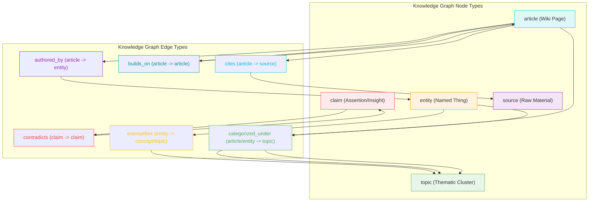

# Domain & Knowledge Graph Skills

<details>
<summary>Relevant source files</summary>

The following files were used as context for generating this wiki page:

- [docs/superpowers/plans/2026-04-09-understand-knowledge.md](docs/superpowers/plans/2026-04-09-understand-knowledge.md)
- [docs/superpowers/specs/2026-04-09-understand-knowledge-design.md](docs/superpowers/specs/2026-04-09-understand-knowledge-design.md)
- [understand-anything-plugin/packages/dashboard/src/components/KnowledgeGraphView.tsx](understand-anything-plugin/packages/dashboard/src/components/KnowledgeGraphView.tsx)
- [understand-anything-plugin/skills/understand-domain/SKILL.md](understand-anything-plugin/skills/understand-domain/SKILL.md)
- [understand-anything-plugin/skills/understand-domain/extract-domain-context.py](understand-anything-plugin/skills/understand-domain/extract-domain-context.py)
- [understand-anything-plugin/skills/understand-knowledge/SKILL.md](understand-anything-plugin/skills/understand-knowledge/SKILL.md)
- [understand-anything-plugin/skills/understand-knowledge/merge-knowledge-graph.py](understand-anything-plugin/skills/understand-knowledge/merge-knowledge-graph.py)
- [understand-anything-plugin/skills/understand-knowledge/parse-knowledge-base.py](understand-anything-plugin/skills/understand-knowledge/parse-knowledge-base.py)
- [understand-anything-plugin/src/__tests__/worktree-redirect.test.mjs](understand-anything-plugin/src/__tests__/worktree-redirect.test.mjs)

</details>


This page details the implementation of two specialized skills: `/understand-domain` and `/understand-knowledge`. The `/understand-domain` skill extracts business domain knowledge from a codebase, generating a `domain-graph.json` file and a `DomainMeta` structure. The `/understand-knowledge` skill processes Karpathy-pattern LLM wikis, parsing markdown files into `article`, `entity`, and `claim` nodes, and generating a `knowledge-graph.json` file.

## 2.5.1. /understand-domain: Business Domain Extraction

The `/understand-domain` skill analyzes a codebase to identify business domains, flows, and process steps. It can operate in two modes: deriving knowledge from an existing `knowledge-graph.json` (if available) or performing a lightweight scan of the codebase. The output is an interactive horizontal flow graph displayed in the dashboard.

### How It Works

The skill follows a multi-phase process to extract and represent domain knowledge:

1.  **Resolve `PROJECT_ROOT`**: Determines the project's root directory, handling Git worktree redirections to ensure persistence of generated files [understand-anything-plugin/skills/understand-domain/SKILL.md:20-43]().
2.  **Detect Existing Graph**: Checks for an existing `knowledge-graph.json`. If found and the `--full` flag is not used, it proceeds to derive domain knowledge from it. Otherwise, it performs a lightweight scan [understand-anything-plugin/skills/understand-domain/SKILL.md:90-93]().
3.  **Lightweight Scan (Path 1)**: If no existing knowledge graph is used, a Python script `extract-domain-context.py` performs a lightweight scan. This script generates `domain-context.json` containing file trees, detected entry points, file signatures, code snippets, and project metadata [understand-anything-plugin/skills/understand-domain/SKILL.md:95-109]().
4.  **Derive from Existing Graph (Path 2)**: If a `knowledge-graph.json` exists, the skill reads it and formats the data (nodes, edges, layers, tour steps) as context for the domain analyzer [understand-anything-plugin/skills/understand-domain/SKILL.md:112-121]().
5.  **Domain Analysis**: The `domain-analyzer` agent is dispatched with the prepared context (either from the lightweight scan or the existing graph) to perform the actual domain analysis. Its output is written to `domain-analysis.json` [understand-anything-plugin/skills/understand-domain/SKILL.md:124-128]().
6.  **Validate and Save**: The `domain-analysis.json` output is validated against the graph schema (which supports domain/flow/step types). Valid data is saved to `domain-graph.json`, and intermediate files are cleaned up [understand-anything-plugin/skills/understand-domain/SKILL.md:130-135]().

#### `extract-domain-context.py`

This Python script is responsible for the deterministic preprocessing step in the lightweight scan path. It identifies key structural and functional elements of a codebase relevant for domain analysis.

**Key Features:**

*   **Configuration**: Defines limits for file tree depth, files per directory, total files, sampled files, lines per file, and entry points, along with source file extensions and directories to skip [understand-anything-plugin/skills/understand-domain/extract-domain-context.py:24-66]().
*   **`.gitignore` Support**: Parses `.gitignore` files to exclude irrelevant files and directories from the scan [understand-anything-plugin/skills/understand-domain/extract-domain-context.py:117-147]().
*   **File Tree Scanning**: Recursively walks the project directory, respecting `MAX_FILE_TREE_DEPTH`, `MAX_FILES_PER_DIR`, `MAX_FILES_TOTAL`, `SKIP_DIRS`, and `.gitignore` patterns. It collects paths of relevant source files [understand-anything-plugin/skills/understand-domain/extract-domain-context.py:150-192]().
*   **Entry Point Detection**: Scans source files for predefined patterns to identify common entry points like HTTP routes, CLI commands, event handlers, and cron jobs [understand-anything-plugin/skills/understand-domain/extract-domain-context.py:68-114](). It extracts code snippets for each detected entry point [understand-anything-plugin/skills/understand-domain/extract-domain-context.py:197-249]().
*   **File Signatures**: For sampled files, it extracts imports and exports to understand dependencies and interfaces [understand-anything-plugin/skills/understand-domain/extract-domain-context.py:252-290]().
*   **Metadata Collection**: Gathers information from common project metadata files like `package.json`, `README.md`, etc. [understand-anything-plugin/skills/understand-domain/extract-domain-context.py:59-66]().
*   **Output**: Generates a `domain-context.json` file containing the collected data, which serves as input for the `domain-analyzer` agent [understand-anything-plugin/skills/understand-domain/extract-domain-context.py:103-108]().

#### `DomainMeta`

The `DomainMeta` interface is part of the core types and is used to store domain-specific metadata on `GraphNode` objects.

```typescript
// Optional domain metadata for domain/flow/step nodes
export interface DomainMeta {
  description?: string;
  flowType?: "sequential" | "parallel" | "conditional";
  order?: number;
  inputs?: string[];
  outputs?: string[];
  triggers?: string[];
  involvedActors?: string[];
}
```
Sources:
- [understand-anything-plugin/skills/understand-domain/SKILL.md:2-135]()
- [understand-anything-plugin/skills/understand-domain/extract-domain-context.py:1-320]()
- [docs/superpowers/plans/2026-04-09-understand-knowledge.md:115-119]()

### Diagram: /understand-domain Flow

```mermaid
graph TD
    subgraph "User Interaction"
        A[User runs /understand-domain] --> B{--full flag?}
    end

    subgraph "Phase 0: Project Setup"
        B -- No --> C[Check for .understand-anything/knowledge-graph.json]
        B -- Yes --> D[Force fresh scan]
        C -- Exists & no --full --> E[Derive from existing graph]
        C -- Not exists or --full --> D
        D --> F[Lightweight scan]
    end

    subgraph "Phase 1: Context Generation"
        F --> G[Run extract-domain-context.py]
        G -- Outputs --> H[domain-context.json]
        E --> I[Read knowledge-graph.json]
        I -- Formats --> J[Structured graph context]
    end

    subgraph "Phase 2: LLM Analysis"
        H --> K[domain-analyzer agent]
        J --> K
        K -- Writes --> L[domain-analysis.json]
    end

    subgraph "Phase 3: Validation & Persistence"
        L --> M[Validate domain-analysis.json]
        M -- Validated --> N[Save to .understand-anything/domain-graph.json]
        N --> O[Clean up intermediate files]
    end

    subgraph "Dashboard Visualization"
        O --> P[Dashboard displays Domain Graph]
    end

    style A fill:#ace,stroke:#333,stroke-width:2px
    style B fill:#f9f,stroke:#333,stroke-width:2px
    style C fill:#f9f,stroke:#333,stroke-width:2px
    style D fill:#f9f,stroke:#333,stroke-width:2px
    style E fill:#afa,stroke:#333,stroke-width:2px
    style F fill:#afa,stroke:#333,stroke-width:2px
    style G fill:#add8e6,stroke:#333,stroke-width:2px
    style H fill:#fff,stroke:#333,stroke-width:2px
    style I fill:#add8e6,stroke:#333,stroke-width:2px
    style J fill:#fff,stroke:#333,stroke-width:2px
    style K fill:#f9c,stroke:#333,stroke-width:2px
    style L fill:#fff,stroke:#333,stroke-width:2px
    style M fill:#add8e6,stroke:#333,stroke-width:2px
    style N fill:#afa,stroke:#333,stroke-width:2px
    style O fill:#add8e6,stroke:#333,stroke-width:2px
    style P fill:#ace,stroke:#333,stroke-width:2px
```
**Diagram: /understand-domain Flow**
Sources:
- [understand-anything-plugin/skills/understand-domain/SKILL.md:2-135]()
- [understand-anything-plugin/skills/understand-domain/extract-domain-context.py:1-320]()

## 2.5.2. /understand-knowledge: Karpathy-pattern Wiki Parsing

The `/understand-knowledge` skill is designed to analyze a Karpathy-pattern LLM wiki, which typically consists of raw sources, markdown wiki files with wikilinks, and a schema file. It generates an interactive knowledge graph with entity extraction, implicit relationships, and topic clustering.

### Karpathy-pattern Wiki Structure

The skill specifically targets the Karpathy LLM wiki pattern, characterized by:
*   **Raw sources**: Immutable source documents (articles, papers, data files).
*   **Wiki**: LLM-generated markdown files using `[[target]]` wikilink syntax.
*   **Schema**: Configuration files like `CLAUDE.md` or `AGENTS.md`.
*   **`index.md`**: A content catalog organized by categories.
*   **`log.md`**: A chronological operation log.

Detection signals include the presence of `index.md` and multiple `.md` files with wikilinks [understand-anything-plugin/skills/understand-knowledge/SKILL.md:11-20]().

### How It Works

The skill executes a multi-phase pipeline:

1.  **DETECT**: Determines the target directory and runs `parse-knowledge-base.py` to detect the Karpathy format. If successful, it generates `scan-manifest.json` and announces the detected articles, sources, topics, and wikilinks [understand-anything-plugin/skills/understand-knowledge/SKILL.md:24-40]().
2.  **SCAN (Deterministic)**: The `parse-knowledge-base.py` script performs all deterministic extraction, including article nodes (from `.md` files), source nodes (from `raw/` files), topic nodes (from `index.md` headings), `related` edges (from wikilinks), and `categorized_under` edges (from `index.md` sections) [understand-anything-plugin/skills/understand-knowledge/SKILL.md:43-49]().
3.  **ANALYZE (LLM-driven)**: Dispatches `article-analyzer` subagents in batches to extract implicit knowledge. These agents process articles and generate `analysis-batch-*.json` files containing new nodes (entities, claims) and edges [understand-anything-plugin/skills/understand-knowledge/SKILL.md:52-72]().
4.  **MERGE**: The `merge-knowledge-graph.py` script combines `scan-manifest.json` with all `analysis-batch-*.json` files. It handles entity deduplication, edge normalization, layer building from `index.md` categories, and tour generation. The result is `assembled-graph.json` [understand-anything-plugin/skills/understand-knowledge/SKILL.md:75-89]().
5.  **SAVE**: The `assembled-graph.json` is validated, saved to `knowledge-graph.json`, and metadata is written to `meta.json`. Intermediate files are cleaned up, and a summary is reported to the user. Finally, the dashboard is auto-triggered [understand-anything-plugin/skills/understand-knowledge/SKILL.md:92-125]().

#### `parse-knowledge-base.py`

This Python script is the deterministic parser for Karpathy-pattern LLM wikis. It extracts structural information from markdown files and resolves wikilinks.

**Key Features:**

*   **Regex Patterns**: Defines regular expressions for wikilinks (`[[target|display]]`), YAML frontmatter, code blocks, and headings [understand-anything-plugin/skills/understand-knowledge/parse-knowledge-base.py:22-29]().
*   **Format Detection**: The `detect_format` function identifies if a directory follows the Karpathy pattern by checking for `index.md`, `log.md`, `raw/` directory, and schema files (`CLAUDE.md`, `AGENTS.md`) [understand-anything-plugin/skills/understand-knowledge/parse-knowledge-base.py:38-69]().
*   **Markdown Extraction Helpers**:
    *   `extract_frontmatter`: Parses YAML frontmatter into a dictionary [understand-anything-plugin/skills/understand-knowledge/parse-knowledge-base.py:76-86]().
    *   `extract_wikilinks`: Finds all `[[target]]` and `[[target|display]]` links [understand-anything-plugin/skills/understand-knowledge/parse-knowledge-base.py:89-97]().
    *   `extract_headings`: Extracts all markdown headings with their level and text [understand-anything-plugin/skills/understand-knowledge/parse-knowledge-base.py:100-105]().
    *   `extract_code_blocks`: Identifies languages used in fenced code blocks [understand-anything-plugin/skills/understand-knowledge/parse-knowledge-base.py:108-111]().
    *   `extract_first_paragraph`: Extracts a concise summary from the first non-empty paragraph after frontmatter and H1 [understand-anything-plugin/skills/understand-knowledge/parse-knowledge-base.py:114-154]().
    *   `extract_h1`: Extracts the main H1 heading of an article [understand-anything-plugin/skills/understand-knowledge/parse-knowledge-base.py:157-164]().
*   **`index.md` Parsing**: The `parse_index` function extracts categories from `##` headings in `index.md` and associates wikilinks under each category [understand-anything-plugin/skills/understand-knowledge/parse-knowledge-base.py:170-194]().
*   **`log.md` Parsing**: The `parse_log` function extracts operation timelines from `log.md` [understand-anything-plugin/skills/understand-knowledge/parse-knowledge-base.py:201-202]().
*   **Graph Construction**: The main `scan` function orchestrates the parsing, creating `article`, `entity`, `topic`, and `source` nodes, and `related` and `categorized_under` edges. It resolves wikilinks to node IDs [understand-anything-plugin/skills/understand-knowledge/parse-knowledge-base.py:209-400]().
*   **Output**: Writes a `scan-manifest.json` to the intermediate directory, containing the initial graph structure [understand-anything-plugin/skills/understand-knowledge/parse-knowledge-base.py:13-14]().

#### `merge-knowledge-graph.py`

This Python script combines the deterministic `scan-manifest.json` with the LLM-generated `analysis-batch-*.json` files.

**Key Features:**

*   **Canonical Types**: Defines `VALID_NODE_TYPES` and `VALID_EDGE_TYPES` to ensure schema compliance, including knowledge-specific types like `article`, `entity`, `topic`, `claim`, `source`, `cites`, `contradicts`, etc. [understand-anything-plugin/skills/understand-knowledge/merge-knowledge-graph.py:29-48]().
*   **Type Aliases**: Provides `NODE_TYPE_ALIASES` and `EDGE_TYPE_ALIASES` for flexible input parsing and normalization [understand-anything-plugin/skills/understand-knowledge/merge-knowledge-graph.py:50-66]().
*   **Normalization**: Functions `normalize_node_type`, `normalize_edge_type`, and `normalize_entity_name` standardize types and entity names for consistent graph representation and deduplication [understand-anything-plugin/skills/understand-knowledge/merge-knowledge-graph.py:73-85]().
*   **Merge Pipeline**:
    *   Loads the `scan-manifest.json` as the base graph [understand-anything-plugin/skills/understand-knowledge/merge-knowledge-graph.py:101-104]().
    *   Iterates through `analysis-batch-*.json` files, processing new nodes and edges [understand-anything-plugin/skills/understand-knowledge/merge-knowledge-graph.py:111-176]().
    *   **Entity Deduplication**: Uses `entity_name_map` to identify and remap duplicate entities (e.g., "Andrej Karpathy" and "A. Karpathy" become one `entity` node) [understand-anything-plugin/skills/understand-knowledge/merge-knowledge-graph.py:135-143]().
    *   **Edge Validation**: Ensures that edge sources and targets exist in the node set after deduplication [understand-anything-plugin/skills/understand-knowledge/merge-knowledge-graph.py:166-175]().
    *   **Edge Deduplication**: Removes redundant edges [understand-anything-plugin/skills/understand-knowledge/merge-knowledge-graph.py:178-185]().
*   **Layer and Tour Generation**: Builds `layers` from `index.md` categories and `tour` steps from the section ordering, providing structured navigation for the dashboard [understand-anything-plugin/skills/understand-knowledge/merge-knowledge-graph.py:190-226]().
*   **Output**: Writes the final `assembled-graph.json` to the intermediate directory [understand-anything-plugin/skills/understand-knowledge/merge-knowledge-graph.py:230-231]().

#### Knowledge Graph Types

The `KnowledgeGraph` schema is extended to support knowledge-specific nodes and edges.

**New Node Types**:
*   `article`: A wiki/note page, the primary content unit.
*   `entity`: A named thing (person, tool, paper, organization).
*   `topic`: A thematic cluster grouping related articles.
*   `claim`: A specific assertion, insight, or takeaway.
*   `source`: Raw/reference material.
[docs/superpowers/specs/2026-04-09-understand-knowledge-design.md:39-49]()

**New Edge Types**:
*   `cites`: `article` → `source` (references or draws from).
*   `contradicts`: `claim` → `claim` (conflicts or disagrees with).
*   `builds_on`: `article` → `article` (extends, refines, or deepens).
*   `exemplifies`: `entity` → `concept/topic` (is a concrete example of).
*   `categorized_under`: `article/entity` → `topic` (belongs to this theme).
*   `authored_by`: `article` → `entity` (written or created by).
[docs/superpowers/specs/2026-04-09-understand-knowledge-design.md:64-70]()

**`KnowledgeMeta` Interface**:
This interface stores optional metadata for knowledge nodes:
*   `format`: The detected knowledge base format (e.g., "karpathy").
*   `wikilinks`: List of wikilinks found in the article.
*   `backlinks`: List of nodes linking to this article.
*   `frontmatter`: Any YAML frontmatter extracted.
*   `sourceUrl`: URL of the original source.
*   `confidence`: A 0-1 score for LLM-inferred relationships.
[docs/superpowers/specs/2026-04-09-understand-knowledge-design.md:75-82]()

This `KnowledgeMeta` is added as an optional field to `GraphNode` [docs/superpowers/plans/2026-04-09-understand-knowledge.md:103-118]().

**Graph-Level `kind` Flag**:
The `KnowledgeGraph` interface includes a `kind` field (`"codebase"` or `"knowledge"`) to inform the dashboard about the graph's nature, influencing layout and UI components [docs/superpowers/specs/2026-04-09-understand-knowledge-design.md:97-105]().

#### Dashboard Integration

The dashboard's `KnowledgeGraphView` component is designed to visualize these knowledge graphs. It uses `ReactFlow` for rendering and applies a force-directed layout for knowledge graphs, as opposed to the hierarchical layout used for codebase graphs [understand-anything-plugin/packages/dashboard/src/components/KnowledgeGraphView.tsx:1-19]().

*   **Node Filtering**: The `filteredGraph` memo filters nodes based on `nodeTypeFilters`, specifically handling knowledge-related node types (`article`, `entity`, `topic`, `claim`, `source`) [understand-anything-plugin/packages/dashboard/src/components/KnowledgeGraphView.tsx:121-137]().
*   **Layout Computation**: The `computeLayout` function calculates node positions using a force-directed layout, considering edge counts and community (layer) information [understand-anything-plugin/packages/dashboard/src/components/KnowledgeGraphView.tsx:51-93]().
*   **Custom Node Rendering**: `CustomNode` components are used, with `CustomNodeData` including `nodeType`, `summary`, `tags`, and highlighting states for search and tour [understand-anything-plugin/packages/dashboard/src/components/KnowledgeGraphView.tsx:158-188]().
*   **Edge Styling**: `EDGE_STYLES` defines visual properties for different knowledge edge types, such as `cites`, `contradicts`, `builds_on`, and `exemplifies` [understand-anything-plugin/packages/dashboard/src/components/KnowledgeGraphView.tsx:24-34]().

Sources:
- [understand-anything-plugin/skills/understand-knowledge/SKILL.md:1-133]()
- [understand-anything-plugin/skills/understand-knowledge/parse-knowledge-base.py:1-400]()
- [understand-anything-plugin/skills/understand-knowledge/merge-knowledge-graph.py:1-231]()
- [docs/superpowers/specs/2026-04-09-understand-knowledge-design.md:1-109]()
- [docs/superpowers/plans/2026-04-09-understand-knowledge.md:50-132]()
- [understand-anything-plugin/packages/dashboard/src/components/KnowledgeGraphView.tsx:1-200]()

### Diagram: /understand-knowledge Pipeline

```mermaid
graph TD
    subgraph "User Interaction"
        A[User runs /understand-knowledge <wiki-directory>] --> B{Target Directory}
    end

    subgraph "Phase 1: DETECT & Initial Scan"
        B --> C[parse-knowledge-base.py]
        C -- Detects Karpathy pattern --> D{Detected Format?}
        D -- No --> E[Error: Not Karpathy Wiki]
        D -- Yes --> F[Generates scan-manifest.json]
        F -- Contains --> G[Initial Graph: Article, Source, Topic Nodes + Wikilinks, Categorized Edges]
    end

    subgraph "Phase 2: ANALYZE (LLM-driven)"
        G --> H[Batch Articles (10-15 per batch)]
        H --> I[Dispatch article-analyzer subagents (up to 3 concurrent)]
        I -- For each batch --> J[Generates analysis-batch-N.json]
        J -- Contains --> K[LLM-inferred Nodes (Entity, Claim) + Edges (Cites, Contradicts, Builds_on, Exemplifies, Authored_by)]
    end

    subgraph "Phase 3: MERGE & Finalize"
        F & J --> L[merge-knowledge-graph.py]
        L -- Performs --> M[Entity Deduplication, Edge Normalization, Layer/Tour Generation]
        M -- Writes --> N[assembled-graph.json]
    end

    subgraph "Phase 4: SAVE & Visualize"
        N --> O[Validate & Save to .understand-anything/knowledge-graph.json]
        O --> P[Write meta.json]
        P --> Q[Clean up intermediate files]
        Q --> R[Auto-trigger /understand-dashboard]
    end

    style A fill:#ace,stroke:#333,stroke-width:2px
    style B fill:#f9f,stroke:#333,stroke-width:2px
    style C fill:#add8e6,stroke:#333,stroke-width:2px
    style D fill:#f9f,stroke:#333,stroke-width:2px
    style E fill:#fcc,stroke:#333,stroke-width:2px
    style F fill:#afa,stroke:#333,stroke-width:2px
    style G fill:#fff,stroke:#333,stroke-width:2px
    style H fill:#f9c,stroke:#333,stroke-width:2px
    style I fill:#f9c,stroke:#333,stroke-width:2px
    style J fill:#afa,stroke:#333,stroke-width:2px
    style K fill:#fff,stroke:#333,stroke-width:2px
    style L fill:#add8e6,stroke:#333,stroke-width:2px
    style M fill:#f9f,stroke:#333,stroke-width:2px
    style N fill:#afa,stroke:#333,stroke-width:2px
    style O fill:#add8e6,stroke:#333,stroke-width:2px
    style P fill:#add8e6,stroke:#333,stroke-width:2px
    style Q fill:#add8e6,stroke:#333,stroke-width:2px
    style R fill:#ace,stroke:#333,stroke-width:2px
```
**Diagram: /understand-knowledge Pipeline**
Sources:
- [understand-anything-plugin/skills/understand-knowledge/SKILL.md:24-125]()
- [understand-anything-plugin/skills/understand-knowledge/parse-knowledge-base.py:1-400]()
- [understand-anything-plugin/skills/understand-knowledge/merge-knowledge-graph.py:1-231]()

### Diagram: Knowledge Graph Node and Edge Types


**Diagram: Knowledge Graph Node and Edge Types**
Sources:
- [docs/superpowers/specs/2026-04-09-understand-knowledge-design.md:39-70]()
- [docs/superpowers/plans/2026-04-09-understand-knowledge.md:61-84]()
