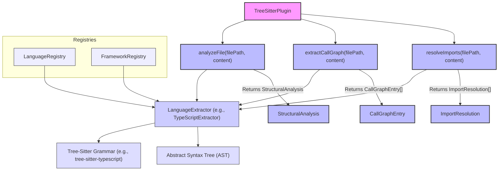

# Core Library (@understand-anything/core)

<details>
<summary>Relevant source files</summary>

The following files were used as context for generating this wiki page:

- [understand-anything-plugin/packages/core/src/__tests__/domain-normalize.test.ts](understand-anything-plugin/packages/core/src/__tests__/domain-normalize.test.ts)
- [understand-anything-plugin/packages/core/src/__tests__/domain-persistence.test.ts](understand-anything-plugin/packages/core/src/__tests__/domain-persistence.test.ts)
- [understand-anything-plugin/packages/core/src/__tests__/normalize-graph.test.ts](understand-anything-plugin/packages/core/src/__tests__/normalize-graph.test.ts)
- [understand-anything-plugin/packages/core/src/analyzer/normalize-graph.ts](understand-anything-plugin/packages/core/src/analyzer/normalize-graph.ts)
- [understand-anything-plugin/packages/core/src/index.ts](understand-anything-plugin/packages/core/src/index.ts)
- [understand-anything-plugin/packages/core/src/persistence/index.ts](understand-anything-plugin/packages/core/src/persistence/index.ts)
- [understand-anything-plugin/packages/core/src/persistence/persistence.test.ts](understand-anything-plugin/packages/core/src/persistence/persistence.test.ts)
- [understand-anything-plugin/packages/core/src/types.test.ts](understand-anything-plugin/packages/core/src/types.test.ts)
- [understand-anything-plugin/packages/core/src/types.ts](understand-anything-plugin/packages/core/src/types.ts)

</details>


The `@understand-anything/core` package is the foundational TypeScript library that provides the core data structures, schema validation, graph construction logic, search capabilities, persistence mechanisms, and the plugin architecture for the entire Understand Anything system. It defines the common language and contracts used across all components, from the analysis pipeline to the dashboard.

This page provides a high-level overview of the core library's responsibilities. For detailed information on each subsystem, please refer to the linked child pages.

## KnowledgeGraph Types & Schema

The core library defines the canonical data model for the KnowledgeGraph, which is the central artifact generated by the analysis pipeline. This includes a comprehensive set of `NodeType`s (21 types) and `EdgeType`s (35 types) to represent various code, non-code, domain, and knowledge entities and their relationships. Key interfaces like `GraphNode`, `GraphEdge`, `Layer`, `TourStep`, `ProjectMeta`, `DomainMeta`, and `KnowledgeMeta` establish the structure of the graph.

The library also implements a robust Zod-based validation pipeline, which includes `sanitizeGraph`, `normalizeGraph`, `autoFixGraph`, and `validateGraph` functions. This pipeline ensures data integrity by cleaning, normalizing, and validating the graph data at various stages of its lifecycle. Alias tables are used to handle variations in input data, such as different ways to express complexity levels.

For details, see [KnowledgeGraph Types & Schema](#3.1).

Sources:
- [understand-anything-plugin/packages/core/src/types.ts:1-116]()
- [understand-anything-plugin/packages/core/src/index.ts:4-12]()
- [understand-anything-plugin/packages/core/src/analyzer/normalize-graph.ts:1-25]()
- [understand-anything-plugin/packages/core/src/analyzer/normalize-graph.ts:113-142]()
- [understand-anything-plugin/packages/core/src/persistence/index.ts:5]()
- [understand-anything-plugin/packages/core/src/persistence/index.ts:94-101]()
- [understand-anything-plugin/packages/core/src/persistence/index.ts:171-178]()
- [understand-anything-plugin/packages/core/src/types.test.ts:1-117]()
- [understand-anything-plugin/packages/core/src/types.test.ts:120-143]()
- [understand-anything-plugin/packages/core/src/__tests__/normalize-graph.test.ts:124-185]()

### KnowledgeGraph Structure
```mermaid
graph TD
    KG[KnowledgeGraph] --> PM[ProjectMeta]
    KG --> GN[GraphNode[]]
    KG --> GE[GraphEdge[]]
    KG --> L[Layer[]]
    KG --> TS[TourStep[]]

    GN --> NT[NodeType]
    GN --> DM[DomainMeta]
    GN --> KM[KnowledgeMeta]
    GE --> ET[EdgeType]

    subgraph "Node Types (NodeType)"
        CodeNodes["file, function, class, module, concept"]
        NonCodeNodes["config, document, service, table, endpoint, pipeline, schema, resource"]
        DomainNodes["domain, flow, step"]
        KnowledgeNodes["article, entity, topic, claim, source"]
    end

    subgraph "Edge Types (EdgeType)"
        Structural["imports, exports, contains, inherits, implements"]
        Behavioral["calls, subscribes, publishes, middleware"]
        DataFlow["reads_from, writes_to, transforms, validates"]
        Dependencies["depends_on, tested_by, configures"]
        Semantic["related, similar_to"]
        InfraSchema["deploys, serves, provisions, triggers, migrates, documents, routes, defines_schema"]
        DomainEdges["contains_flow, flow_step, cross_domain"]
        KnowledgeEdges["cites, contradicts, builds_on, exemplifies, categorized_under, authored_by"]
    end

    NT --> CodeNodes
    NT --> NonCodeNodes
    NT --> DomainNodes
    NT --> KnowledgeNodes

    ET --> Structural
    ET --> Behavioral
    ET --> DataFlow
    ET --> Dependencies
    ET --> Semantic
    ET --> InfraSchema
    ET --> DomainEdges
    ET --> KnowledgeEdges

    style KG fill:#f9f,stroke:#333,stroke-width:2px
    style PM fill:#bbf,stroke:#333,stroke-width:2px
    style GN fill:#bbf,stroke:#333,stroke-width:2px
    style GE fill:#bbf,stroke:#333,stroke-width:2px
    style L fill:#bbf,stroke:#333,stroke-width:2px
    style TS fill:#bbf,stroke:#333,stroke-width:2px
    style NT fill:#ccf,stroke:#333,stroke-width:1px
    style ET fill:#ccf,stroke:#333,stroke-width:1px
    style DM fill:#ccf,stroke:#333,stroke-width:1px
    style KM fill:#ccf,stroke:#333,stroke-width:1px
```
Sources:
- [understand-anything-plugin/packages/core/src/types.ts:1-19]()
- [understand-anything-plugin/packages/core/src/types.ts:39-61]()
- [understand-anything-plugin/packages/core/src/types.ts:64-69]()
- [understand-anything-plugin/packages/core/src/types.ts:72-78]()
- [understand-anything-plugin/packages/core/src/types.ts:81-88]()
- [understand-anything-plugin/packages/core/src/types.ts:91-99]()

## GraphBuilder & LLM Analyzer

The `GraphBuilder` class is central to constructing the KnowledgeGraph. It provides methods like `addFile`, `addFileWithAnalysis`, and `addNonCodeFileWithAnalysis` to incrementally build the graph from various sources. This process involves leveraging LLM prompt builders such as `buildFileAnalysisPrompt` and `buildProjectSummaryPrompt` to extract semantic information from files. The `GraphBuilder` also incorporates logic for layer detection and tour generation, which are crucial for organizing and navigating the codebase.

For details, see [GraphBuilder & LLM Analyzer](#3.2).

Sources:
- [understand-anything-plugin/packages/core/src/index.ts:16]()
- [understand-anything-plugin/packages/core/src/index.ts:18-23]()
- [understand-anything-plugin/packages/core/src/index.ts:40-44]()
- [understand-anything-plugin/packages/core/src/index.ts:47-50]()

## Tree-Sitter Plugin & Language Extractors

The `TreeSitterPlugin` is a key component for deterministic code analysis. It utilizes Tree-Sitter grammars to perform structural analysis of code files, including extracting call graphs (`extractCallGraph`) and resolving imports (`resolveImports`). The plugin relies on an `LanguageExtractor` interface, with specific implementations for various languages like TypeScript, Python, Go, Rust, Java, C++, C#, Ruby, and PHP. The `LanguageRegistry` and `FrameworkRegistry` manage the configuration and discovery of these language-specific extractors and framework-specific analysis rules.

For details, see [Tree-Sitter Plugin & Language Extractors](#3.3).

Sources:
- [understand-anything-plugin/packages/core/src/index.ts:13]()
- [understand-anything-plugin/packages/core/src/index.ts:14-15]()
- [understand-anything-plugin/packages/core/src/index.ts:57-65]()
- [understand-anything-plugin/packages/core/src/types.ts:195-202]()

### Tree-Sitter Plugin Architecture

Sources:
- [understand-anything-plugin/packages/core/src/index.ts:13-15]()
- [understand-anything-plugin/packages/core/src/index.ts:57-65]()
- [understand-anything-plugin/packages/core/src/types.ts:169-181]()
- [understand-anything-plugin/packages/core/src/types.ts:183-187]()
- [understand-anything-plugin/packages/core/src/types.ts:189-193]()
- [understand-anything-plugin/packages/core/src/types.ts:195-202]()

## Non-Code Parsers

Beyond code, `@understand-anything/core` includes a suite of parsers for various non-code file types. These parsers are responsible for extracting structured information from files such as Markdown, YAML, JSON, TOML, Dockerfile, SQL, GraphQL, Protobuf, Terraform, Makefile, Shell scripts, and environment files. The extracted data is then mapped to appropriate `GraphNode` types like `table`, `service`, or `resource`, enriching the KnowledgeGraph with infrastructure and configuration details.

For details, see [Non-Code Parsers](#3.4).

Sources:
- [understand-anything-plugin/packages/core/src/index.ts:104-118]()
- [understand-anything-plugin/packages/core/src/types.ts:123-160]()
- [understand-anything-plugin/packages/core/src/types.ts:175-181]()
- [understand-anything-plugin/packages/core/src/types.test.ts:145-162]()
- [understand-anything-plugin/packages/core/src/types.test.ts:164-178]()
- [understand-anything-plugin/packages/core/src/__tests__/normalize-graph.test.ts:103-117]()

## Search, Persistence & Incremental Updates

The core library provides robust mechanisms for searching, persisting, and incrementally updating the KnowledgeGraph. It includes a `SearchEngine` for fuzzy search (powered by Fuse.js) and a `SemanticSearchEngine` for embedding-based semantic search using cosine similarity.

The persistence layer handles reading and writing the KnowledgeGraph, `AnalysisMeta`, `ProjectConfig`, and `FingerprintStore` to disk, ensuring that absolute file paths are sanitized (`sanitiseFilePaths`) before storage to prevent leakage of local directory structures.

For incremental updates, the system uses file fingerprinting (`FileFingerprint`, `contentHash`) to detect changes. A `change-classifier` (`classifyUpdate`) determines the `ChangeLevel` (e.g., `SKIP`, `PARTIAL_UPDATE`, `ARCHITECTURE_UPDATE`, `FULL_UPDATE`) and `staleness` of the graph, allowing for efficient updates without re-analyzing the entire codebase.

For details, see [Search, Persistence & Incremental Updates](#3.5).

Sources:
- [understand-anything-plugin/packages/core/src/index.ts:2-3]()
- [understand-anything-plugin/packages/core/src/index.ts:32-33]()
- [understand-anything-plugin/packages/core/src/index.ts:35-38]()
- [understand-anything-plugin/packages/core/src/index.ts:80-83]()
- [understand-anything-plugin/packages/core/src/index.ts:84-98]()
- [understand-anything-plugin/packages/core/src/index.ts:100-102]()
- [understand-anything-plugin/packages/core/src/persistence/index.ts:1-11]()
- [understand-anything-plugin/packages/core/src/persistence/index.ts:21-67]()
- [understand-anything-plugin/packages/core/src/persistence/index.ts:69-83]()
- [understand-anything-plugin/packages/core/src/persistence/index.ts:85-105]()
- [understand-anything-plugin/packages/core/src/persistence/index.ts:107-111]()
- [understand-anything-plugin/packages/core/src/persistence/index.ts:113-116]()
- [understand-anything-plugin/packages/core/src/persistence/index.ts:118-121]()
- [understand-anything-plugin/packages/core/src/persistence/index.ts:123-131]()
- [understand-anything-plugin/packages/core/src/persistence/index.ts:133-136]()
- [understand-anything-plugin/packages/core/src/persistence/index.ts:138-147]()
- [understand-anything-plugin/packages/core/src/persistence/persistence.test.ts:1-10]()
- [understand-anything-plugin/packages/core/src/persistence/persistence.test.ts:77-83]()
- [understand-anything-plugin/packages/core/src/persistence/persistence.test.ts:85-91]()
- [understand-anything-plugin/packages/core/src/persistence/persistence.test.ts:117-123]()
- [understand-anything-plugin/packages/core/src/persistence/persistence.test.ts:125-131]()
- [understand-anything-plugin/packages/core/src/persistence/persistence.test.ts:139-143]()
- [understand-anything-plugin/packages/core/src/persistence/persistence.test.ts:157-162]()
- [understand-anything-plugin/packages/core/src/persistence/persistence.test.ts:164-168]()
- [understand-anything-plugin/packages/core/src/persistence/persistence.test.ts:180-184]()
- [understand-anything-plugin/packages/core/src/persistence/persistence.test.ts:186-190]()

## Plugin Registry & Discovery

The `@understand-anything/core` package establishes a flexible plugin architecture through the `PluginRegistry`. This registry is responsible for discovering and managing `AnalyzerPlugin` implementations, which extend the system's analysis capabilities. The `parsePluginConfig` and `serializePluginConfig` functions, along with `DEFAULT_PLUGIN_CONFIG`, facilitate the configuration and persistence of plugins. This design allows third-party developers to easily register and integrate their own analysis modules, enhancing the system's extensibility.

For details, see [Plugin Registry & Discovery](#3.6).

Sources:
- [understand-anything-plugin/packages/core/src/index.ts:57]()
- [understand-anything-plugin/packages/core/src/index.ts:73-78]()
- [understand-anything-plugin/packages/core/src/types.ts:195-202]()
- [understand-anything-plugin/packages/core/src/types.test.ts:180-188]()
