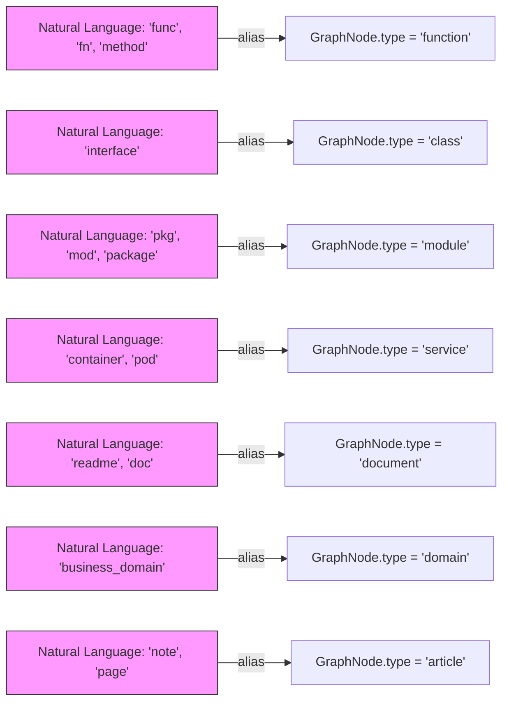
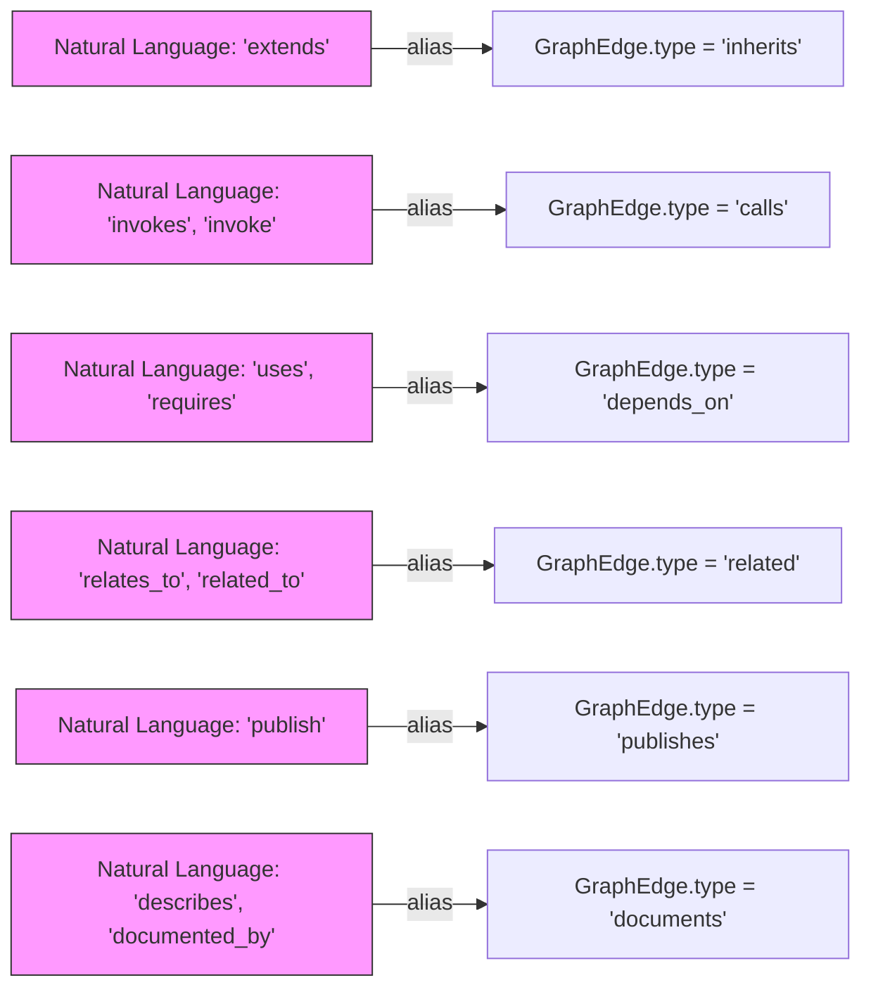

# KnowledgeGraph Types & Schema

<details>
<summary>Relevant source files</summary>

The following files were used as context for generating this wiki page:

- [understand-anything-plugin/packages/core/src/__tests__/domain-normalize.test.ts](understand-anything-plugin/packages/core/src/__tests__/domain-normalize.test.ts)
- [understand-anything-plugin/packages/core/src/__tests__/domain-persistence.test.ts](understand-anything-plugin/packages/core/src/__tests__/domain-persistence.test.ts)
- [understand-anything-plugin/packages/core/src/__tests__/domain-types.test.ts](understand-anything-plugin/packages/core/src/__tests__/domain-types.test.ts)
- [understand-anything-plugin/packages/core/src/__tests__/normalize-graph.test.ts](understand-anything-plugin/packages/core/src/__tests__/normalize-graph.test.ts)
- [understand-anything-plugin/packages/core/src/__tests__/plugin-discovery.test.ts](understand-anything-plugin/packages/core/src/__tests__/plugin-discovery.test.ts)
- [understand-anything-plugin/packages/core/src/__tests__/schema.test.ts](understand-anything-plugin/packages/core/src/__tests__/schema.test.ts)
- [understand-anything-plugin/packages/core/src/analyzer/normalize-graph.ts](understand-anything-plugin/packages/core/src/analyzer/normalize-graph.ts)
- [understand-anything-plugin/packages/core/src/index.ts](understand-anything-plugin/packages/core/src/index.ts)
- [understand-anything-plugin/packages/core/src/persistence/index.ts](understand-anything-plugin/packages/core/src/persistence/index.ts)
- [understand-anything-plugin/packages/core/src/persistence/persistence.test.ts](understand-anything-plugin/packages/core/src/persistence/persistence.test.ts)
- [understand-anything-plugin/packages/core/src/plugins/tree-sitter-plugin.ts](understand-anything-plugin/packages/core/src/plugins/tree-sitter-plugin.ts)
- [understand-anything-plugin/packages/core/src/schema.ts](understand-anything-plugin/packages/core/src/schema.ts)
- [understand-anything-plugin/packages/core/src/types.test.ts](understand-anything-plugin/packages/core/src/types.test.ts)
- [understand-anything-plugin/packages/core/src/types.ts](understand-anything-plugin/packages/core/src/types.ts)

</details>


This section documents the core KnowledgeGraph data contract employed in the Understand Anything system. It defines the canonical types for graph nodes (NodeType) and edges (EdgeType), key interfaces such as `GraphNode`, `GraphEdge`, `Layer`, `TourStep`, and project/domain/knowledge metadata types. The section also covers the robust schema validation pipeline based on Zod schemas, which performs sanitization, normalization (including alias resolution), auto-fixing, and final validation to guarantee integrity and consistency of the graph data at runtime.

---

## 1. KnowledgeGraph Data Model Overview

The KnowledgeGraph is a structured directed graph representing codebases, knowledge bases, or domain models. It is composed of:

- **Nodes (21 distinct types):** Representing code entities like files, functions, classes, modules, and concepts; non-code entities like configs, documents, services; domain-specific abstractions like domains, flows, steps; and knowledge entities such as articles, topics, claims, and sources.

- **Edges (35 distinct types):** Expressing relationships such as structural (imports, inherits), behavioral (calls, publishes), data flow (reads_from, transforms), dependencies (depends_on, tested_by), semantic (related, similar_to), infrastructure (deploys, serves), domain-specific (contains_flow, flow_step), and knowledge relationships (cites, contradicts).

- **Layers:** Logical groupings of nodes that correspond to architectural layers or other classifications.

- **Tour Steps:** Ordered sequences for guided exploration or learning of the graph.

- **ProjectMeta, DomainMeta, KnowledgeMeta:** Structured metadata describing the project context, domain-specific details, and knowledge-related annotations.


### Core TypeScript Interfaces

```ts
// Node types (21 total)
type NodeType =
  | "file" | "function" | "class" | "module" | "concept"
  | "config" | "document" | "service" | "table" | "endpoint"
  | "pipeline" | "schema" | "resource"
  | "domain" | "flow" | "step"
  | "article" | "entity" | "topic" | "claim" | "source";

// Edge types (35 total)
type EdgeType =
  | "imports" | "exports" | "contains" | "inherits" | "implements"  // Structural
  | "calls" | "subscribes" | "publishes" | "middleware"             // Behavioral
  | "reads_from" | "writes_to" | "transforms" | "validates"          // Data flow
  | "depends_on" | "tested_by" | "configures"                        // Dependencies
  | "related" | "similar_to"                                         // Semantic
  | "deploys" | "serves" | "provisions" | "triggers"                 // Infrastructure
  | "migrates" | "documents" | "routes" | "defines_schema"           // Schema/Data
  | "contains_flow" | "flow_step" | "cross_domain"                   // Domain
  | "cites" | "contradicts" | "builds_on" | "exemplifies" | "categorized_under" | "authored_by"; // Knowledge

// GraphNode interface
interface GraphNode {
  id: string;
  type: NodeType;
  name: string;
  filePath?: string;
  lineRange?: [number, number];
  summary: string;
  tags: string[];
  complexity: "simple" | "moderate" | "complex";
  languageNotes?: string;

  domainMeta?: DomainMeta;   // present if node is domain/flow/step type
  knowledgeMeta?: KnowledgeMeta;  // present if node is article/entity/topic/claim/source
}

// GraphEdge interface
interface GraphEdge {
  source: string;
  target: string;
  type: EdgeType;
  direction: "forward" | "backward" | "bidirectional";
  description?: string;
  weight: number; // expected range 0 to 1
}

// Layer grouping interface
interface Layer {
  id: string;
  name: string;
  description: string;
  nodeIds: string[];
}

// TourStep interface for guided graph tours
interface TourStep {
  order: number;
  title: string;
  description: string;
  nodeIds: string[];
  languageLesson?: string;
}

// ProjectMeta describes overall project info
interface ProjectMeta {
  name: string;
  languages: string[];
  frameworks: string[];
  description: string;
  analyzedAt: string;      // ISO date string
  gitCommitHash: string;
}

// DomainMeta optional metadata for domain nodes
interface DomainMeta {
  entities?: string[];
  businessRules?: string[];
  crossDomainInteractions?: string[];
  entryPoint?: string;
  entryType?: "http" | "cli" | "event" | "cron" | "manual";
}

// KnowledgeMeta optional metadata for knowledge nodes
interface KnowledgeMeta {
  wikilinks?: string[];
  backlinks?: string[];
  category?: string;
  content?: string;
}
```

These typings form the contract for the graph data consumed and output by all subsystems and persisted on disk [packages/core/src/types.ts:1-100]().

---

## 2. Type Aliases and Normalization

### 2.1 Node Type Aliases

Human-generated or LLM-generated graphs may use various synonyms or informal aliases for node types. To ensure consistency, a canonicalization mapping is defined, converting aliases to standard types:

- `func`, `fn`, `method` → `function`
- `interface`, `struct` → `class`
- `mod`, `pkg`, `package` → `module`
- Non-code aliases:
  - `container`, `deployment`, `pod` → `service`
  - `doc`, `readme`, `docs` → `document`
  - `job`, `ci` → `pipeline`
  - `route`, `api`, `query`, `mutation` → `endpoint`
  - `setting`, `env`, `configuration` → `config`
  - `infra`, `infrastructure`, `terraform` → `resource`
  - `migration`, `database`, `db`, `view` → `table`
  - `proto`, `protobuf`, `definition`, `typedef` → `schema`
- Domain aliases:
  - `business_domain` → `domain`
  - `business_flow`, `business_process` → `flow`
  - `task`, `business_step` → `step`
- Knowledge aliases:
  - `note`, `page`, `wiki_page` → `article`
  - `person`, `actor`, `organization` → `entity`
  - `tag`, `category`, `theme` → `topic`
  - `assertion`, `decision`, `thesis` → `claim`
  - `reference`, `raw`, `paper` → `source`

### 2.2 Edge Type Aliases

Similarly for edges, aliases such as:

- `extends` → `inherits`
- `invokes` → `calls`
- `uses`, `requires` → `depends_on`
- `relates_to`, `related_to` → `related`
- `similar` → `similar_to`
- `import` → `imports`
- `export` → `exports`
- `contain` → `contains`
- `publish` → `publishes`
- `subscribe` → `subscribes`
- Non-code aliases like `describes` → `documents`, `creates` → `provisions`, and domain aliases like `has_flow` → `contains_flow`

are normalized to canonical edge types.

### 2.3 Complexity and Direction Aliases

- Complexity values such as `low`, `easy` map to `simple`.
- Direction aliases such as `to` and `outbound` map to `forward`.
- Other typical normalizations maintain a consistent vocabulary.

The alias tables are centrally declared as constant records to facilitate this automatic normalization handled in the validation pipeline [packages/core/src/schema.ts:17-146]().

---

## 3. The Schema Validation Pipeline

The graph validation pipeline employs the Zod library schemas for structural validation, augmented by a series of preprocessing steps:

### Pipeline Stages

```mermaid
flowchart TD
  A[Raw Input Graph (JSON)] --> B[sanitizeGraph()]
  B --> C[autoFixGraph()]
  C --> D[normalizeGraph()]
  D --> E[validateGraph()]
  E -->|success| F[Validated KnowledgeGraph]
  E -->|failure| G[Validation Errors / Issues]
```

**Stage details:**

- **sanitizeGraph:** Cleanses the input by normalizing case, handling nulls, ensuring arrays for collections (`nodes`, `edges`, `layers`, `tour`), and preparing the graph structure for strict validation.

- **autoFixGraph:** Applies heuristics and defaulting:
  - Fills missing required fields with safe defaults (e.g., assigning `"file"` type node if none specified).
  - Clamps out-of-range numeric values like edge weights (always between 0 and 1).
  - Ensures `complexity` is set (defaults to `"moderate"`).
  - Adds or fixes missing identifiers and normalizes fields like `type` to canonical values using alias mappings.

- **normalizeGraph:** Converts IDs and references into canonical normalized forms; this includes:
  - For node IDs, ensuring the prefix corresponds to the node type (e.g., `func:` → `function:`).
  - Rewriting edges to match normalized node IDs.
  - Dropping dangling edges or nodes with unresolved references.
  - Deduplicating nodes and edges.

- **validateGraph:** Performs formal Zod schema validation validating types of all fields; it produces detailed success/failure output with human-readable issues.

This pipeline guards against corrupted, incomplete, or LLM-generated invalid graph data. Each stage contributes to heuristically improving and eventually verifying the graph [packages/core/src/schema.ts:148-330](), [packages/core/src/__tests__/schema.test.ts:3-150]().

---

## 4. KnowledgeGraph Zod Schema

The comprehensive Zod schema for the entire KnowledgeGraph structure validates:

- The project metadata fields and their types.
- That `nodes` is a non-empty array of objects matching `GraphNode`.
- That `edges` is an array of `GraphEdge` objects with correct enum values for type, direction, and numeric weight constraints.
- That `layers` and `tour` are arrays with correct subfield types.
- Correct usage of optional metadata fields like `domainMeta` and `knowledgeMeta`.

Validation failures include missing required fields, invalid enum values, duplicate IDs, and dangling references.

Usage example:

```ts
import { validateGraph } from "@understand-anything/core";

const result = validateGraph(graphJson);
if (result.success) {
  // Typed validated KnowledgeGraph available in result.data
} else {
  // Detailed issues in result.issues
}
```

This robust validation approach ensures the system always consumes well-formed, normalized graphs [packages/core/src/schema.ts:4-14, 180-330](), [packages/core/src/__tests__/schema.test.ts:60-150]().

---

## 5. Alias Resolution and Data Flows

The system relies heavily on the alias tables for node types, edge types, complexity, and direction to convert messy or LLM-generated data into the canonical vocabulary, enabling uniform downstream processing.

When validation is invoked, aliases in the incoming graph are first lowercased and replaced via alias tables. For example, a node typed `"func"` is normalized to `"function"`, and an edge typed `"extends"` becomes `"inherits"`.

After alias expansion, node and edge IDs are normalized using rules such as prefixing according to type and including path and name qualifiers to avoid ID collisions (important for step nodes in domains with flow discriminators).

### NodeID Normalization Example

```ts
normalizeNodeId("step:create-order:validate", {
  type: "step",
  name: "Validate",
  filePath: "src/validators/order.ts"
});
// Returns: "step:create-order:src/validators/order.ts:validate"
```

This normalization ensures unique consistent IDs and is critical for graph merging and referencing.

---

## 6. File Persistence and Sanitization

When graphs are saved to disk (e.g., in `.understand-anything/knowledge-graph.json`), file paths in nodes are sanitized so absolute paths outside the project root do not leak developer environment details.

- If a node's `filePath` is absolute and inside the project root, it is made relative.
- If absolute but outside the project root, only the basename (file name) is stored.
- Relative paths are preserved as-is.

This sanitization is critical for privacy concerns when storing and sharing graph data [packages/core/src/persistence/index.ts:21-67]().

---

## 7. GraphNode and GraphEdge Detailed Fields

| Field          | Description                                                                                     | Remarks                             |
|----------------|-------------------------------------------------------------------------------------------------|-----------------------------------|
| `id`           | Unique identifier for the node in canonical form (`type:filepath:name` style)                   | Normalized with `normalizeNodeId` |
| `type`         | One of 21 canonical `NodeType` strings                                                        | Enforced by validation             |
| `name`         | Human-readable name or label                                                                   | Required                          |
| `filePath`     | Optional relative file path                                                                    | Sanitized on persistence          |
| `lineRange`     | Optional `[startLine, endLine]` integer tuple                                                  | 1-based line numbers              |
| `summary`       | Short textual summary or docstring for the node                                                | Required                          |
| `tags`         | Array of tags for categorization                                                              | Empty array allowed               |
| `complexity`    | `"simple"` | `"moderate"` | `"complex"`                                                          | Normalized from aliases           |
| `languageNotes` | Optional language-specific annotations                                                        | e.g. TypeScript generics notes    |
| `domainMeta`    | Optional metadata for domain, flow, or step nodes                                              | Contains domain-specific info     |
| `knowledgeMeta` | Optional metadata for knowledge nodes (articles, claims, etc.)                                | External references, wikilinks    |

| Field      | Description                                                              | Remarks                   |
|------------|--------------------------------------------------------------------------|---------------------------|
| `source`  | ID of the source node                                                    | Required                  |
| `target`  | ID of the target node                                                    | Required                  |
| `type`    | One of 35 canonical `EdgeType` strings                                  | Enforced by validation    |
| `direction` | `"forward"` | `"backward"` | `"bidirectional"`                      | Normalized from aliases   |
| `weight`  | Numeric weight between 0 and 1 expressing edge strength/confidence      | Clamped during autofix    |
| `description` | Optional string elaborating on the relationship                     | Optional                  |

---

## 8. Natural Language to Code Entity Bridging Diagrams

These diagrams illustrate how system components bridge natural language concepts (e.g., nodes like "function", "class", "domain") to their internal code representations, leveraging alias normalization and type enums.

### Diagram 1: Node Type Aliases and Canonical Normalization



### Diagram 2: Edge Type Aliases and Canonical Normalization



These alias mappings enable the system to robustly interpret a wide variety of informal or LLM-inspired labels into the fixed known schema [packages/core/src/schema.ts:17-125]().

---

## 9. Key Functions & Classes

| Exported Function/Class  | Responsibilities                                                                                              | Source & Lines           |
|-------------------------|--------------------------------------------------------------------------------------------------------------|-------------------------|
| `sanitizeGraph(data)`   | Cleans incoming raw graph data, normalizes cases, handles nulls, ensures arrays are not null                 | `schema.ts:148-194`      |
| `autoFixGraph(data)`    | Auto-corrects missing or invalid fields (types, complexity, weights), adds defaults                          | `schema.ts:196-310`      |
| `validateGraph(data)`   | Runs the full Zod schema validation, returns success/failure with issue reports                              | `schema.ts:330-400`      |
| `normalizeNodeId(id, node)` | Converts node IDs to canonical `type:path:name` format with well-defined prefixes to avoid clashes        | `normalize-graph.ts:31-110` |
| `normalizeComplexity(value)` | Maps complexity string/numeric aliases to canonical set (`simple`, `moderate`, `complex`)                  | `normalize-graph.ts:134-152` |
| `sanitizeFilePaths(graph, projectRoot)` | Makes all node file paths relative or strips them appropriately for persistence, avoiding info leakage          | `persistence/index.ts:38-67` |
| `saveGraph(projectRoot, graph)` | Saves the graph JSON to `.understand-anything/knowledge-graph.json` with path sanitization               | `persistence/index.ts:69-83` |
| `loadGraph(projectRoot, options)` | Loads and validates graph JSON from disk with option to skip validation                                   | `persistence/index.ts:84-105` |

These functions enforce data consistency throughout the lifecycle from analysis output → disk → internal usage → visualization [packages/core/src/schema.ts]() and [packages/core/src/analyzer/normalize-graph.ts](), [packages/core/src/persistence/index.ts]().

---

## 10. Graph Structure Example

An example minimal graph node and edge structure after validation:

```json
{
  "nodes": [
    {
      "id": "file:src/index.ts",
      "type": "file",
      "name": "index.ts",
      "filePath": "src/index.ts",
      "lineRange": [1, 50],
      "summary": "Entry point",
      "tags": ["entry"],
      "complexity": "simple"
    }
  ],
  "edges": [
    {
      "source": "file:src/index.ts",
      "target": "file:src/index.ts",
      "type": "imports",
      "direction": "forward",
      "weight": 0.8
    }
  ],
  "layers": [
    {
      "id": "layer-1",
      "name": "Core",
      "description": "Core layer",
      "nodeIds": ["file:src/index.ts"]
    }
  ],
  "tour": [
    {
      "order": 1,
      "title": "Start here",
      "description": "Begin with the entry point",
      "nodeIds": ["file:src/index.ts"]
    }
  ],
  "project": {
    "name": "test-project",
    "languages": ["typescript"],
    "frameworks": ["vitest"],
    "description": "A test project",
    "analyzedAt": "2026-03-14T00:00:00.000Z",
    "gitCommitHash": "abc123"
  },
  "version": "1.0.0"
}
```

This structure is fully type-safe and normalized after applying alias resolution and validation [schema.test.ts:11-58]().

---

## Summary

- The KnowledgeGraph comprises rich, typed nodes and edges capturing code, domain, and knowledge artifacts.
- 21 NodeTypes and 35 EdgeTypes cover the broad domain of codebase and knowledge modeling.
- Aliases from natural language or LLMs are normalized to canonical types to maintain consistency.
- A multi-stage Zod-powered validation pipeline sanitizes, auto-fixes, normalizes IDs, and validates every graph instance.
- The persistent file format is sanitized to avoid path information leaks.
- The TypeScript interfaces provide strict typing to enable strong guarantees about graph data.
- The alias tables and normalization logic bridge human/LLM vocabulary to the strict graph schema.

---

# Appendix: Summary Mermaid Diagram - Full Graph Data Flow in Core Library

```mermaid
flowchart TD
  A[Analysis Output (Raw Graph)]
  B[sanitizeGraph()]
  C[autoFixGraph()]
  D[normalizeBatchOutput()]
  E[normalizeGraph()]
  F[validateGraph() with Zod]
  G[KnowledgeGraph (Validated, Typed)]
  H[saveGraph()]
  I[knowledge-graph.json on disk]
  J[loadGraph() + validateGraph()]
  K[Dashboard / UI / Skills]

  A --> B --> C --> D --> E --> F -->|success| G
  G --> H --> I
  I --> J --> F
  G --> K

  subgraph Alias Normalization & ID Canonicalization
    D --> E
  end

  classDef processStyle fill:#eee,stroke:#000,stroke-width:1px;
  class B,C,D,E,F,H,J processStyle;
```

---

# Sources

- `packages/core/src/types.ts:1-100`
- `packages/core/src/schema.ts:17-146,148-330`
- `packages/core/src/__tests__/schema.test.ts:3-150`
- `packages/core/src/analyzer/normalize-graph.ts:31-110,134-152`
- `packages/core/src/persistence/index.ts:21-67,69-105`
- `packages/core/src/__tests__/domain-types.test.ts:1-142`
- `packages/core/src/__tests__/domain-normalize.test.ts:1-47`
