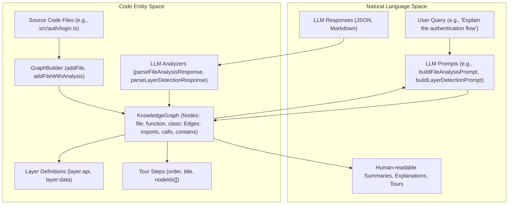

# GraphBuilder & LLM Analyzer

<details>
<summary>Relevant source files</summary>

The following files were used as context for generating this wiki page:

- [understand-anything-plugin/packages/core/src/__tests__/domain-normalize.test.ts](understand-anything-plugin/packages/core/src/__tests__/domain-normalize.test.ts)
- [understand-anything-plugin/packages/core/src/__tests__/language-lesson.test.ts](understand-anything-plugin/packages/core/src/__tests__/language-lesson.test.ts)
- [understand-anything-plugin/packages/core/src/__tests__/normalize-graph.test.ts](understand-anything-plugin/packages/core/src/__tests__/normalize-graph.test.ts)
- [understand-anything-plugin/packages/core/src/analyzer/graph-builder.test.ts](understand-anything-plugin/packages/core/src/analyzer/graph-builder.test.ts)
- [understand-anything-plugin/packages/core/src/analyzer/graph-builder.ts](understand-anything-plugin/packages/core/src/analyzer/graph-builder.ts)
- [understand-anything-plugin/packages/core/src/analyzer/normalize-graph.ts](understand-anything-plugin/packages/core/src/analyzer/normalize-graph.ts)
- [understand-anything-plugin/packages/core/src/index.ts](understand-anything-plugin/packages/core/src/index.ts)
- [understand-anything-plugin/packages/dashboard/public/knowledge-graph.json](understand-anything-plugin/packages/dashboard/public/knowledge-graph.json)
- [understand-anything-plugin/skills/understand-chat/SKILL.md](understand-anything-plugin/skills/understand-chat/SKILL.md)
- [understand-anything-plugin/skills/understand-diff/SKILL.md](understand-anything-plugin/skills/understand-diff/SKILL.md)
- [understand-anything-plugin/skills/understand-explain/SKILL.md](understand-anything-plugin/skills/understand-explain/SKILL.md)
- [understand-anything-plugin/skills/understand-onboard/SKILL.md](understand-anything-plugin/skills/understand-onboard/SKILL.md)
- [understand-anything-plugin/skills/understand/frameworks/django.md](understand-anything-plugin/skills/understand/frameworks/django.md)

</details>


This page details the core components responsible for constructing the KnowledgeGraph and leveraging Large Language Models (LLMs) for analysis. It covers the `GraphBuilder` class, which is central to populating the graph with nodes and edges, as well as the LLM prompt builders and related utilities for extracting insights, detecting architectural layers, and generating guided tours.

## GraphBuilder: Constructing the KnowledgeGraph

The `GraphBuilder` class [understand-anything-plugin/packages/core/src/analyzer/graph-builder.ts:60-370]() is the primary interface for adding nodes and edges to the KnowledgeGraph. It manages the internal lists of nodes and edges, ensures unique IDs, and tracks detected languages.

### Initialization and Core Properties

The `GraphBuilder` is initialized with a `projectName` and `gitHash`, which become part of the `project` metadata in the final `KnowledgeGraph` [understand-anything-plugin/packages/core/src/analyzer/graph-builder.ts:70-74](). It also uses a `LanguageRegistry` to detect the language of files based on their paths [understand-anything-plugin/packages/core/src/analyzer/graph-builder.ts:76-77]().

```typescript
class GraphBuilder {
  private readonly nodes: GraphNode[] = [];
  private readonly edges: GraphEdge[] = [];
  private readonly languages = new Set<string>();
  private readonly nodeIds = new Set<string>();
  private readonly edgeKeys = new Set<string>();
  private readonly projectName: string;
  private readonly gitHash: string;
  private readonly languageRegistry: LanguageRegistry;

  constructor(projectName: string, gitHash: string, languageRegistry?: LanguageRegistry) {
    this.projectName = projectName;
    this.gitHash = gitHash;
    this.languageRegistry = languageRegistry ?? LanguageRegistry.createDefault();
  }
  // ... methods
}
```
Sources:
- [understand-anything-plugin/packages/core/src/analyzer/graph-builder.ts:60-74]()

### Adding Files and Analysis Results

The `GraphBuilder` provides several methods for adding different types of files and their associated analysis:

#### `addFile(filePath: string, meta: FileMeta)`
This method adds a generic file node to the graph. It automatically detects the file's language and creates a node of type `"file"` [understand-anything-plugin/packages/core/src/analyzer/graph-builder.ts:84-102]().

#### `addFileWithAnalysis(filePath: string, analysis: StructuralAnalysis, meta: FileAnalysisMeta)`
For code files that have undergone structural analysis (e.g., via Tree-Sitter), this method adds the file node itself, along with its contained functions and classes as separate nodes. It also creates `"contains"` edges linking the file to its functions and classes [understand-anything-plugin/packages/core/src/analyzer/graph-builder.ts:105-177](). The `meta` object includes summaries for the file and its contained entities.

#### `addNonCodeFile(filePath: string, meta: NonCodeFileMeta)`
This method is used for non-code files (e.g., configuration files, documentation). It creates a node whose type is determined by `meta.nodeType` (e.g., `"config"`, `"document"`, `"service"`) [understand-anything-plugin/packages/core/src/analyzer/graph-builder.ts:210-226]().

#### `addNonCodeFileWithAnalysis(filePath: string, meta: NonCodeFileAnalysisMeta)`
Similar to `addFileWithAnalysis`, this method handles non-code files that have structured analysis results. It can create child nodes for definitions (tables, schemas), services, endpoints, steps, resources, and sections, linking them to the parent non-code file via `"contains"` edges [understand-anything-plugin/packages/core/src/analyzer/graph-builder.ts:228-320](). The `KIND_TO_NODE_TYPE` mapping [understand-anything-plugin/packages/core/src/analyzer/graph-builder.ts:39-57]() helps determine the appropriate node type for various definitions (e.g., `table`, `message`, `route`).

### Adding Edges

The `GraphBuilder` supports adding various types of relationships between nodes:

*   **`addImportEdge(fromFile: string, toFile: string)`**: Creates an `"imports"` edge between two file nodes [understand-anything-plugin/packages/core/src/analyzer/graph-builder.ts:179-190]().
*   **`addCallEdge(callerFile: string, callerFunc: string, calleeFile: string, calleeFunc: string)`**: Creates a `"calls"` edge between two function nodes [understand-anything-plugin/packages/core/src/analyzer/graph-builder.ts:192-208]().
*   **`addEdge(sourceId: string, targetId: string, type: GraphEdge["type"], direction: GraphEdge["direction"], weight: number)`**: A generic method to add any type of edge between two existing nodes [understand-anything-plugin/packages/core/src/analyzer/graph-builder.ts:322-333]().
*   **`addContainsEdge(parentId: string, childId: string)`**: A convenience method to add a `"contains"` edge [understand-anything-plugin/packages/core/src/analyzer/graph-builder.ts:335-344]().

### Building the Graph

The `build()` method [understand-anything-plugin/packages/core/src/analyzer/graph-builder.ts:346-370]() finalizes the graph construction. It aggregates all added nodes and edges, populates the `project` metadata (including detected languages), and initializes empty `layers` and `tour` arrays.

```typescript
// Diagram: GraphBuilder Data Flow
graph TD
    A[GraphBuilder Constructor] --> B{projectName, gitHash, LanguageRegistry}
    B --> C[Internal State: nodes[], edges[], languages Set]

    subgraph Add Operations
        D[addFile(filePath, meta)] --> C
        E[addFileWithAnalysis(filePath, analysis, meta)] --> C
        F[addNonCodeFile(filePath, meta)] --> C
        G[addNonCodeFileWithAnalysis(filePath, meta)] --> C
        H[addImportEdge(from, to)] --> C
        I[addCallEdge(caller, callee)] --> C
        J[addEdge(source, target, type, dir, weight)] --> C
    end

    C --> K[build()]
    K --> L[KnowledgeGraph Object]
    L -- includes --> M[Project Metadata]
    L -- includes --> N[Nodes Array]
    L -- includes --> O[Edges Array]
    L -- includes --> P[Empty Layers Array]
    L -- includes --> Q[Empty Tour Array]
```
Sources:
- [understand-anything-plugin/packages/core/src/analyzer/graph-builder.ts:60-370]()
- [understand-anything-plugin/packages/core/src/analyzer/graph-builder.test.ts:6-203]()

### Node ID Normalization

The `normalizeNodeId` function [understand-anything-plugin/packages/core/src/analyzer/normalize-graph.ts:64-111]() is crucial for ensuring consistency in node identifiers. It converts various forms of IDs (e.g., bare paths, double-prefixed IDs, project-name-prefixed IDs) into a canonical `type:path` format. This is important for reliable graph traversal and querying. For example, `my-project:file:src/foo.ts` becomes `file:src/foo.ts` [understand-anything-plugin/packages/core/src/analyzer/normalize-graph.test.ts:35-37](), and a bare `formatDate` for a function in `src/utils.ts` becomes `func:src/utils.ts:formatDate` [understand-anything-plugin/packages/core/src/analyzer/normalize-graph.test.ts:53-59]().

The `normalizeComplexity` function [understand-anything-plugin/packages/core/src/analyzer/normalize-graph.ts:134-152]() standardizes complexity values to "simple", "moderate", or "complex", handling various string aliases and numeric inputs.

Sources:
- [understand-anything-plugin/packages/core/src/analyzer/normalize-graph.ts:64-111]()
- [understand-anything-plugin/packages/core/src/analyzer/normalize-graph.ts:134-152]()
- [understand-anything-plugin/packages/core/src/__tests__/normalize-graph.test.ts:9-122]()
- [understand-anything-plugin/packages/core/src/__tests__/normalize-graph.test.ts:124-184]()

## LLM Analyzer: Prompt Builders and Parsers

The `@understand-anything/core` package includes utilities for interacting with LLMs to enrich the KnowledgeGraph. These are primarily found in `llm-analyzer.ts`, `layer-detector.ts`, and `tour-generator.ts`.

### File Analysis Prompt

The `buildFileAnalysisPrompt` function [understand-anything-plugin/packages/core/src/analyzer/llm-analyzer.ts:10-12]() generates a prompt for an LLM to analyze a single file. This prompt typically includes the file's content, its path, and instructions to extract structural information (functions, classes, imports, exports) and provide summaries. The `parseFileAnalysisResponse` function [understand-anything-plugin/packages/core/src/analyzer/llm-analyzer.ts:13-15]() then processes the LLM's JSON output into a structured `LLMFileAnalysis` object.

### Project Summary Prompt

The `buildProjectSummaryPrompt` function [understand-anything-plugin/packages/core/src/analyzer/llm-analyzer.ts:16-18]() creates a prompt for the LLM to generate a high-level summary of the entire project. This prompt would typically include a list of key files, their summaries, and potentially the overall graph structure. The `parseProjectSummaryResponse` function [understand-anything-plugin/packages/core/src/analyzer/llm-analyzer.ts:19-21]() extracts the structured `LLMProjectSummary` from the LLM's response.

### Layer Detection

Architectural layer detection is a critical step in understanding a codebase. The `layer-detector.ts` module provides the necessary tools:

*   **`buildLayerDetectionPrompt(graph: KnowledgeGraph)`**: This function [understand-anything-plugin/packages/core/src/analyzer/layer-detector.ts:10-12]() constructs a prompt for the LLM, providing it with the current KnowledgeGraph (nodes and edges) and asking it to identify logical architectural layers and assign nodes to them.
*   **`parseLayerDetectionResponse(response: string)`**: Parses the LLM's response, which is expected to be in a specific JSON format, into an `LLMLayerResponse` object [understand-anything-plugin/packages/core/src/analyzer/layer-detector.ts:13-15]().
*   **`applyLLMLayers(graph: KnowledgeGraph, llmLayers: LLMLayerResponse)`**: Integrates the detected layers from the LLM into the `KnowledgeGraph` object [understand-anything-plugin/packages/core/src/analyzer/layer-detector.ts:16-18]().

Framework-specific layer detection rules can be injected into the prompts. For example, the Django framework addendum [understand-anything-plugin/skills/understand/frameworks/django.md:48-60]() defines canonical layers like `layer:api`, `layer:data`, `layer:service`, etc., and specifies which file patterns and node types belong to each.

```mermaid
graph TD
    A[KnowledgeGraph] --> B{buildLayerDetectionPrompt}
    B --> C[LLM]
    C --> D[LLM Response (JSON)]
    D --> E{parseLayerDetectionResponse}
    E --> F[LLMLayerResponse Object]
    F --> G{applyLLMLayers}
    G --> H[KnowledgeGraph with Layers]

    subgraph Framework Specifics
        I[Django Framework Addendum] --> B
        I --> E
    end
```
Sources:
- [understand-anything-plugin/packages/core/src/analyzer/llm-analyzer.ts:10-23]()
- [understand-anything-plugin/packages/core/src/analyzer/layer-detector.ts:10-18]()
- [understand-anything-plugin/skills/understand/frameworks/django.md:48-60]()

### Tour Generation

The `tour-generator.ts` module facilitates the creation of guided tours through the codebase:

*   **`buildTourGenerationPrompt(graph: KnowledgeGraph)`**: Generates a prompt for the LLM to create a step-by-step learning tour based on the `KnowledgeGraph` [understand-anything-plugin/packages/core/src/analyzer/tour-generator.ts:10-12]().
*   **`parseTourGenerationResponse(response: string)`**: Parses the LLM's JSON response into a structured tour object [understand-anything-plugin/packages/core/src/analyzer/tour-generator.ts:13-15]().
*   **`generateHeuristicTour(graph: KnowledgeGraph)`**: Provides a heuristic-based approach to tour generation, which can serve as a fallback or complement to LLM-generated tours [understand-anything-plugin/packages/core/src/analyzer/tour-generator.ts:16-18](). This typically involves traversing the graph using algorithms like Breadth-First Search (BFS) and ranking nodes by importance (e.g., fan-in count).

The generated tours are stored in the `tour` array of the `KnowledgeGraph` [understand-anything-plugin/skills/understand-onboard/SKILL.md:22]().

```mermaid
graph TD
    A[KnowledgeGraph] --> B{buildTourGenerationPrompt}
    B --> C[LLM]
    C --> D[LLM Response (JSON)]
    D --> E{parseTourGenerationResponse}
    E --> F[Tour Object]
    A --> G{generateHeuristicTour}
    G --> F
    F --> H[KnowledgeGraph with Tour]
```
Sources:
- [understand-anything-plugin/packages/core/src/analyzer/tour-generator.ts:10-18]()
- [understand-anything-plugin/skills/understand-onboard/SKILL.md:22]()

### Language Lesson

The `language-lesson.ts` module helps in understanding language-specific concepts within a code component:

*   **`buildLanguageLessonPrompt(node: GraphNode, edges: GraphEdge[], language: string, languageConfig?: LanguageConfig)`**: Creates a prompt for the LLM to explain language-specific patterns or concepts present in a given `GraphNode` and its surrounding `GraphEdge`s [understand-anything-plugin/packages/core/src/analyzer/language-lesson.ts:3-6]().
*   **`parseLanguageLessonResponse(response: string)`**: Parses the LLM's response, extracting `languageNotes` and a list of `concepts` with their explanations [understand-anything-plugin/packages/core/src/analyzer/language-lesson.ts:7-9]().
*   **`detectLanguageConcepts(node: GraphNode, language: string)`**: Heuristically detects common language concepts (e.g., "async/await", "middleware pattern") based on node tags and language [understand-anything-plugin/packages/core/src/analyzer/language-lesson.ts:10-12]().

Sources:
- [understand-anything-plugin/packages/core/src/analyzer/language-lesson.ts:3-12]()
- [understand-anything-plugin/packages/core/src/__tests__/language-lesson.test.ts:3-157]()

## Bridging Natural Language Space to Code Entity Space

The LLM analysis components are designed to bridge the gap between human-understandable natural language descriptions and the structured code entities within the KnowledgeGraph.


Sources:
- [understand-anything-plugin/packages/core/src/analyzer/graph-builder.ts]()
- [understand-anything-plugin/packages/core/src/analyzer/llm-analyzer.ts]()
- [understand-anything-plugin/packages/core/src/analyzer/layer-detector.ts]()
- [understand-anything-plugin/packages/core/src/analyzer/tour-generator.ts]()
- [understand-anything-plugin/skills/understand-chat/SKILL.md]()
- [understand-anything-plugin/skills/understand-explain/SKILL.md]()
- [understand-anything-plugin/skills/understand-onboard/SKILL.md]()
- [understand-anything-plugin/skills/understand-diff/SKILL.md]()

The `SKILL.md` files for various commands (`/understand-chat`, `/understand-explain`, `/understand-onboard`, `/understand-diff`) demonstrate how the LLM interacts with the `KnowledgeGraph`. They instruct the LLM to:
*   **Read project metadata**: Extract `project` details like name, languages, frameworks [understand-anything-plugin/skills/understand-chat/SKILL.md:35-36]().
*   **Search for relevant nodes**: Use keywords to find nodes by `name`, `summary`, or `tags` [understand-anything-plugin/skills/understand-chat/SKILL.md:38-42]().
*   **Find connected edges**: Identify 1-hop relationships (incoming/outgoing calls, imports, dependencies) to understand context [understand-anything-plugin/skills/understand-chat/SKILL.md:44-48]().
*   **Identify layers**: Determine which architectural layers are involved [understand-anything-plugin/skills/understand-chat/SKILL.md:49]().
*   **Generate structured output**: Produce explanations, onboarding guides, or diff analyses based on the extracted graph data [understand-anything-plugin/skills/understand-explain/SKILL.md:54-59]().

This iterative process of querying the graph, extracting relevant subgraphs, and feeding them to the LLM allows for detailed, context-aware analysis and generation of human-readable insights.

Sources:
- [understand-anything-plugin/skills/understand-chat/SKILL.md:35-56]()
- [understand-anything-plugin/skills/understand-explain/SKILL.md:36-59]()
- [understand-anything-plugin/skills/understand-onboard/SKILL.md:35-52]()
- [understand-anything-plugin/skills/understand-diff/SKILL.md:40-59]()
