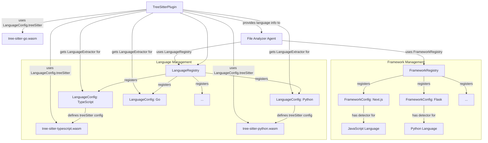

# Tree-Sitter Plugin & Language Extractors

<details>
<summary>Relevant source files</summary>

The following files were used as context for generating this wiki page:

- [docs/superpowers/plans/2026-04-15-language-extractors-impl.md](docs/superpowers/plans/2026-04-15-language-extractors-impl.md)
- [docs/superpowers/plans/2026-06-03-language-auto-detection.md](docs/superpowers/plans/2026-06-03-language-auto-detection.md)
- [docs/superpowers/specs/2026-06-03-language-auto-detection-design.md](docs/superpowers/specs/2026-06-03-language-auto-detection-design.md)
- [understand-anything-plugin/packages/core/src/__tests__/domain-types.test.ts](understand-anything-plugin/packages/core/src/__tests__/domain-types.test.ts)
- [understand-anything-plugin/packages/core/src/__tests__/framework-registry.test.ts](understand-anything-plugin/packages/core/src/__tests__/framework-registry.test.ts)
- [understand-anything-plugin/packages/core/src/__tests__/language-registry.test.ts](understand-anything-plugin/packages/core/src/__tests__/language-registry.test.ts)
- [understand-anything-plugin/packages/core/src/__tests__/plugin-discovery.test.ts](understand-anything-plugin/packages/core/src/__tests__/plugin-discovery.test.ts)
- [understand-anything-plugin/packages/core/src/__tests__/schema.test.ts](understand-anything-plugin/packages/core/src/__tests__/schema.test.ts)
- [understand-anything-plugin/packages/core/src/languages/configs/c.ts](understand-anything-plugin/packages/core/src/languages/configs/c.ts)
- [understand-anything-plugin/packages/core/src/languages/configs/cpp.ts](understand-anything-plugin/packages/core/src/languages/configs/cpp.ts)
- [understand-anything-plugin/packages/core/src/languages/configs/csharp.ts](understand-anything-plugin/packages/core/src/languages/configs/csharp.ts)
- [understand-anything-plugin/packages/core/src/languages/configs/go.ts](understand-anything-plugin/packages/core/src/languages/configs/go.ts)
- [understand-anything-plugin/packages/core/src/languages/configs/index.ts](understand-anything-plugin/packages/core/src/languages/configs/index.ts)
- [understand-anything-plugin/packages/core/src/languages/configs/java.ts](understand-anything-plugin/packages/core/src/languages/configs/java.ts)
- [understand-anything-plugin/packages/core/src/languages/configs/javascript.ts](understand-anything-plugin/packages/core/src/languages/configs/javascript.ts)
- [understand-anything-plugin/packages/core/src/languages/configs/lua.ts](understand-anything-plugin/packages/core/src/languages/configs/lua.ts)
- [understand-anything-plugin/packages/core/src/languages/configs/php.ts](understand-anything-plugin/packages/core/src/languages/configs/php.ts)
- [understand-anything-plugin/packages/core/src/languages/configs/python.ts](understand-anything-plugin/packages/core/src/languages/configs/python.ts)
- [understand-anything-plugin/packages/core/src/languages/configs/ruby.ts](understand-anything-plugin/packages/core/src/languages/configs/ruby.ts)
- [understand-anything-plugin/packages/core/src/languages/configs/rust.ts](understand-anything-plugin/packages/core/src/languages/configs/rust.ts)
- [understand-anything-plugin/packages/core/src/languages/configs/typescript.ts](understand-anything-plugin/packages/core/src/languages/configs/typescript.ts)
- [understand-anything-plugin/packages/core/src/languages/framework-registry.ts](understand-anything-plugin/packages/core/src/languages/framework-registry.ts)
- [understand-anything-plugin/packages/core/src/languages/frameworks/django.ts](understand-anything-plugin/packages/core/src/languages/frameworks/django.ts)
- [understand-anything-plugin/packages/core/src/languages/frameworks/express.ts](understand-anything-plugin/packages/core/src/languages/frameworks/express.ts)
- [understand-anything-plugin/packages/core/src/languages/frameworks/fastapi.ts](understand-anything-plugin/packages/core/src/languages/frameworks/fastapi.ts)
- [understand-anything-plugin/packages/core/src/languages/frameworks/flask.ts](understand-anything-plugin/packages/core/src/languages/frameworks/flask.ts)
- [understand-anything-plugin/packages/core/src/languages/frameworks/gin.ts](understand-anything-plugin/packages/core/src/languages/frameworks/gin.ts)
- [understand-anything-plugin/packages/core/src/languages/frameworks/nextjs.ts](understand-anything-plugin/packages/core/src/languages/frameworks/nextjs.ts)
- [understand-anything-plugin/packages/core/src/languages/frameworks/rails.ts](understand-anything-plugin/packages/core/src/languages/frameworks/rails.ts)
- [understand-anything-plugin/packages/core/src/plugins/extractors/__tests__/cpp-extractor.test.ts](understand-anything-plugin/packages/core/src/plugins/extractors/__tests__/cpp-extractor.test.ts)
- [understand-anything-plugin/packages/core/src/plugins/extractors/__tests__/csharp-extractor.test.ts](understand-anything-plugin/packages/core/src/plugins/extractors/__tests__/csharp-extractor.test.ts)
- [understand-anything-plugin/packages/core/src/plugins/extractors/__tests__/go-extractor.test.ts](understand-anything-plugin/packages/core/src/plugins/extractors/__tests__/go-extractor.test.ts)
- [understand-anything-plugin/packages/core/src/plugins/extractors/__tests__/java-extractor.test.ts](understand-anything-plugin/packages/core/src/plugins/extractors/__tests__/java-extractor.test.ts)
- [understand-anything-plugin/packages/core/src/plugins/extractors/__tests__/php-extractor.test.ts](understand-anything-plugin/packages/core/src/plugins/extractors/__tests__/php-extractor.test.ts)
- [understand-anything-plugin/packages/core/src/plugins/extractors/__tests__/python-extractor.test.ts](understand-anything-plugin/packages/core/src/plugins/extractors/__tests__/python-extractor.test.ts)
- [understand-anything-plugin/packages/core/src/plugins/extractors/__tests__/rust-extractor.test.ts](understand-anything-plugin/packages/core/src/plugins/extractors/__tests__/rust-extractor.test.ts)
- [understand-anything-plugin/packages/core/src/plugins/extractors/base-extractor.ts](understand-anything-plugin/packages/core/src/plugins/extractors/base-extractor.ts)
- [understand-anything-plugin/packages/core/src/plugins/extractors/cpp-extractor.ts](understand-anything-plugin/packages/core/src/plugins/extractors/cpp-extractor.ts)
- [understand-anything-plugin/packages/core/src/plugins/extractors/csharp-extractor.ts](understand-anything-plugin/packages/core/src/plugins/extractors/csharp-extractor.ts)
- [understand-anything-plugin/packages/core/src/plugins/extractors/go-extractor.ts](understand-anything-plugin/packages/core/src/plugins/extractors/go-extractor.ts)
- [understand-anything-plugin/packages/core/src/plugins/extractors/java-extractor.ts](understand-anything-plugin/packages/core/src/plugins/extractors/java-extractor.ts)
- [understand-anything-plugin/packages/core/src/plugins/extractors/php-extractor.ts](understand-anything-plugin/packages/core/src/plugins/extractors/php-extractor.ts)
- [understand-anything-plugin/packages/core/src/plugins/extractors/python-extractor.ts](understand-anything-plugin/packages/core/src/plugins/extractors/python-extractor.ts)
- [understand-anything-plugin/packages/core/src/plugins/extractors/rust-extractor.ts](understand-anything-plugin/packages/core/src/plugins/extractors/rust-extractor.ts)
- [understand-anything-plugin/packages/core/src/plugins/extractors/types.ts](understand-anything-plugin/packages/core/src/plugins/extractors/types.ts)
- [understand-anything-plugin/packages/core/src/plugins/extractors/typescript-extractor.ts](understand-anything-plugin/packages/core/src/plugins/extractors/typescript-extractor.ts)
- [understand-anything-plugin/packages/core/src/plugins/tree-sitter-plugin.ts](understand-anything-plugin/packages/core/src/plugins/tree-sitter-plugin.ts)
- [understand-anything-plugin/packages/core/src/schema.ts](understand-anything-plugin/packages/core/src/schema.ts)

</details>


This page details the `TreeSitterPlugin`, a core component responsible for deep structural analysis of codebases using Tree-Sitter parsers. It covers the plugin's initialization, its methods for analyzing files, extracting call graphs, and resolving imports. We will also explore the `LanguageExtractor` interface, its various language-specific implementations (TypeScript, Python, Go, Rust, Java, C++, C#, Ruby, PHP), and how languages and frameworks are managed via the `LanguageRegistry` and `FrameworkRegistry`.

## TreeSitterPlugin

The `TreeSitterPlugin` is an `AnalyzerPlugin` that leverages Tree-Sitter to perform detailed structural analysis of source code files. It supports a wide range of programming languages by loading their respective Tree-Sitter grammars and using specialized `LanguageExtractor` implementations.

### Initialization (`init`)

The `init()` method [packages/core/src/plugins/tree-sitter-plugin.ts:124-197]() is an asynchronous function that loads the `web-tree-sitter` module and all configured language grammars. It must be called and awaited before any synchronous analysis methods can be used.

If language configurations are provided during construction, it loads grammars based on the `treeSitter` field in each `LanguageConfig` [packages/core/src/plugins/tree-sitter-plugin.ts:134-172](). If no configurations are given, it defaults to loading TypeScript and JavaScript grammars for backward compatibility [packages/core/src/plugins/tree-sitter-plugin.ts:174-194](). Special handling exists for TypeScript to also load the TSX grammar if available [packages/core/src/plugins/tree-sitter-plugin.ts:150-159]().

```mermaid
graph TD
    A[TreeSitterPlugin Constructor] --> B{Configs Provided?};
    B -- Yes --> C[Filter configs with treeSitter field];
    B -- No --> D[Default to TypeScript/JavaScript configs];
    C --> E[Populate this.configs, this.languages, this._extensionToLang];
    D --> E;
    E --> F{Extractors Provided?};
    F -- Yes --> G[Register provided extractors];
    F -- No --> H[Register all builtinExtractors];
    G --> I[TreeSitterPlugin Instance Ready];
    H --> I;

    subgraph Initialization (async init())
        I --> J[Call init()];
        J --> K[Import web-tree-sitter];
        K --> L[Initialize ParserClass];
        L --> M{this.configs.length > 0?};
        M -- Yes --> N[Load grammars from this.configs];
        M -- No --> O[Load legacy TS/JS grammars];
        N --> P[Store loaded languages in this._languages];
        O --> P;
        P --> Q[Set _initialized = true];
        Q --> R[Initialization Complete];
    end
```
**Diagram: TreeSitterPlugin Initialization Flow**
Sources: [packages/core/src/plugins/tree-sitter-plugin.ts:56-96](), [packages/core/src/plugins/tree-sitter-plugin.ts:124-197]()

### File Analysis (`analyzeFile`)

The `analyzeFile()` method [packages/core/src/plugins/tree-sitter-plugin.ts:220-259]() takes a file path and its content, determines the language, and then uses the appropriate `LanguageExtractor` to perform structural analysis. It returns a `StructuralAnalysis` object containing functions, classes, imports, and exports found in the file.

If no extractor is found for the file's language, or if the Tree-Sitter grammar is not loaded, it gracefully skips the structural analysis for that file [packages/core/src/plugins/tree-sitter-plugin.ts:226-228]().

### Call Graph Extraction (`extractCallGraph`)

The `extractCallGraph()` method [packages/core/src/plugins/tree-sitter-plugin.ts:261-280]() is responsible for identifying function calls within a file. Similar to `analyzeFile`, it uses the language-specific extractor to traverse the AST and build a list of `CallGraphEntry` objects, each specifying a `caller`, `callee`, and `lineNumber`.

### Import Resolution (`resolveImports`)

The `resolveImports()` method [packages/core/src/plugins/tree-sitter-plugin.ts:282-301]() extracts import statements from a file and attempts to resolve them to their corresponding file paths. This is crucial for building the `imports` and `exports` edges in the Knowledge Graph. It relies on the `resolveImportPath` method of the specific `LanguageExtractor`.

```mermaid
graph TD
    A[analyzeFile(filePath, fileContent)] --> B{Get Language Key from filePath};
    B -- No Language --> C[Return empty StructuralAnalysis];
    B -- Language Found --> D{Get Parser for Language};
    D -- No Parser --> C;
    D -- Parser Found --> E[Parse fileContent into AST];
    E --> F{Get LanguageExtractor for Language};
    F -- No Extractor --> C;
    F -- Extractor Found --> G[extractor.extractStructure(rootNode)];
    G --> H[Return StructuralAnalysis];

    I[extractCallGraph(filePath, fileContent)] --> J{Get Language Key from filePath};
    J -- No Language --> K[Return empty CallGraphEntry[]];
    J -- Language Found --> L{Get Parser for Language};
    L -- No Parser --> K;
    L -- Parser Found --> M[Parse fileContent into AST];
    M --> N{Get LanguageExtractor for Language};
    N -- No Extractor --> K;
    N -- Extractor Found --> O[extractor.extractCallGraph(rootNode)];
    O --> P[Return CallGraphEntry[]];

    Q[resolveImports(filePath, fileContent)] --> R{Get Language Key from filePath};
    R -- No Language --> S[Return empty ImportResolution];
    R -- Language Found --> T{Get Parser for Language};
    T -- No Parser --> S;
    T -- Parser Found --> U[Parse fileContent into AST];
    U --> V{Get LanguageExtractor for Language};
    V -- No Extractor --> S;
    V -- Extractor Found --> W[extractor.resolveImportPath(importPath, currentFilePath)];
    W --> X[Return ImportResolution];
```
**Diagram: TreeSitterPlugin Analysis Methods**
Sources: [packages/core/src/plugins/tree-sitter-plugin.ts:220-301]()

## LanguageExtractor Interface

The `LanguageExtractor` interface [packages/core/src/plugins/extractors/types.ts:1-10]() defines the contract for language-specific code analysis. Each implementation must provide:

- `languageIds`: An array of string identifiers for the languages it supports (e.g., `["typescript", "javascript"]`).
- `extractStructure(rootNode: TreeSitterNode)`: Extracts high-level structural information like functions, classes, imports, and exports.
- `extractCallGraph(rootNode: TreeSitterNode)`: Extracts function/method call relationships.
- `resolveImportPath(importPath: string, currentFilePath: string)`: (Optional) Resolves an import string to a canonical file path.

```typescript
// packages/core/src/plugins/extractors/types.ts
export interface LanguageExtractor {
  readonly languageIds: string[];
  extractStructure(rootNode: TreeSitterNode): StructuralAnalysis;
  extractCallGraph(rootNode: TreeSitterNode): CallGraphEntry[];
  resolveImportPath?(
    importPath: string,
    currentFilePath: string,
  ): string | null;
}
```
Sources: [packages/core/src/plugins/extractors/types.ts:1-10]()

## Per-Language Extractor Implementations

The `Understand-Anything` codebase includes a suite of `LanguageExtractor` implementations for various popular programming languages. These extractors parse the Abstract Syntax Tree (AST) generated by Tree-Sitter and transform it into the `StructuralAnalysis` and `CallGraphEntry` formats used by the Knowledge Graph.

All builtin extractors are registered by default if no custom extractors are provided to the `TreeSitterPlugin` constructor [packages/core/src/plugins/tree-sitter-plugin.ts:93-96]().

### TypeScript/JavaScript (`TypeScriptExtractor`)

The `TypeScriptExtractor` [packages/core/src/plugins/extractors/typescript-extractor.ts:106-107]() handles both TypeScript and JavaScript.

- **`extractStructure`**:
    - Identifies `function_declaration`, `class_declaration`, `lexical_declaration`, `variable_declaration`, `import_statement`, and `export_statement` nodes [packages/core/src/plugins/extractors/typescript-extractor.ts:207-234]().
    - Extracts function names, parameters, and return types [packages/core/src/plugins/extractors/typescript-extractor.ts:237-269]().
    - Extracts class names, methods, and properties [packages/core/src/plugins/extractors/typescript-extractor.ts:271-309]().
    - Parses import statements, including named, namespace, and default imports [packages/core/src/plugins/extractors/typescript-extractor.ts:311-329]().
    - Determines exports from `export_statement` nodes [packages/core/src/plugins/extractors/typescript-extractor.ts:331-379]().
- **`extractCallGraph`**:
    - Traverses the AST, maintaining a `functionStack` to track the current function scope [packages/core/src/plugins/extractors/typescript-extractor.ts:134-167]().
    - When a `call_expression` is encountered, it records the `caller` (from the stack) and `callee` (from the expression) [packages/core/src/plugins/extractors/typescript-extractor.ts:170-177]().

### Python (`PythonExtractor`)

The `PythonExtractor` [packages/core/src/plugins/extractors/python-extractor.ts:100-101]() supports Python.

- **`extractStructure`**:
    - Processes `function_definition`, `class_definition`, and `import_statement` nodes [packages/core/src/plugins/extractors/python-extractor.ts:126-148]().
    - Extracts function names and parameters [packages/core/src/plugins/extractors/python-extractor.ts:151-169]().
    - Extracts class names, methods, and properties [packages/core/src/plugins/extractors/python-extractor.ts:171-199]().
    - Handles `import_statement` and `import_from_statement` to capture imports [packages/core/src/plugins/extractors/python-extractor.ts:201-229]().
    - Infers exports from top-level functions and classes [packages/core/src/plugins/extractors/python-extractor.ts:231-246]().
- **`extractCallGraph`**:
    - Uses a recursive walk to identify `call` expressions within `function_definition` or `class_definition` scopes [packages/core/src/plugins/extractors/python-extractor.ts:250-289]().

### Go (`GoExtractor`)

The `GoExtractor` [packages/core/src/plugins/extractors/go-extractor.ts:100-101]() supports Go.

- **`extractStructure`**:
    - Handles `function_declaration`, `method_declaration`, `type_declaration` (for structs and interfaces), and `import_declaration` [packages/core/src/plugins/extractors/go-extractor.ts:126-150]().
    - Extracts function names, parameters, and return types [packages/core/src/plugins/extractors/go-extractor.ts:153-171]().
    - Extracts struct fields and interface methods [packages/core/src/plugins/extractors/go-extractor.ts:173-201]().
    - Processes `import_declaration` to get imported packages [packages/core/src/plugins/extractors/go-extractor.ts:203-219]().
    - Determines exports based on identifier visibility (capitalized names) [packages/core/src/plugins/extractors/go-extractor.ts:221-236]().
- **`extractCallGraph`**:
    - Identifies `call_expression` nodes and their callers within function/method scopes [packages/core/src/plugins/extractors/go-extractor.ts:240-279]().

### Rust (`RustExtractor`)

The `RustExtractor` [packages/core/src/plugins/extractors/rust-extractor.ts:100-101]() supports Rust.

- **`extractStructure`**:
    - Processes `function_item`, `struct_item`, `enum_item`, `trait_item`, `impl_item`, and `use_declaration` [packages/core/src/plugins/extractors/rust-extractor.ts:126-150]().
    - Extracts function names, parameters, and return types [packages/core/src/plugins/extractors/rust-extractor.ts:153-171]().
    - Extracts struct fields, enum variants, and trait methods [packages/core/src/plugins/extractors/rust-extractor.ts:173-201]().
    - Handles `use_declaration` for imports [packages/core/src/plugins/extractors/rust-extractor.ts:203-219]().
    - Infers exports from public items (`pub` keyword) [packages/core/src/plugins/extractors/rust-extractor.ts:221-236]().
- **`extractCallGraph`**:
    - Identifies `call_expression` nodes and their callers within function/method scopes [packages/core/src/plugins/extractors/rust-extractor.ts:240-279]().

### Java (`JavaExtractor`)

The `JavaExtractor` [packages/core/src/plugins/extractors/java-extractor.ts:100-101]() supports Java.

- **`extractStructure`**:
    - Processes `class_declaration`, `interface_declaration`, `enum_declaration`, `method_declaration`, and `import_declaration` [packages/core/src/plugins/extractors/java-extractor.ts:126-150]().
    - Extracts method names, parameters, and return types [packages/core/src/plugins/extractors/java-extractor.ts:153-171]().
    - Extracts class fields and methods [packages/core/src/plugins/extractors/java-extractor.ts:173-201]().
    - Handles `import_declaration` for imports [packages/core/src/plugins/extractors/java-extractor.ts:203-219]().
    - Infers exports from public classes, interfaces, and methods [packages/core/src/plugins/extractors/java-extractor.ts:221-236]().
- **`extractCallGraph`**:
    - Identifies `method_invocation` nodes and their callers within method scopes [packages/core/src/plugins/extractors/java-extractor.ts:240-279]().

### C++ (`CppExtractor`)

The `CppExtractor` [packages/core/src/plugins/extractors/cpp-extractor.ts:124-125]() supports C and C++.

- **`extractStructure`**:
    - Processes `function_definition`, `class_specifier`, `struct_specifier`, `namespace_definition`, and `#include` directives [packages/core/src/plugins/extractors/cpp-extractor.ts:204-228]().
    - Extracts function names, parameters, and return types, handling complex declarators [packages/core/src/plugins/extractors/cpp-extractor.ts:39-99]().
    - Extracts class/struct members (properties and methods), respecting access specifiers (`public`, `private`, `protected`) [packages/core/src/plugins/extractors/cpp-extractor.ts:230-300]().
    - Maps `#include` directives to imports [packages/core/src/plugins/extractors/cpp-extractor.ts:302-318]().
    - Treats non-static top-level functions and public class/struct members as exports [packages/core/src/plugins/extractors/cpp-extractor.ts:120-123]().
- **`extractCallGraph`**:
    - Identifies `call_expression` nodes and their callers within function scopes [packages/core/src/plugins/extractors/cpp-extractor.ts:154-196]().

### C# (`CsharpExtractor`)

The `CsharpExtractor` [packages/core/src/plugins/extractors/csharp-extractor.ts:100-101]() supports C#.

- **`extractStructure`**:
    - Processes `class_declaration`, `interface_declaration`, `struct_declaration`, `enum_declaration`, `method_declaration`, `property_declaration`, and `using_directive` [packages/core/src/plugins/extractors/csharp-extractor.ts:126-150]().
    - Extracts method names, parameters, and return types [packages/core/src/plugins/extractors/csharp-extractor.ts:153-171]().
    - Extracts class/struct/interface members (properties and methods) [packages/core/src/plugins/extractors/csharp-extractor.ts:173-201]().
    - Handles `using_directive` for imports [packages/core/src/plugins/extractors/csharp-extractor.ts:203-219]().
    - Infers exports from public types and members [packages/core/src/plugins/extractors/csharp-extractor.ts:221-236]().
- **`extractCallGraph`**:
    - Identifies `invocation_expression` nodes and their callers within method scopes [packages/core/src/plugins/extractors/csharp-extractor.ts:240-279]().

### Ruby (`RubyExtractor`)

The `RubyExtractor` [packages/core/src/plugins/extractors/ruby-extractor.ts:100-101]() supports Ruby.

- **`extractStructure`**:
    - Processes `method_declaration`, `class_declaration`, `module_declaration`, and `call` expressions for `require`/`load`/`include`/`extend` [packages/core/src/plugins/extractors/ruby-extractor.ts:126-150]().
    - Extracts method names and parameters [packages/core/src/plugins/extractors/ruby-extractor.ts:153-171]().
    - Extracts class/module methods and properties [packages/core/src/plugins/extractors/ruby-extractor.ts:173-201]().
    - Handles various import-like mechanisms (`require`, `load`, `include`, `extend`) [packages/core/src/plugins/extractors/ruby-extractor.ts:203-219]().
    - Infers exports from public methods and class/module definitions [packages/core/src/plugins/extractors/ruby-extractor.ts:221-236]().
- **`extractCallGraph`**:
    - Identifies `call` expressions and their callers within method scopes [packages/core/src/plugins/extractors/ruby-extractor.ts:240-279]().

### PHP (`PhpExtractor`)

The `PhpExtractor` [packages/core/src/plugins/extractors/php-extractor.ts:115-116]() supports PHP.

- **`extractStructure`**:
    - Processes `function_definition`, `class_declaration`, `interface_declaration`, and `namespace_use_declaration` [packages/core/src/plugins/extractors/php-extractor.ts:148-176]().
    - Extracts function names, parameters (prefixed with `$`), and return types [packages/core/src/plugins/extractors/php-extractor.ts:37-64]().
    - Extracts class/interface names, methods, and properties [packages/core/src/plugins/extractors/php-extractor.ts:200-228]().
    - Handles `namespace_use_declaration` for imports, including grouped uses [packages/core/src/plugins/extractors/php-extractor.ts:67-88]().
    - Treats public classes, interfaces, and top-level functions as exports [packages/core/src/plugins/extractors/php-extractor.ts:109-112]().
- **`extractCallGraph`**:
    - Identifies `function_call_expression`, `member_call_expression`, and `scoped_call_expression` nodes and their callers [packages/core/src/plugins/extractors/php-extractor.ts:191-233]().

Sources:
- [packages/core/src/plugins/tree-sitter-plugin.ts:93-96]()
- [packages/core/src/plugins/extractors/typescript-extractor.ts:106-107]()
- [packages/core/src/plugins/extractors/typescript-extractor.ts:207-234]()
- [packages/core/src/plugins/extractors/typescript-extractor.ts:237-269]()
- [packages/core/src/plugins/extractors/typescript-extractor.ts:271-309]()
- [packages/core/src/plugins/extractors/typescript-extractor.ts:311-329]()
- [packages/core/src/plugins/extractors/typescript-extractor.ts:331-379]()
- [packages/core/src/plugins/extractors/typescript-extractor.ts:134-167]()
- [packages/core/src/plugins/extractors/typescript-extractor.ts:170-177]()
- [packages/core/src/plugins/extractors/python-extractor.ts:100-101]()
- [packages/core/src/plugins/extractors/python-extractor.ts:126-148]()
- [packages/core/src/plugins/extractors/python-extractor.ts:151-169]()
- [packages/core/src/plugins/extractors/python-extractor.ts:171-199]()
- [packages/core/src/plugins/extractors/python-extractor.ts:201-229]()
- [packages/core/src/plugins/extractors/python-extractor.ts:231-246]()
- [packages/core/src/plugins/extractors/python-extractor.ts:250-289]()
- [packages/core/src/plugins/extractors/go-extractor.ts:100-101]()
- [packages/core/src/plugins/extractors/go-extractor.ts:126-150]()
- [packages/core/src/plugins/extractors/go-extractor.ts:153-171]()
- [packages/core/src/plugins/extractors/go-extractor.ts:173-201]()
- [packages/core/src/plugins/extractors/go-extractor.ts:203-219]()
- [packages/core/src/plugins/extractors/go-extractor.ts:221-236]()
- [packages/core/src/plugins/extractors/go-extractor.ts:240-279]()
- [packages/core/src/plugins/extractors/rust-extractor.ts:100-101]()
- [packages/core/src/plugins/extractors/rust-extractor.ts:126-150]()
- [packages/core/src/plugins/extractors/rust-extractor.ts:153-171]()
- [packages/core/src/plugins/extractors/rust-extractor.ts:173-201]()
- [packages/core/src/plugins/extractors/rust-extractor.ts:203-219]()
- [packages/core/src/plugins/extractors/rust-extractor.ts:221-236]()
- [packages/core/src/plugins/extractors/rust-extractor.ts:240-279]()
- [packages/core/src/plugins/extractors/java-extractor.ts:100-101]()
- [packages/core/src/plugins/extractors/java-extractor.ts:126-150]()
- [packages/core/src/plugins/extractors/java-extractor.ts:153-171]()
- [packages/core/src/plugins/extractors/java-extractor.ts:173-201]()
- [packages/core/src/plugins/extractors/java-extractor.ts:203-219]()
- [packages/core/src/plugins/extractors/java-extractor.ts:221-236]()
- [packages/core/src/plugins/extractors/java-extractor.ts:240-279]()
- [packages/core/src/plugins/extractors/cpp-extractor.ts:124-125]()
- [packages/core/src/plugins/extractors/cpp-extractor.ts:204-228]()
- [packages/core/src/plugins/extractors/cpp-extractor.ts:39-99]()
- [packages/core/src/plugins/extractors/cpp-extractor.ts:230-300]()
- [packages/core/src/plugins/extractors/cpp-extractor.ts:302-318]()
- [packages/core/src/plugins/extractors/cpp-extractor.ts:154-196]()
- [packages/core/src/plugins/extractors/csharp-extractor.ts:100-101]()
- [packages/core/src/plugins/extractors/csharp-extractor.ts:126-150]()
- [packages/core/src/plugins/extractors/csharp-extractor.ts:153-171]()
- [packages/core/src/plugins/extractors/csharp-extractor.ts:173-201]()
- [packages/core/src/plugins/extractors/csharp-extractor.ts:203-219]()
- [packages/core/src/plugins/extractors/csharp-extractor.ts:221-236]()
- [packages/core/src/plugins/extractors/csharp-extractor.ts:240-279]()
- [packages/core/src/plugins/extractors/ruby-extractor.ts:100-101]()
- [packages/core/src/plugins/extractors/ruby-extractor.ts:126-150]()
- [packages/core/src/plugins/extractors/ruby-extractor.ts:153-171]()
- [packages/core/src/plugins/extractors/ruby-extractor.ts:173-201]()
- [packages/core/src/plugins/extractors/ruby-extractor.ts:203-219]()
- [packages/core/src/plugins/extractors/ruby-extractor.ts:221-236]()
- [packages/core/src/plugins/extractors/ruby-extractor.ts:240-279]()
- [packages/core/src/plugins/extractors/php-extractor.ts:115-116]()
- [packages/core/src/plugins/extractors/php-extractor.ts:148-176]()
- [packages/core/src/plugins/extractors/php-extractor.ts:37-64]()
- [packages/core/src/plugins/extractors/php-extractor.ts:200-228]()
- [packages/core/src/plugins/extractors/php-extractor.ts:67-88]()
- [packages/core/src/plugins/extractors/php-extractor.ts:109-112]()
- [packages/core/src/plugins/extractors/php-extractor.ts:191-233]()

## LanguageRegistry and FrameworkRegistry

The `LanguageRegistry` and `FrameworkRegistry` are central to managing supported languages and frameworks within the system. They provide a standardized way to access language-specific configurations and framework definitions.

### LanguageRegistry

The `LanguageRegistry` [packages/core/src/languages/language-registry.ts:1-10]() is a singleton class that holds a collection of `LanguageConfig` objects. Each `LanguageConfig` defines properties like `id`, `name`, `extensions`, `aliases`, and crucially, `treeSitter` configuration for loading WASM grammars.

- **`registerLanguage(config: LanguageConfig)`**: Adds a new language configuration to the registry [packages/core/src/languages/language-registry.ts:12-14]().
- **`getLanguage(id: string)`**: Retrieves a `LanguageConfig` by its ID [packages/core/src/languages/language-registry.ts:16-18]().
- **`getLanguageByExtension(ext: string)`**: Finds a language config based on a file extension [packages/core/src/languages/language-registry.ts:20-26]().
- **`getAllLanguages()`**: Returns all registered language configurations [packages/core/src/languages/language-registry.ts:28-30]().

The registry is populated with a set of default language configurations from `packages/core/src/languages/configs/index.ts`. These include:
- TypeScript [packages/core/src/languages/configs/typescript.ts]()
- JavaScript [packages/core/src/languages/configs/javascript.ts]()
- Python [packages/core/src/languages/configs/python.ts]()
- Go [packages/core/src/languages/configs/go.ts]()
- Rust [packages/core/src/languages/configs/rust.ts]()
- Java [packages/core/src/languages/configs/java.ts]()
- C++ [packages/core/src/languages/configs/cpp.ts]()
- C# [packages/core/src/languages/configs/csharp.ts]()
- Ruby [packages/core/src/languages/configs/ruby.ts]()
- PHP [packages/core/src/languages/configs/php.ts]()
- C [packages/core/src/languages/configs/c.ts]()
- Lua [packages/core/src/languages/configs/lua.ts]()

### FrameworkRegistry

The `FrameworkRegistry` [packages/core/src/languages/framework-registry.ts:1-10]() is similar to the `LanguageRegistry` but manages `FrameworkConfig` objects. Each `FrameworkConfig` defines a framework's `id`, `name`, `language`, and a `detector` function to identify if a project uses this framework.

- **`registerFramework(config: FrameworkConfig)`**: Adds a new framework configuration [packages/core/src/languages/framework-registry.ts:12-14]().
- **`getFramework(id: string)`**: Retrieves a `FrameworkConfig` by its ID [packages/core/src/languages/framework-registry.ts:16-18]().
- **`getAllFrameworks()`**: Returns all registered framework configurations [packages/core/src/languages/framework-registry.ts:20-22]().

Default framework configurations include:
- Next.js [packages/core/src/languages/frameworks/nextjs.ts]()
- Express [packages/core/src/languages/frameworks/express.ts]()
- Flask [packages/core/src/languages/frameworks/flask.ts]()
- Django [packages/core/src/languages/frameworks/django.ts]()
- FastAPI [packages/core/src/languages/frameworks/fastapi.ts]()
- Gin [packages/core/src/languages/frameworks/gin.ts]()
- Rails [packages/core/src/languages/frameworks/rails.ts]()


**Diagram: Language and Framework Registries in Action**
Sources:
- [packages/core/src/languages/language-registry.ts:1-10]()
- [packages/core/src/languages/language-registry.ts:12-14]()
- [packages/core/src/languages/language-registry.ts:16-18]()
- [packages/core/src/languages/language-registry.ts:20-26]()
- [packages/core/src/languages/language-registry.ts:28-30]()
- [packages/core/src/languages/configs/index.ts]()
- [packages/core/src/languages/configs/typescript.ts]()
- [packages/core/src/languages/configs/javascript.ts]()
- [packages/core/src/languages/configs/python.ts]()
- [packages/core/src/languages/configs/go.ts]()
- [packages/core/src/languages/configs/rust.ts]()
- [packages/core/src/languages/configs/java.ts]()
- [packages/core/src/languages/configs/cpp.ts]()
- [packages/core/src/languages/configs/csharp.ts]()
- [packages/core/src/languages/configs/ruby.ts]()
- [packages/core/src/languages/configs/php.ts]()
- [packages/core/src/languages/configs/c.ts]()
- [packages/core/src/languages/configs/lua.ts]()
- [packages/core/src/languages/framework-registry.ts:1-10]()
- [packages/core/src/languages/framework-registry.ts:12-14]()
- [packages/core/src/languages/framework-registry.ts:16-18]()
- [packages/core/src/languages/framework-registry.ts:20-22]()
- [packages/core/src/languages/frameworks/nextjs.ts]()
- [packages/core/src/languages/frameworks/express.ts]()
- [packages/core/src/languages/frameworks/flask.ts]()
- [packages/core/src/languages/frameworks/django.ts]()
- [packages/core/src/languages/frameworks/fastapi.ts]()
- [packages/core/src/languages/frameworks/gin.ts]()
- [packages/core/src/languages/frameworks/rails.ts]()
