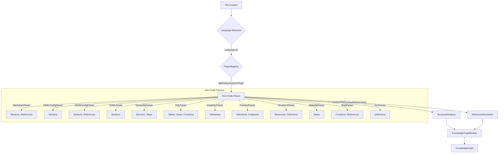
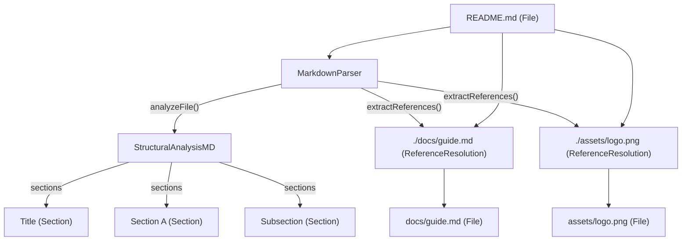
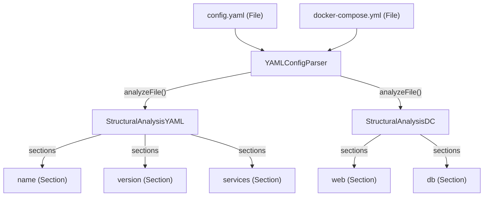
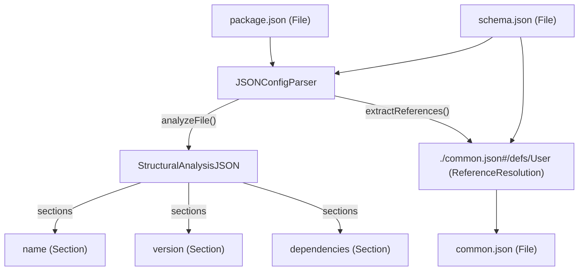
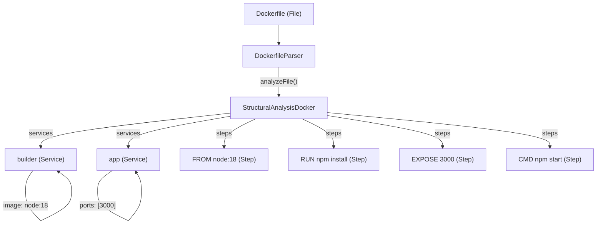
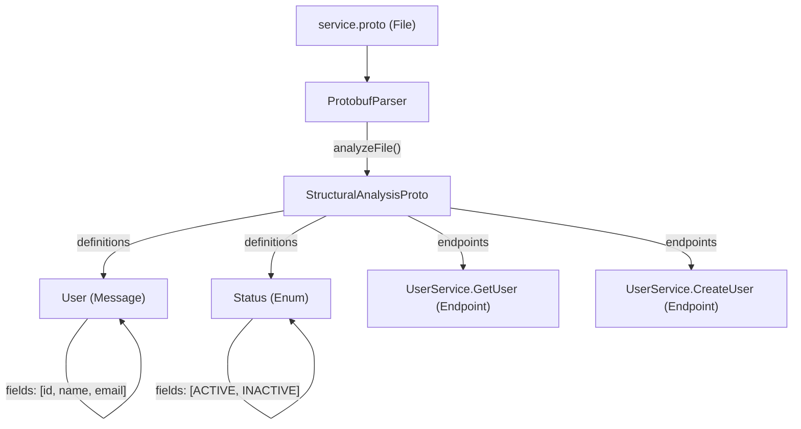
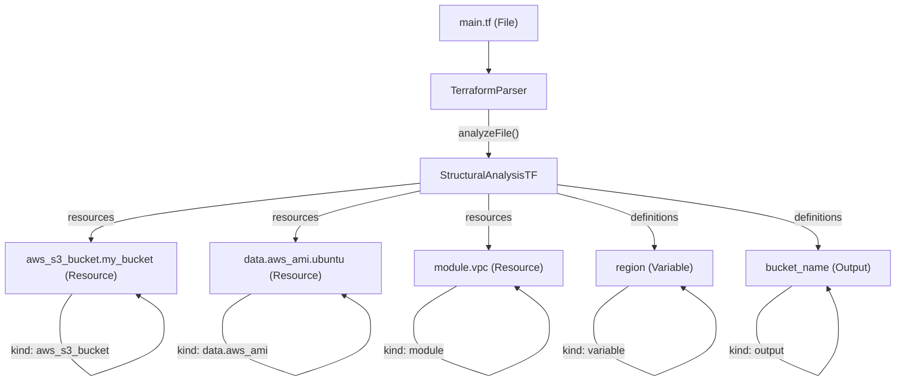
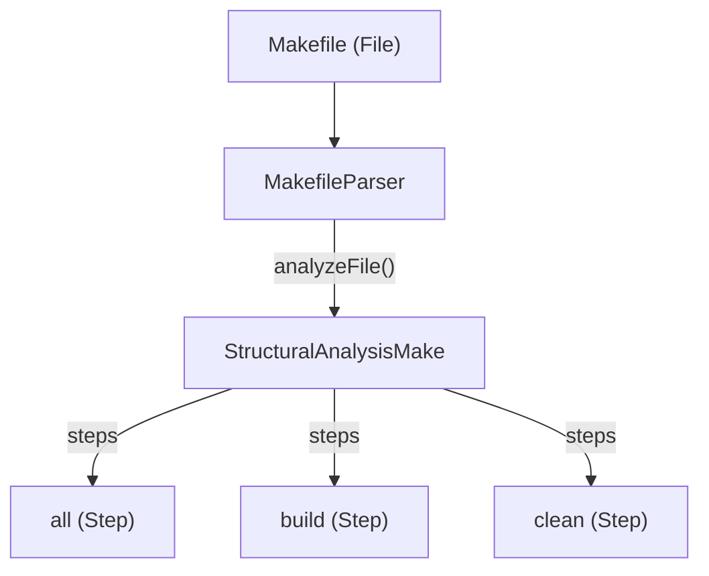
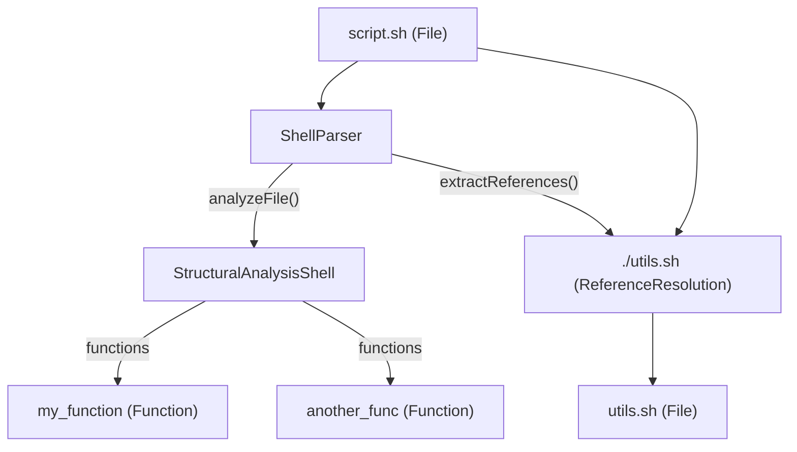
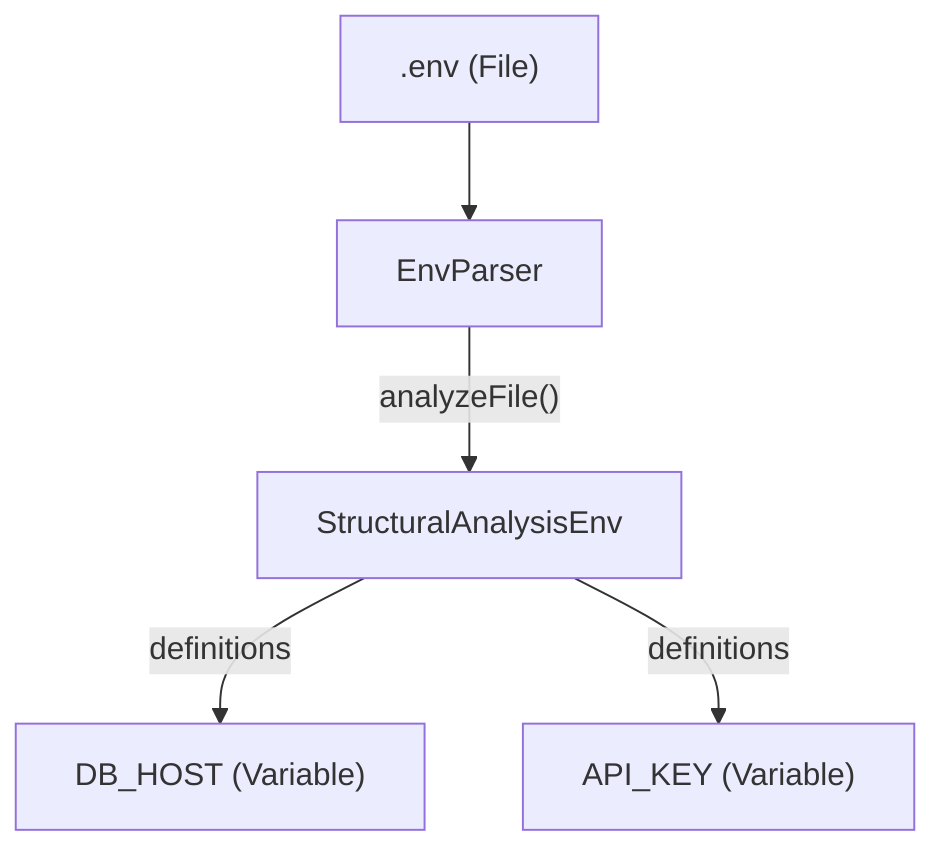

# Non-Code Parsers

Relevant source files

The following files were used as context for generating this wiki page:

- [understand-anything-plugin/packages/core/src/__tests__/parsers.test.ts](understand-anything-plugin/packages/core/src/__tests__/parsers.test.ts)
- [understand-anything-plugin/packages/core/src/plugins/parsers/dockerfile-parser.ts](understand-anything-plugin/packages/core/src/plugins/parsers/dockerfile-parser.ts)
- [understand-anything-plugin/packages/core/src/plugins/parsers/env-parser.ts](understand-anything-plugin/packages/core/src/plugins/parsers/env-parser.ts)
- [understand-anything-plugin/packages/core/src/plugins/parsers/index.ts](understand-anything-plugin/packages/core/src/plugins/parsers/index.ts)
- [understand-anything-plugin/packages/core/src/plugins/parsers/json-parser.ts](understand-anything-plugin/packages/core/src/plugins/parsers/json-parser.ts)
- [understand-anything-plugin/packages/core/src/plugins/parsers/makefile-parser.ts](understand-anything-plugin/packages/core/src/plugins/parsers/makefile-parser.ts)
- [understand-anything-plugin/packages/core/src/plugins/parsers/markdown-parser.ts](understand-anything-plugin/packages/core/src/plugins/parsers/markdown-parser.ts)
- [understand-anything-plugin/packages/core/src/plugins/parsers/protobuf-parser.ts](understand-anything-plugin/packages/core/src/plugins/parsers/protobuf-parser.ts)
- [understand-anything-plugin/packages/core/src/plugins/parsers/shell-parser.ts](understand-anything-plugin/packages/core/src/plugins/parsers/shell-parser.ts)
- [understand-anything-plugin/packages/core/src/plugins/parsers/terraform-parser.ts](understand-anything-plugin/packages/core/src/plugins/parsers/terraform-parser.ts)
- [understand-anything-plugin/packages/core/src/plugins/parsers/toml-parser.ts](understand-anything-plugin/packages/core/src/plugins/parsers/toml-parser.ts)
- [understand-anything-plugin/packages/core/src/plugins/parsers/yaml-parser.ts](understand-anything-plugin/packages/core/src/plugins/parsers/yaml-parser.ts)
- [understand-anything-plugin/skills/understand/languages/css.md](understand-anything-plugin/skills/understand/languages/css.md)
- [understand-anything-plugin/skills/understand/languages/dockerfile.md](understand-anything-plugin/skills/understand/languages/dockerfile.md)
- [understand-anything-plugin/skills/understand/languages/graphql.md](understand-anything-plugin/skills/understand/languages/graphql.md)
- [understand-anything-plugin/skills/understand/languages/html.md](understand-anything-plugin/skills/understand/languages/html.md)
- [understand-anything-plugin/skills/understand/languages/json.md](understand-anything-plugin/skills/understand/languages/json.md)
- [understand-anything-plugin/skills/understand/languages/markdown.md](understand-anything-plugin/skills/understand/languages/markdown.md)
- [understand-anything-plugin/skills/understand/languages/protobuf.md](understand-anything-plugin/skills/understand/languages/protobuf.md)
- [understand-anything-plugin/skills/understand/languages/shell.md](understand-anything-plugin/skills/understand/languages/shell.md)
- [understand-anything-plugin/skills/understand/languages/sql.md](understand-anything-plugin/skills/understand/languages/sql.md)
- [understand-anything-plugin/skills/understand/languages/terraform.md](understand-anything-plugin/skills/understand/languages/terraform.md)
- [understand-anything-plugin/skills/understand/languages/yaml.md](understand-anything-plugin/skills/understand/languages/yaml.md)

This page details the parser subsystem within the `@understand-anything/core` package responsible for extracting structural information from various non-code file types. These parsers implement the `AnalyzerPlugin` interface and are designed to identify key entities like sections, services, resources, definitions, and steps within configuration files, documentation, and other domain-specific languages. This extracted information is then used to enrich the KnowledgeGraph.

## Overview of Non-Code Parsers

The `understand-anything` plugin utilizes a set of specialized parsers for non-code files. These parsers are crucial for understanding the structure and relationships within files that don't conform to traditional programming language syntax but still contain valuable architectural or configuration data. Each parser is implemented as a class that adheres to the `AnalyzerPlugin` interface [understand-anything-plugin/packages/core/src/types.js](), providing `analyzeFile` and `extractReferences` methods.

The `registerAllParsers` function [understand-anything-plugin/packages/core/src/plugins/parsers/index.ts]() is responsible for registering all these parsers with the `PluginRegistry` [understand-anything-plugin/packages/core/src/__tests__/parsers.test.ts:14-15](). This allows the system to dynamically select the appropriate parser based on the file's language or extension.

The following non-code file types are supported:

*   **Markdown**: Extracts headings and local file/image references.
*   **YAML**: Extracts top-level keys and handles various YAML-flavored formats.
*   **JSON/JSONC**: Extracts top-level keys and `$ref` references, supporting comments and trailing commas.
*   **TOML**: Extracts top-level keys.
*   **Dockerfile**: Extracts multi-stage build stages, exposed ports, and instructions.
*   **SQL**: Extracts table, view, and function definitions.
*   **GraphQL**: Extracts type, query, mutation, and subscription definitions.
*   **Protobuf**: Extracts message, enum, and service definitions, including RPC methods.
*   **Terraform**: Extracts resource, data, module, variable, and output blocks.
*   **Makefile**: Extracts build targets.
*   **Shell**: Extracts function definitions and `source` references.
*   **Env**: Extracts environment variable definitions.

### Parser Architecture

Each parser class implements the `AnalyzerPlugin` interface, which defines the `name`, `languages`, `analyzeFile`, and optionally `extractReferences` methods.

*   `name`: A unique identifier for the parser.
*   `languages`: An array of language identifiers (e.g., "markdown", "yaml", "json") that this parser can handle. These identifiers are typically determined by the `LanguageRegistry` during file scanning.
*   `analyzeFile(filePath: string, content: string)`: This method performs structural analysis on the file content and returns a `StructuralAnalysis` object. This object can contain `sections`, `services`, `resources`, `definitions`, `steps`, `functions`, `classes`, `imports`, and `exports`. For non-code parsers, the focus is usually on `sections`, `services`, `resources`, `definitions`, and `steps`.
*   `extractReferences(filePath: string, content: string)`: This optional method identifies and extracts references to other files or entities within the current file.

**Diagram: Non-Code Parser Data Flow**
Sources: [understand-anything-plugin/packages/core/src/types.js](), [understand-anything-plugin/packages/core/src/__tests__/parsers.test.ts:14-15]()

## Markdown Parser

The `MarkdownParser` [understand-anything-plugin/packages/core/src/plugins/parsers/markdown-parser.ts:8-78]() is responsible for analyzing Markdown files (`.md`).

### Capabilities

*   **Heading Extraction**: Identifies ATX-style headings (`#`, `##`, etc.) and extracts their names, levels, and line ranges [understand-anything-plugin/packages/core/src/plugins/parsers/markdown-parser.ts:41-69](). It correctly ignores headings within fenced code blocks [understand-anything-plugin/packages/core/src/plugins/parsers/markdown-parser.ts:45-60]().
*   **Local Reference Extraction**: Extracts local file and image references (e.g., `[link](./path/to/file.md)`, ``) [understand-anything-plugin/packages/core/src/plugins/parsers/markdown-parser.ts:24-38](). It explicitly skips external URLs.

### Mapping to Graph Nodes

*   **Headings**: Mapped to `SectionInfo` objects within the `StructuralAnalysis` result. These typically become `Section` nodes in the KnowledgeGraph.
*   **Local References**: Mapped to `ReferenceResolution` objects, which can form `references` edges between `File` nodes.

**Diagram: Markdown Parser Output**
Sources: [understand-anything-plugin/packages/core/src/plugins/parsers/markdown-parser.ts:8-78](), [understand-anything-plugin/packages/core/src/__tests__/parsers.test.ts:17-86]()

## YAML Parser

The `YAMLConfigParser` [understand-anything-plugin/packages/core/src/plugins/parsers/yaml-parser.ts:14-106]() handles YAML files (`.yaml`, `.yml`) and various YAML-flavored formats.

### Capabilities

*   **Top-Level Key Extraction**: Parses YAML content to extract top-level keys as sections [understand-anything-plugin/packages/core/src/plugins/parsers/yaml-parser.ts:35-60](). It supports both plain and quoted keys.
*   **Array-Root Document Handling**: For YAML documents that are arrays at the root, it generates sections for each array entry, attempting to name them using `name`, `id`, or `kind` fields [understand-anything-plugin/packages/core/src/plugins/parsers/yaml-parser.ts:62-80]().
*   **Graceful Error Handling**: Includes a fallback to regex-based extraction if `yaml` library parsing fails [understand-anything-plugin/packages/core/src/plugins/parsers/yaml-parser.ts:81-99]().
*   **Language Support**: Explicitly supports `yaml`, `kubernetes`, `docker-compose`, `github-actions`, and `openapi` language IDs [understand-anything-plugin/packages/core/src/plugins/parsers/yaml-parser.ts:16-22]().

### Mapping to Graph Nodes

*   **Top-Level Keys/Array Entries**: Mapped to `SectionInfo` objects, which become `Section` nodes in the KnowledgeGraph. For `docker-compose.yml`, these might represent services; for `github-actions`, they might represent jobs or triggers.

**Diagram: YAML Parser Output**
Sources: [understand-anything-plugin/packages/core/src/plugins/parsers/yaml-parser.ts:14-106](), [understand-anything-plugin/packages/core/src/__tests__/parsers.test.ts:88-126]()

## JSON / JSONC Parser

The `JSONConfigParser` [understand-anything-plugin/packages/core/src/plugins/parsers/json-parser.ts:69-136]() handles JSON (`.json`) and JSONC (`.jsonc`) files.

### Capabilities

*   **JSONC Support**: The `stripJsoncSyntax` function [understand-anything-plugin/packages/core/src/plugins/parsers/json-parser.ts:11-59]() preprocesses JSONC content to remove line comments (`//`), block comments (`/* ... */`), and trailing commas, making it valid for `JSON.parse`.
*   **Top-Level Key Extraction**: Extracts top-level keys as sections [understand-anything-plugin/packages/core/src/plugins/parsers/json-parser.ts:106-130]().
*   **$ref Reference Extraction**: Identifies and extracts `$ref` values, commonly found in JSON Schema and OpenAPI specifications, as `schema` type references [understand-anything-plugin/packages/core/src/plugins/parsers/json-parser.ts:88-102](). Internal `$ref`s (starting with `#`) are skipped.
*   **Language Support**: Supports `json`, `jsonc`, `json-schema`, and `openapi` language IDs [understand-anything-plugin/packages/core/src/plugins/parsers/json-parser.ts:74-74]().

### Mapping to Graph Nodes

*   **Top-Level Keys**: Mapped to `SectionInfo` objects, which become `Section` nodes. For `package.json`, these might be `name`, `version`, `dependencies`.
*   **$ref References**: Mapped to `ReferenceResolution` objects with `referenceType: "schema"`, forming `references` edges.

**Diagram: JSON/JSONC Parser Output**
Sources: [understand-anything-plugin/packages/core/src/plugins/parsers/json-parser.ts:69-136](), [understand-anything-plugin/packages/core/src/__tests__/parsers.test.ts:128-190]()

## TOML Parser

The `TOMLParser` [understand-anything-plugin/packages/core/src/plugins/parsers/toml-parser.ts]() (not fully provided, but inferred from `parsers.test.ts`) handles TOML files (`.toml`).

### Capabilities

*   **Top-Level Key Extraction**: Extracts top-level keys and table names as sections.

### Mapping to Graph Nodes

*   **Top-Level Keys/Tables**: Mapped to `SectionInfo` objects, which become `Section` nodes.

Sources: [understand-anything-plugin/packages/core/src/__tests__/parsers.test.ts:5]()

## Dockerfile Parser

The `DockerfileParser` [understand-anything-plugin/packages/core/src/plugins/parsers/dockerfile-parser.ts:8-86]() analyzes Dockerfiles.

### Capabilities

*   **Multi-Stage Build Stage Extraction**: Identifies `FROM` directives to delineate build stages, extracting the base image and stage name (if aliased with `AS`) [understand-anything-plugin/packages/core/src/plugins/parsers/dockerfile-parser.ts:24-67]().
*   **EXPOSE Port Extraction**: Collects `EXPOSE` directives and associates them with the correct build stage [understand-anything-plugin/packages/core/src/plugins/parsers/dockerfile-parser.ts:49-59]().
*   **Instruction Step Extraction**: Extracts individual Dockerfile instructions (e.g., `RUN`, `COPY`, `CMD`) as steps [understand-anything-plugin/packages/core/src/plugins/parsers/dockerfile-parser.ts:72-85]().

### Mapping to Graph Nodes

*   **Build Stages**: Mapped to `ServiceInfo` objects, which become `Service` nodes in the KnowledgeGraph. These nodes include the image name and exposed ports.
*   **Instructions**: Mapped to `StepInfo` objects, which become `Step` nodes.

**Diagram: Dockerfile Parser Output**
Sources: [understand-anything-plugin/packages/core/src/plugins/parsers/dockerfile-parser.ts:8-86](), [understand-anything-plugin/packages/core/src/__tests__/parsers.test.ts:200-240]()

## SQL Parser

The `SQLParser` [understand-anything-plugin/packages/core/src/plugins/parsers/sql-parser.ts]() (not fully provided, but inferred from `parsers.test.ts`) handles SQL files (`.sql`).

### Capabilities

*   **Definition Extraction**: Extracts `CREATE TABLE`, `CREATE VIEW`, and `CREATE FUNCTION` statements.

### Mapping to Graph Nodes

*   **Tables/Views/Functions**: Mapped to `DefinitionInfo` objects, which become `Table`, `View`, or `Function` nodes in the KnowledgeGraph.

Sources: [understand-anything-plugin/packages/core/src/__tests__/parsers.test.ts:8]()

## GraphQL Parser

The `GraphQLParser` [understand-anything-plugin/packages/core/src/plugins/parsers/graphql-parser.ts]() (not fully provided, but inferred from `parsers.test.ts`) handles GraphQL schema files (`.graphql`, `.gql`).

### Capabilities

*   **Definition Extraction**: Extracts `type`, `input`, `enum`, `interface`, `union`, `scalar`, `query`, `mutation`, and `subscription` definitions.

### Mapping to Graph Nodes

*   **Definitions**: Mapped to `DefinitionInfo` objects, which become `Type`, `Query`, `Mutation`, `Subscription`, etc., nodes in the KnowledgeGraph.

Sources: [understand-anything-plugin/packages/core/src/__tests__/parsers.test.ts:9]()

## Protobuf Parser

The `ProtobufParser` [understand-anything-plugin/packages/core/src/plugins/parsers/protobuf-parser.ts:8-141]() analyzes Protocol Buffer definition files (`.proto`).

### Capabilities

*   **Message Definition Extraction**: Identifies `message` blocks, extracting their names and fields [understand-anything-plugin/packages/core/src/plugins/parsers/protobuf-parser.ts:28-44]().
*   **Enum Definition Extraction**: Identifies `enum` blocks, extracting their names and values [understand-anything-plugin/packages/core/src/plugins/parsers/protobuf-parser.ts:47-60]().
*   **Service RPC Method Extraction**: Identifies `service` blocks and extracts `rpc` methods as endpoints [understand-anything-plugin/packages/core/src/plugins/parsers/protobuf-parser.ts:66-87]().

### Mapping to Graph Nodes

*   **Messages/Enums**: Mapped to `DefinitionInfo` objects, which become `Message` or `Enum` nodes. Their fields/values are stored as `fields` on these nodes.
*   **RPC Methods**: Mapped to `EndpointInfo` objects, which become `Endpoint` nodes, typically with `method: "rpc"` and `path: "ServiceName.MethodName"`.

**Diagram: Protobuf Parser Output**
Sources: [understand-anything-plugin/packages/core/src/plugins/parsers/protobuf-parser.ts:8-141](), [understand-anything-plugin/packages/core/src/__tests__/parsers.test.ts:280-319]()

## Terraform Parser

The `TerraformParser` [understand-anything-plugin/packages/core/src/plugins/parsers/terraform-parser.ts:8-130]() analyzes Terraform configuration files (`.tf`).

### Capabilities

*   **Resource Extraction**: Identifies `resource` blocks, extracting their type and name (e.g., `aws_s3_bucket.my_bucket`) [understand-anything-plugin/packages/core/src/plugins/parsers/terraform-parser.ts:28-42]().
*   **Data Source Extraction**: Identifies `data` blocks, extracting their type and name (e.g., `data.aws_ami.ubuntu`) [understand-anything-plugin/packages/core/src/plugins/parsers/terraform-parser.ts:45-59]().
*   **Module Extraction**: Identifies `module` blocks, extracting their names [understand-anything-plugin/packages/core/src/plugins/parsers/terraform-parser.ts:62-72]().
*   **Variable and Output Extraction**: Identifies `variable` and `output` blocks, extracting their names [understand-anything-plugin/packages/core/src/plugins/parsers/terraform-parser.ts:81-111]().

### Mapping to Graph Nodes

*   **Resources/Data Sources/Modules**: Mapped to `ResourceInfo` objects, which become `Resource` nodes. The `kind` field distinguishes between `resource.type`, `data.type`, and `module`.
*   **Variables/Outputs**: Mapped to `DefinitionInfo` objects, which become `Variable` or `Output` nodes.

**Diagram: Terraform Parser Output**
Sources: [understand-anything-plugin/packages/core/src/plugins/parsers/terraform-parser.ts:8-130](), [understand-anything-plugin/packages/core/src/__tests__/parsers.test.ts:321-360]()

## Makefile Parser

The `MakefileParser` [understand-anything-plugin/packages/core/src/plugins/parsers/makefile-parser.ts:8-50]() analyzes Makefiles.

### Capabilities

*   **Target Extraction**: Identifies build targets (e.g., `all`, `clean`, `build`) and their line ranges [understand-anything-plugin/packages/core/src/plugins/parsers/makefile-parser.ts:23-49](). It filters out special Make targets (like `.PHONY`) and variable assignments.

### Mapping to Graph Nodes

*   **Targets**: Mapped to `StepInfo` objects, which become `Step` nodes in the KnowledgeGraph.

**Diagram: Makefile Parser Output**
Sources: [understand-anything-plugin/packages/core/src/plugins/parsers/makefile-parser.ts:8-50](), [understand-anything-plugin/packages/core/src/__tests__/parsers.test.ts:362-390]()

## Shell Parser

The `ShellParser` [understand-anything-plugin/packages/core/src/plugins/parsers/shell-parser.ts:8-86]() analyzes shell scripts (`.sh`, `.bash`, `jenkinsfile`).

### Capabilities

*   **Function Extraction**: Identifies shell function definitions (both `name() {` and `function name {` syntaxes) and extracts their names and line ranges [understand-anything-plugin/packages/core/src/plugins/parsers/shell-parser.ts:41-85](). It includes logic to correctly match braces and handle multi-line definitions.
*   **Source Reference Extraction**: Extracts `source` or `.` commands that reference other shell scripts [understand-anything-plugin/packages/core/src/plugins/parsers/shell-parser.ts:25-38]().

### Mapping to Graph Nodes

*   **Functions**: Mapped to `FunctionInfo` objects, which become `Function` nodes.
*   **Source References**: Mapped to `ReferenceResolution` objects with `referenceType: "file"`, forming `references` edges.

**Diagram: Shell Parser Output**
Sources: [understand-anything-plugin/packages/core/src/plugins/parsers/shell-parser.ts:8-86](), [understand-anything-plugin/packages/core/src/__tests__/parsers.test.ts:392-431]()

## Env Parser

The `EnvParser` [understand-anything-plugin/packages/core/src/plugins/parsers/env-parser.ts:8-41]() analyzes `.env` files.

### Capabilities

*   **Variable Extraction**: Identifies `KEY=value` assignments, extracting the variable names [understand-anything-plugin/packages/core/src/plugins/parsers/env-parser.ts:23-38](). It skips comments and empty lines.

### Mapping to Graph Nodes

*   **Variables**: Mapped to `DefinitionInfo` objects, which become `Variable` nodes.

**Diagram: Env Parser Output**
Sources: [understand-anything-plugin/packages/core/src/plugins/parsers/env-parser.ts:8-41](), [understand-anything-plugin/packages/core/src/__tests__/parsers.test.ts:433-455]()
