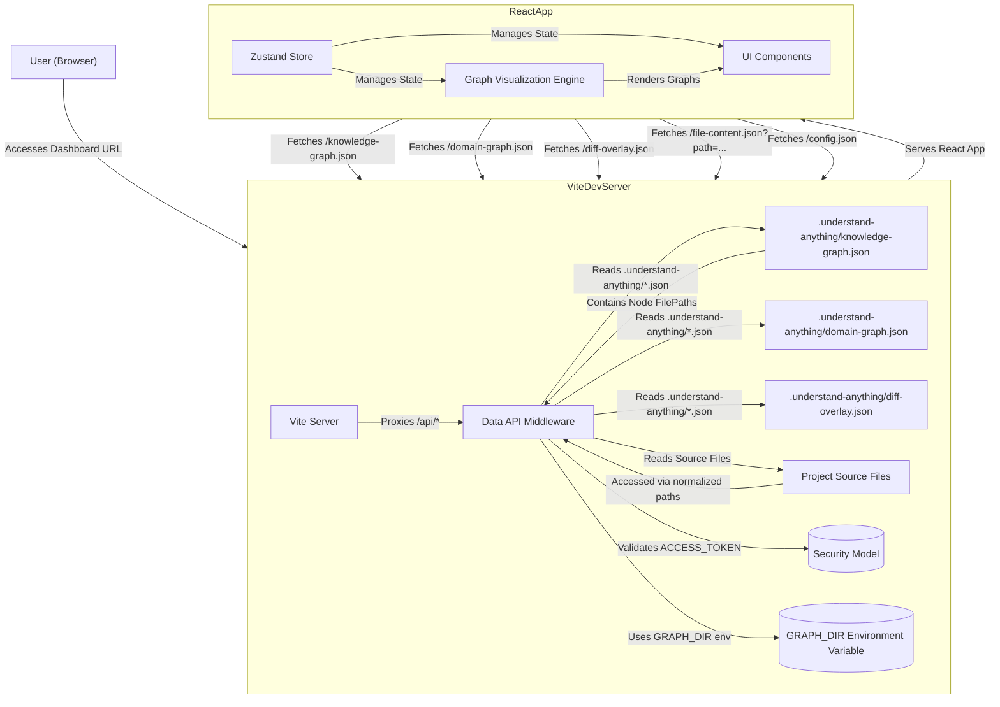

# Dashboard (@understand-anything/dashboard)

Relevant source files

The following files were used as context for generating this wiki page:

- [homepage/package.json](homepage/package.json)
- [pnpm-lock.yaml](pnpm-lock.yaml)
- [understand-anything-plugin/packages/dashboard/package.json](understand-anything-plugin/packages/dashboard/package.json)
- [understand-anything-plugin/packages/dashboard/src/components/CodeViewer.tsx](understand-anything-plugin/packages/dashboard/src/components/CodeViewer.tsx)
- [understand-anything-plugin/packages/dashboard/src/components/KeyboardShortcutsHelp.tsx](understand-anything-plugin/packages/dashboard/src/components/KeyboardShortcutsHelp.tsx)
- [understand-anything-plugin/packages/dashboard/src/components/LayerLegend.tsx](understand-anything-plugin/packages/dashboard/src/components/LayerLegend.tsx)
- [understand-anything-plugin/packages/dashboard/src/components/LearnPanel.tsx](understand-anything-plugin/packages/dashboard/src/components/LearnPanel.tsx)
- [understand-anything-plugin/packages/dashboard/src/components/SearchBar.tsx](understand-anything-plugin/packages/dashboard/src/components/SearchBar.tsx)
- [understand-anything-plugin/packages/dashboard/src/hooks/useKeyboardShortcuts.ts](understand-anything-plugin/packages/dashboard/src/hooks/useKeyboardShortcuts.ts)
- [understand-anything-plugin/packages/dashboard/src/index.css](understand-anything-plugin/packages/dashboard/src/index.css)
- [understand-anything-plugin/packages/dashboard/src/themes/presets.ts](understand-anything-plugin/packages/dashboard/src/themes/presets.ts)
- [understand-anything-plugin/packages/dashboard/src/utils/__tests__/smoke.test.ts](understand-anything-plugin/packages/dashboard/src/utils/__tests__/smoke.test.ts)
- [understand-anything-plugin/packages/dashboard/vite.config.ts](understand-anything-plugin/packages/dashboard/vite.config.ts)
- [understand-anything-plugin/pnpm-workspace.yaml](understand-anything-plugin/pnpm-workspace.yaml)
- [understand-anything-plugin/skills/understand-dashboard/SKILL.md](understand-anything-plugin/skills/understand-dashboard/SKILL.md)

The `@understand-anything/dashboard` package provides a React-based interactive web interface for visualizing the KnowledgeGraph generated by the Understand Anything analysis pipeline. It offers various graph views, search capabilities, code viewing, and guided tours to help users explore and understand their codebase. This page provides a high-level overview of the dashboard's architecture, its development server, security model, and links to child pages for detailed documentation of its components and features.

The dashboard is a single-page application built with React and Vite, leveraging state management with Zustand and graph visualization libraries like React Flow, ELK.js, and D3-force. It communicates with a local Vite development server that acts as a data API, serving graph data and file contents.

## Architecture Overview

The dashboard is structured as a client-side React application that fetches data from a local Vite development server. This server not only serves the static assets of the React app but also includes middleware to expose several data API endpoints. This architecture allows the dashboard to remain a lightweight frontend while securely accessing and displaying potentially sensitive codebase information.

The core components include:
- **Vite Dev Server with Data API Middleware**: Handles requests for graph data (`/knowledge-graph.json`, `/domain-graph.json`, `/diff-overlay.json`), file content (`/file-content.json`), and configuration (`/config.json`). It enforces a security model using an `ACCESS_TOKEN`.
- **React Application**: The frontend, responsible for rendering the UI, managing state, and interacting with the data API.
- **Graph Visualization Engine**: Utilizes libraries like `@xyflow/react` (React Flow), `elkjs`, and `d3-force` to render and layout the various graph views.
- **Zustand Store**: Manages the global state of the dashboard, including the loaded graph, selected nodes, navigation history, search results, and UI settings.
- **UI Components**: A collection of React components for search, code viewing, filtering, theming, and other interactive elements.

Sources: [understand-anything-plugin/packages/dashboard/vite.config.ts:1-24](), [understand-anything-plugin/packages/dashboard/src/components/CodeViewer.tsx:26-28]()

## Dashboard Server & Data API

The dashboard runs on a Vite development server, which is configured to include custom middleware for serving graph data and file contents. This server is launched via the `/understand-dashboard` skill [understand-anything-plugin/skills/understand-dashboard/SKILL.md:80-80](). A critical security feature is the `ACCESS_TOKEN` [understand-anything-plugin/packages/dashboard/vite.config.ts:12-12](), a one-time token generated at server startup that must be included in the URL to access any data endpoints. This prevents unauthorized access to local codebase information.

The server exposes several key API endpoints:
- `/knowledge-graph.json`: Serves the main KnowledgeGraph.
- `/domain-graph.json`: Serves the Domain Graph.
- `/diff-overlay.json`: Provides data for visualizing code changes.
- `/file-content.json`: Allows the dashboard to fetch the content of specific source files for display in the `CodeViewer` [understand-anything-plugin/packages/dashboard/src/components/CodeViewer.tsx:26-28]().
- `/config.json`: Provides dashboard configuration.

The `GRAPH_DIR` environment variable [understand-anything-plugin/skills/understand-dashboard/SKILL.md:105-105]() is used to locate the `.understand-anything/` directory containing the generated graph files. The server employs a `graphFileCandidates` strategy [understand-anything-plugin/packages/dashboard/vite.config.ts:15-23]() to search for these files. Path sanitization and validation are performed by `normalizeGraphPath` [understand-anything-plugin/packages/dashboard/vite.config.ts:34-53]() and `graphFilePathSet` [understand-anything-plugin/packages/dashboard/vite.config.ts:55-70]() to ensure that only files explicitly part of the analyzed graph and within the project root can be accessed.

For a detailed explanation of the server's middleware, security model, and file access logic, see [Dashboard Server & Data API](#4.1).
Sources: [understand-anything-plugin/packages/dashboard/vite.config.ts:1-24](), [understand-anything-plugin/packages/dashboard/src/components/CodeViewer.tsx:26-28](), [understand-anything-plugin/skills/understand-dashboard/SKILL.md:80-80](), [understand-anything-plugin/skills/understand-dashboard/SKILL.md:105-105]()

## Graph Visualization Engine

The dashboard's primary function is to visualize complex graph structures. It uses `@xyflow/react` (React Flow) as its core rendering engine, augmented by `elkjs` for sophisticated graph layout and `d3-force` for force-directed layouts, particularly in the Domain Graph View. The visualization engine supports two main navigation levels: an "overview" for high-level architectural understanding and a "layer-detail" view for drilling down into specific components. It also handles edge aggregation, lazy container expansion, and viewport locking to provide a smooth user experience.

For an in-depth look at how graphs are rendered, laid out, and navigated, refer to [Graph Visualization Engine](#4.2).
Sources: [pnpm-lock.yaml:128-147]()

## Domain Graph View & Force Layout

The `DomainGraphView` is a specialized visualization that focuses on the business domain and its associated flows and steps. It utilizes a D3 force-directed layout (`applyForceLayout`) to arrange `DomainClusterNode`, `FlowNode`, and `StepNode` components, emphasizing relationships and clusters within the domain. This view offers both an overview (`buildDomainOverview`) and a detailed perspective (`buildDomainDetail`) of the domain graph.

More information on the Domain Graph View, its components, and layout algorithms can be found in [Domain Graph View & Force Layout](#4.3).
Sources: [pnpm-lock.yaml:131-132]()

## Dashboard State Management (Zustand Store)

The dashboard's interactive nature relies heavily on robust state management. `useDashboardStore` [understand-anything-plugin/packages/dashboard/src/components/CodeViewer.tsx:65]() (a Zustand store) centralizes all application state, including the loaded `KnowledgeGraph`, `DomainGraph`, selected nodes, navigation history, persona filtering, detail levels (file vs. class), focus mode, diff overlay state, and search integration. It also wires up the `SearchEngine` and `SemanticSearchEngine` from `@understand-anything/core` to provide powerful search capabilities.

For a comprehensive guide to the dashboard's state, its actions, and how different UI elements interact with it, see [Dashboard State Management (Zustand Store)](#4.4).
Sources: [understand-anything-plugin/packages/dashboard/package.json:29-29](), [understand-anything-plugin/packages/dashboard/src/components/CodeViewer.tsx:65]()

## UI Components & Panels

The dashboard features a rich set of UI components designed to facilitate exploration and understanding. Key components include:
- `CustomNode`: The base component for rendering various node types in the graph.
- `NodeInfo`: Displays detailed information about a selected node.
- `SearchBar`: Provides fuzzy and semantic search capabilities [understand-anything-plugin/packages/dashboard/src/components/SearchBar.tsx:25-31]().
- `LearnPanel`: Guides users through a project's tour steps [understand-anything-plugin/packages/dashboard/src/components/LearnPanel.tsx:6-16]().
- `LayerLegend`: Explains the color-coding of architectural layers [understand-anything-plugin/packages/dashboard/src/components/LayerLegend.tsx:19-22]().
- `CodeViewer`: Displays source code with syntax highlighting and line range highlighting [understand-anything-plugin/packages/dashboard/src/components/CodeViewer.tsx:59-64]().
- `FileExplorer`, `PersonaSelector`, `FilterPanel`, `PathFinderModal`, `ExportMenu`, `WarningBanner`, `DiffToggle`, `OnboardingOverlay`, and mobile layout components.

These components are built using React and styled with Tailwind CSS, often incorporating glassmorphism effects.

For a detailed breakdown of each UI component and its functionality, refer to [UI Components & Panels](#4.5).
Sources: [understand-anything-plugin/packages/dashboard/src/components/CodeViewer.tsx:59-64](), [understand-anything-plugin/packages/dashboard/src/components/LearnPanel.tsx:6-16](), [understand-anything-plugin/packages/dashboard/src/components/LayerLegend.tsx:19-22](), [understand-anything-plugin/packages/dashboard/src/components/SearchBar.tsx:25-31]()

## Theming & Internationalization

The dashboard offers a flexible theming system and supports internationalization. The theme system is built around `ThemeContext` and `ThemeEngine`, allowing for various presets like `dark-gold`, `dark-ocean`, `dark-forest`, and `light-minimal` [understand-anything-plugin/packages/dashboard/src/themes/presets.ts:26-170](). It uses CSS variables [understand-anything-plugin/packages/dashboard/src/index.css:6-86]() for dynamic styling and includes glassmorphism utilities [understand-anything-plugin/packages/dashboard/src/index.css:118-130](). The `ThemePicker` component allows users to switch between themes.

Internationalization (i18n) is supported, with locales for English (`en`), Simplified Chinese (`zh`), Traditional Chinese (`zh-TW`), Japanese (`ja`), Korean (`ko`), and Russian (`ru`), ensuring the dashboard is accessible to a global audience.

For more details on customizing the dashboard's appearance and language, see [Theming & Internationalization](#4.6).
Sources: [understand-anything-plugin/packages/dashboard/src/index.css:6-86](), [understand-anything-plugin/packages/dashboard/src/index.css:118-130](), [understand-anything-plugin/packages/dashboard/src/themes/presets.ts:26-170]()
