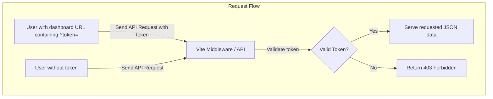
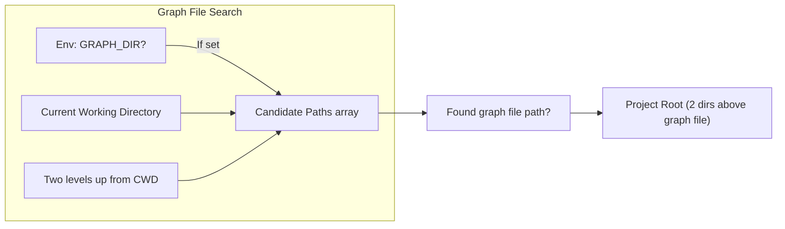
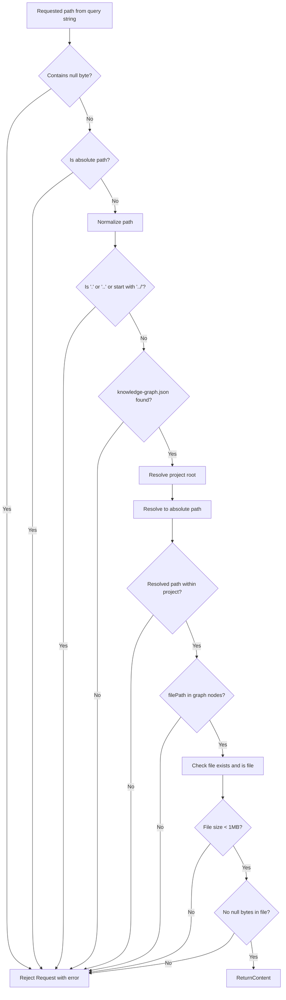
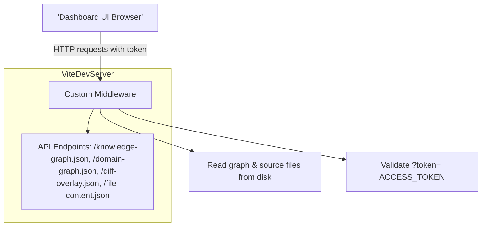
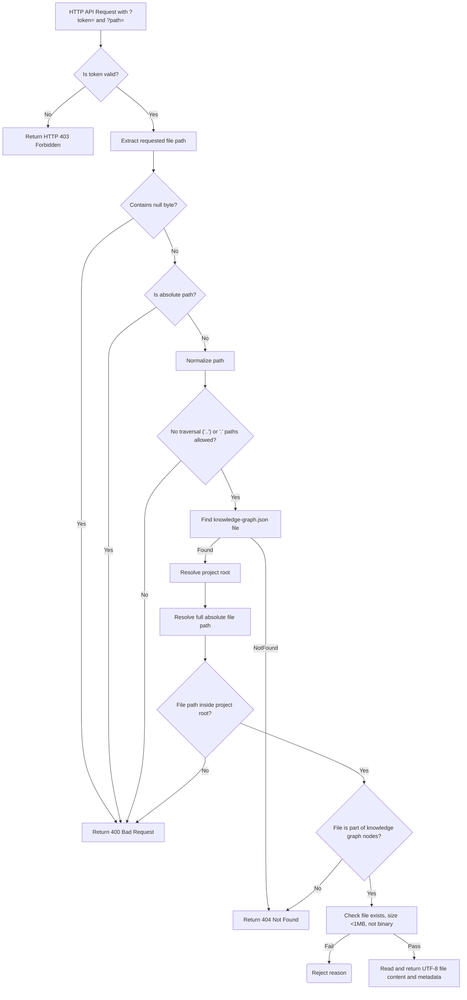
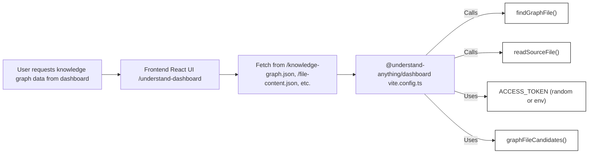

# Dashboard Server & Data API

<details>
<summary>Relevant source files</summary>

The following files were used as context for generating this wiki page:

- [homepage/package.json](homepage/package.json)
- [pnpm-lock.yaml](pnpm-lock.yaml)
- [understand-anything-plugin/packages/dashboard/package.json](understand-anything-plugin/packages/dashboard/package.json)
- [understand-anything-plugin/packages/dashboard/src/components/TokenGate.tsx](understand-anything-plugin/packages/dashboard/src/components/TokenGate.tsx)
- [understand-anything-plugin/packages/dashboard/src/utils/__tests__/smoke.test.ts](understand-anything-plugin/packages/dashboard/src/utils/__tests__/smoke.test.ts)
- [understand-anything-plugin/packages/dashboard/vite.config.ts](understand-anything-plugin/packages/dashboard/vite.config.ts)
- [understand-anything-plugin/skills/understand-dashboard/SKILL.md](understand-anything-plugin/skills/understand-dashboard/SKILL.md)

</details>


This section documents the core middleware server functionality embedded into the Vite development server within the `@understand-anything/dashboard` package. It covers how the dashboard serves its data API endpoints used for visualizing the analyzed project knowledge graphs and source code contents. This includes the security and path sanitization models, the lifecycle and discovery process for the project graph directory, and the search strategy for loading the appropriate graph files.

---

## 4.1.1 Purpose and Scope

The dashboard server is implemented as custom middleware atop the Vite dev server, providing a REST-like data API. This API exposes several critical JSON endpoints such as:

- `/knowledge-graph.json` — the full project knowledge graph
- `/domain-graph.json` — business domain data graph
- `/diff-overlay.json` — differential overlays highlighting changed nodes
- `/file-content.json` — raw source file contents for preview
- `/config.json` — runtime configuration

The middleware imposes an **Access Token security model** to restrict access to sensitive graph data. It also implements path normalization and strict sanitization to prevent unauthorized file access. The middleware uses an optimized **graph file candidate search strategy** to locate the relevant `.understand-anything/knowledge-graph.json` and related files by environment and working directory.

---

## 4.1.2 ACCESS_TOKEN Security Model

To protect the sensitive knowledge graph data, the server requires an `ACCESS_TOKEN` query parameter on API requests. This token is a randomly generated 16-byte hex string created once per server process runtime at startup. It is either:

- Provided via the environment variable `UNDERSTAND_ACCESS_TOKEN`
- Or else randomly generated using Node's `crypto.randomBytes(16).toString('hex')` when the server starts

The server then opens with a URL automatically including this token as a `?token=...` query parameter to be used by the dashboard UI. Any API request to endpoints like `/knowledge-graph.json` or `/diff-overlay.json` requires this token or else returns HTTP 403 Forbidden.

The token requirement is enforced in the middleware request handlers, and an unauthenticated access attempt results in denial.

This gating mechanism ensures that the knowledge graph data stays protected, as it may contain sensitive project source code references and internal architecture information.



**Sources:** `packages/dashboard/vite.config.ts:9-12, 179-199` `packages/dashboard/src/components/TokenGate.tsx:1-79`


---

## 4.1.3 GRAPH_DIR Lifecycle and Graph File Discovery

The knowledge graph and related JSON files are expected to reside within a `.understand-anything` folder inside the target project directory. The location of this project directory can be customized by setting the environment variable `GRAPH_DIR` before starting the dashboard server.

The middleware uses the `graphFileCandidates()` function to generate an ordered list of candidate absolute file paths where requested graph files (e.g. `knowledge-graph.json`, `domain-graph.json`, `diff-overlay.json`) might exist:

```ts
function graphFileCandidates(fileName: string): string[] {
  const graphDir = process.env.GRAPH_DIR;
  return [
    ...(graphDir ? [path.resolve(graphDir, `.understand-anything/${fileName}`)] : []),
    path.resolve(process.cwd(), `.understand-anything/${fileName}`),
    path.resolve(process.cwd(), `../../../.understand-anything/${fileName}`),
  ];
}
```

This search respects the following precedence:

1. If `GRAPH_DIR` is set, look there first.
2. Look under `.understand-anything` in the current working directory.
3. Look further up two directory levels (e.g. monorepo scenarios).

The first existing candidate path among these is selected as the active graph file — found using `findGraphFile()`. The project root is inferred as two directories above the graph file path.

This lifecycle allows running multiple dashboards root-relative or from differing monorepo levels.



**Sources:** `packages/dashboard/vite.config.ts:15-33`


---

## 4.1.4 Path Sanitization and Validation Pipeline

When the UI requests the contents of a source code file (`/file-content.json?path=...`), the server carefully sanitizes the requested file path to prevent directory traversal and unauthorized access.

Path sanitization pipeline steps in `readSourceFile(url)`:

1. **Query extraction:** Extract the `path` query parameter. Reject if missing or contains null bytes.
2. **Absolute path disallowed:** If `path` is an absolute path, reject.
3. **Normalization:** Normalize the path with `path.normalize()`.
4. **No parent directories allowed:** Reject if normalized path is `"."`, `".."` or begins with `../`.
5. **Graph presence check:** Verify `knowledge-graph.json` is found for the project.
6. **Project root resolution and path resolution:** Resolve the requested path relative to the project root.
7. **Revalidation:** Re-check path stays within the project root and is not a parent.
8. **File inclusion:** Confirm requested normalized relative path exists as a `filePath` in nodes inside the knowledge graph JSON.
9. **File size and type checks:** The file must exist, be a regular file, not larger than 1 MB, and not binary (no null bytes in buffer).
10. **Return content:** If all checks pass, return UTF-8 content, detected language, line count, and file size in JSON.

This rigorous pipeline prevents the server from serving arbitrary files outside the graph or system files. It limits preview size and filters unwanted binaries.



**Sources:** `packages/dashboard/vite.config.ts:114-177`


---

## 4.1.5 Graph File Candidates Search Strategy

The `graphFileCandidates` function generates an ordered array of potential file paths where a graph file with a given name may reside corresponding to the location environment.

Typical candidates searched per file name (e.g. `knowledge-graph.json`) include:

- `.understand-anything/knowledge-graph.json` inside the directory specified by environment variable `GRAPH_DIR` if set
- `.understand-anything/knowledge-graph.json` inside the current working directory (process.cwd())
- `.understand-anything/knowledge-graph.json` located two directories higher from the current working directory (for monorepo or unusual directory layouts)

The search respects this order for any requested graph file. The first existing path wins.

```ts
function graphFileCandidates(fileName: string): string[] {
  const graphDir = process.env.GRAPH_DIR;
  return [
    ...(graphDir ? [path.resolve(graphDir, `.understand-anything/${fileName}`)] : []),
    path.resolve(process.cwd(), `.understand-anything/${fileName}`),
    path.resolve(process.cwd(), `../../../.understand-anything/${fileName}`),
  ];
}
```

This design enables flexible deployments and ease of use by node environment configuration or running the dashboard server in various working directories.

**Sources:** `packages/dashboard/vite.config.ts:15-24`


---

## 4.1.6 Key Functions and Data Flow Summary

The following summarizes the main functions and their roles in the data serving workflow:

| Function                  | Role/Description                                                  | Defined in                          |
|---------------------------|-----------------------------------------------------------------|-----------------------------------|
| `graphFileCandidates()`    | Returns an ordered list of possible absolute candidate paths for a given graph file name, based on `GRAPH_DIR` and cwd | `vite.config.ts:15-24`             |
| `findGraphFile()`          | Finds the first existing path in candidates for a graph file    | `vite.config.ts:26-28`             |
| `projectRootFromGraphFile()` | Infers project root directory by stripping the last two path segments from the located graph file path | `vite.config.ts:30-32`             |
| `normalizeGraphPath()`     | Cleans and restricts file paths inside the project, rejecting invalid or outside paths | `vite.config.ts:34-52`             |
| `graphFilePathSet()`       | Parses `knowledge-graph.json` to build a set of safe relative file paths that are present in graph nodes | `vite.config.ts:55-70`             |
| `readSourceFile()`         | Handles `/file-content.json` requests with strict validation pipeline and returns file content if safe | `vite.config.ts:114-177`           |
| `detectLanguage()`         | Infers programming language for a file extension used in source previews | `vite.config.ts:72-102`            |
| `sendJson()`               | Sends JSON response with HTTP status                            | `vite.config.ts:104-108`           |
| `rejectFileRequest()`      | Helper to reject with error message and HTTP status code         | `vite.config.ts:109-112`           |

The middleware integrates these to handle secure, sanitized, and performant serving of graph JSON files and source previews.

---

## 4.1.7 Vite Middleware Setup and API Endpoints

The `vite.config.ts` file defines a custom middleware hook inside the Vite server’s `configureServer` lifecycle:

- It intercepts requests for API endpoints: `/knowledge-graph.json`, `/domain-graph.json`, `/diff-overlay.json`, `/file-content.json`, `/config.json`.
- For JSON graph data files, it locates the graph file via `findGraphFile`, enforces access token validation (`accessToken` query param matches the token generated on startup).
- For file content previews, the `readSourceFile()` function is invoked to validate and respond.
- The server listens bound to localhost only (`127.0.0.1`) on port 5173 by default, preventing unintentional LAN access.
- It opens the browser tab with the dashboard URL including the token query parameter.

This approach allows the React dashboard frontend to fetch necessary data securely from these endpoints over HTTP during development or preview.



**Sources:** `packages/dashboard/vite.config.ts:179-248`


---

## 4.1.8 Security & Path Sanitization Pipeline Diagram



**Sources:** `packages/dashboard/vite.config.ts:114-177`


---

## 4.1.9 Mapping Natural Language Concepts to Code Entities

The dashboard server bridges the "Natural Language Space" of the user-facing dashboard UI and command-line invocations to the precise code entities handling the data API.



This diagram shows the direct invocation flow from the UI through the middleware to core functions managing graph file discovery, token security, and source file reading.

**Sources:** `packages/dashboard/vite.config.ts:9-28,114-177`


---

## 4.1.10 Dashboard Server Key Configuration Elements

| Config Setting                  | Default / Mechanism                     | Description                                           |
|--------------------------------|---------------------------------------|-------------------------------------------------------|
| `UNDERSTAND_ACCESS_TOKEN`       | env var or random 16-byte hex token at server start | Security token required as `?token` query param       |
| `GRAPH_DIR`                    | env var or inferred via cwd            | Specifies the root directory containing `.understand-anything` folder |
| Server host                   | `"127.0.0.1"`                          | Bound only to localhost for security                   |
| Server port                   | `5173` (or next available)             | Default HTTP server port for dashboard                  |
| Max file preview size           | 1MB (1024 * 1024 bytes)               | Max allowed size for source code file previews          |
| Max binary file rejection       | Files containing null bytes rejected | Prevent serving of binary data as code preview          |

**Sources:** `packages/dashboard/vite.config.ts:9-190`


---

# Summary

The dashboard's Vite dev server middleware exposes a carefully secured REST JSON API over HTTP to serve the analyzed project's knowledge graph and related files. It uses a per-runtime **ACCESS_TOKEN** to gate access and enforce strict **path sanitization and validation** pipelines preventing any unauthorized or dangerous file accesses. The graph discovery strategy uses the `GRAPH_DIR` environment variable fallback hierarchy to locate `.understand-anything` project metadata reliably.

These mechanisms enable the React dashboard UI to serve detailed visualizations and source previews with correctness and security during development or runtime previews, bridging analyzed project knowledge (code entity space) with user interactions (natural language space).

---

**Sources:**  
`understand-anything-plugin/packages/dashboard/vite.config.ts:1-248`  
`understand-anything-plugin/packages/dashboard/src/components/TokenGate.tsx:1-79`  
`understand-anything-plugin/skills/understand-dashboard/SKILL.md:1-106`
