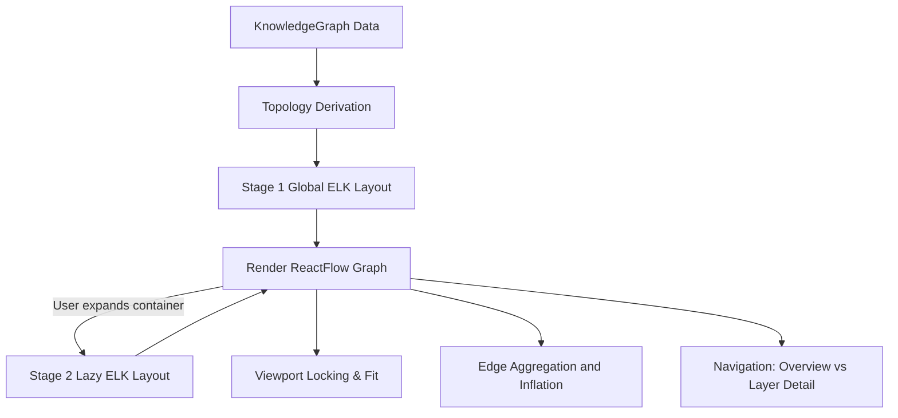
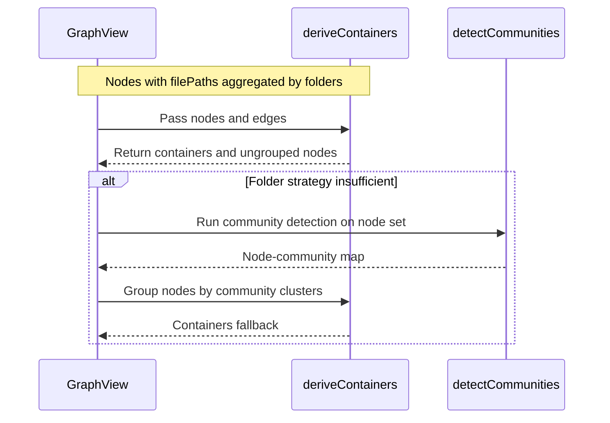
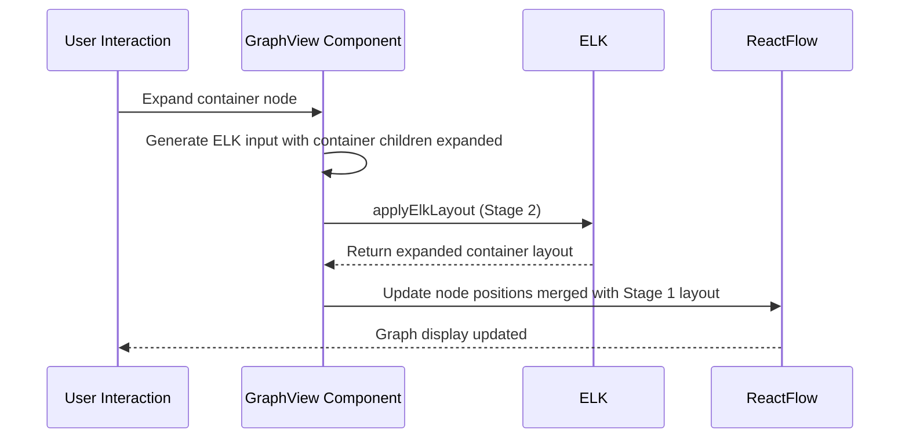
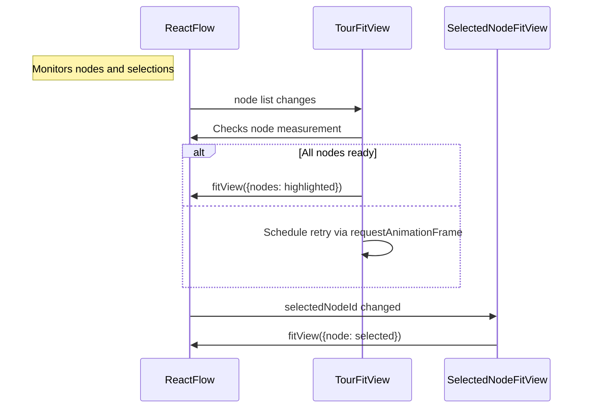
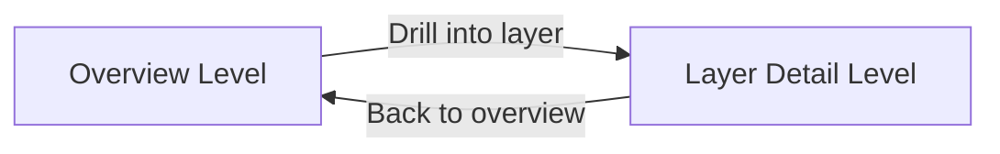

# Graph Visualization Engine

<details>
<summary>Relevant source files</summary>

The following files were used as context for generating this wiki page:

- [docs/superpowers/plans/2026-05-03-graph-layout-scaling.md](docs/superpowers/plans/2026-05-03-graph-layout-scaling.md)
- [docs/superpowers/specs/2026-05-03-graph-layout-scaling-design.md](docs/superpowers/specs/2026-05-03-graph-layout-scaling-design.md)
- [understand-anything-plugin/packages/core/src/analyzer/layer-detector.ts](understand-anything-plugin/packages/core/src/analyzer/layer-detector.ts)
- [understand-anything-plugin/packages/dashboard/src/App.tsx](understand-anything-plugin/packages/dashboard/src/App.tsx)
- [understand-anything-plugin/packages/dashboard/src/components/Breadcrumb.tsx](understand-anything-plugin/packages/dashboard/src/components/Breadcrumb.tsx)
- [understand-anything-plugin/packages/dashboard/src/components/ContainerNode.tsx](understand-anything-plugin/packages/dashboard/src/components/ContainerNode.tsx)
- [understand-anything-plugin/packages/dashboard/src/components/CustomNode.tsx](understand-anything-plugin/packages/dashboard/src/components/CustomNode.tsx)
- [understand-anything-plugin/packages/dashboard/src/components/DomainClusterNode.tsx](understand-anything-plugin/packages/dashboard/src/components/DomainClusterNode.tsx)
- [understand-anything-plugin/packages/dashboard/src/components/DomainGraphView.tsx](understand-anything-plugin/packages/dashboard/src/components/DomainGraphView.tsx)
- [understand-anything-plugin/packages/dashboard/src/components/GraphView.tsx](understand-anything-plugin/packages/dashboard/src/components/GraphView.tsx)
- [understand-anything-plugin/packages/dashboard/src/components/LayerClusterNode.tsx](understand-anything-plugin/packages/dashboard/src/components/LayerClusterNode.tsx)
- [understand-anything-plugin/packages/dashboard/src/components/NodeInfo.tsx](understand-anything-plugin/packages/dashboard/src/components/NodeInfo.tsx)
- [understand-anything-plugin/packages/dashboard/src/components/PortalNode.tsx](understand-anything-plugin/packages/dashboard/src/components/PortalNode.tsx)
- [understand-anything-plugin/packages/dashboard/src/components/WarningBanner.tsx](understand-anything-plugin/packages/dashboard/src/components/WarningBanner.tsx)
- [understand-anything-plugin/packages/dashboard/src/store.ts](understand-anything-plugin/packages/dashboard/src/store.ts)
- [understand-anything-plugin/packages/dashboard/src/utils/__tests__/containers.test.ts](understand-anything-plugin/packages/dashboard/src/utils/__tests__/containers.test.ts)
- [understand-anything-plugin/packages/dashboard/src/utils/__tests__/edgeAggregation.test.ts](understand-anything-plugin/packages/dashboard/src/utils/__tests__/edgeAggregation.test.ts)
- [understand-anything-plugin/packages/dashboard/src/utils/__tests__/elk-layout.test.ts](understand-anything-plugin/packages/dashboard/src/utils/__tests__/elk-layout.test.ts)
- [understand-anything-plugin/packages/dashboard/src/utils/containers.ts](understand-anything-plugin/packages/dashboard/src/utils/containers.ts)
- [understand-anything-plugin/packages/dashboard/src/utils/edgeAggregation.ts](understand-anything-plugin/packages/dashboard/src/utils/edgeAggregation.ts)
- [understand-anything-plugin/packages/dashboard/src/utils/elk-layout.ts](understand-anything-plugin/packages/dashboard/src/utils/elk-layout.ts)
- [understand-anything-plugin/packages/dashboard/src/utils/layout.ts](understand-anything-plugin/packages/dashboard/src/utils/layout.ts)
- [understand-anything-plugin/packages/dashboard/src/utils/layout.worker.ts](understand-anything-plugin/packages/dashboard/src/utils/layout.worker.ts)
- [understand-anything-plugin/packages/dashboard/src/utils/louvain.ts](understand-anything-plugin/packages/dashboard/src/utils/louvain.ts)

</details>


This section presents a deep technical dive into the **Graph Visualization Engine** of the Understand-Anything Dashboard. This engine is centered around the `GraphView` React component and its orchestration of a sophisticated two-stage layout lifecycle based on ELK (Eclipse Layout Kernel). We detail the topology derivation strategies, the Stage 1 global layout using ELK’s layered algorithm, and the Stage 2 incremental layout phase enabling lazy container expansion. The engine also incorporates viewport locking mechanisms, edge aggregation and inflation techniques to optimize visual clarity, and navigation paradigms supporting overview and layer-detail levels.

---

## 1. Architecture Overview

The **Graph Visualization Engine** renders the complex knowledge graphs using ReactFlow (via `@xyflow/react`) integrated tightly with ELK for hierarchical layouts. The core React component is `GraphView`, responsible for translating raw knowledge graph data into richly interactive graph visualizations. It implements a multi-phase rendering lifecycle with performance tradeoffs between layout accuracy and interactivity, allowing large graphs to be interactively explored without compromising responsiveness.

### High-Level Flow

- **Topology Derivation:** Input nodes and edges from the normalized knowledge graph are processed, grouped into containers and layers, and transformed into ELK-compatible input.
- **Stage 1 Layout (Global):** ELK computes a global layered layout with containers and clusters expanded minimally.
- **Stage 2 Layout (Lazy Expansion):** Containers are incrementally expanded with updated ELK calls to lay out newly exposed internal children.
- **Viewport Locking & Fitting:** The viewport adjusts smoothly to user navigation and highlighted tour nodes using deliberate polling and fit strategies.
- **Edge Aggregation/Inflation:** Edges crossing containers and layers are aggregated to reduce visual clutter, with intra-container edges rendered fully.
- **Navigation Modes:** Two navigation levels (`overview` and `layer-detail`) determine whether the user sees a macro architectural snapshot or drills down into detailed subgraphs.



**Sources:**  
`packages/dashboard/src/components/GraphView.tsx:1-179`  
`packages/dashboard/src/utils/layout.ts:190-230`  
`packages/dashboard/src/utils/elk-layout.ts`  
`packages/dashboard/src/utils/edgeAggregation.ts`

---

## 2. GraphView Component

Located at `packages/dashboard/src/components/GraphView.tsx`, the `GraphView` React component is the visual spine of the Engine.

### Responsibilities

- Subscribe to the knowledge graph via the dashboard store.
- Derive container groupings for nodes based on folder and community heuristics.
- Prepare `ElkInput` structs representing nodes, containers, and edges.
- Trigger **two-stage** ELK layout calls:  
  - **Stage 1:** Full graph with containers collapsed or minimally expanded.  
  - **Stage 2:** Lazy expansion of specific containers as the user drills in.
- Manage interactive viewport fitting, panning, and zooming with helpers like `TourFitView` and `SelectedNodeFitView`.
- Render different node types with custom components:  
  - `CustomNode` for ordinary code/config/data nodes.  
  - `LayerClusterNode` for architectural layers.  
  - `PortalNode` to represent cross-layer connection points.  
  - `ContainerNode` for grouping nested node clusters.

---

### Key Data Flow and Classes

| Class/Function               | Purpose                                                                                     |
|-----------------------------|---------------------------------------------------------------------------------------------|
| `deriveContainers(nodes, edges)` | Groups nodes into containers based on source file paths or community detection fallback.    |
| `nodesToElkInput(nodes, edges, dims, options)` | Converts ReactFlow nodes and edges into ELK-compatible layered layout input.                |
| `applyElkLayout(elkInput)`  | Asynchronous call to ELK to compute node coordinates within layering constraints.            |
| `aggregateContainerEdges(edges, nodeToContainer)` | Buckets edges into intra-container (drawn fully) and aggregated inter-container edges.     |
| React components `CustomNode`, `ContainerNode` | Visual nodes with specialized rendering and interaction.                                |
| Hooks: `useDashboardStore`  | Global state management for node selection, expanded containers, viewport control.           |
| `TourFitView` & `SelectedNodeFitView` | Effects to automatically pan/zoom to nodes relevant to guided tours or selections.        |

The component maintains and merges ELK positions across stages for incremental layout updates as containers are expanded or collapsed.

---

### Two-Stage ELK Layout Lifecycle Explained

1. **Topology Derivation:**  
   The node and edge sets from the knowledge graph are processed to form a hierarchical topology:
   - Containers group nodes by folder structures or via Louvain community detection fallback for modularity.
   - Layers are architectural strata assigned during graph assembly.
   - Layer ports and portal nodes are computed to represent inter-layer connections.

2. **Stage 1 Global Layout:**  
   An initial ELK layout pass arranges nodes, containers (collapsed), and layers providing the global overview.  
   Constraints and options used:  
   - Algorithm: Layered  
   - Direction: DOWN  
   - Node spacing configured for readability.

3. **Stage 2 Lazy Container Expansion:**  
   When a user drills into a container, ELK is triggered asynchronously with children of that container now expanded.  
   The layout from stage 1 is merged with stage 2 outputs preserving global context but showing detailed internals of the expanded container.  
   This stateful merge reduces computation and visual flicker.

4. **Viewport Locking and Fitting:**  
   - **TourFitView:** Polls ReactFlow internal nodes for measured dimensions before smoothly fitting viewport around highlighted tour nodes (ensuring children inside containers are ready).  
   - **SelectedNodeFitView:** Centers viewport on user-selected nodes, with debouncing to avoid jitter.

5. **Edge Aggregation and Inflation:**  
   To reduce clutter, edges crossing container or layer boundaries are aggregated:  
   - Intra-container edges drawn fully.  
   - Inter-container edges aggregated with counts and edge-type summaries.  
   - Portal nodes serve as gateways to reveal hidden edges on expansion.

6. **Overview vs Layer-Detail Navigation:**  
   The engine supports toggling between:  
   - **Overview:** Collapsed containers, layer clusters, and portals for architectural summary.  
   - **Layer Detail:** Drill-down into a specific layer showing nodes and expanded containers. The user is allowed to incrementally explore.

---

### Mermaid Diagram: Component and Data Flow in `GraphView`

```mermaid
graph LR
  KG[KnowledgeGraph] -->|nodes, edges| Topology[Topology Derivation: deriveContainers()]
  Topology --> ElkInput[ELK Input Construction: nodesToElkInput()]
  ElkInput -->|Stage 1 Layout| Stage1[ELK Layout Stage 1: applyElkLayout()]
  Stage1 --> ReactFlowGraph[Render ReactFlow Graph]
  ReactFlowGraph -->|User expands container| RequestStage2[Trigger Stage 2 Expansion]
  RequestStage2 --> ElkInputExpanded[ELK Input with Expanded Container Children]
  ElkInputExpanded -->|Stage 2 Layout| Stage2[ELK Layout Stage 2: applyElkLayout()]
  Stage2 --> ReactFlowGraph
  ReactFlowGraph --> Viewport[Viewport Control (TourFitView, SelectedNodeFitView)]
  ReactFlowGraph --> EdgeAgg[Edge Aggregation & Inflation]
  ReactFlowGraph --> Navigation[Navigation Modes (Overview, Layer Detail)]
```

---

## 3. Topology Derivation and Container Grouping

The first critical step in layout is to derive container groupings. This happens in the utility function `deriveContainers(nodes, edges)`, located at `packages/dashboard/src/utils/containers.ts`. The strategy is twofold:

- **Folder-based grouping:**  
  The primary approach groups nodes by the first folder segment after removing the Longest Common Prefix (LCP) in file paths. Nodes without file paths fall into a default `"~"` container.

- **Community detection fallback:**  
  If folder grouping yields insufficient modularization (e.g., very few containers or excessively unbalanced), Louvain community detection is run on links between nodes to create logically clustered containers. This fallback handles graph structures less amenable to folder heuristics.

Containers with only a single child node are suppressed (i.e., their single child is treated as ungrouped) to avoid unnecessary hierarchy inflation.



**Sources:**  
`packages/dashboard/src/components/GraphView.tsx:53-79` (invocation)  
`packages/dashboard/src/utils/containers.ts`  
`packages/dashboard/src/utils/louvain.ts`

---

## 4. Stage 1: Global ELK Layout

The core layout engine uses ELK’s `layered` algorithm to produce a hierarchical top-down graph layout minimizing edge crossings and arranging nodes in ordered layers.

### Implementation Details

- ELK input is built from ReactFlow nodes and edges, enriched with size dimensions from heuristics `NODE_WIDTH`/`NODE_HEIGHT` or precalculated sizes.
- Layout options configure node spacing (`nodeNodeBetweenLayers`, `nodeNode`), orthogonal edge routing, direction (`DOWN`), and padding.
- `applyElkLayout(elkInput)` performs asynchronous ELK calls, returning node positions.
- The stage 1 layout includes container nodes collapsed and portal nodes marking hidden boundaries for cross-layer edges.

### Position Merging

- Initial positions from ELK are applied to ReactFlow nodes using `mergeElkPositions(nodes, elkResult)`.
- Stage 1 forms the stable layout foundation for incremental expansions.

```mermaid
graph TD
  Subgraph ELK Input Construction
  Nodes[Nodes & Containers] --> ElkInputStructure[Build ElkInput]
  Edges[Graph Edges] --> ElkInputStructure
  end
  ElkInputStructure --> ELK[applyElkLayout()]
  ELK --> Positions[Node & Container Positions]
  Positions --> ReactFlow[ReactFlow render]
```

**Sources:**  
`packages/dashboard/src/utils/layout.ts:190-230`  
`packages/dashboard/src/components/GraphView.tsx:41-45, 175-220`  
`packages/dashboard/src/utils/elk-layout.ts`

---

## 5. Stage 2: Lazy Container Expansion

To handle large graphs efficiently and enable interactive exploration, containers in the global layout can be lazily expanded.

### Mechanism

- When a user drills into a container node, its content — previously absent or collapsed in stage 1 layout — is fetched and integrated.
- A new ELK input graph is generated for the subgraph rooted in that container.
- An asynchronous ELK layout call updates positions within the container, preserving the global graph context outside it.
- The updated layout is merged with the previous stage’s results, dynamically updating the visual display.

This allows:

- Reducing the work and latency of laying out large graphs fully expanded.
- Maintaining a consistent hierarchical mental map.
- Providing incremental reveal of details inside containers.

### Code Highlights

- `GraphView` manages expansion states and triggers Stage 2 asynchronously.
- Positions returned from Stage 2 are merged with original layout by `mergeElkPositions`.
- `containerLayoutCache` stores ELK positions for expanded containers.



**Sources:**  
`packages/dashboard/src/components/GraphView.tsx:86-170`  
`packages/dashboard/src/utils/elk-layout.ts`  
`packages/dashboard/src/utils/layout.ts`  
`packages/dashboard/src/utils/containers.ts`

---

## 6. Viewport Locking and Fitting Strategies

The engine implements adaptive viewport control to enhance usability during node selection and guided tours.

### TourFitView

- Watches `tourHighlightedNodeIds` from dashboard store.
- Polls ReactFlow internal nodes to ensure dimensions are available (which can lag Stage 2 expansions).
- When all highlighted nodes have measured sizes, `fitView()` is called to zoom and pan viewport to tightly frame them.
- Fallback timer (~4s) ensures user is not stuck if nodes never materialize (e.g., filtered out).

### SelectedNodeFitView

- Listens to `selectedNodeId` changes.
- Automatically centers the viewport on a newly selected node with smooth transition.

### Implementation Notes

- Both are React components using effects and refs deployed inside `<ReactFlow>` to leverage ReactFlow internal APIs (`useReactFlow()`, `useNodes()`).
- These subsystems ensure the user’s focus is preserved or adjusted intelligently as graph layouts update asynchronously.



**Sources:**  
`packages/dashboard/src/components/GraphView.tsx:95-179`  

---

## 7. Edge Aggregation and Inflation

Large graphs typically have many edges crossing containers or layers which result in visual clutter. The engine uses aggregation techniques:

### Intra-container edges

- Retained and drawn fully.
- Users can inspect detailed intra-container relationships.

### Inter-container edges

- Aggregated by container pairs and direction.
- Multiple edges between two containers consolidates into one "fat" edge.
- Metadata includes aggregated count and distinct edge types.

### Portal Nodes

- Represent cross-container or cross-layer connection points.
- Help user identify and navigate inter-layer dependencies.

### Implementation Details

- `aggregateContainerEdges(edges, nodeToContainer)` partitions edges.
- `aggregateLayerEdges(graph)` aggregates edges crossing layers.
- `computePortals` identifies portal nodes and their connection counts per layer.
- Edges without container or layer mapping endpoints are dropped silently.

```mermaid
graph TD
  E[All Graph Edges] --> Agg[aggregateContainerEdges()]
  Agg --> IntraEdges[Intra-Container Edges (drawn fully)]
  Agg --> InterAggEdges[Aggregated Inter-Container Edges]
  InterAggEdges --> PortalNodes[Portal Nodes]
  PortalNodes --> ReactFlow[Render PortalNodes]
  IntraEdges --> ReactFlow
```

**Sources:**  
`packages/dashboard/src/utils/edgeAggregation.ts:15-210`  
`packages/dashboard/src/components/GraphView.tsx` (calls at lines 48-52)

---

## 8. Navigation Levels: Overview vs Layer Detail

The Engine supports two navigation levels to help users comprehend graph structure at different granularities.

| Level          | Description                                | UI Features                                         |
|----------------|--------------------------------------------|----------------------------------------------------|
| **Overview**   | Global architecture with collapsed layers and containers. | Shows layer clusters, containers collapsed, portals visible. User sees high-level dependencies. |
| **Layer Detail** | Detailed exploration of a specific architectural layer. | Containers can be lazily expanded, nodes and edges shown in full detail. Contains zoom and viewport controls for fine inspection.|

The store state (`navigationLevel`, `activeLayerId`) controls which level is visible. User-driven actions like drilling into layers trigger transitions with layout refreshes ensuring smooth visual continuity.



**Sources:**  
`packages/dashboard/src/store.ts` (state management of navigation levels)  
`packages/dashboard/src/components/GraphView.tsx`  
`packages/dashboard/src/utils/edgeAggregation.ts`

---

## 9. Mapping Natural Language Space to Code Entities

To ground this engine’s concepts in the codebase, below are two diagrams:

### Diagram 1: User Perspectives to Code Entities

```mermaid
graph TD
  NL[User explores >] -->|Overview| OverviewComp[GraphView (overview mode)]
  NL -->|Layer Detail| LayerDetailComp[GraphView (layer-detail mode)]

  subgraph Code Entities
    GV[GraphView.tsx] --> Nodes[ReactFlow Nodes]
    Nodes --> CustomNode[CustomNode.tsx]
    Nodes --> ContainerNode[ContainerNode.tsx]
    Nodes --> LayerClusterNode[LayerClusterNode.tsx]
    Nodes --> PortalNode[PortalNode.tsx]
    LayoutUtils[utils/layout.ts] --> ElkLayout[utils/elk-layout.ts]
    EdgeAggUtils[utils/edgeAggregation.ts] --> EdgeAggregationProcess
    Store[store.ts] --> NavigationState
  end

  OverviewComp -->|Uses| Nodes
  OverviewComp -->|Calls| LayoutUtils
  LayerDetailComp -->|Calls| LayoutUtils
  GV -->|Invokes| EdgeAggUtils
  GV -->|Reads/Writes| Store
```

### Diagram 2: Layout Lifecycle

```mermaid
flowchart TD
  Start[Raw KnowledgeGraph] --> DeriveContainers[deriveContainers()]
  DeriveContainers --> ElkInput[nodesToElkInput()]
  ElkInput --> ElkStage1[applyElkLayout(Stage 1)]
  ElkStage1 --> Render1[Render ReactFlow Stage 1]
  Render1 --> UserAction[User expands container?]
  UserAction -->|Yes| ElkInputStage2[nodesToElkInput with expanded container]
  ElkInputStage2 --> ElkStage2[applyElkLayout(Stage 2)]
  ElkStage2 --> Render2[Render ReactFlow merged positions]
  Render2 --> ViewportFit[TourFitView & SelectedNodeFitView]
  ElkStage1 --> EdgeAgg[aggregateContainerEdges()]
  EdgeAgg --> Render1
```

---

# Summary

The Graph Visualization Engine in Understand-Anything’s dashboard combines ReactFlow-based graph rendering with the ELK layered layout algorithm executed in a smart two-stage lifecycle:

- **Topology derivation** clusters nodes into containers and layers.
- **Stage 1 layout** produces a global collapsed graph for an architectural overview.
- **Stage 2 layout** lazily expands containers on demand to reveal detail with incremental refinements.
- **Viewport locking** ensures smooth user experience when navigating and highlighting nodes.
- **Edge aggregation** improves visual clarity by consolidating inter-container connections.
- Navigation toggles between **overview** and **layer detail** for flexible exploration.

This design balances scalability, responsiveness, and rich interactivity essential for understanding and exploring complex codebase knowledge graphs.

---

### Further Reading

- `GraphView` component source: `packages/dashboard/src/components/GraphView.tsx`[1-179]()
- ELK layout utilities: `packages/dashboard/src/utils/elk-layout.ts`  
- Edge aggregation: `packages/dashboard/src/utils/edgeAggregation.ts`  
- Container derivation methods: `packages/dashboard/src/utils/containers.ts`  
- Store and navigation state: `packages/dashboard/src/store.ts`

---

*End of 4.2. Graph Visualization Engine*
