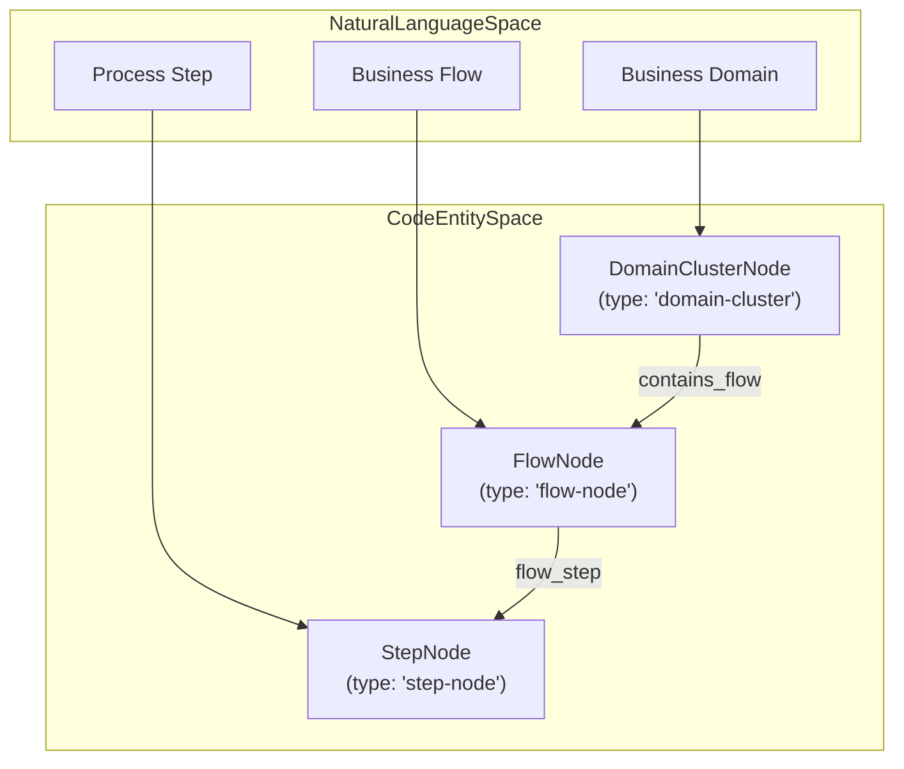
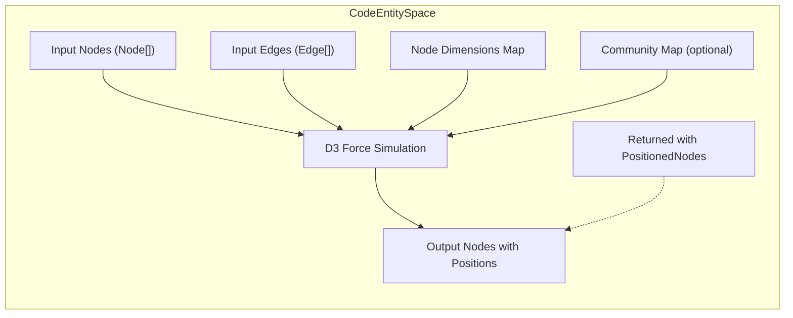
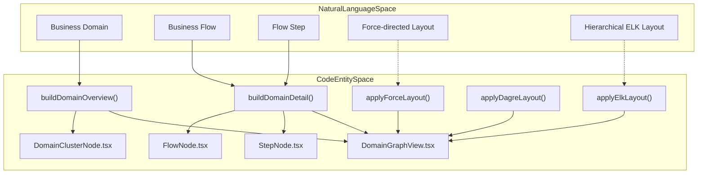
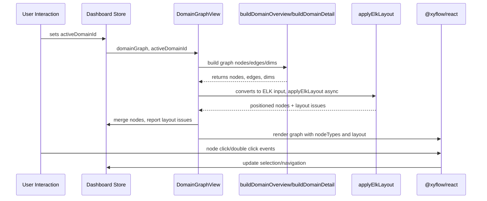

# Domain Graph View & Force Layout

<details>
<summary>Relevant source files</summary>

The following files were used as context for generating this wiki page:

- [understand-anything-plugin/packages/dashboard/src/components/ContainerNode.tsx](understand-anything-plugin/packages/dashboard/src/components/ContainerNode.tsx)
- [understand-anything-plugin/packages/dashboard/src/components/DomainClusterNode.tsx](understand-anything-plugin/packages/dashboard/src/components/DomainClusterNode.tsx)
- [understand-anything-plugin/packages/dashboard/src/components/DomainGraphView.tsx](understand-anything-plugin/packages/dashboard/src/components/DomainGraphView.tsx)
- [understand-anything-plugin/packages/dashboard/src/components/FlowNode.tsx](understand-anything-plugin/packages/dashboard/src/components/FlowNode.tsx)
- [understand-anything-plugin/packages/dashboard/src/components/StepNode.tsx](understand-anything-plugin/packages/dashboard/src/components/StepNode.tsx)
- [understand-anything-plugin/packages/dashboard/src/components/WarningBanner.tsx](understand-anything-plugin/packages/dashboard/src/components/WarningBanner.tsx)
- [understand-anything-plugin/packages/dashboard/src/utils/__tests__/elk-layout.test.ts](understand-anything-plugin/packages/dashboard/src/utils/__tests__/elk-layout.test.ts)
- [understand-anything-plugin/packages/dashboard/src/utils/elk-layout.ts](understand-anything-plugin/packages/dashboard/src/utils/elk-layout.ts)
- [understand-anything-plugin/packages/dashboard/src/utils/layout.ts](understand-anything-plugin/packages/dashboard/src/utils/layout.ts)

</details>


This page documents the implementation details of the Domain Graph visualization in the dashboard subsystem of the Understand Anything project. It covers the **DomainGraphView** component and its primary construction functions `buildDomainOverview` and `buildDomainDetail`, the key node components (`DomainClusterNode`, `FlowNode`, `StepNode`), the D3-based force-directed layout (`applyForceLayout`), and the deprecated Dagre layout fallback. Technical implementation, data flow, and interaction between these components and utilities are explained in detail.

---

## 4.3.1 Purpose and Scope

The domain graph view visualizes business domain structures, their contained flows, and detailed flow steps within a knowledge graph generated by the analysis pipeline. It is an interactive, layered graph representation supporting drill-down levels, selection, and navigation.

This visualization leverages React components (`@xyflow/react`) for rendering nodes and edges, and utilizes the ELK layout engine asynchronously for positioning nodes by default. For certain use cases, a D3 force-directed layout is provided as an alternate force layout strategy, while an older synchronous Dagre layout fallback is deprecated.

---

## 4.3.2 DomainGraphView: Overview & Detail Construction

### Components and Node Types

- **DomainGraphView** is the main React component orchestrating the domain graph visualization.
- It uses three specialized node components representing different graph entity levels:
  - `DomainClusterNode`: Represents a business domain cluster node.
  - `FlowNode`: Represents a flow within a domain.
  - `StepNode`: Represents an individual step within a flow.

These are registered with ReactFlow via the `nodeTypes` mapping:

```typescript
const nodeTypes = {
  "domain-cluster": DomainClusterNode,
  "flow-node": FlowNode,
  "step-node": StepNode,
};
```

Each node component accepts typed data props to render details like labels, summaries, counts, and clickable behaviors for selection and navigation. These nodes also expose handles for incoming and outgoing graph edges used by ReactFlow.

### Building the Domain Overview Graph (`buildDomainOverview`)

This function creates a high-level graph of business domains connected by cross-domain edges.

- It filters graph nodes for those of type `"domain"`.
- Counts associated flows per domain using edges typed `"contains_flow"`.
- Constructs **DomainClusterFlowNode** ReactFlow nodes with appropriate sizing and metadata (entities, business rules, flow count).
- Filters edges typed `"cross_domain"` to show cross-domain relationships.
- Configures edge styles to visually distinguish them (accent color, dashed stroke, animation).

The resulting node and edge collections plus a dimension map for sizing are returned for layout.

### Building the Domain Detail Graph (`buildDomainDetail`)

This function produces a detailed graph for a user-selected domain, showing:

- Flows contained in a domain (via `"contains_flow"` edges).
- Steps belonging to those flows (via `"flow_step"` edges).
- Metadata such as step order and counts are extracted and mapped.
- Constructs `FlowNode` nodes for flows and `StepNode` nodes for steps.
- Step edges constructed from `"flow_step"` edges.
- Size dimensions for flows and steps are set for layout.

This enables drill-down from domain overview to flow-step granularity.



### Runtime Lifecycle Inside DomainGraphViewInner

- React state manages the current active domain being viewed.
- Memoized call to either `buildDomainOverview` (no domain active) or `buildDomainDetail` (with domain id) builds the graph data.
- This structural data contains nodes, edges, and dimension maps.
- The graph uses `nodesToElkInput` to convert nodes/edges into ELK layout input format.
- `applyElkLayout` asynchronously performs hierarchical layout with ELK.
- On completion, positioned node coordinates are merged back into ReactFlow nodes.
- Layout issues (warnings/errors) from ELK are fed into the global dashboard state for display.

---

## 4.3.3 DomainClusterNode, FlowNode, StepNode Components

### DomainClusterNode

- Represents a domain node visually styled with borders, background, and interactive selection/double-click dispatch for navigation.
- Shows label, summary, up to first 5 entities, flow count.
- Contains clickable handles on left/right for connecting edges.
- Highlights when selected.

### FlowNode

- Represents a flow inside a domain.
- Displays optional entry point/type metadata, name, summary, step count.
- Includes interactive selection on click.
- Edge connection handles on left/right.
- Distinct styling for selected state.

### StepNode

- Represents a step inside a flow.
- Shows order number, name, summary, and source file path.
- Smaller node footprint compared to domain and flow nodes.
- Selection and handles similar to others.

All components use React memoization to optimize re-renders.

---

## 4.3.4 Force-Directed Layout (`applyForceLayout`)

The project supports a force-directed layout built on D3's `d3-force` library, for flexible graph layout, especially suited to knowledge graphs with community structure.

### Key features:

- Nodes are modeled as `ForceNode` objects with IDs and optional community labels.
- Links map to `SimulationLinkDatum` objects referencing source/target IDs.
- Configurable physics forces:
  - **Link force:** keeps connected nodes at a target distance.
  - **Charge force:** repulsion between nodes, scaled based on graph size.
  - **Centering force:** pulls nodes towards the center (0,0).
  - **Collide force:** prevents node overlaps based on node dimensions plus padding.
- Optional **community clustering** force:
  - Nodes belonging to the same community cluster attract towards a designated circle segment.
  - Number of communities determines cluster centers placed evenly around a circle.
- The simulation runs synchronously for a fixed number of ticks (100–300) depending on node count, then stops.
- Resulting node positions are offset by half the node width/height to convert centering coordinates into bounding-box style coordinates.
- Edges remain unchanged.

### Usage

`applyForceLayout` accepts:

- `nodes`: ReactFlow nodes array.
- `edges`: ReactFlow edges array.
- `nodeDimensions` map: sizing for each node.
- `communityMap` (optional): node ID to community index mapping.

Returns updated nodes with computed positions and unchanged edges.



---

## 4.3.5 Deprecated Dagre Layout (`applyDagreLayout`)

The dashboard previously used Dagre for synchronous layout of small graphs:

- Positioned nodes using rank-based directed graph layering.
- Default node dimensions of 280x120.
- Spacing scales up for larger graphs.
- Positioned nodes by centering on Dagre’s computed coordinates.
- Edges set with no extra layout metadata.

This layout is deprecated and marked for removal, replaced by ELK or the D3 force layout.

---

## 4.3.6 ELK Layout Integration

The current default domain graph layout in `DomainGraphView` uses the ELK (Eclipse Layout Kernel) layout engine asynchronously.

- DomainGraphView converts graph nodes and edges to ELK input format (`nodesToElkInput`).
- It calls `applyElkLayout` to perform hierarchical/orthogonal layout.
- ELK results are merged back using `mergeElkPositions`.
- Layout issues from ELK's repair and layout phases (missing node sizes, orphan edges, cycles) are surfaced through the dashboard's `WarningBanner` UI component.

The ELK integration helps produce neat directed graph layouts while supporting node groups and layered views.

---

## 4.3.7 Summary Mermaid Diagram: Natural Language to Code Entity Mapping



---

## 4.3.8 Data Flow for DomainGraphView Component



---

## 4.3.9 References and Code Citations

- DomainGraphView component with `buildDomainOverview`, `buildDomainDetail` and nodeTypes registration:  
  `packages/dashboard/src/components/DomainGraphView.tsx:1-213`  
- Domain node component `DomainClusterNode`:  
  `packages/dashboard/src/components/DomainClusterNode.tsx:1-67`  
- Flow node component `FlowNode`:  
  `packages/dashboard/src/components/FlowNode.tsx:1-53`  
- Step node component `StepNode`:  
  `packages/dashboard/src/components/StepNode.tsx:1-54`  
- D3 force-directed layout function `applyForceLayout` and deprecated Dagre fallback `applyDagreLayout`:  
  `packages/dashboard/src/utils/layout.ts:1-189`  
- ELK layout utility and repair logic with async layout call:  
  `packages/dashboard/src/utils/elk-layout.ts:1-245`

---

This comprehensive coverage ensures engineers can understand the domain graph visualization's architecture, main components, layout strategies, and data transformation flow within the dashboard module of Understand Anything.
