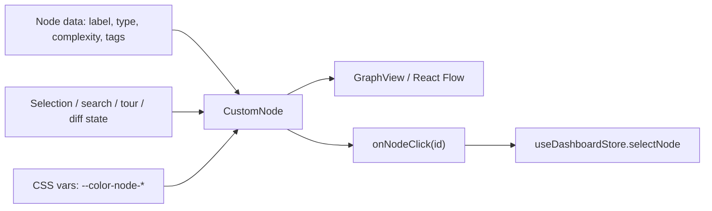
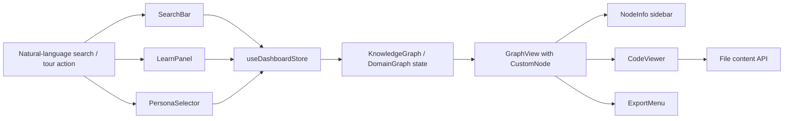

# UI Components & Panels

Relevant source files

The following files were provided as context for reconstructing this DeepWiki page:

- [understand-anything-plugin/packages/dashboard/scripts/benchmark-aggregations.mjs](understand-anything-plugin/packages/dashboard/scripts/benchmark-aggregations.mjs)
- [understand-anything-plugin/packages/dashboard/src/App.tsx](understand-anything-plugin/packages/dashboard/src/App.tsx)
- [understand-anything-plugin/packages/dashboard/src/components/CodeViewer.tsx](understand-anything-plugin/packages/dashboard/src/components/CodeViewer.tsx)
- [understand-anything-plugin/packages/dashboard/src/components/CustomNode.tsx](understand-anything-plugin/packages/dashboard/src/components/CustomNode.tsx)
- [understand-anything-plugin/packages/dashboard/src/components/DiffToggle.tsx](understand-anything-plugin/packages/dashboard/src/components/DiffToggle.tsx)
- [understand-anything-plugin/packages/dashboard/src/components/DomainGraphView.tsx](understand-anything-plugin/packages/dashboard/src/components/DomainGraphView.tsx)
- [understand-anything-plugin/packages/dashboard/src/components/ExportMenu.tsx](understand-anything-plugin/packages/dashboard/src/components/ExportMenu.tsx)
- [understand-anything-plugin/packages/dashboard/src/components/FileExplorer.tsx](understand-anything-plugin/packages/dashboard/src/components/FileExplorer.tsx)
- [understand-anything-plugin/packages/dashboard/src/components/FilterPanel.tsx](understand-anything-plugin/packages/dashboard/src/components/FilterPanel.tsx)
- [understand-anything-plugin/packages/dashboard/src/components/GraphView.tsx](understand-anything-plugin/packages/dashboard/src/components/GraphView.tsx)
- [understand-anything-plugin/packages/dashboard/src/components/KeyboardShortcutsHelp.tsx](understand-anything-plugin/packages/dashboard/src/components/KeyboardShortcutsHelp.tsx)
- [understand-anything-plugin/packages/dashboard/src/components/LayerLegend.tsx](understand-anything-plugin/packages/dashboard/src/components/LayerLegend.tsx)
- [understand-anything-plugin/packages/dashboard/src/components/LearnPanel.tsx](understand-anything-plugin/packages/dashboard/src/components/LearnPanel.tsx)
- [understand-anything-plugin/packages/dashboard/src/components/MobileBottomNav.tsx](understand-anything-plugin/packages/dashboard/src/components/MobileBottomNav.tsx)
- [understand-anything-plugin/packages/dashboard/src/components/MobileDrawer.tsx](understand-anything-plugin/packages/dashboard/src/components/MobileDrawer.tsx)
- [understand-anything-plugin/packages/dashboard/src/components/MobileLayout.tsx](understand-anything-plugin/packages/dashboard/src/components/MobileLayout.tsx)
- [understand-anything-plugin/packages/dashboard/src/components/NodeInfo.tsx](understand-anything-plugin/packages/dashboard/src/components/NodeInfo.tsx)
- [understand-anything-plugin/packages/dashboard/src/components/NodeTooltip.tsx](understand-anything-plugin/packages/dashboard/src/components/NodeTooltip.tsx)
- [understand-anything-plugin/packages/dashboard/src/components/OnboardingOverlay.tsx](understand-anything-plugin/packages/dashboard/src/components/OnboardingOverlay.tsx)
- [understand-anything-plugin/packages/dashboard/src/components/PathFinderModal.tsx](understand-anything-plugin/packages/dashboard/src/components/PathFinderModal.tsx)
- [understand-anything-plugin/packages/dashboard/src/components/PersonaSelector.tsx](understand-anything-plugin/packages/dashboard/src/components/PersonaSelector.tsx)
- [understand-anything-plugin/packages/dashboard/src/components/ProjectOverview.tsx](understand-anything-plugin/packages/dashboard/src/components/ProjectOverview.tsx)
- [understand-anything-plugin/packages/dashboard/src/components/SearchBar.tsx](understand-anything-plugin/packages/dashboard/src/components/SearchBar.tsx)
- [understand-anything-plugin/packages/dashboard/src/components/WarningBanner.tsx](understand-anything-plugin/packages/dashboard/src/components/WarningBanner.tsx)
- [understand-anything-plugin/packages/dashboard/src/contexts/I18nContext.tsx](understand-anything-plugin/packages/dashboard/src/contexts/I18nContext.tsx)
- [understand-anything-plugin/packages/dashboard/src/hooks/useIsMobile.ts](understand-anything-plugin/packages/dashboard/src/hooks/useIsMobile.ts)
- [understand-anything-plugin/packages/dashboard/src/hooks/useKeyboardShortcuts.ts](understand-anything-plugin/packages/dashboard/src/hooks/useKeyboardShortcuts.ts)
- [understand-anything-plugin/packages/dashboard/src/index.css](understand-anything-plugin/packages/dashboard/src/index.css)
- [understand-anything-plugin/packages/dashboard/src/locales/en.ts](understand-anything-plugin/packages/dashboard/src/locales/en.ts)
- [understand-anything-plugin/packages/dashboard/src/locales/ja.ts](understand-anything-plugin/packages/dashboard/src/locales/ja.ts)
- [understand-anything-plugin/packages/dashboard/src/locales/ko.ts](understand-anything-plugin/packages/dashboard/src/locales/ko.ts)
- [understand-anything-plugin/packages/dashboard/src/locales/ru.ts](understand-anything-plugin/packages/dashboard/src/locales/ru.ts)
- [understand-anything-plugin/packages/dashboard/src/locales/zh-TW.ts](understand-anything-plugin/packages/dashboard/src/locales/zh-TW.ts)
- [understand-anything-plugin/packages/dashboard/src/locales/zh.ts](understand-anything-plugin/packages/dashboard/src/locales/zh.ts)
- [understand-anything-plugin/packages/dashboard/src/store.ts](understand-anything-plugin/packages/dashboard/src/store.ts)
- [understand-anything-plugin/packages/dashboard/src/themes/presets.ts](understand-anything-plugin/packages/dashboard/src/themes/presets.ts)
- [understand-anything-plugin/packages/dashboard/src/utils/__tests__/filters.test.ts](understand-anything-plugin/packages/dashboard/src/utils/__tests__/filters.test.ts)
- [understand-anything-plugin/packages/dashboard/src/utils/__tests__/layerStats.test.ts](understand-anything-plugin/packages/dashboard/src/utils/__tests__/layerStats.test.ts)
- [understand-anything-plugin/packages/dashboard/src/utils/filters.ts](understand-anything-plugin/packages/dashboard/src/utils/filters.ts)
- [understand-anything-plugin/packages/dashboard/src/utils/layerStats.ts](understand-anything-plugin/packages/dashboard/src/utils/layerStats.ts)
- [understand-anything-plugin/packages/dashboard/src/utils/layout.ts](understand-anything-plugin/packages/dashboard/src/utils/layout.ts)
- [understand-anything-plugin/pnpm-workspace.yaml](understand-anything-plugin/pnpm-workspace.yaml)

This section documents the major UI components and panels that constitute the React-based interactive dashboard in the Understand Anything system. These components enable users to navigate, explore, search, filter, and learn from the knowledge graph derived from a codebase. The components covered include graph visualization nodes, informational sidebars, search utilities, guided learning tours, legends, code viewers, file explorers, persona selectors, filters, path-finding modal dialogs, export menus, warning banners, diff toggles, onboarding overlays, and mobile layout components.

---

## Overview & Scope

The dashboard is implemented with React and TypeScript and uses `@xyflow/react` for graph visualization. UI components are integrated with the dashboard's Zustand store, which manages state such as the loaded knowledge graph, selected nodes, filters, search modes, user personas, navigation history, diff mode, and UI presentation state. Internationalization is managed through the `I18nContext` for user-facing text.

Many heavier panels are lazily loaded from the main app entry to improve initial bundle performance. The interactions between components, the store, and rendering logic form the backbone of the Understand Anything dashboard user experience.

---

## 1. Graph Visualization Nodes: `CustomNode`

`CustomNode` is the primary React component that renders an individual node in the graph view. It is used within the `GraphView` React Flow visualization.

### Implementation Highlights

- Renders nodes according to their node type, such as file, function, class, module, or concept.
- Uses a vertical colored bar to indicate node type, with colors synchronized to CSS variables.
- Displays node type, complexity, summary text, and a shortened/truncated label.
- Varies styling for selection, search highlighting, guided-tour highlighting, and diff overlay states.
- Supports click handling through a callback prop.
- Uses memoization to reduce unnecessary rerenders.

### Data Flow

- Node props carry data such as label, node type, complexity, highlight flags, diff state, and tags.
- The component uses localized strings for tooltips and labels.
- Styling logic composes CSS classes dynamically from node state.
- On click, the component emits the node id to a parent callback, which updates the dashboard selection state.

### Diagram: Node Rendering & Interaction Flow

---

## 2. Node Information Panel: `NodeInfo`

`NodeInfo` is a sidebar panel showing detailed information about the currently selected node.

### Key Features

- Shows type badges colored by node type.
- Displays edges grouped by categories such as wikilinks, backlinks, and categories, with buttons to navigate to related nodes.
- For knowledge nodes, shows related knowledge claims and backlinks.
- For domain nodes, lists entities, business rules, domains, and flow steps with navigation support.
- Supports multiple detail levels and adapts to the graph's active view mode.

### Data Flow

- Reads selected node and graph context from the Zustand store.
- Queries loaded graph nodes and edges to build related-node lists.
- Uses localized strings for UI text.
- Dispatches navigation actions when the user clicks related entities.

---

## 3. Search Bar: `SearchBar`

The search bar supports both fuzzy text search and semantic search modes over graph content.

### Implementation Notes

- Connects to the store's current search query, search results, and search mode.
- Dispatches updates for query and mode changes.
- Supports fuzzy matching through a Fuse.js-based search engine.
- Supports semantic similarity search where embedding/search infrastructure is available.
- Displays results in a dropdown and supports keyboard navigation.

---

## 4. Guided Tour Panel: `LearnPanel`

`LearnPanel` presents a guided tour through the knowledge graph using curated nodes.

### Highlights

- Lazily loaded to avoid increasing the initial dashboard bundle.
- Uses tour state from the store, including active step and highlighted nodes.
- Allows users to navigate through tour steps and read contextual explanations.
- Synchronizes the graph viewport by panning and zooming to highlighted nodes.

---

## 5. Layer Legend: `LayerLegend`

`LayerLegend` explains the meaning of layers and color codes in the graph.

- Shows explanations of architectural layers in the structural graph view.
- Displays the meaning of node colors and edge categories.
- Helps users interpret how graph organization maps to codebase structure.

---

## 6. Code Viewer: `CodeViewer`

`CodeViewer` displays source code associated with a selected node, including syntax highlighting and line-range support.

### Implementation Details

- Uses syntax highlighting with theme-aware rendering.
- Supports two presentation modes: inline sidebar and expandable modal dialog.
- Accepts or uses an access token for fetching file content securely through the API.
- Fetches source content asynchronously and chooses a language mode based on file extension or metadata.
- Highlights line ranges when the selected graph node contains location metadata.
- Handles loading, error, and fallback language-detection states.

### Data Flow

- Reads selected node and file metadata from the dashboard store.
- Fetches file content when the selected node or path changes.
- Displays file path, file size or preview metadata, and highlighted source ranges.
- Supports close and expand events to control visibility.

---

## 7. File Explorer: `FileExplorer`

`FileExplorer` displays a tree view of project files derived from graph layers or file nodes.

- Organizes project structure as folders and files.
- Allows file selection, which can update the selected graph node or focus the graph view.
- Reflects filter and persona state where relevant.

---

## 8. Persona Selector: `PersonaSelector`

`PersonaSelector` allows switching between user personas such as beginner, builder, or architect-style views.

- Persona selection influences filtering logic applied to visible nodes and edges.
- The UI provides toggle buttons or selectors for changing persona.
- Persona state is stored centrally so other panels can adapt consistently.

---

## 9. Filter Panel: `FilterPanel`

`FilterPanel` provides fine-grained controls for showing and hiding graph elements.

- Uses store-managed filter state.
- Supports filtering by node type, edge type, complexity, and layer.
- Opening and closing the panel updates UI state in the store.
- Filter changes propagate to graph rendering, search results, export, and statistics views.

---

## 10. Path Finder Modal: `PathFinderModal`

`PathFinderModal` helps users find shortest paths or conceptual connections between nodes.

- Provides interactive inputs for source and target nodes.
- Displays path results with node and edge highlights.
- Is lazily loaded and can overlay the main graph views.

---

## 11. Export Menu: `ExportMenu`

`ExportMenu` allows exporting the current graph view to SVG, PNG, or JSON formats while respecting active filters and persona context.

### Implementation Highlights

- Uses the React Flow instance to capture node and edge coordinates and appearance.
- Generates a clean SVG representation by drawing graph nodes and edges manually.
- Converts SVG to PNG through a canvas for raster export.
- Serializes a filtered JSON export according to active filters and persona.
- Handles blob download and menu open/close logic.
- Uses store selectors for graph data, filters, persona, and React Flow instance state.

---

## 12. Warning Banner: `WarningBanner`

`WarningBanner` displays layout or data-validation issues as non-blocking banners.

- Reads validation output or graph layout issues from dashboard state.
- Shows warnings prominently so users understand possible inconsistencies.
- Supports dismiss or reload-style actions where available.

---

## 13. Diff Toggle: `DiffToggle`

`DiffToggle` enables or disables the diff overlay mode, which annotates graph nodes and edges with change or affected states.

- Interfaces with a boolean diff-mode property in the store.
- Causes graph nodes to rerender with diff glow/highlight states.
- Provides an accessible toggle control.

---

## 14. Onboarding Overlay: `OnboardingOverlay`

`OnboardingOverlay` is a first-visit or forced onboarding modal that guides users through dashboard usage.

### Implementation Details

- Controlled by parent state and persistence logic.
- Contains multiple steps, each with title, body, and optional hint.
- Closes on Escape key.
- Provides navigation buttons for next, previous, skip, and finish.
- Uses animated or glassmorphic styling consistent with the dashboard theme.

---

## 15. Mobile Layout Components

Mobile-specific layout components adapt the dashboard UI to smaller screens.

- `MobileLayout`: Manages drawer navigation, bottom navigation, and panel toggles optimized for mobile.
- `MobileDrawer` and `MobileBottomNav`: Provide supporting sliding menu and tab-bar interactions.
- `useIsMobile`: Detects responsive breakpoints to switch layout behavior.

These components ensure that the dashboard remains usable across device form factors.

---

## Data Flow & Interaction Summary

### Dashboard Store Centralization

The Zustand store acts as the central hub for UI state:

- Loaded knowledge graph and domain graph data.
- Selected node and navigation history.
- Search query, search results, and search mode.
- Panel open/close flags.
- Filters, personas, and diff mode toggles.
- React Flow instance reference for export operations.

### Diagram: Natural Language to Code Entity Space

---

## Additional Implementation Details

### Lazy Loading & Suspense

In the main app component, heavier panels such as `LearnPanel`, `CodeViewer`, `PathFinderModal`, and `OnboardingOverlay` are lazy-loaded with React `Suspense` fallbacks to optimize bundle size and initial load time.

### Theming & Internationalization

Components draw from the theme context for colors and style variables and use the i18n context for localized text strings, allowing the UI to adapt to user language and theme preferences.

### Interaction Handling

Most components interact with the store through selectors and dispatcher functions, such as node selection, search updates, filter toggles, persona changes, and panel visibility updates. This keeps cross-component behavior synchronized.

### Export Functionality

The export logic manually creates SVG representations from React Flow nodes and edges for clean scalable diagrams. PNG export converts the generated SVG through a canvas. JSON export serializes the filtered graph state rather than the entire unfiltered graph.

---

## Summary Table of UI Components

| Component | Purpose | Key Props / Store Interaction | Lazy Loaded | File Path |
| --- | --- | --- | --- | --- |
| `CustomNode` | Renders individual graph nodes with styling and interactions | Node data, click handler, selection/search/diff flags | No | `understand-anything-plugin/packages/dashboard/src/components/CustomNode.tsx` |
| `NodeInfo` | Sidebar showing selected node details and related nodes | Selected node, graph edges, navigation actions | No | `understand-anything-plugin/packages/dashboard/src/components/NodeInfo.tsx` |
| `SearchBar` | Search input supporting fuzzy and semantic search | Search query, mode, results | No | `understand-anything-plugin/packages/dashboard/src/components/SearchBar.tsx` |
| `LearnPanel` | Guided tour interface with step-by-step highlights | Tour step, highlighted nodes, viewport actions | Yes | `understand-anything-plugin/packages/dashboard/src/components/LearnPanel.tsx` |
| `LayerLegend` | Explains layer colors and node categories | Layer and node type metadata | No | `understand-anything-plugin/packages/dashboard/src/components/LayerLegend.tsx` |
| `CodeViewer` | Source-code preview with syntax highlighting | Selected node path, file fetch API, line ranges | Yes | `understand-anything-plugin/packages/dashboard/src/components/CodeViewer.tsx` |
| `FileExplorer` | File tree navigation panel | File/folder graph nodes, selection, filters | No | `understand-anything-plugin/packages/dashboard/src/components/FileExplorer.tsx` |
| `PersonaSelector` | Switches user personas that influence filtering | Persona setter and current persona state | No | `understand-anything-plugin/packages/dashboard/src/components/PersonaSelector.tsx` |
| `FilterPanel` | Filters nodes, edges, layers, and complexity | Filter state and toggle actions | No | `understand-anything-plugin/packages/dashboard/src/components/FilterPanel.tsx` |
| `PathFinderModal` | Finds graph paths between entities | Source/target nodes, modal open state | Yes | `understand-anything-plugin/packages/dashboard/src/components/PathFinderModal.tsx` |
| `ExportMenu` | Exports graph as SVG, PNG, or JSON | React Flow instance, filters, persona, graph state | No | `understand-anything-plugin/packages/dashboard/src/components/ExportMenu.tsx` |
| `WarningBanner` | Shows validation or layout warnings | Warning/layout issue state | No | `understand-anything-plugin/packages/dashboard/src/components/WarningBanner.tsx` |
| `DiffToggle` | Toggles diff overlay visual state | Diff-mode boolean setter | No | `understand-anything-plugin/packages/dashboard/src/components/DiffToggle.tsx` |
| `OnboardingOverlay` | First-time onboarding modal with steps | Visibility, step state, dismiss callbacks | Yes | `understand-anything-plugin/packages/dashboard/src/components/OnboardingOverlay.tsx` |
| `MobileLayout` | Responsive layout and navigation for mobile devices | Drawer state, active panel, mobile breakpoint | No | `understand-anything-plugin/packages/dashboard/src/components/MobileLayout.tsx` |

---

## Detailed Component Descriptions

### CustomNode

`CustomNode` is a React Flow node component that renders a graph node in the structural knowledge graph. It handles visual decorations such as a colored left bar representing the node type, text labels for node type and complexity, a truncated summary preview, and dynamic CSS classes reflecting states like selection, search highlighting, tour highlighting, and diff changes. Interaction occurs primarily through an `onClick` handler passed via props to select or drill into entities.

### NodeInfo

The `NodeInfo` panel shows detailed information about the currently selected node. It includes node type badges with colors matching `CustomNode`, edge relationships grouped logically, rich previews of knowledge or domain details, and navigation buttons for traversing related nodes and domain hierarchies. Text strings are localized through the dashboard i18n context.

### SearchBar

`SearchBar` provides a search input with modes for fuzzy text matching and semantic search. It interacts with the store to apply search queries and update highlighted search results across the graph.

### LearnPanel

`LearnPanel` presents a multi-step guided tour of the knowledge graph. It highlights nodes relevant to the current tour step and can pan or zoom the graph view. It is triggered by user action or onboarding flow and controlled through store state.

### CodeViewer

`CodeViewer` is a syntax-highlighted source-code viewer that loads files asynchronously through an API. It supports sidebar and modal presentations and can highlight line segments described by selected graph nodes. It handles loading and error states gracefully.

### ExportMenu

`ExportMenu` generates visual exports of the current graph view. SVG export creates scalable vector graphics for nodes and edges. PNG export rasterizes the SVG through a canvas. JSON export serializes a filtered graph representation using active filters and persona context. The menu opens and closes through UI state and outside-click handling.

### OnboardingOverlay

`OnboardingOverlay` appears on first visit or when forced through a URL parameter. It contains a localized sequence of onboarding steps with titles and hints. Navigation controls allow forward/backward step switching and final dismissal.

---

## Summary

The UI components and panels in the Understand Anything dashboard form a tightly integrated ecosystem. Each component interfaces with the centralized Zustand store to respond to user input and system state changes, providing an interactive experience for exploring generated code knowledge graphs. Specialized components such as `CustomNode`, `NodeInfo`, and `CodeViewer` are complemented by supporting utilities such as search bars, legends, filter panels, export menus, and onboarding overlays.

The dashboard architecture supports scalability and modularity through lazy loading, theme integration, internationalization, responsive mobile layouts, and a separation between visualization, data fetching, and state management.
