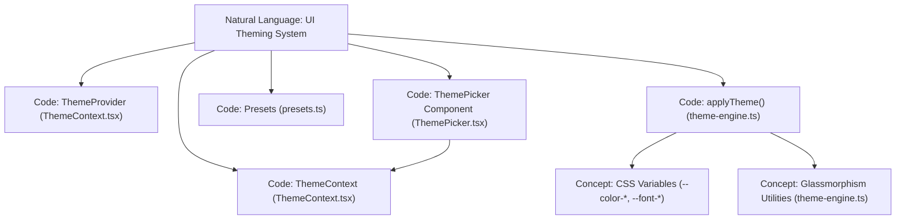
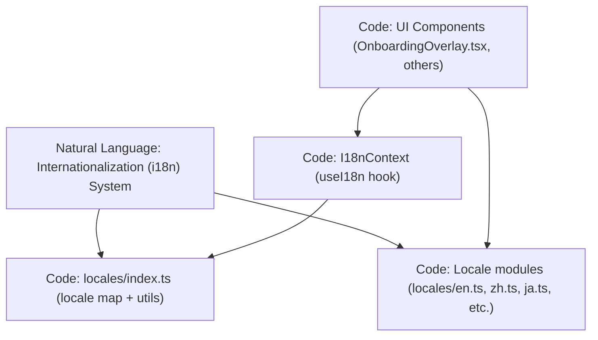

# Theming & Internationalization

<details>
<summary>Relevant source files</summary>

The following files were used as context for generating this wiki page:

- [understand-anything-plugin/packages/dashboard/src/components/OnboardingOverlay.tsx](understand-anything-plugin/packages/dashboard/src/components/OnboardingOverlay.tsx)
- [understand-anything-plugin/packages/dashboard/src/components/ThemePicker.tsx](understand-anything-plugin/packages/dashboard/src/components/ThemePicker.tsx)
- [understand-anything-plugin/packages/dashboard/src/locales/en.ts](understand-anything-plugin/packages/dashboard/src/locales/en.ts)
- [understand-anything-plugin/packages/dashboard/src/locales/index.ts](understand-anything-plugin/packages/dashboard/src/locales/index.ts)
- [understand-anything-plugin/packages/dashboard/src/locales/ja.ts](understand-anything-plugin/packages/dashboard/src/locales/ja.ts)
- [understand-anything-plugin/packages/dashboard/src/locales/ko.ts](understand-anything-plugin/packages/dashboard/src/locales/ko.ts)
- [understand-anything-plugin/packages/dashboard/src/locales/ru.ts](understand-anything-plugin/packages/dashboard/src/locales/ru.ts)
- [understand-anything-plugin/packages/dashboard/src/locales/zh-TW.ts](understand-anything-plugin/packages/dashboard/src/locales/zh-TW.ts)
- [understand-anything-plugin/packages/dashboard/src/locales/zh.ts](understand-anything-plugin/packages/dashboard/src/locales/zh.ts)
- [understand-anything-plugin/packages/dashboard/src/themes/ThemeContext.tsx](understand-anything-plugin/packages/dashboard/src/themes/ThemeContext.tsx)
- [understand-anything-plugin/packages/dashboard/src/themes/index.ts](understand-anything-plugin/packages/dashboard/src/themes/index.ts)
- [understand-anything-plugin/packages/dashboard/src/themes/theme-engine.ts](understand-anything-plugin/packages/dashboard/src/themes/theme-engine.ts)
- [understand-anything-plugin/packages/dashboard/src/themes/types.ts](understand-anything-plugin/packages/dashboard/src/themes/types.ts)
- [understand-anything-plugin/skills/understand/locales/en.md](understand-anything-plugin/skills/understand/locales/en.md)
- [understand-anything-plugin/skills/understand/locales/ja.md](understand-anything-plugin/skills/understand/locales/ja.md)
- [understand-anything-plugin/skills/understand/locales/ko.md](understand-anything-plugin/skills/understand/locales/ko.md)
- [understand-anything-plugin/skills/understand/locales/ru.md](understand-anything-plugin/skills/understand/locales/ru.md)
- [understand-anything-plugin/skills/understand/locales/zh-TW.md](understand-anything-plugin/skills/understand/locales/zh-TW.md)
- [understand-anything-plugin/skills/understand/locales/zh.md](understand-anything-plugin/skills/understand/locales/zh.md)

</details>


This section documents the comprehensive theming and internationalization (i18n) systems implemented in the Understand Anything dashboard. It covers the design and implementation details of the theme context and engine, available theme presets, CSS variable architecture, utilities for glassmorphism, the interactive ThemePicker component, and the multilingual support infrastructure including locale management and translation resources.

---

## 1. Theme System Overview

The theme system enables dynamic alteration of the dashboard's appearance, including colors, accents, and typography, ensuring a customizable UI experience. It is implemented using React context and hooks for state management, coupled with runtime CSS variable updates.

### Key Components:

- **ThemeContext & ThemeProvider**: React context that holds the current theme configuration and exposes setters to update theme preset, accent color, and heading font.
- **ThemeEngine**: Updates CSS variables on the `<html>` root element based on the active theme config.
- **Theme Presets**: Predefined color palettes such as `dark-gold`, `dark-ocean`, `dark-forest`, and `light-minimal`.
- **ThemePicker Component**: UI widget that presents selectable theme presets, accent color swatches, and heading font options.
- **CSS Variable Architecture**: Uses variables like `--color-root`, `--color-surface`, `--color-accent`, `--font-heading` to define visual styles.
- **Glassmorphism Utilities**: CSS color overlays and border styles for translucent "glass" effects.

---

## 2. ThemeContext & ThemeProvider

The **ThemeContext** is created to share theme state and controls throughout the React component tree.

- Exposes:
  - `config`: Current theme configuration including presetId, accentId, and headingFont.
  - `preset`: Full preset object derived from the config.
  - `setPreset(presetId)`, `setAccent(accentId)`, `setHeadingFont(font)` functions to update theme.
  
- The **ThemeProvider** maintains the `config` state internally, initializing from:
  - LocalStorage saved theme config (key: `"ua-theme"`)
  - Optional fallback `metaTheme` prop
  - Default fallback preset config from `DEFAULT_THEME_CONFIG`

- On `config` changes, **ThemeProvider** invokes `applyTheme` to update CSS variables and saves the config back to localStorage for persistence.

- Ensures consistency between saved user preferences and latest theme presets.

### LocalStorage Handling

- **loadFromLocalStorage** parses and validates saved theme JSON.
- **saveToLocalStorage** serializes the current config, handling exceptions like quota exceeded.
  
```tsx
// Simplified use of ThemeContext and ThemeProvider usage pattern:
const { config, preset, setPreset, setAccent, setHeadingFont } = useTheme();
```

Sources: [packages/dashboard/src/themes/ThemeContext.tsx:1-107]()

---

## 3. Theme Engine & CSS Variable Application

The **ThemeEngine** is responsible for applying the active theme's colors and styles at runtime by manipulating CSS custom properties on the root document element.

### Workflow of `applyTheme(config: ThemeConfig)`

1. Retrieves the full preset via `getPreset(config.presetId)`.
2. Retrieves the active accent swatch via `getAccent(preset, config.accentId)`.
3. Applies base colors defined in the preset's `colors` object as properties like `--color-root`, `--color-surface`.
4. Applies accent colors (`--color-accent`, `--color-accent-dim`, `--color-accent-bright`).
5. Derives additional CSS colors programmatically from the accent base color. This includes border colors, glassmorphism background and border overlays, scrollbar thumb colors, glow effects, and edge colors. The derivation uses RGB conversion and opacity adjustments, differentiating between light and dark themes.
6. Applies a `data-theme` attribute (`"dark"` or `"light"`) on `<html>` for CSS selectors targeting theme variants.
7. Sets the font family for headings by updating `--font-heading` based on `headingFont` config (`serif`, `sans`, `mono`).

### Key CSS Variables Set by ThemeEngine:

| CSS Variable                | Description                              |
|-----------------------------|----------------------------------------|
| --color-root                | Base background/root color              |
| --color-surface             | Card or elevated surface background    |
| --color-accent              | Accent color main                       |
| --color-accent-dim          | Dimmed accent                          |
| --color-accent-bright       | Bright accent for highlights            |
| --color-border-subtle       | Subtle border color, derived from accent|
| --color-border-medium       | Medium opacity border color             |
| --glass-bg                  | Glassmorphism background (translucent) |
| --glass-bg-heavy            | Heavier glassmorphism background        |
| --glass-border              | Glassmorphism border                     |
| --color-edge                | Edge color for graph lines               |
| --scrollbar-thumb          | Scrollbar thumb color                     |
| --glow-accent               | Accent glow                            |
| --font-heading              | Font-family for headings                  |

The derivation and application happen whenever the theme config changes or is initially set.

Sources: [packages/dashboard/src/themes/theme-engine.ts:1-66](), [packages/dashboard/src/themes/ThemeContext.tsx:33-69]()

---

## 4. Theme Presets & Accent Swatches

The system includes several predefined theme **presets** combining background colors, surface tones, text colors, and accent swatches.

Available presets (fully defined in `presets.ts`):

- **dark-gold**: Dark theme with warm gold/yellow accents.
- **dark-ocean**: Dark theme with cool blue/cyan accents.
- **dark-forest**: Dark theme with deep green accents.
- **light-minimal**: Light themed, minimalistic color palette.

Each preset defines the following:

- `id`: Preset identifier string.
- `name`: Human-readable preset name.
- `isDark`: Boolean flag for dark vs light theme.
- `colors`: Map of fixed color names to hex values used as CSS variables.
- `defaultAccentId`: The default accent color swatch id.
- `accentSwatches`: Array of swatches defining available accent colors with their own ids and hex values.

Users can switch presets and accent colors independently.

Sources: [packages/dashboard/src/themes/ThemeContext.tsx:12-13](), [packages/dashboard/src/themes/index.ts:1-6]()

---

## 5. Glassmorphism Utilities

The theme system supports **glassmorphism** styling by applying translucent overlays and borders using CSS variables derived from the accent color. These include:

- Background overlays for translucent card surfaces (`--glass-bg`, `--glass-bg-heavy`).
- Border colors with partial transparency (`--glass-border`, `--glass-border-heavy`).
- Subtle transparency effects that adapt to light or dark themes.

These are computed dynamically in `deriveFromAccent` based on the accent RGB color and theme darkness, ensuring contrast and harmony.

Sources: [packages/dashboard/src/themes/theme-engine.ts:10-30]()

---

## 6. ThemePicker Component

The **ThemePicker** is an interactive React component providing a dropdown UI for users to select:

- A theme preset from the available list.
- An accent color swatch from the current preset's options.
- A heading font style (`serif`, `sans`, `mono`).

### Features:

- Uses the `useTheme()` hook to read and update theme settings.
- Renders visually distinct color sample dots for the presets and accent swatches.
- Supports keyboard and mouse events:
  - Opens/closes on button click.
  - Closes on outside click or Escape key press.
- Applies highlighting style on currently selected options.
- Uses translations from the i18n context for all static labels and tooltips.
- Uses Tailwind CSS utility classes for styling, enhanced by CSS variables from current theme.

### Interaction Flow

- On preset button click: calls `setPreset(presetId)` to switch preset and resets accent to preset default.
- On accent swatch click: calls `setAccent(accentId)` to update accent color.
- On heading font button click: calls `setHeadingFont(font)` to update font.

This component is typically embedded in the dashboard header or settings UI.

Sources: [packages/dashboard/src/components/ThemePicker.tsx:1-181](), [packages/dashboard/src/themes/ThemeContext.tsx:6-106]()

---

## 7. Internationalization (i18n) System

The i18n system enables Understand Anything's dashboard UI to support multiple languages.

### Supported Locales

- `en` (English)
- `zh` (Simplified Chinese)
- `zh-TW` (Traditional Chinese)
- `ja` (Japanese)
- `ko` (Korean)
- `ru` (Russian)

### Structure

- Each locale is a module exporting a nested translation object, organizing strings by dashboard UI sections (e.g., `common`, `nodeInfo`, `themePicker`, `onboarding`, etc.).
- Locale modules reside in `packages/dashboard/src/locales/` (e.g., `en.ts`, `zh.ts`, `ja.ts`, etc.).
- There exists an index module that exports:
  - The full map from locale keys (e.g., `"en"`) to locale objects.
  - Utility functions:
    - `getLocale(key)` to retrieve a locale object with a fallback to English.
    - `resolveLocaleKey(lang)` that normalizes input language strings (e.g. `"zh-cn"`, `"chinese"`, `"ja"`) to correct locale keys used in the app.

### Usage

- React components use the `useI18n()` hook (from `I18nContext`) to access the current locale's translation strings.
- The app detects or allows users to select their preferred language, loading corresponding locale data.
- Example: The onboarding overlay uses translated strings for its step titles and buttons.

---

## 8. i18n Usage Example: OnboardingOverlay

This component renders a first-visit onboarding modal with translation support:

- Uses the `useI18n()` hook to access localized text via `t.onboarding` and `t.common`.
- Text elements for buttons, steps, headers, hints change based on the current locale.
- Supports multiple languages seamlessly based on the i18n context.

Sources: [packages/dashboard/src/components/OnboardingOverlay.tsx:1-131](), [packages/dashboard/src/locales/index.ts:1-36]()

---

## 9. Natural Language & Code Entity Space Association Diagrams

### Diagram 1: Theme System Natural Language to Code Entities



### Diagram 2: Internationalization Natural Language to Code Entities



---

## 10. Summary Table: Theme & Internationalization Key Files

| Feature                  | Primary File                                    | Lines / Key Exports                           | Description                                   |
|--------------------------|------------------------------------------------|----------------------------------------------|-----------------------------------------------|
| ThemeContext & Provider  | packages/dashboard/src/themes/ThemeContext.tsx | 1-107 (ThemeProvider, useTheme)               | React context managing theme state & persistence |
| ThemeEngine (CSS Var Update) | packages/dashboard/src/themes/theme-engine.ts  | 1-66 (applyTheme, hexToRgb)                   | Applies theme to CSS variables & glass effects |
| ThemePicker UI Component | packages/dashboard/src/components/ThemePicker.tsx | 1-181 (ThemePicker component)                  | Dropdown UI to select preset, accent, fonts    |
| Internationalization Locales | packages/dashboard/src/locales/*.ts           | ~All lines                                     | Locale translation objects for UI strings       |
| Locale Utils & Map       | packages/dashboard/src/locales/index.ts        | 1-36 (locales map, getLocale, resolveLocaleKey) | Locale retrieval and language key resolution     |
| Onboarding usage example | packages/dashboard/src/components/OnboardingOverlay.tsx | 1-131 (uses useI18n hook for translations)  | Example component using i18n strings             |

---

# References

- React Context and Hooks form the core of theme state management.
- All theme updates work by CSS custom properties on `<html>`.
- Accent color drives many derived visual effects using rgba overlays.
- User preferences are persisted in `localStorage` under `"ua-theme"`.
- Locales are a flat JSON-like object structure covering all UI text.
- Locale resolution normalizes various language identifiers to supported keys.

---

Sources:

- [packages/dashboard/src/themes/ThemeContext.tsx:1-107]()
- [packages/dashboard/src/themes/theme-engine.ts:1-66]()
- [packages/dashboard/src/components/ThemePicker.tsx:1-181]()
- [packages/dashboard/src/locales/index.ts:1-36]()
- [packages/dashboard/src/locales/en.ts:1-229]()
- [packages/dashboard/src/locales/zh.ts:1-276]()
- [packages/dashboard/src/locales/zh-TW.ts:1-278]()
- [packages/dashboard/src/locales/ja.ts:1-269]()
- [packages/dashboard/src/locales/ko.ts:1-274]()
- [packages/dashboard/src/locales/ru.ts:1-280]()
- [packages/dashboard/src/components/OnboardingOverlay.tsx:1-131]()
