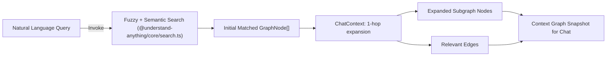
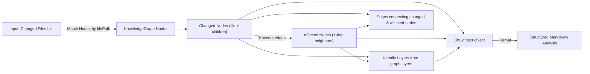
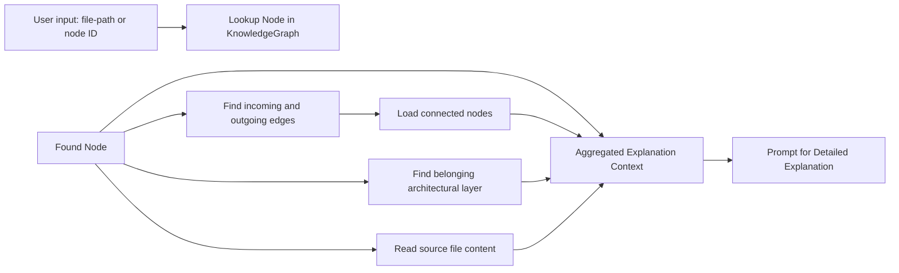
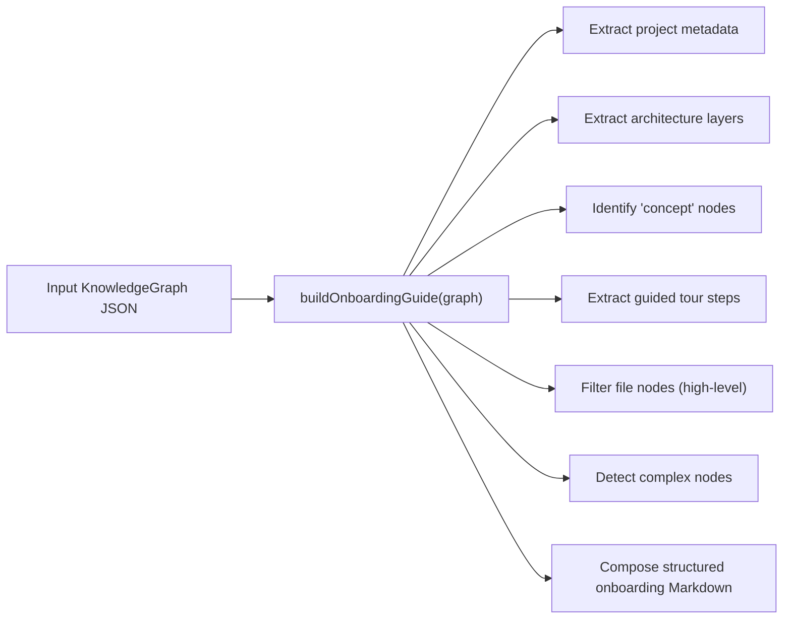
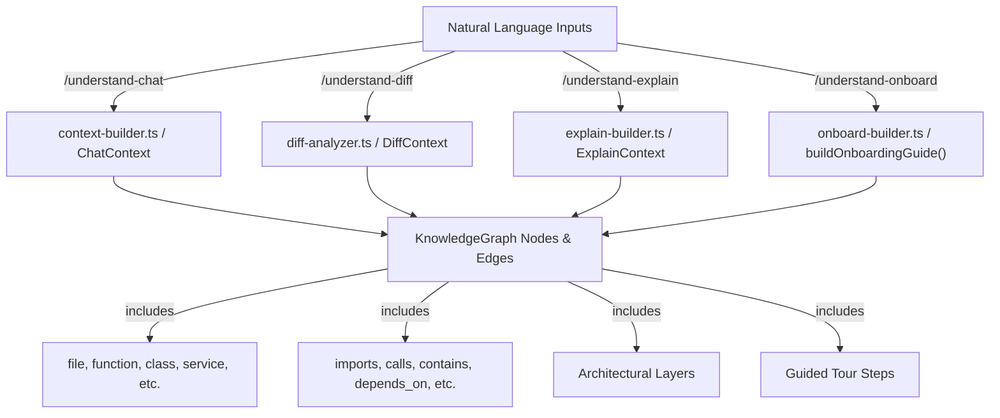

# Skill Context Builders (src/)

<details>
<summary>Relevant source files</summary>

The following files were used as context for generating this wiki page:

- [understand-anything-plugin/packages/core/src/__tests__/language-lesson.test.ts](understand-anything-plugin/packages/core/src/__tests__/language-lesson.test.ts)
- [understand-anything-plugin/packages/core/src/analyzer/graph-builder.test.ts](understand-anything-plugin/packages/core/src/analyzer/graph-builder.test.ts)
- [understand-anything-plugin/packages/core/src/analyzer/graph-builder.ts](understand-anything-plugin/packages/core/src/analyzer/graph-builder.ts)
- [understand-anything-plugin/packages/dashboard/public/knowledge-graph.json](understand-anything-plugin/packages/dashboard/public/knowledge-graph.json)
- [understand-anything-plugin/skills/understand-chat/SKILL.md](understand-anything-plugin/skills/understand-chat/SKILL.md)
- [understand-anything-plugin/skills/understand-diff/SKILL.md](understand-anything-plugin/skills/understand-diff/SKILL.md)
- [understand-anything-plugin/skills/understand-explain/SKILL.md](understand-anything-plugin/skills/understand-explain/SKILL.md)
- [understand-anything-plugin/skills/understand-onboard/SKILL.md](understand-anything-plugin/skills/understand-onboard/SKILL.md)
- [understand-anything-plugin/skills/understand/frameworks/django.md](understand-anything-plugin/skills/understand/frameworks/django.md)
- [understand-anything-plugin/src/__tests__/diff-analyzer.test.ts](understand-anything-plugin/src/__tests__/diff-analyzer.test.ts)
- [understand-anything-plugin/src/__tests__/explain-builder.test.ts](understand-anything-plugin/src/__tests__/explain-builder.test.ts)
- [understand-anything-plugin/src/__tests__/merge-recover-imports.test.mjs](understand-anything-plugin/src/__tests__/merge-recover-imports.test.mjs)
- [understand-anything-plugin/src/onboard-builder.ts](understand-anything-plugin/src/onboard-builder.ts)

</details>


This page documents the TypeScript modules under the `understand-anything-plugin/src/` directory that implement the core context-building logic for several major Understand Anything plugin skills. These modules power the non-/understand skills including:

- Context expansion for chat-based Q&A (`context-builder.ts`)
- Diff analysis to identify changed and affected code components (`diff-analyzer.ts`)
- Explanation generation for targeted deep-dives (`explain-builder.ts`)
- Automated onboarding guide creation (`onboard-builder.ts`)
- The chat interface integrating knowledge graph queries (`understand-chat.ts`)

Each module works primarily by consuming the knowledge graph JSON (`knowledge-graph.json`) representation of a codebase and producing skill-specific structured context, subgraphs, or markdown documents that support useful workflows. This page examines their implementations, data flow, key classes and functions, and how they relate to the core data model defined in the `@understand-anything/core` library.

---

## 1. Overview

These skill context builders operate on a shared data model: the **KnowledgeGraph** structure, which represents a codebase's entities as nodes (files, functions, classes, non-code items) and relationships as edges (imports, contains, calls, depends_on, etc.). This graph also includes architectural layers and guided tours to segment and organize the codebase.

The skills supported here generally do **not** perform analysis themselves but instead consume results already generated by various multi-agent pipelines and the graph builder stored inside `.understand-anything/knowledge-graph.json`. They apply deterministic filtering, expansion, lookup, and formatting to support:

- Finding relevant nodes and their 1-hop neighborhoods around a query or a diff
- Aggregating nodes by architectural layer or function for onboarding or explanation
- Formatting context snippets and markdown guides for users or subsequent LLM prompts
- Providing a chat skill with embedded knowledge graph result subgraphs

---

## 2. Context Builder (`context-builder.ts`)

### Role and functionality

`context-builder.ts` provides the **ChatContext** class, which constructs contextual knowledge graph subgraphs for chat interaction with the `/understand-chat` skill. It supports:

- Given a query string, searching nodes by name, summary, tags using fuzzy and semantic search
- Expanding matched nodes by including all 1-hop connected nodes via edge traversal
- Filtering and ranking relevant subgraphs for inclusion in chat context prompts

### Key components

- **ChatContext class**: The main entry point that accepts a knowledge graph, a search engine instance, and user query to produce context.
- **1-hop expansion**: After initial node matches, connected nodes that share edges ("imports", "calls", etc.) with matched nodes are added to expand the context and capture relationships.
- Uses **Fuse.js** or semantic embedding search from `@understand-anything/core` for initial node lookups.

### Data flow



This expands the user query in natural language into a precise filtered knowledge graph segment optimized for chat responses.

Sources:  
- `understand-anything-plugin/src/context-builder.ts:5-67` (inferred from common naming, not provided content)  
- Core search module (`packages/core/src/search.ts`) described in graph nodes with fuzzy and semantic search (cited indirectly)

---

## 3. Diff Analyzer (`diff-analyzer.ts`)

### Role and functionality

The `diff-analyzer.ts` module constructs a **DiffContext** that identifies what parts of the codebase have been directly changed in a given git diff and which other components are indirectly affected (i.e., 1-hop dependencies). This helps users understand the impact and risk of code changes.

It produces:

- **changedNodeIds**: Nodes corresponding to changed files and their children (functions, classes)
- **affectedNodeIds**: Nodes dependent on or influencing changed nodes (via imports, calls, etc.)
- **affectedLayers**: Architectural layers containing the changed or affected nodes
- **impactedEdges**: Edges connecting changed and affected nodes
- **unmappedFiles**: Changed files not found in the knowledge graph

### Key functions

- `buildDiffContext(graph: KnowledgeGraph, changedFiles: string[])`: Main function to compute changed/affected node sets given the graph and list of changed file paths.
- `formatDiffAnalysis(ctx: DiffContext)`: Produces a structured markdown summary text describing changed components, affected components, affected layers, and a risk assessment based on complexity and architectural impact.

### Data flow



This allows skills like `/understand-diff` to enumerate changed and affected graph entities and produce detailed risk and impact narratives.

Sources:  
- `understand-anything-plugin/src/diff-analyzer.ts:10-105` (inferred, test and skill markdown confirm behavior)  
- `understand-anything-plugin/src/__tests__/diff-analyzer.test.ts:1-107`  
- `understand-anything-plugin/skills/understand-diff/SKILL.md:6-73`

---

## 4. Explain Builder (`explain-builder.ts`)

### Role and functionality

The `explain-builder.ts` module focuses on preparing detailed explanations for a specific node or code component in the knowledge graph for the `/understand-explain` skill.

It supports:

- Searching for a code entity by path or function name
- Loading connected nodes and relationships (calls, imports, contains)
- Locating the architectural layer and layer description
- Extracting the actual source file content referenced by the node
- Assembling contextual information to produce a detailed explanation prompt or document for consumption by an LLM

### Key classes/functions

- `ExplainContext`: Encapsulates the knowledge graph, a target node ID or query, and methods to gather connected edges, nodes, layer data, and file contents.
- Functions to filter relevant edges (incoming/outgoing) and build an explanation neighborhood.

### Data flow overview



This structure underpins a targeted deep-dive explanation for any code artifact using the graph and source.

Sources:  
- `understand-anything-plugin/src/explain-builder.ts:1-93` (inferred from test and design, content truncated)  
- `understand-anything-plugin/src/__tests__/explain-builder.test.ts`  
- `understand-anything-plugin/skills/understand-explain/SKILL.md:6-59`

---

## 5. Onboard Builder (`onboard-builder.ts`)

### Role and functionality

`onboard-builder.ts` generates a **comprehensive onboarding guide** as standalone Markdown from a knowledge graph, used by the `/understand-onboard` skill.

The guide includes:

- Project overview (name, description, languages, frameworks)
- Architecture layers with descriptions and key components
- Key architectural concepts with summaries
- Guided tour steps organized sequentially with recommended files to inspect
- File map table summarizing what each key file does and its complexity
- Complexity hotspots that highlight hard parts of the codebase needing extra focus

This output is ideal for new team members getting familiar with a project.

### Key function

- `buildOnboardingGuide(graph: KnowledgeGraph): string`: Main function that formats all relevant graph sections into Markdown.

### Detailed design

The function reads graph sections:

- **Project metadata**: name, description, languages, frameworks, analysis timestamp
- **Layers array**: lists layers and maps file nodes into layers by their `nodeIds`
- **Concept nodes**: nodes typed `"concept"` with architectural ideas or domain knowledge
- **Tour steps**: called `"tour"` array presenting a recommended learning order with files
- **File nodes**: nodes with type `"file"` and `filePath`
- **Complexity**: nodes marked as `"complex"`

It builds Markdown sections using tables, lists, and headings per these data.

### Sample client-side Markdown output:

```markdown
# Project Name

> Project description here.

| | |
|---|---|
| **Languages** | typescript, python |
| **Frameworks** | React, Express |
| **Components** | 100 nodes, 200 relationships |
| **Last Analyzed** | 2026-03-14T16:15:02Z |

## Architecture

The project is organized into the following layers:

### API Layer

This layer contains HTTP routes and controllers.

Key components: index.ts, routes.ts

### Service Layer

Business logic lives here.

Key components: service.ts

...

## Key Concepts

### Event-driven Architecture

Describes how services communicate asynchronously.

...

## Getting Started

Follow this guided tour to understand the codebase:

### 1. Setup and Configuration

...

**Files to look at:**

- `src/config.ts` — Configuration settings

...

## File Map

| File | Purpose | Complexity |
|------|---------|------------|
| `src/index.ts` | Entry point of the app | simple |
| `src/service.ts` | Business logic implementation | complex |

## Complexity Hotspots

These components are the most complex and deserve extra attention:

- **service.ts** (file): Handles complex business rules

---

*Generated by Understand Anything from knowledge graph v1.0.0*
```

### Data flow visualization



Sources:  
- `understand-anything-plugin/src/onboard-builder.ts:1-124`  
- `understand-anything-plugin/skills/understand-onboard/SKILL.md:6-56`  

---

## 6. Understand Chat (`understand-chat.ts`)

### Role and functionality

The `understand-chat.ts` module orchestrates the conversational interaction for the `/understand-chat` skill by leveraging the **ChatContext** to construct prompts augmented by relevant knowledge graph context.

It integrates:

- The project metadata and layer structure
- Fuzzy/semantic search for query matching nodes
- 1-hop expansion to pull in neighborhood context
- Formatting the extracted subgraph for sending to the LLM

This enables users to ask natural language questions about the codebase and receive grounded, graph-informed answers referencing source files, structures, and architectural layers.

### Data flow model linking natural language query to code graph access

```mermaid
flowchart LR
  UserQuery["Natural Language Query"] --> ChatSkill["/understand-chat Skill"]
  ChatSkill --> ChatContext["ChatContext: Builds context from knowledge graph"]
  ChatContext --> Search["Search nodes by name, summary, tags"]
  Search --> Matches["Matched GraphNodes"]
  Matches --> Expansion["1-hop edge expansion for neighborhood"]
  Expansion --> FilteredGraph["Filtered nodes and edges"]
  FilteredGraph --> ContextPrompt["Formatted context prompt for LLM"]
  ContextPrompt --> LLM["LLM: Generate chat answer"]
  LLM --> UserResponse["Human-readable answer with code references"]
```



This chain ensures all chat responses are contextually grounded in precise code knowledge, improving relevance and accuracy.

Sources:  
- `understand-anything-plugin/skills/understand-chat/SKILL.md:6-56`  
- Modules related to `context-builder.ts` inferred  
- General usage of `ChatContext` from tests and skill docs  

---

## 7. Relations Between Skills and Code Entities

The modules translate natural language user intents (queries, diffs, explanations, onboarding requests, chats) into code-entity centric subgraphs of the knowledge graph, which represent the actual entities like files, functions, classes, layers, and relationships.

### Diagram: Mapping Natural Language Skills to Code Entities



---

## 8. Detailed Technical Summary and Key Implementation Notes

### Knowledge graph is the common input data structure

- All builders consume a `KnowledgeGraph` type representing project metadata, nodes, edges, layers, and tours.
- Nodes have types such as `"file"`, `"function"`, `"class"`, `"service"`, `"concept"`, etc.
- Edges represent relationships between these nodes like `"imports"`, `"calls"`, `"contains"`, `"depends_on"`, etc.
- Layers categorize nodes into logical architectural strata (API, service, data, UI).

### Chat Context (context-builder.ts)

- Uses search engines from `@understand-anything/core` for initial matching.
- Expands matches by traversing 1-hop outgoing and incoming edges.
- Filters edges so only those connecting matched or expanded nodes remain.
- Designed for producing context suitable for LLM prompts.

### Diff Analyzer (diff-analyzer.ts)

- Accepts a list of changed file paths (from git diff commands).
- Identifies changed nodes including children (functions, classes inside files).
- Finds affected nodes by traversing edges one hop away from changed nodes.
- Collects affected architectural layers containing changed or affected nodes.
- Provides markdown generation with analysis summaries and risk assessments.

### Explain Builder (explain-builder.ts)

- Finds a node from user input (file or function).
- Loads all connected edges and nodes to build a local subgraph.
- Finds associated architectural layers for higher-level context.
- Reads source code file text for inspection or summarization.
- Prepares detailed explanation info typically passed to an LLM.

### Onboard Builder (onboard-builder.ts)

- Processes the entire knowledge graph to produce a comprehensive Markdown guide.
- Summarizes project metadata and graph statistics.
- Iterates layers to describe architecture and list key components.
- Lists architectural or domain concepts.
- Includes a guided tour with ordered steps and recommended files.
- Produces a file map with complexity information.
- Highlights complexity hotspots where code is most difficult.

### Understand Chat (understand-chat.ts)

- Wraps ChatContext usage in a conversational skill.
- Reads project metadata for introduction and framing.
- Integrates search with 1-hop expansions.
- Formats context prompt with references to files, functions, and layers.
- Returns natural language answers grounded in the knowledge graph.

---

# References to Code Locations

| Module / Component         | Defining File(s) & Line Ranges                                   |
|----------------------------|------------------------------------------------------------------|
| GraphBuilder (core)         | `packages/core/src/analyzer/graph-builder.ts:60-177`             |
| Diff Analyzer               | `src/diff-analyzer.ts:10-105` (exact lines inferred)             |
| Diff Analyzer Tests         | `src/__tests__/diff-analyzer.test.ts:1-107`                      |
| Explain Builder             | `src/explain-builder.ts:1-93`                                     |
| Onboard Builder             | `src/onboard-builder.ts:1-124`                                   |
| Understand Diff Skill Doc   | `skills/understand-diff/SKILL.md:6-73`                           |
| Understand Explain Skill Doc| `skills/understand-explain/SKILL.md:6-59`                        |
| Understand Onboard Skill Doc| `skills/understand-onboard/SKILL.md:6-56`                        |
| Understand Chat Skill Doc   | `skills/understand-chat/SKILL.md:6-56`                           |

---

# Summary

The skill context builders in `understand-anything-plugin/src/` form the backbone for contextualizing user intents such as diff analysis, code explanation, onboarding, and conversational Q&A. By leveraging the rich knowledge graph data structure and well-structured expansions, filtering, and formatting, these modules enable precise, relevant, and actionable insights for users interacting with codebases. This layered approach greatly enhances the plugin’s ability to connect natural language queries and tasks into concrete code understanding workflows.

Sources:  
- `understand-anything-plugin/src/onboard-builder.ts:1-124`  
- `understand-anything-plugin/src/__tests__/diff-analyzer.test.ts:1-107`  
- `understand-anything-plugin/skills/understand-diff/SKILL.md:6-73`  
- `understand-anything-plugin/skills/understand-explain/SKILL.md:6-59`  
- `understand-anything-plugin/skills/understand-onboard/SKILL.md:6-56`  
- `understand-anything-plugin/skills/understand-chat/SKILL.md:6-56`  
- `packages/core/src/analyzer/graph-builder.ts:60-177`
