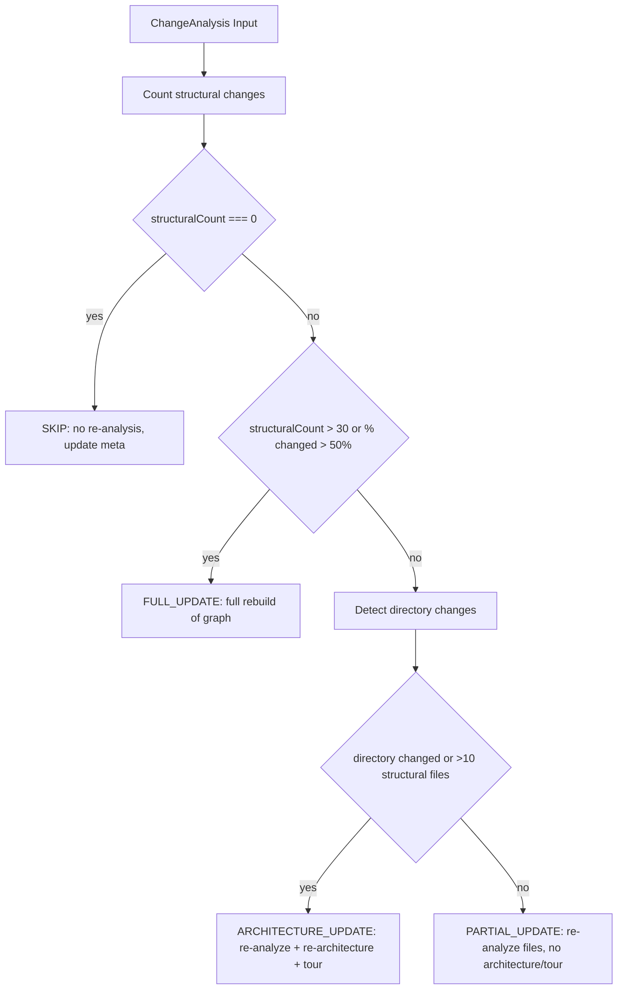

# Auto-Update & Hooks

<details>
<summary>Relevant source files</summary>

The following files were used as context for generating this wiki page:

- [eslint.config.mjs](eslint.config.mjs)
- [scripts/generate-large-graph.mjs](scripts/generate-large-graph.mjs)
- [understand-anything-plugin/hooks/auto-update-prompt.md](understand-anything-plugin/hooks/auto-update-prompt.md)
- [understand-anything-plugin/hooks/hooks.json](understand-anything-plugin/hooks/hooks.json)
- [understand-anything-plugin/packages/core/src/__tests__/change-classifier.test.ts](understand-anything-plugin/packages/core/src/__tests__/change-classifier.test.ts)
- [understand-anything-plugin/packages/core/src/__tests__/fingerprint.test.ts](understand-anything-plugin/packages/core/src/__tests__/fingerprint.test.ts)
- [understand-anything-plugin/packages/core/src/change-classifier.ts](understand-anything-plugin/packages/core/src/change-classifier.ts)
- [understand-anything-plugin/packages/core/src/fingerprint.ts](understand-anything-plugin/packages/core/src/fingerprint.ts)
- [understand-anything-plugin/packages/core/src/plugins/extractors/ruby-extractor.ts](understand-anything-plugin/packages/core/src/plugins/extractors/ruby-extractor.ts)
- [understand-anything-plugin/packages/core/src/plugins/parsers/graphql-parser.ts](understand-anything-plugin/packages/core/src/plugins/parsers/graphql-parser.ts)
- [understand-anything-plugin/packages/core/src/plugins/parsers/sql-parser.ts](understand-anything-plugin/packages/core/src/plugins/parsers/sql-parser.ts)
- [understand-anything-plugin/skills/understand/build-fingerprints.mjs](understand-anything-plugin/skills/understand/build-fingerprints.mjs)

</details>


This page documents the auto-update and hooks subsystem in Understand Anything. It includes detailed explanations of the hooks system defined in `hooks.json`, the incremental auto-update workflow driven by the `auto-update-prompt.md` script, the fingerprint-based change detection mechanism, and the decision matrix used in `classifyUpdate` to determine incremental update actions on the knowledge graph.

---

## 1. Hooks System Overview

Understand Anything employs a hooks system to automate tasks triggered by external events during the lifecycle of a coding session or post-tool execution. This system is configured in the JSON file located at:

- `understand-anything-plugin/hooks/hooks.json`

### Hook Types

The relevant hooks here are:

- **PostToolUse**: Triggered after executing specific CLI tools or commands.
- **SessionStart**: Triggered at the start of a user session.

### Hook Commands for Auto-Update

Within these hooks, conditional Bash commands detect when a Git commit (commit, merge, cherry-pick, rebase) has occurred or when the session starts with an out-of-date knowledge graph. The presence of `autoUpdate` set to `true` in `.understand-anything/config.json` along with knowledge graph metadata files triggers automatic execution of the internal auto-update mechanism without user confirmation.

The relevant commands in hooks.json are:

- **PostToolUse** hook runs a command that checks if the tool input contains a git action and calls the auto-update prompt when:

  - `.understand-anything/config.json` exists with `"autoUpdate": true`.
  - `.understand-anything/knowledge-graph.json` exists.

- **SessionStart** hook runs a command that compares the current Git HEAD commit hash with `.understand-anything/meta.json` stored hash. If different, it triggers the auto-update prompt, urging an incremental update.

**Note:** In both cases, the commands print a message instructing the plugin to read and execute the instructions inside `auto-update-prompt.md` and not to ask the user for confirmation but perform the update transparently.

```json
{
  "hooks": {
    "PostToolUse": [
      {
        "matcher": "Bash",
        "hooks": [
          {
            "type": "command",
            "command": "printf '%s' \"$TOOL_INPUT\" | grep -qE 'git\\s+(commit|merge|cherry-pick|rebase)' && [ -f .understand-anything/config.json ] && grep -q '\"autoUpdate\".*true' .understand-anything/config.json && [ -f .understand-anything/knowledge-graph.json ] && echo \"[understand-anything] Commit detected with auto-update enabled. You MUST read the file at ${CLAUDE_PLUGIN_ROOT}/hooks/auto-update-prompt.md and execute its instructions to incrementally update the knowledge graph. Do not ask the user for confirmation — just do it.\" || true"
          }
        ]
      }
    ],
    "SessionStart": [
      {
        "hooks": [
          {
            "type": "command",
            "command": "[ -f .understand-anything/config.json ] && grep -q '\"autoUpdate\".*true' .understand-anything/config.json && [ -f .understand-anything/meta.json ] && [ -f .understand-anything/knowledge-graph.json ] && [ \"$(node -p \"JSON.parse(require('fs').readFileSync('.understand-anything/meta.json','utf8')).gitCommitHash\")\" != \"$(git rev-parse HEAD 2>/dev/null)\" ] && echo \"[understand-anything] Knowledge graph is stale. You MUST read the file at ${CLAUDE_PLUGIN_ROOT}/hooks/auto-update-prompt.md and execute its instructions to check for structural changes and update the graph. Do not ask the user for confirmation — just do it.\" || true"
          }
        ]
      }
    ]
  }
}
```

Sources: `understand-anything-plugin/hooks/hooks.json` [2-25]()

---

## 2. Auto-Update Incremental Workflow

The actual logic for performing incremental updates to the knowledge graph is encoded in an internal, non-user-facing script described in:

- `understand-anything-plugin/hooks/auto-update-prompt.md`

This script is triggered by the above hooks. Its goal is to minimize expensive LLM token usage by detecting code structural changes deterministically and only running costly analyses when necessary.

### Key Principles

- **Cost Efficiency:** When changes are cosmetic (formatting, internal logic), do not use any LLM tokens.
- **Deterministic Structural Fingerprinting:** Accurately detect structural changes (functions, classes, imports, exports).
- **Incremental Update Decisions:** Use change classification matrix to decide whether to skip, partially update, or fully rebuild.
- **No User Confirmation:** The update process runs automatically without interruption.

### Workflow Phases

The workflow proceeds in several phases:

#### Phase 0 — Pre-Flight Checks (Zero Token Cost)

- Verify presence of essential files: knowledge graph (`knowledge-graph.json`) and metadata (`meta.json`).
- Confirm current Git HEAD commit; if unchanged since last analysis and no `--force` flag, stop immediately.
- Detect changed files between last analyzed commit and HEAD.
  - If no changed files, update `meta.json` with new commit and stop.
- Filter changed files for recognized source file extensions.
  - If none remain, update `meta.json` and stop.
- Apply `.understandignore` exclusions to eliminate user-excluded files that spuriously trigger updates.
  - Use an `ignore-filter.mjs` utility script that imports the plugin's internal ignore logic.
  - Files excluded here are removed before fingerprint comparison.
  - If all changed files are excluded, update the metadata and stop.
- Prepare an intermediate directory under `.understand-anything/intermediate` for temporary data.

#### Phase 1 — Structural Fingerprint Check (Zero LLM Tokens)

- Runs a deterministic Node.js script (`fingerprint-check.mjs`) which:

  - Reads stored fingerprints from `.understand-anything/fingerprints.json`.
  - For each changed source file:
    - Reads current file content.
    - Computes SHA-256 content hash.
    - If content hash unchanged → classify as `NONE`.
    - Else, extracts structural elements via regex (functions, classes, imports, exports).
    - Compares against stored fingerprint:
      - If structural elements identical → classify as `COSMETIC`.
      - Else → classify as `STRUCTURAL`.
  - Newly added or deleted files are automatically `STRUCTURAL`.
  - Based on file-level classifications, produces an overall update action decision:
    - `SKIP`, `PARTIAL_UPDATE`, `ARCHITECTURE_UPDATE`, or `FULL_UPDATE`.
  - Writes a detailed JSON summary to `.understand-anything/intermediate/change-analysis.json`.

#### Phase 2 — Update Action Decision & Reporting

- Reads the change analysis JSON.
- Applies a decision gate:

| Action               | Behavior                                                                                  |
|----------------------|-------------------------------------------------------------------------------------------|
| `SKIP`               | Update metadata commit hash, report "Zero tokens spent", stop.                            |
| `FULL_UPDATE`         | Report major structural change, recommend `/understand --full` run, stop.                 |
| `ARCHITECTURE_UPDATE`| Run architecture-level re-analysis, rebuild tours, update metadata.                      |
| `PARTIAL_UPDATE`      | Re-analyze only changed files, preserve architecture and tours, update metadata.          |

- In non-SKIP cases, the pipeline increments the knowledge graph accordingly.

### Incremental Update Benefits

This approach ensures that trivial or cosmetic edits do not waste expensive LLM tokens and that large changes trigger appropriate levels of rebuild, maintaining up-to-date accuracy efficiently.

---

## 3. Fingerprint-Based Change Detection

At the core of the incremental update is the deterministic fingerprinting system that captures the structure of source files.

### Fingerprint Types

Implemented in the core package:

- `FileFingerprint`: Captures the file path, content hash, and structural elements including functions, classes, imports, and exports.
- `FunctionFingerprint`, `ClassFingerprint`, `ImportFingerprint`: Represent details of each structural element.
- `ChangeLevel`: Enumerates change categories: `"NONE" | "COSMETIC" | "STRUCTURAL"`.

### Fingerprint Extraction

- The function `extractFileFingerprint` generates a fingerprint by:

  - Calculating SHA-256 hash of full file content.
  - Recording function signatures, classes, import statements, and declared exports.
  - Calculating line counts for structural elements.

This extraction uses structured analysis results from parsers and language extractors.

### Fingerprint Comparison

- The function `compareFingerprints` operates on two `FileFingerprint`s (old and new) to classify changes:

```typescript
type ChangeLevel = "NONE" | "COSMETIC" | "STRUCTURAL";

function compareFingerprints(oldFp: FileFingerprint, newFp: FileFingerprint): FileChangeResult;
```

- Returns:

  - `NONE` if content hashes match exactly.
  - `COSMETIC` if content differs but structure (functions/classes/imports/exports) matches.
  - `STRUCTURAL` if functions/classes are added/removed, signatures altered, imports/exports changed, or significant line count differences occur.

- It accumulates human-readable details to explain what changed.

This comparison is conservative: lacking structural data leads to `STRUCTURAL` classification to avoid missing true changes.

### Change Analysis Summary

- The `analyzeChanges` function aggregates file-level results across the whole diff:

  - Lists files by change type (`newFiles`, `deletedFiles`, `structurallyChangedFiles`, `cosmeticOnlyFiles`, `unchangedFiles`).
  - This aggregated analysis is used downstream for update action classification.

---

## 4. Update Decision Matrix: classifyUpdate()

The logic to decide how to update the knowledge graph based on the fingerprint-based change analysis is consolidated in:

- `understand-anything-plugin/packages/core/src/change-classifier.ts`

### `classifyUpdate` Function

```typescript
export function classifyUpdate(
  analysis: ChangeAnalysis,
  totalFilesInGraph: number,
  allKnownFiles: string[] = []
): UpdateDecision;
```

#### Decision Matrix Summary

| Condition                                                                    | Action               | Re-analysis Detail               | Rebuild Architecture | Rebuild Tour      | Reason Description                                        |
| ---------------------------------------------------------------------------- | -------------------- | ------------------------------- | -------------------- | ----------------- | ---------------------------------------------------------|
| No structural changes (only cosmetic or unchanged files)                     | `SKIP`               | None                            | No                   | No                | No structural or impactful changes.                       |
| Structural changes in > 30 files or > 50% of all files                       | `FULL_UPDATE`        | All structurally changed + new  | Yes                  | Yes               | Large scale changes; full rebuild recommended.            |
| Structural changes affect directory structure or > 10 files                  | `ARCHITECTURE_UPDATE`| All structurally changed + new  | Yes                  | Yes               | Architecture needs re-analysis due to directory changes. |
| Structural changes in ≤ 10 files in same directories                         | `PARTIAL_UPDATE`     | Structurally changed + new files| No                   | No                | Localized changes; partial incremental update possible.   |

#### Directory Structure Change Detection

- Uses `detectDirectoryChanges` helper to check if new or deleted files introduce or remove top-level source directories.
- Top-level directory is the first directory segment after the root.
- If new or deleted files reside in directories not known in baseline, flags for architecture update.

#### Output Structure: `UpdateDecision`

```typescript
interface UpdateDecision {
  action: "SKIP" | "PARTIAL_UPDATE" | "ARCHITECTURE_UPDATE" | "FULL_UPDATE";
  filesToReanalyze: string[]; // input for incremental re-analysis
  rerunArchitecture: boolean;
  rerunTour: boolean;
  reason: string; // human-readable explanation of decision
}
```

### Example Decision Flow



Sources:  
- `understand-anything-plugin/packages/core/src/change-classifier.ts` [1-143]()  
- `understand-anything-plugin/packages/core/src/__tests__/change-classifier.test.ts` [1-183]()  

---

## 5. Data Flow and Execution Diagram

Below is a detailed flow diagram showing the lifecycle from Git commit detection by hooks, through file change filtering and fingerprint comparison, culminating in a classification decision that drives the incremental update workflow.

```mermaid
flowchart TD
  subgraph "Natural Language Space"
    H[hooks.json PostToolUse / SessionStart Hooks]
    U[auto-update-prompt.md Workflow]
  end

  subgraph "File System & Git"
    F1[.understand-anything/meta.json]
    F2[.understand-anything/knowledge-graph.json]
    F3[.understand-anything/fingerprints.json]
    F4[Source Files (git diff)]
    IG[.understandignore]
  end

  subgraph "Node.js Scripts"
    I1[Ignore Filter Script \n(./ignore-filter.mjs)]
    I2[Fingerprint-Check Script \n(./fingerprint-check.mjs)]
    BF[build-fingerprints.mjs]
  end

  subgraph "Code Entities"
    C1[FingerprintStore Interface]
    C2[classifyUpdate() Function]
  end

  H -->|trigger on commit/session| U
  U --> F1
  U --> F2
  U --> F3
  U --> F4
  F4 -->|list changed files| I1
  IG --> I1
  I1 -->|filtered files| I2
  F3 --> I2
  I2 -->|change analysis JSON| C1
  C1 --> C2
  C2 -->|Update decision| U
```

---

## 6. Key Classes and Functions

### `classifyUpdate`

- Role: Given aggregated structural change analysis and project context, determines the update action category.
- Input: `ChangeAnalysis` (detail on file-level changes), total number files in graph, and known file paths.
- Output: `UpdateDecision` with update strategy and affected files.

### Fingerprint Extraction & Comparison

- `extractFileFingerprint(filePath, content, analysis)`:
  - Converts parsed structural analysis into a lightweight, comparable fingerprint.
- `compareFingerprints(oldFingerprint, newFingerprint)`:
  - Performs a detailed comparison returning change level and details.

### Fingerprint Store

- `FingerprintStore`:
  - Holds file-wise fingerprints plus metadata such as git commit hash.
  - Persisted at `.understand-anything/fingerprints.json`.
- Created during the full `/understand` run via:
  - `build-fingerprints.mjs` which uses core classes like `TreeSitterPlugin` and `PluginRegistry` to parse all files and produce fingerprints.

---

## 7. Summary

The Auto-Update and Hooks system in Understand Anything provides a sophisticated, deterministic incremental update mechanism for the knowledge graph. Via Git commit detection hooks and the internal auto-update prompt script, it:

- Identifies changed files and applies ignore filters.
- Uses a fingerprinting system to classify changes at the structural level.
- Employs a configurable decision matrix to decide between skipping, partially updating, or fully rebuilding the knowledge graph.
- Enables cost-efficient updates by minimizing unnecessary LLM token usage.
- Automates all steps transparently without explicit user interaction.

This design balances accuracy, performance, and usability in keeping the knowledge graph current during active development.

---

## References & Sources

- `understand-anything-plugin/hooks/hooks.json` [2-25]()  
- `understand-anything-plugin/hooks/auto-update-prompt.md` [1-147]()  
- `understand-anything-plugin/packages/core/src/change-classifier.ts` [1-143]()  
- `understand-anything-plugin/packages/core/src/__tests__/change-classifier.test.ts` [1-183]()  
- `understand-anything-plugin/packages/core/src/fingerprint.ts` [1-275]()  
- `understand-anything-plugin/skills/understand/build-fingerprints.mjs` [1-91]()
