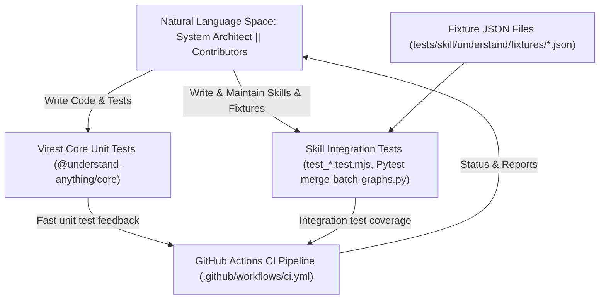
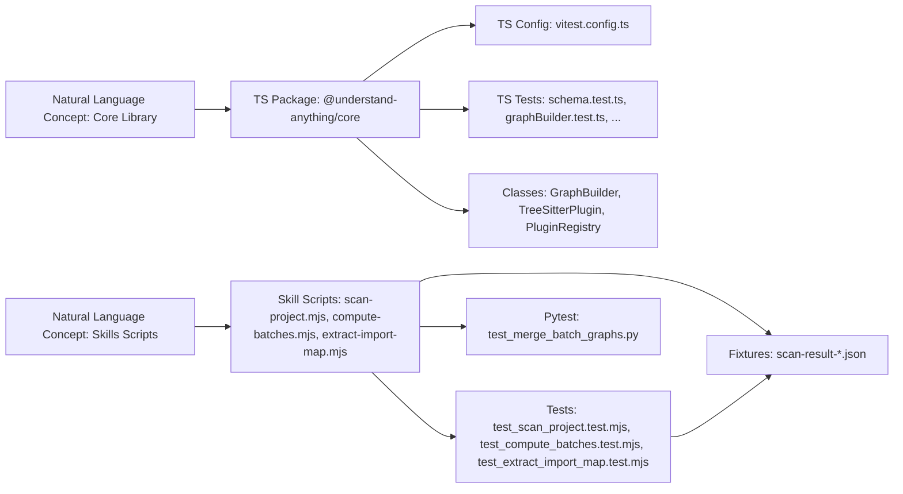

# Testing & CI

Relevant source files

The following files were used as context for generating this wiki page:

- [.github/ISSUE_TEMPLATE/bug_report.yml](.github/ISSUE_TEMPLATE/bug_report.yml)
- [.github/ISSUE_TEMPLATE/config.yml](.github/ISSUE_TEMPLATE/config.yml)
- [.github/ISSUE_TEMPLATE/feature_request.yml](.github/ISSUE_TEMPLATE/feature_request.yml)
- [.github/ISSUE_TEMPLATE/question.yml](.github/ISSUE_TEMPLATE/question.yml)
- [.github/PULL_REQUEST_TEMPLATE.md](.github/PULL_REQUEST_TEMPLATE.md)
- [.github/workflows/ci.yml](.github/workflows/ci.yml)
- [CODE_OF_CONDUCT.md](CODE_OF_CONDUCT.md)
- [SECURITY.md](SECURITY.md)
- [package.json](package.json)
- [tests/skill/understand/fixtures/scan-result-merge-respects-non-mergeable.json](tests/skill/understand/fixtures/scan-result-merge-respects-non-mergeable.json)
- [tests/skill/understand/fixtures/scan-result-non-code.json](tests/skill/understand/fixtures/scan-result-non-code.json)
- [tests/skill/understand/fixtures/scan-result-singletons.json](tests/skill/understand/fixtures/scan-result-singletons.json)
- [tests/skill/understand/test_compute_batches.test.mjs](tests/skill/understand/test_compute_batches.test.mjs)
- [tests/skill/understand/test_merge_batch_graphs.py](tests/skill/understand/test_merge_batch_graphs.py)
- [tests/skill/understand/test_scan_project.test.mjs](tests/skill/understand/test_scan_project.test.mjs)
- [understand-anything-plugin/packages/core/vitest.config.ts](understand-anything-plugin/packages/core/vitest.config.ts)

This section provides a high-level overview of the testing and continuous integration (CI) strategy employed in the Understand Anything codebase. It describes the different test suites used across the project, their purposes, and how they integrate with the GitHub Actions CI pipeline. Detailed documentation on each testing aspect is available in child pages linked at the end.

---

## Testing Strategy Overview

The Understand Anything project employs a multi-layered testing approach to ensure robustness, correctness, and maintainability across its diverse components. This involves:

- **Core Unit Tests**: These are written in TypeScript using the [Vitest](https://vitest.dev/) testing framework. They focus on the core library `@understand-anything/core`, covering schema validation, graph construction, language extractor logic, plugins, and other low-level functionalities.

- **Skill Integration Tests**: Integration tests target skill scripts that form key parts of the analysis pipeline, such as `scan-project.mjs`, `compute-batches.mjs`, and `extract-import-map.mjs`. These are written in JavaScript modules (`.mjs`) for the most part, except for the Python-based `merge-batch-graphs.py` where `pytest` is used.

- **Fixtures**: JSON fixture files are extensively used to simulate various scenarios and codebase snapshots. These fixtures drive the integration tests and act as regression guards that ensure batch merging, import map extraction, and the complex interaction of code/non-code files behave correctly.

- **Continuous Integration (CI) Pipeline**: The project uses GitHub Actions configured in `.github/workflows/ci.yml` to automate linting, building, and running tests on every pull request and push to `main`. This guarantees that failures are caught early, maintaining code health.

This strategy balances fast, focused unit testing with realistic integration scenarios and automated enforcement via CI.

---

## Core Unit Tests with Vitest

The core package, `@understand-anything/core`, houses the foundational logic for graph building, parsers, schema validation, language extractors, fingerprinting, and plugin management. Its correctness is verified primarily via a robust Vitest suite.

Key focuses include:

- **Schema Validation Tests**: Ensure that the complex type schemas for knowledge graphs enforce expected constraints.

- **GraphBuilder Tests**: Validate the incremental construction and merging behaviors of the graph.

- **TreeSitterPlugin & Extractor Tests**: Verify language-specific parsing and extraction routines.

- **Fingerprinting and Change Classifier**: Confirm that file-change detection and staleness heuristics function correctly.

- **Persistence Layer Tests**: Check reading/writing of knowledge graphs and domain meta.

This unit test suite operates via the script `pnpm --filter @understand-anything/core test` which runs `vitest run` for headless execution. Running it in development is fast and supports parallel and watch modes.

For further detail, including example test cases and coverage, see the child page [Core Package Tests](#7.1).

---

## Skill Integration Tests

The skill scripts orchestrate the core phases of codebase analysis by combining static analysis and LLM intelligence:

- `scan-project.mjs`: Enumerates files, detects languages, and builds initial import maps.

- `compute-batches.mjs`: Segments files into batches for analysis based on import connectivity.

- `extract-import-map.mjs`: Generates a map of import relations between files.

- `merge-batch-graphs.py`: A Python script that merges batch graphs and performs graph canonicalization.

Integration tests for these scripts validate the higher-level workflows. These tests run actual skill commands on controlled fixtures and verify output correctness.

- Most integration tests are authored in ES modules with Mocha/Vitest-like syntax in `.test.mjs` files.

- The graph merging script is tested via `pytest` tests in Python (`test_merge_batch_graphs.py`).

- JSON fixture files simulate various repository states, including complex cases mixing code and non-code files, singleton batches, and batch merging edge cases.

Integration tests are executed via the root `pnpm test` command, leveraging node and Python environments as appropriate.

For comprehensive details on integration test structure, fixture data, and example scenarios, see the child page [Skill Integration Tests](#7.2).

---

## Fixture Files

Fixtures play a critical role in deterministic testing of the analysis pipeline. Examples include:

- `scan-result-singletons.json`: Simulates many isolated TypeScript files expected to merge into a few batches.

- `scan-result-non-code.json`: Contains a mix of code and non-code files exercising handling of infra, config, and document files.

- `scan-result-merge-respects-non-mergeable.json`: Regression test ensuring that small batches marked non-mergeable (e.g. Dockerfiles) are not incorrectly merged.

These fixtures represent curated snapshots of codebases with various complexities, languages, import structures, and edge cases, enabling confident regression coverage.

---

## Continuous Integration (CI) Pipeline

The project configures GitHub Actions to automate running linting, building, and tests upon:

- Pull requests (to provide early feedback to contributors).

- Direct pushes to `main` (to ensure the master branch remains stable).

The CI workflow (`.github/workflows/ci.yml`) performs:

1. Checking out the code.

2. Installing pnpm and Node.js (v22).

3. Installing dependencies via `pnpm install`.

4. Running lint with `pnpm lint`.

5. Building the core and skill packages.

6. Running core unit tests and skill integration tests.

The workflow uses concurrency settings to cancel outdated runs on the same branch, preserving runner time and delivering clear latest statuses.

This CI setup guarantees quality gates are enforced continuously, supporting a healthy, maintainable codebase.

---

## Testing & CI Diagram

---

## Bridging Natural Language Concepts to Code Entities

This diagram illustrates the linkage between high-level system components and their concrete code artifacts, focusing on testing core and skill packages.

---

## Summary

- The **core logic** is verified with **Vitest unit tests**, focusing on individual components and correctness of the knowledge graph and analyzers.

- The **skill scripts** providing end-to-end analysis function are validated with **integration tests** in `.mjs` (JavaScript) and Python `pytest`.

- **Fixture files** simulate complex repository states to ensure tests cover realistic scenarios and regression cases.

- **GitHub Actions** automate linting, building, and test execution on PRs and pushes, enforcing quality continuously.

For deeper technical detail, test code examples, and diagnostic strategies, consult the following specialized child pages:

- [Core Package Tests](#7.1) — Detailed documentation of the Vitest test suite for the core package.

- [Skill Integration Tests](#7.2) — Comprehensive overview of integration tests for skill scripts, fixture usage, and interaction with Python tests.

---

## Sources

- `package.json` (lines 29-43) — test scripts and dependencies  
- `.github/workflows/ci.yml` (lines 1-51) — CI pipeline config  
- `tests/skill/understand/test_merge_batch_graphs.py` (entire file) — python integration tests for merging batch graphs  
- `tests/skill/understand/test_scan_project.test.mjs` (entire file) — integration tests for scan-project skill  
- `tests/skill/understand/test_compute_batches.test.mjs` (entire file) — integration tests for compute-batches skill  
- `tests/skill/understand/test_extract_import_map.test.mjs` (entire file) — integration tests for extract-import-map skill  
- `tests/skill/understand/fixtures/*.json` — fixture files used by integration tests  
- `understand-anything-plugin/packages/core/vitest.config.ts` — vitest configuration for core package tests
