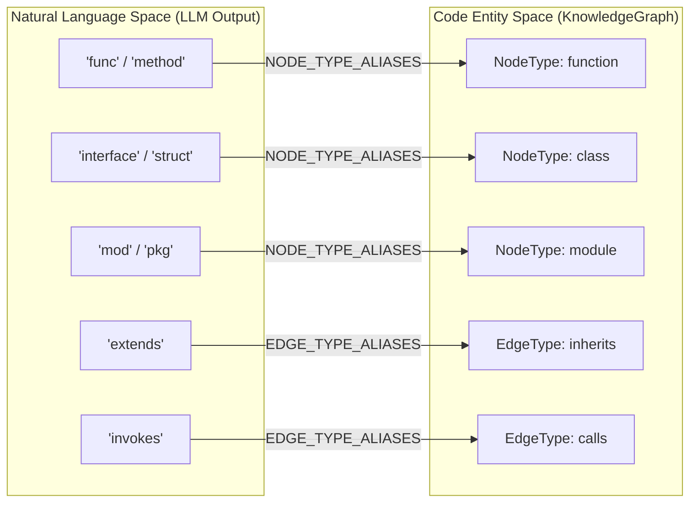
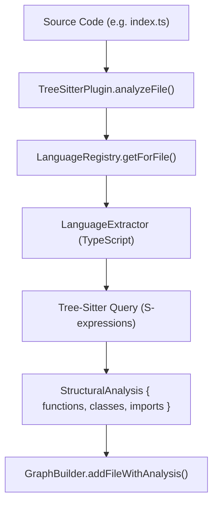

# Core Package Tests

Relevant source files

The following files were used as context for generating this wiki page:

- [understand-anything-plugin/hooks/auto-update-prompt.md](understand-anything-plugin/hooks/auto-update-prompt.md)
- [understand-anything-plugin/hooks/hooks.json](understand-anything-plugin/hooks/hooks.json)
- [understand-anything-plugin/packages/core/src/__tests__/change-classifier.test.ts](understand-anything-plugin/packages/core/src/__tests__/change-classifier.test.ts)
- [understand-anything-plugin/packages/core/src/__tests__/domain-types.test.ts](understand-anything-plugin/packages/core/src/__tests__/domain-types.test.ts)
- [understand-anything-plugin/packages/core/src/__tests__/fingerprint.test.ts](understand-anything-plugin/packages/core/src/__tests__/fingerprint.test.ts)
- [understand-anything-plugin/packages/core/src/__tests__/ignore-filter.test.ts](understand-anything-plugin/packages/core/src/__tests__/ignore-filter.test.ts)
- [understand-anything-plugin/packages/core/src/__tests__/ignore-generator.test.ts](understand-anything-plugin/packages/core/src/__tests__/ignore-generator.test.ts)
- [understand-anything-plugin/packages/core/src/__tests__/language-lesson.test.ts](understand-anything-plugin/packages/core/src/__tests__/language-lesson.test.ts)
- [understand-anything-plugin/packages/core/src/__tests__/plugin-discovery.test.ts](understand-anything-plugin/packages/core/src/__tests__/plugin-discovery.test.ts)
- [understand-anything-plugin/packages/core/src/__tests__/plugin-registry.test.ts](understand-anything-plugin/packages/core/src/__tests__/plugin-registry.test.ts)
- [understand-anything-plugin/packages/core/src/__tests__/schema.test.ts](understand-anything-plugin/packages/core/src/__tests__/schema.test.ts)
- [understand-anything-plugin/packages/core/src/analyzer/graph-builder.test.ts](understand-anything-plugin/packages/core/src/analyzer/graph-builder.test.ts)
- [understand-anything-plugin/packages/core/src/analyzer/graph-builder.ts](understand-anything-plugin/packages/core/src/analyzer/graph-builder.ts)
- [understand-anything-plugin/packages/core/src/analyzer/language-lesson.ts](understand-anything-plugin/packages/core/src/analyzer/language-lesson.ts)
- [understand-anything-plugin/packages/core/src/fingerprint.ts](understand-anything-plugin/packages/core/src/fingerprint.ts)
- [understand-anything-plugin/packages/core/src/ignore-filter.ts](understand-anything-plugin/packages/core/src/ignore-filter.ts)
- [understand-anything-plugin/packages/core/src/ignore-generator.ts](understand-anything-plugin/packages/core/src/ignore-generator.ts)
- [understand-anything-plugin/packages/core/src/plugins/discovery.ts](understand-anything-plugin/packages/core/src/plugins/discovery.ts)
- [understand-anything-plugin/packages/core/src/plugins/registry.ts](understand-anything-plugin/packages/core/src/plugins/registry.ts)
- [understand-anything-plugin/packages/core/src/plugins/tree-sitter-plugin.test.ts](understand-anything-plugin/packages/core/src/plugins/tree-sitter-plugin.test.ts)
- [understand-anything-plugin/packages/core/src/plugins/tree-sitter-plugin.ts](understand-anything-plugin/packages/core/src/plugins/tree-sitter-plugin.ts)
- [understand-anything-plugin/packages/core/src/schema.ts](understand-anything-plugin/packages/core/src/schema.ts)
- [understand-anything-plugin/packages/dashboard/public/knowledge-graph.json](understand-anything-plugin/packages/dashboard/public/knowledge-graph.json)
- [understand-anything-plugin/skills/understand-chat/SKILL.md](understand-anything-plugin/skills/understand-chat/SKILL.md)
- [understand-anything-plugin/skills/understand-diff/SKILL.md](understand-anything-plugin/skills/understand-diff/SKILL.md)
- [understand-anything-plugin/skills/understand-explain/SKILL.md](understand-anything-plugin/skills/understand-explain/SKILL.md)
- [understand-anything-plugin/skills/understand-onboard/SKILL.md](understand-anything-plugin/skills/understand-onboard/SKILL.md)
- [understand-anything-plugin/skills/understand/frameworks/django.md](understand-anything-plugin/skills/understand/frameworks/django.md)

The `@understand-anything/core` package uses **Vitest** for its unit testing suite. These tests ensure the integrity of the KnowledgeGraph schema, the accuracy of structural analysis (via Tree-Sitter), the reliability of incremental update fingerprints, and the correctness of the plugin registry system.

## Schema Validation & Normalization

The schema tests verify the Zod-based validation pipeline. This pipeline is critical because it handles the "Natural Language to Code Entity" mapping by normalizing inconsistent LLM outputs into a canonical graph structure.

### Implementation Detail
The `validateGraph` function performs a three-stage process:
1.  **Sanitize**: Removes nulls and lowercases enum strings [packages/core/src/schema.ts:148-194]().
2.  **Auto-Fix**: Clamps out-of-range values (e.g., edge weights) and fills missing required fields with defaults [packages/core/src/schema.ts:196-221]().
3.  **Normalize**: Maps LLM aliases (like `func` or `struct`) to canonical types (`function`, `class`) [packages/core/src/schema.ts:17-125]().

### Alias Mapping Diagram
This diagram shows how the system bridges the gap between various natural language terms used by LLMs and the rigid `NodeType` and `EdgeType` space.

**Diagram: Entity Alias Normalization**

Sources: [packages/core/src/schema.ts:17-125](), [packages/core/src/__tests__/schema.test.ts:122-232]()

## GraphBuilder Tests

`GraphBuilder` tests ensure that nodes and edges are correctly instantiated and linked. The builder is responsible for maintaining referential integrity during the assembly of file analyses.

*   **File Analysis**: Tests verify that `addFileWithAnalysis` correctly creates a `file` node and links it to child `function` and `class` nodes via `contains` edges [packages/core/src/analyzer/graph-builder.ts:105-177]().
*   **Edge Deduplication**: Tests confirm that `addImportEdge` and `addCallEdge` prevent duplicate edges by checking an internal `edgeKeys` set [packages/core/src/analyzer/graph-builder.ts:179-208]().
*   **Non-Code Mapping**: Tests validate the `KIND_TO_NODE_TYPE` mapping, ensuring that a "route" in a non-code file becomes an `endpoint` node [packages/core/src/analyzer/graph-builder.ts:39-58]().

Sources: [packages/core/src/analyzer/graph-builder.ts:60-225](), [packages/core/src/analyzer/graph-builder.test.ts]()

## Tree-Sitter & Language Extractors

The `TreeSitterPlugin` tests focus on the deterministic extraction of code structures without using an LLM.

### Data Flow
1.  **Initialization**: `init()` loads WASM grammars for registered languages [packages/core/src/plugins/tree-sitter-plugin.ts:124-197]().
2.  **Extraction**: `analyzeFile()` identifies the correct `LanguageExtractor` based on file extension [packages/core/src/plugins/tree-sitter-plugin.ts:105-118]().
3.  **Querying**: Uses tree-sitter queries to find definitions (functions, classes) and references (imports, calls).

**Diagram: Structural Extraction Pipeline**

Sources: [packages/core/src/plugins/tree-sitter-plugin.ts:31-118](), [packages/core/src/plugins/tree-sitter-plugin.test.ts]()

## Plugin Registry & Discovery

The `PluginRegistry` manages the lifecycle of `AnalyzerPlugin` implementations. Tests verify:
*   **Priority**: Later registrations for the same language take priority [packages/core/src/__tests__/plugin-registry.test.ts:85-92]().
*   **Delegation**: `analyzeFile` and `resolveImports` calls are correctly routed to the plugin supporting that file's language [packages/core/src/plugins/registry.ts:56-66]().
*   **Discovery**: `PluginDiscovery` tests ensure that third-party plugins can be loaded via configuration strings [packages/core/src/plugins/discovery.ts]().

Sources: [packages/core/src/plugins/registry.ts:11-81](), [packages/core/src/__tests__/plugin-registry.test.ts:1-182]()

## Fingerprinting & Change Classification

These tests power the `auto-update-prompt.md` logic, which determines if a file change requires an LLM re-analysis.

*   **Fingerprint Tests**: Verify that `SHA-256` hashes and structural regex matches (functions/classes) are correctly computed and compared [hooks/auto-update-prompt.md:98-122]().
*   **Change Classifier**: Validates the escalation logic:
    *   **COSMETIC**: Only internal logic changed; no re-analysis [hooks/auto-update-prompt.md:133]().
    *   **STRUCTURAL**: New function/class or changed imports; triggers `PARTIAL_UPDATE` [hooks/auto-update-prompt.md:134]().
    *   **ARCHITECTURE_UPDATE**: New directories or >10 structural changes [hooks/auto-update-prompt.md:119]().

Sources: [packages/core/src/fingerprint.ts](), [packages/core/src/__tests__/change-classifier.test.ts](), [hooks/auto-update-prompt.md:94-146]()

## Ignore Filter & Generator

*   **IgnoreFilter**: Tests the `.understandignore` logic, ensuring it follows `.gitignore` semantics to exclude large directories (e.g., `node_modules`, `dist`) from the graph [packages/core/src/ignore-filter.ts]().
*   **IgnoreGenerator**: Tests the automatic generation of an initial `.understandignore` file based on the project's detected languages and frameworks [packages/core/src/ignore-generator.ts]().

Sources: [packages/core/src/__tests__/ignore-filter.test.ts](), [packages/core/src/__tests__/ignore-generator.test.ts]()
