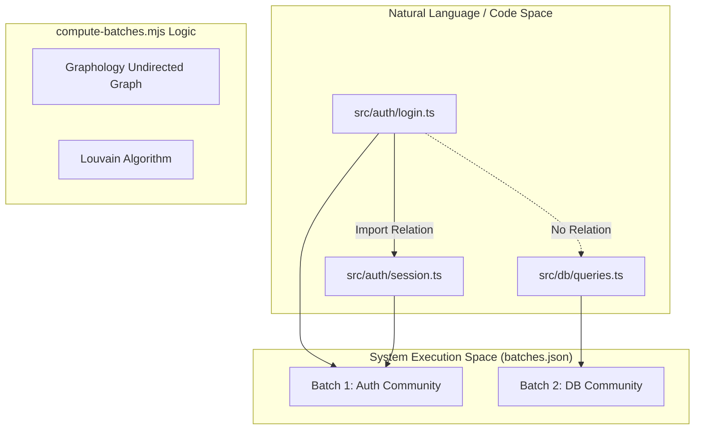
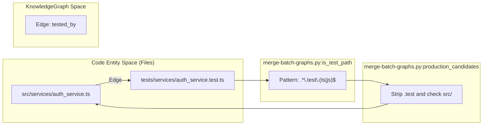

# Skill Integration Tests

Relevant source files

The following files were used as context for generating this wiki page:

- [docs/superpowers/plans/2026-05-24-semantic-batching-and-output-chunking-impl.md](docs/superpowers/plans/2026-05-24-semantic-batching-and-output-chunking-impl.md)
- [docs/superpowers/specs/2026-05-24-semantic-batching-and-output-chunking-design.md](docs/superpowers/specs/2026-05-24-semantic-batching-and-output-chunking-design.md)
- [tests/skill/understand/fixtures/scan-result-3-cliques.json](tests/skill/understand/fixtures/scan-result-3-cliques.json)
- [tests/skill/understand/fixtures/scan-result-large-community.json](tests/skill/understand/fixtures/scan-result-large-community.json)
- [tests/skill/understand/fixtures/scan-result-merge-respects-non-mergeable.json](tests/skill/understand/fixtures/scan-result-merge-respects-non-mergeable.json)
- [tests/skill/understand/fixtures/scan-result-non-code.json](tests/skill/understand/fixtures/scan-result-non-code.json)
- [tests/skill/understand/fixtures/scan-result-singletons.json](tests/skill/understand/fixtures/scan-result-singletons.json)
- [tests/skill/understand/test_compute_batches.test.mjs](tests/skill/understand/test_compute_batches.test.mjs)
- [tests/skill/understand/test_merge_batch_graphs.py](tests/skill/understand/test_merge_batch_graphs.py)
- [tests/skill/understand/test_scan_project.test.mjs](tests/skill/understand/test_scan_project.test.mjs)

This page documents the integration test suite for the core skill scripts used in Phase 0 through Phase 2.5 of the analysis pipeline. These tests ensure that the deterministic components of the system—file discovery, semantic batching, import mapping, and graph merging—function correctly across various project topologies and languages.

## Overview of Integration Testing Strategy

The integration tests target the standalone scripts located in `understand-anything-plugin/skills/understand/`. These scripts are typically invoked by the `/understand` slash command via the plugin host (e.g., Claude Code, Cursor).

| Test File | Target Script | Primary Responsibility |
| :--- | :--- | :--- |
| `test_scan_project.test.mjs` | `scan-project.mjs` | Validates file enumeration, language detection, and ignore filtering. |
| `test_compute_batches.test.mjs` | `compute-batches.mjs` | Validates Louvain community detection and non-code file grouping. |
| `test_extract_import_map.test.mjs` | `extract-import-map.mjs` | Validates cross-file dependency resolution using Tree-Sitter. |
| `test_merge_batch_graphs.py` | `merge-batch-graphs.py` | Validates ID canonicalization and deterministic `tested_by` linking. |

Sources: [docs/superpowers/plans/2026-05-24-semantic-batching-and-output-chunking-impl.md:9-11](), [understand-anything-plugin/package.json:54-57]()

---

## 1. Project Scanner Tests (`test_scan_project.test.mjs`)

The `scan-project.mjs` script is responsible for Phase 0 (Discovery). The tests verify that the scanner correctly identifies file languages and respects `.understandignore` or `.gitignore` rules.

### Implementation Detail
The test suite uses `mkdtempSync` to create isolated project trees for each test case [tests/skill/understand/test_scan_project.test.mjs:28-45](). It exercises two discovery paths:
1. **Git Path:** Uses `git ls-files` for high-performance enumeration in initialized repositories [tests/skill/understand/test_scan_project.test.mjs:35-43]().
2. **Walker Path:** A recursive directory walker fallback for non-git environments.

### Key Assertions
* **Language Mapping:** Ensures extensions like `.tsx` map to `typescript`, `.py` to `python`, and `.rs` to `rust` [tests/skill/understand/test_scan_project.test.mjs:107-162]().
* **Ignore Logic:** Verifies that files listed in ignore patterns are excluded from the `scan-result.json` output [tests/skill/understand/test_scan_project.test.mjs:203-210]().

Sources: [tests/skill/understand/test_scan_project.test.mjs:16-20](), [tests/skill/understand/test_scan_project.test.mjs:63-77]()

---

## 2. Semantic Batching Tests (`test_compute_batches.test.mjs`)

Phase 1.5 introduces `compute-batches.mjs`, which replaces simple count-based batching with **Louvain Community Detection**. This ensures that files with high logical coupling (e.g., `auth/login.ts` and `auth/session.ts`) are analyzed in the same LLM context.

### Data Flow: Scan to Batches
The diagram below illustrates how the test suite validates the transition from "Code Entity Space" (imports) to "System Execution Space" (batches).

**Bridge: Import Topology to Batch Assignment**

Sources: [docs/superpowers/specs/2026-05-24-semantic-batching-and-output-chunking-design.md:94-105](), [tests/skill/understand/test_compute_batches.test.mjs:44-62]()

### Size Enforcement and Fallbacks
Tests verify that large communities (exceeding the 35-file cap) are split to prevent LLM output overflow [tests/skill/understand/test_compute_batches.test.mjs:94-108](). If the Louvain algorithm fails, the script must fall back to alphabetical chunking to ensure pipeline continuity [docs/superpowers/specs/2026-05-24-semantic-batching-and-output-chunking-design.md:144-148]().

---

## 3. Import Extraction Tests (`test_extract_import_map.test.mjs`)

This suite validates the `extract-import-map.mjs` script, which uses the `TreeSitterPlugin` from `@understand-anything/core` to build a project-wide dependency graph.

### Key Functionalities Tested
* **Cross-Language Resolution:** Handling of `import` in TS, `require` in JS, `use` in Rust, and `import/from` in Python.
* **Alias Resolution:** Correctly resolving `import { x } from '@/utils'` using `tsconfig.json` or `package.json` paths.
* **Symbol Exports:** Verification that the script extracts top-level exported functions and classes for the `neighborMap` [docs/superpowers/specs/2026-05-24-semantic-batching-and-output-chunking-design.md:122-127]().

Sources: [docs/superpowers/specs/2026-05-24-semantic-batching-and-output-chunking-design.md:83-85](), [tests/skill/understand/test_compute_batches.test.mjs:118-153]()

---

## 4. Graph Merger Tests (`test_merge_batch_graphs.py`)

The `merge-batch-graphs.py` script is a Python-based utility that aggregates the JSON outputs from multiple `file-analyzer` subagents into a single `KnowledgeGraph`.

### Deterministic Linker: `tested_by`
The most critical part of this test suite is the `IsTestPathTests` and `ProductionCandidatesTests` classes. They verify the heuristics used to link production code to its corresponding test files.

**Bridge: File Naming to Semantic Relationship**

Sources: [tests/skill/understand/test_merge_batch_graphs.py:65-148](), [tests/skill/understand/test_merge_batch_graphs.py:151-190]()

### Test Scenarios
| Scenario | Logic Validated |
| :--- | :--- |
| **JS/TS Siblings** | Links `X.ts` to `X.test.ts` [tests/skill/understand/test_merge_batch_graphs.py:68-84](). |
| **Python Prefixes** | Links `app/logic.py` to `tests/test_logic.py` [tests/skill/understand/test_merge_batch_graphs.py:99-101](). |
| **Go Suffixes** | Links `util.go` to `util_test.go` [tests/skill/understand/test_merge_batch_graphs.py:94-96](). |
| **Java/Maven** | Links `src/main/.../Bar.java` to `src/test/.../BarTest.java` [tests/skill/understand/test_merge_batch_graphs.py:103-107](). |

Sources: [tests/skill/understand/test_merge_batch_graphs.py:43-45](), [tests/skill/understand/test_merge_batch_graphs.py:154-189]()

---

## 5. Fixture JSON Files

The integration tests are driven by synthetic `scan-result-*.json` fixtures that simulate various repository structures without requiring a full file system.

* **`scan-result-3-cliques.json`**: Tests that Louvain detection identifies three disjoint clusters (Auth, API, DB) [tests/skill/understand/fixtures/scan-result-3-cliques.json:1-31]().
* **`scan-result-large-community.json`**: A 40-node complete graph used to test community splitting logic [tests/skill/understand/fixtures/scan-result-large-community.json:1-253]().
* **`scan-result-non-code.json`**: Validates the grouping of Dockerfiles, CI workflows, and SQL migrations into specialized batches [tests/skill/understand/fixtures/scan-result-non-code.json:1-38]().
* **`scan-result-merge-respects-non-mergeable.json`**: Regression test ensuring that infrastructure files (like Dockerfiles) are not pooled into generic "misc" batches [tests/skill/understand/fixtures/scan-result-merge-respects-non-mergeable.json:1-233]().

Sources: [docs/superpowers/plans/2026-05-24-semantic-batching-and-output-chunking-impl.md:22-26](), [tests/skill/understand/test_compute_batches.test.mjs:189-195]()
