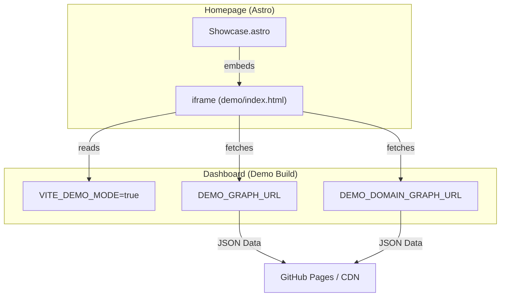
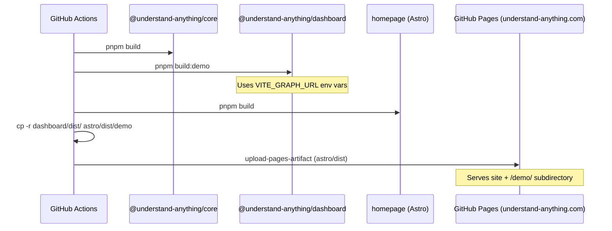

# Homepage & Marketing Site

Relevant source files

The following files were used as context for generating this wiki page:

- [.github/workflows/deploy-homepage.yml](.github/workflows/deploy-homepage.yml)
- [CONTRIBUTING.md](CONTRIBUTING.md)
- [READMEs/README.ru-RU.md](READMEs/README.ru-RU.md)
- [homepage/.gitignore](homepage/.gitignore)
- [homepage/.vscode/extensions.json](homepage/.vscode/extensions.json)
- [homepage/.vscode/launch.json](homepage/.vscode/launch.json)
- [homepage/README.md](homepage/README.md)
- [homepage/astro.config.mjs](homepage/astro.config.mjs)
- [homepage/public/.gitkeep](homepage/public/.gitkeep)
- [homepage/public/CNAME](homepage/public/CNAME)
- [homepage/public/images/overview-domain.gif](homepage/public/images/overview-domain.gif)
- [homepage/public/images/overview-structural.gif](homepage/public/images/overview-structural.gif)
- [homepage/src/components/CommunityVideo.astro](homepage/src/components/CommunityVideo.astro)
- [homepage/src/components/Features.astro](homepage/src/components/Features.astro)
- [homepage/src/components/Footer.astro](homepage/src/components/Footer.astro)
- [homepage/src/components/Hero.astro](homepage/src/components/Hero.astro)
- [homepage/src/components/Install.astro](homepage/src/components/Install.astro)
- [homepage/src/components/Nav.astro](homepage/src/components/Nav.astro)
- [homepage/src/components/Problem.astro](homepage/src/components/Problem.astro)
- [homepage/src/components/Showcase.astro](homepage/src/components/Showcase.astro)
- [homepage/src/layouts/Layout.astro](homepage/src/layouts/Layout.astro)
- [homepage/src/pages/index.astro](homepage/src/pages/index.astro)
- [homepage/src/styles/global.css](homepage/src/styles/global.css)
- [understand-anything-plugin/packages/dashboard/vite.config.demo.ts](understand-anything-plugin/packages/dashboard/vite.config.demo.ts)

The **Understand Anything** marketing site and homepage are built using the **Astro** framework, located in the `homepage/` directory. This site serves as the primary entry point for users, providing an overview of the system's capabilities, a live interactive demo, and installation instructions.

## 1. Architecture & Component Structure

The homepage is a static site generated via Astro, utilizing a component-based architecture to manage the various sections of the marketing landing page.

### 1.1 Page Layout
The main entry point is `homepage/src/pages/index.astro`, which composes the page from several specialized components. It also implements a global `IntersectionObserver` to trigger "scroll-reveal" animations by adding the `visible` class to elements with the `reveal` class [homepage/src/pages/index.astro:13-38]().

### 1.2 Core Components

| Component | Purpose | Key Logic/Data |
| :--- | :--- | :--- |
| `Hero.astro` | Top-of-page impact, badges, and CTA. | Contains links to GitHub, Discord, and Substack [homepage/src/components/Hero.astro:2-35](). |
| `Showcase.astro` | Interactive demo embedding. | Embeds the dashboard in "demo mode" via an `iframe` [homepage/src/components/Showcase.astro:25-33](). |
| `Features.astro` | Grid of value propositions. | Iterates over a `features` array to render cards [homepage/src/components/Features.astro:2-47](). |
| `Install.astro` | Quick-start commands. | Includes a clipboard copy script for installation commands [homepage/src/components/Install.astro:24-37](). |
| `CommunityVideo.astro` | Social proof / Walkthroughs. | Embeds a YouTube video walkthrough [homepage/src/components/CommunityVideo.astro:2-34](). |
| `Footer.astro` | Navigation and legal links. | Standard links to license, contact, and social [homepage/src/components/Footer.astro:10-21](). |

### 1.3 Global Styling
Styling is managed through `homepage/src/styles/global.css`. It defines design tokens for the "Dark Gold" aesthetic, including self-hosted fonts (Inter, DM Serif Display, JetBrains Mono) and the primary gradient sweep used across the site [homepage/src/styles/global.css:35-53]().

**Sources:**
- [homepage/src/pages/index.astro:1-38]()
- [homepage/src/components/Hero.astro:1-86]()
- [homepage/src/components/Showcase.astro:1-44]()
- [homepage/src/styles/global.css:1-127]()

---

## 2. Live Demo Integration

The "Live Demo" is a specialized build of the `@understand-anything/dashboard` package.

### 2.1 Demo Build Configuration
The dashboard is built for the homepage using `vite.config.demo.ts`. This configuration sets a specific base path and defines `VITE_DEMO_MODE` as `true` [understand-anything-plugin/packages/dashboard/vite.config.demo.ts:7-19](). This mode disables local file system API calls and instead relies on static JSON files hosted on GitHub Pages.

### 2.2 Data Flow for Demo
The demo dashboard fetches its Knowledge Graph data from environment-defined URLs rather than the local Vite middleware used during development.

**Sources:**
- [understand-anything-plugin/packages/dashboard/vite.config.demo.ts:1-49]()
- [homepage/src/components/Showcase.astro:2-33]()
- [.github/workflows/deploy-homepage.yml:46-52]()

---

## 3. Deployment Pipeline

The site is automatically deployed to GitHub Pages via the `deploy-homepage.yml` workflow.

### 3.1 Build & Merge Strategy
The deployment process involves three distinct build steps that are merged into a single distribution directory:
1.  **Core Build**: Builds `@understand-anything/core` as a dependency [ .github/workflows/deploy-homepage.yml:43-44]().
2.  **Dashboard Build**: Executes the `build:demo` command to create the interactive visualization [ .github/workflows/deploy-homepage.yml:46-47]().
3.  **Homepage Build**: Builds the Astro site [ .github/workflows/deploy-homepage.yml:39-41]().
4.  **Merge**: The dashboard's `dist` folder is copied into `homepage/dist/demo`, making the demo accessible at `/demo/` relative to the root domain [ .github/workflows/deploy-homepage.yml:53-54]().

### 3.2 Deployment Diagram
The following diagram maps the CI/CD pipeline to the resulting URL structure.

**Sources:**
- [.github/workflows/deploy-homepage.yml:23-69]()
- [understand-anything-plugin/packages/dashboard/vite.config.demo.ts:7-7]()

---

## 4. Configuration & SEO

*   **CNAME**: The file `homepage/public/CNAME` configures the custom domain `understand-anything.com`.
*   **Astro Config**: `homepage/astro.config.mjs` defines the site's integration and output settings.
*   **Internationalization**: While the homepage is primarily English, the READMEs in `READMEs/` (e.g., `README.ru-RU.md`) provide translated marketing copy that mirrors the homepage's value propositions [READMEs/README.ru-RU.md:42-98]().

**Sources:**
- [homepage/public/CNAME:1-1]()
- [READMEs/README.ru-RU.md:1-100]()
